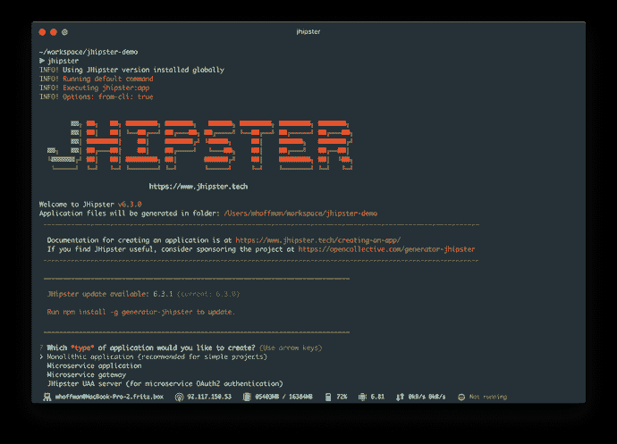
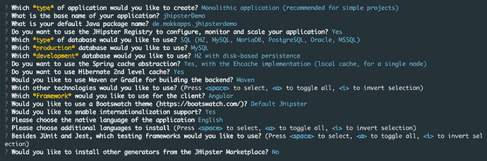
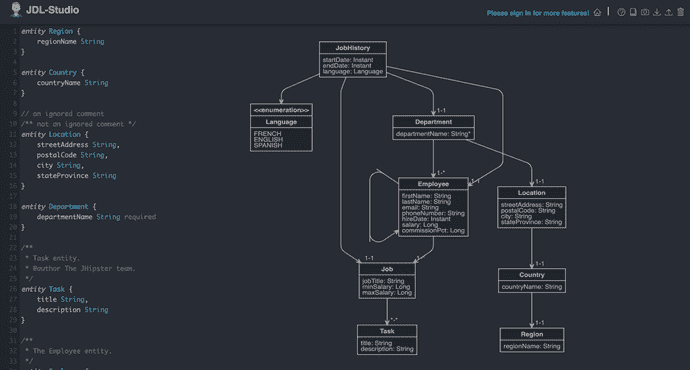
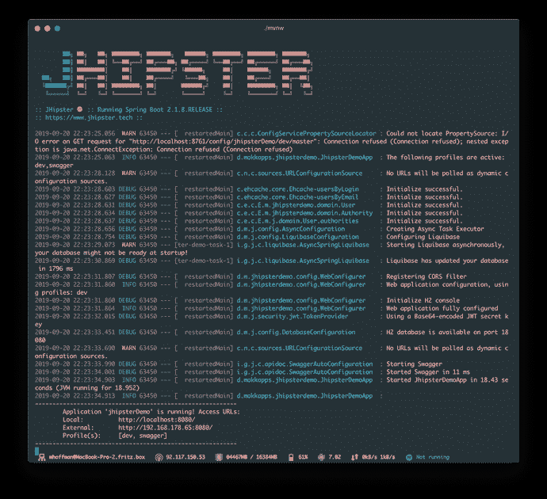
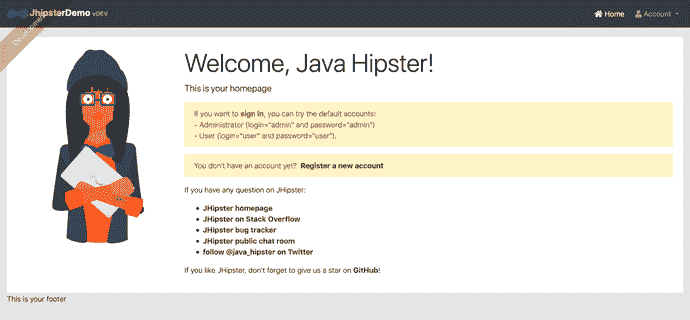
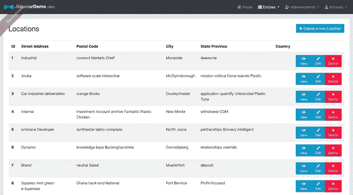
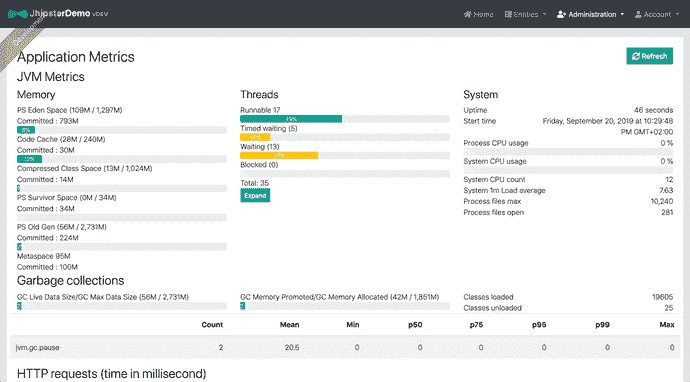
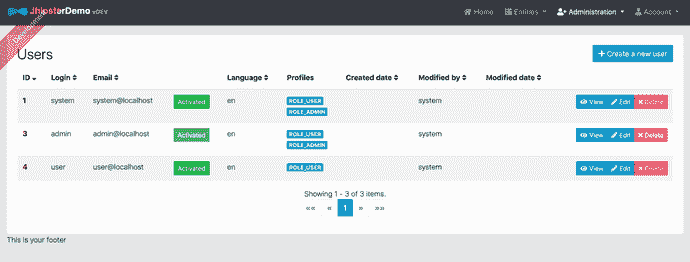

# JHipster——构建生产就绪的 Angular & Spring Boot 应用程序的最快方法

> 原文：<https://dev.to/mokkapps/jhipster-the-fastest-way-to-build-a-production-ready-angular-spring-boot-application-21n8>

过去几年，我主要从事网络和移动应用的前端工作，但我也做一些次要的后端工作。自今年年中以来，我一直在努力提高我的后端知识，并开始专注于使用 Spring Boot 进行 Java 后端开发。

当我在 [Pluralsight](https://www.pluralsight.com/) 上观看多个 Java 教程时，我偶然发现了 [JHipster](https://www.jhipster.tech/) ，并立即爱上了它。

在这篇文章中，我将告诉你为什么我喜欢 JHipster，以及你如何快速开始一个 JHipster 项目。

## JHipster 是什么？

> JHipster 是一个开发平台，用于生成、开发和部署 Spring Boot+Angular/React/Vue Web 应用程序和 Spring 微服务。

基本上，它是一个约曼生成器，可以创建包括 Spring Boot、自举和 Angular(或 React 或 Vue)在内的应用。

Julien Dubois 于 2013 年启动了该项目，可在 [GitHub](https://github.com/jhipster/generator-jhipster) 上下载。

如果你想看 JHipster 的实际操作，我可以推荐下面这段来自 Matt Raible 的视频:

## 为什么要用 JHipster？

在我看来，杰普斯特是惊人的

*   是开源的
*   支架反作用，Vue，前端有角度
*   对每个前端框架使用 TypeScript
*   使用 Spring Boot 2.1，所以我们可以用 Java 11+开发我们的应用程序
*   提供开箱即用的用户管理，包括电子邮件验证和密码重置
*   可以轻松部署到 CloudFoundry、Heroku、OpenShift 或 AWS
*   使用网飞操作系统、弹性堆栈和 Docker 提供强大的微服务架构
*   使用强大的工具 Yeoman、Webpack 和 Maven/Gradle
*   对前端和后端的实体有很好的测试覆盖率

## 快速启动

### 安装先决条件

确保安装 JHipster 的必备组件 [Java](http://www.oracle.com/technetwork/java/javase/downloads/index.html) 、 [Git](https://git-scm.com/) 和 [Node.js](https://nodejs.org/) 。

然后我们可以安装 JHipster 作为全局 npm 包:`npm install -g generator-jhipster`

### 创建新项目

现在我们可以创建一个新项目并开始:

第一步，创建一个新目录并进入其中`mkdir jhipster-demo && cd jhipster-demo`

现在我们可以运行`jhipster`来启动发电机

有以下选择:

我选择了单片应用程序，因为对于一个简单的演示项目来说，微服务架构是一种大材小用。除此之外，我选择 Angular 作为前端框架，支持 i18n 和一些用于数据库、缓存和监控的后端配置。

下一步是用 [JDL 工作室](https://start.jhipster.tech/jdl-studio/)为我们的实体建模，并下载生成的`jhipster-jdl.jh`文件:

[JDL 工作室](https://start.jhipster.tech/jdl-studio/)是一个基于 [JDL 语法](https://www.jhipster.tech/jdl/)绘制吉普斯特 JDL 图的很好的图形工具。你不需要使用这个图形工具，但是也可以使用命令行界面来[创建实体。](https://www.jhipster.tech/creating-an-entity/)

下载完`.jh`文件后，我们现在可以用`jhipster import-jdl jhipster-jdl.jh`生成实体。在我们的例子中，我们只是导入默认的 JDL 工作室文件，它也显示在上面的图片中。

### 启动后端

运行`./mvnw`，启动 Spring Boot 应用程序:

### 启动前端

运行`npm start`，启动角度应用程序，然后可通过`http://localhost:9000/`访问:

最后，我们可以登录并查看一些开箱即用的功能，如查看和编辑我们的实体的可能性，

查看应用程序的指标

和用户管理

## 结论

在本文中，我只是向您展示了一个快速启动项目，并提到了它的一些优点。正如你在官方文档中看到的那样，JHipster 要强大得多。在我看来，如果大公司正在使用这个框架，这也是一个好的迹象，正如你在这个官方列表中看到的[。](https://www.jhipster.tech/companies-using-jhipster/)

JHipster 的一个缺点是没有典型的 Angular CLI 项目。JHipster 中包含 Angular CLI，但项目结构看起来与默认的 Angular CLI 项目不同。

此外，JHipster 生成了许多代码，其中包括许多您可能不知道的库。你可以只添加或修改代码，而不学习这些库背后的基础知识，但这可能会导致一些未来的问题。

您还应该记住，JHipster 项目更像是一个大的开始，而不是一个小的、精益的项目开始。