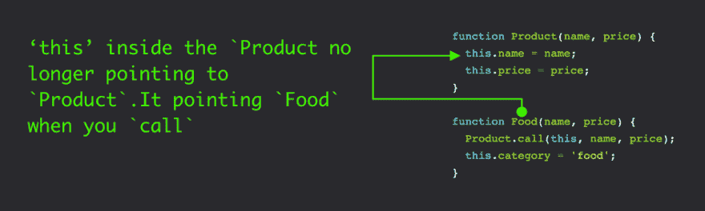
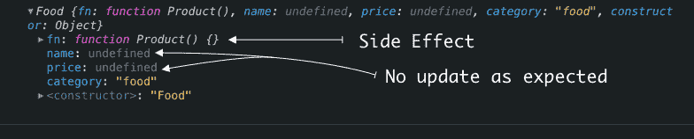
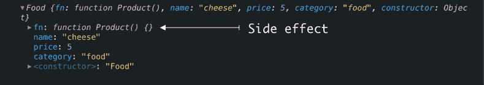
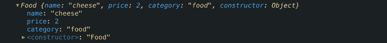

# 通过制作自己的理解:JavaScript 调用、应用和绑定

> 原文:[https://dev . to/kamaal/understanding-by-making-your-own-JavaScript-call-apply-bind-5238](https://dev.to/kamaal/understanding-by-making-your-own-javascript-call-apply-bind-5238)

不重新发明轮子最终是有意义的，但这也是通过(重新)创造已经存在的东西来提高自己的一种方式。我写这个系列主要是为了提高我对 JavaScript 的标准内置对象如`call`、`apply`、`bind`的理解。

## [](#functionprototypecall)Function.prototype.call()

> call()方法使用给定的 this 值和单独提供的参数调用函数。- MDN

[Mozilla](https://developer.mozilla.org/en-US/docs/Web/JavaScript/Reference/Global_Objects/Function/call)

最初，方法`call`调用函数并允许您传递逗号分隔的参数。

#### [](#example-from-mdn)来自 MDN 的例子

```
 function Product(name, price) {
  this.name = name;
  this.price = price;
}

function Food(name, price) {
  Product.call(this, name, price);
  this.category = 'food';
}

function Toy(name, price) {
  Product.call(this, name, price);
  this.category = 'toy';
}

const food = new Food('cheese', 5)
console.log(food.name) //  cheese
console.log(food) //  {name: 'chees', price: 5, category: 'food'}

const fun = new Toy('robot', 40);
console.log(fun.name) //  robot 
```

#### [](#custom-example)自定义示例

```
 const add = (a, b) => a + b
console.log(add.call(null, 3, 8, 10)) // 11 
```

通过上面的例子，我们可以了解 call 方法的基本功能。

*   Call 改变了调用者的`this`上下文，在上面的例子中`Product.call`用`call`的第一个参数，即`Food`替换了原来函数体中的`this`。>使用调用来链接一个对象的构造函数- MDN

[T2】](https://res.cloudinary.com/practicaldev/image/fetch/s--ZahQrZGN--/c_limit%2Cf_auto%2Cfl_progressive%2Cq_auto%2Cw_880/https://thepracticaldev.s3.amazonaws.com/i/smxdcojxpxn7z7x666zx.png)

*   如果调用时有多个参数，那么从左到右，从第二个参数开始，将每个参数传递给原始函数。

    *   在我们的例子中是`name`和`price`。
*   `call`不应该对`this`对象产生任何副作用。

> thisArg 值在没有修改的情况下作为`this`值传递。这与第 3 版有所不同，在第 3 版中，未定义或空的 thisArg 被替换为全局对象，ToObject 应用于所有其他值，结果作为`this`值传递。即使不加修改地传递 thisArg，非严格函数在进入函数时仍然执行这些转换。- Ecma

[Ecma 规范](https://www.ecma-international.org/ecma-262/6.0/#sec-function.prototype.call)

## [](#lets-reimplement-the-call-method)让我们重新实现调用方法。

```
 if(!Function.prototype.fauxCall){
    Function.prototype.fauxCall = function(context){
       context.fn = this;
       return context.fn();
    }
}

const food = new Food('cheese', 5)
console.log(food) //  expected {name: 'chees', price: 5, category: 'food'} 
```

如果我们运行上面的代码，我们将得到

[T2】](https://res.cloudinary.com/practicaldev/image/fetch/s--ucQ3crSV--/c_limit%2Cf_auto%2Cfl_progressive%2Cq_auto%2Cw_880/https://thepracticaldev.s3.amazonaws.com/i/83nqogy3i8gqo8y5hqra.png)

而不是

```
 {name: 'chees', price: 5, category: 'food'} 
```

好的，我们需要在调用`fn()`时传递原始参数。看起来很容易，但是🤔我们如何知道有多少参数来自原始调用？

这里我们可以使用`arguments`它是在函数内部可访问的类似**数组的**对象，但是，我们仍然有一个问题；记住`arguments`不是`array`而是`object`，这就是为什么**像数组一样**

我们可以用`Array.from` [【更多方式】](https://dzone.com/articles/js-array-from-an-array-like-object)把这个`object`转换成`array`，然后从第二个元素用`Array.slice`忽略第一个参数。

```
if(!Function.prototype.fauxCall){
    Function.prototype.fauxCall = function(context){
       const args = Array.from(arguments).slice(1);
       context.fn = this;
       return context.fn(...args);
    }
}

const food = new Food('cheese', 5)
console.log(food) //  expected {name: 'chees', price: 5, category: 'food'} 
```

如果我们运行上面的代码，我们将得到

[T2】](https://res.cloudinary.com/practicaldev/image/fetch/s--8A_kyezN--/c_limit%2Cf_auto%2Cfl_progressive%2Cq_auto%2Cw_880/https://thepracticaldev.s3.amazonaws.com/i/jgifge75si7va0tuzikb.png)

Ok 看起来不错，但还是可以看到副作用。我们可以使用`delete`操作符来消除副作用，但是，即使我们可以删除我们创建的这个副作用`fn`属性，我们还有一个问题；如果`context`已经有一个同名的房产`fn`。在这种情况下，应该形成随机密钥，然后将其分配给上下文，然后我们必须删除它。

```
if(!Function.prototype.fauxCall){
    Function.prototype.fauxCall = function(context){
       const fnName =
    [...Array(10)].map(_ => ((Math.random() * 36) | 0).toString(36)).join`` ||
    {};
       const args = Array.from(arguments).slice(1);
       context[fnName]= this;
       const result = obj[fnName](...args); 
       delete obj[fnName];
       return result;
    }
}

const food = new Food('cheese', 5)
console.log(food) //  expected {name: 'chees', price: 5, category: 'food'} 
```

如果我们运行上面的代码，我们将得到

[T2】](https://res.cloudinary.com/practicaldev/image/fetch/s--Bwsk8yOH--/c_limit%2Cf_auto%2Cfl_progressive%2Cq_auto%2Cw_880/https://thepracticaldev.s3.amazonaws.com/i/62atb9zhv15llj4ayq0i.png)

几乎成功了，但是如果我们用 null 而不是 object 来调用，我们会得到一个错误。

还记得我们的`add`函数吗？如果我们想在没有`this`参数的情况下`fauxCall`添加函数，我们会得到错误

```
const add = (a, b) => a + b;
console.log(add.fauxCall(null, 5, 6, 7)); // 11 :: 7 will ignore by add method 
```

[T2】](https://res.cloudinary.com/practicaldev/image/fetch/s--VREfsSBW--/c_limit%2Cf_auto%2Cfl_progressive%2Cq_auto%2Cw_880/https://thepracticaldev.s3.amazonaws.com/i/0ptf5sbhiwija9hwjff3.png)

这是因为我们试图给一个`null`对象设置一个属性，我们可以通过 guard 函数来修复它。

此外，再添加两个方法来检查现有的属性，并分配新的属性，而不是静态的`fnName`变量。

1.  `getRandomKey`:该函数每次生成并返回一个随机字符串。
2.  `checkRandomKey`:这个函数有两个参数；key 和 context (object ),并检查该对象是否已经具有与 property 相同的键，然后用新的键递归它，直到为属性名找到唯一的新属性。

#### [](#complete-implementation)完成实施

```
const isOBject = obj => {
    const type = typeof obj;
    return type === "function" || (type === "object" && !!obj);
};

const getRandomKey = () => {
    return (
    [...Array(10)].map(_ => ((Math.random() * 36) | 0).toString(36)).join`` ||
    {}
  );
};

const checkRandomKey = (key, obj) => (obj[key] === undefined) ? key : checkRandomKey(getRandomKey(), obj);

if(!Function.prototype.fauxCall){
    Function.prototype.fauxCall = function(_context) {
       const context = isOBject(_context) ? _context : {};
       const fnName = checkRandomKey(getRandomKey(), context);
       const args = Array.from(arguments).slice(1);
       context[fnName] = this;
       const result = context[fnName](...args);
       delete context[fnName];
       return result;
    };
}

function Product(name, price) {
  this.name = name;
  this.price = price;
}

function Food(name, price) {
  Product.fauxCall(this, name, price);
  this.category = "food";
}
const add = (a, b) => a + b;

console.log(new Food("cheese", 5)); // {name: 'chees', price: 5, category: 'food'}
console.log(add.fauxCall(null, 5, 6, 7)); // 11 :: 7 will ignore by add method 
```

* * *

## function . prototype . apply()

> apply()方法使用给定的 this 值和以数组(或类似数组的对象)形式提供的参数调用函数。- MDN

[Mozilla](https://developer.mozilla.org/en-US/docs/Web/JavaScript/Reference/Global_Objects/Function/call)

最初，方法`apply`调用函数并允许您传递数组或类似数组的参数。听起来熟悉吗？是的，因为`call`和`apply`几乎做着同样的事情，唯一不同的是 call 接受逗号分隔的参数，而 apply 接受数组或类似数组的对象作为参数。

在这种情况下，我们为`call`做的一切对`apply`有效，除了`args`部分，现在我们确切地知道哪个参数应该与函数调用一起使用。

```
//... all call helper codes
if(!Function.prototype.fauxApply){
    Function.prototype.fauxApply = function(_context, _args) {
        const context = isOBject(_context) ? _context : {};
        const fnName = checkRandomKey(getRandomKey(), context);
        const args = _args.length ? _args : []
        context[fnName] = this;
        const result = context[fnName](...args);
        delete context[fnName];
        return result;
    };
}
const numbers = [5, 6, 7];

console.log(new Food("cheese", 5)); // {name: 'chees', price: 5, category: 'food'}
console.log(add.fauxApply(null, 5, 6, 7)); // 11 :: 7 will ignore by add method 
```

* * *

## [](#functionprototypebind)Function.prototype.bind()

> bind()方法创建一个新函数，调用该函数时，其 this 关键字设置为提供的值，调用新函数时，在任何提供的参数之前有一个给定的参数序列。

call 和 bind 之间唯一的区别是 call 调用函数并返回值，而 bind 返回一个带有更新上下文的新函数。

所以我们可以简单地返回一个新函数，用参数和上下文调用`call`。

```
//... all call helper codes
Function.prototype.fauxBind = function(_contetxt){
  const args = Array.from(arguments).slice(1);
  const self = this;
  return function(){
      //return self.fauxApply(_contetxt, args)
      return self.fauxCall(_contetxt, ...args) // either call or apply
  }
}
console.log(add.fauxBind(null, 4,7)()); 
```

CodeSandbox

[T2】](https://codesandbox.io/s/js-call-apply-bind-yh997?fontsize=14)

[https://codesandbox.io/embed/yh997](https://codesandbox.io/embed/yh997)

♥

这里的实现是许多方式中的一种。这个模拟的目的只是为了了解`call`在引擎盖下是如何工作的。如果你发现任何问题或错别字，请让我知道。