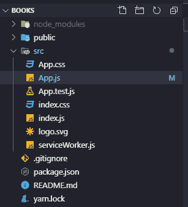

# 反应钩，是什么？怎么用？第 1 部分-使用“使用状态”

> 原文：<https://dev.to/lukyhenson/react-hooks-what-is-it-how-to-use-it-pt-1-using-usestate-1k8>

在这第一部分，我将向你展示如何在一个简单的 react 应用程序中使用`react hooks`，在这个应用程序中，你可以将书籍添加到你的列表中，考虑各种可能性，我们将使用`useState()`、`useEffect()`和`useCallback()`。

### 第一步:创建项目

*   你需要在你的机器上安装`create-react-app`，使用这个命令安装`npm install -g create-react-app`；
*   所以现在您可以通过键入`npx create-react-app books`来生成项目；
*   您的项目文件夹将包含以下路径和文件:
*   删除此文件`App.js`并创建一个同名的新文件；
*   在您的新文件上创建如下内容:

```
import React from 'react';

export default function App() {
  return <h1>Hello World!</h1>
}; 
```

<svg width="20px" height="20px" viewBox="0 0 24 24" class="highlight-action crayons-icon highlight-action--fullscreen-on"><title>Enter fullscreen mode</title></svg> <svg width="20px" height="20px" viewBox="0 0 24 24" class="highlight-action crayons-icon highlight-action--fullscreen-off"><title>Exit fullscreen mode</title></svg>

### 第二步:使用 useState()

在 react 版本中，在`16.8`之前创建一个有状态的组件，你应该先创建一个这样的类组件:

```
import React from 'react';

class App extends React.Component {
  state = {
    title: 'Hello World!',
  }

  render() {
    return <h1>{this.state.title}</h1>
  }
};

export default App; 
```

<svg width="20px" height="20px" viewBox="0 0 24 24" class="highlight-action crayons-icon highlight-action--fullscreen-on"><title>Enter fullscreen mode</title></svg> <svg width="20px" height="20px" viewBox="0 0 24 24" class="highlight-action crayons-icon highlight-action--fullscreen-off"><title>Exit fullscreen mode</title></svg>

*   好了，现在我们要把它放在我们的上下文中:

```
import React from 'react';

class App extends React.Component {
  state = {
    books: ['Javascript', 'React'],
    newBook: '',
  }

  handleBookInput = e => this.setState({ newBook: e.target.value });

  addBook = () => {
    this.setState({
      books: [...this.state.books, this.state.newBook],
      newBook: '',
    });
  }

  render() {
    // if you don't know what is <></> is short way to use <React.Fragment> :D
    return (
      <>
        <input
          value={this.state.newBook}
          onChange={this.handleBookInput}
          placeholder="add here you new book"
          onKeyPress={e => e.key === 'Enter' && this.addBook()}
        />
        <button onClick={this.addBook}>Add Book!</button>
        <ul>
          {this.state.books.map(
            (book, index) => <li key={index}>{book}</li>
          )}
        </ul>
      </>
    )
  }
};

export default App; 
```

<svg width="20px" height="20px" viewBox="0 0 24 24" class="highlight-action crayons-icon highlight-action--fullscreen-on"><title>Enter fullscreen mode</title></svg> <svg width="20px" height="20px" viewBox="0 0 24 24" class="highlight-action crayons-icon highlight-action--fullscreen-off"><title>Exit fullscreen mode</title></svg>

*   让我们将这个文件重新构建成一个功能组件，并使用`useState`:

```
// We need to import useState from react
import React, { useState } from 'react';

export default function App() {
  /* When we declare a state variable with useState,
  it returns a pair — an array with two items.
  The first item is the current value,
  and the second is a function that lets us update it.
  Using[0] and[1] to access them is a bit confusing because 
  they have a specific meaning.
  This is why we use array destructuring instead. */

  /* 
  const booksStateVariable = useState(['Javascript', 'React']);
  const books = booksStateVariable[0];
  const setBooks = booksStateVariable[1];
  */

  /* To be more pretty and readable we use the way bellow,
  now you don't need to use this.state.books, just use books as a state 
  variable :D;   
  */

  const [books, setBooks] = useState(['Javascript', 'React']);

  /*We'll create an addBook function to save this new book in books array,
  what this setBooks do? Answer: It do something like that to you => [...books, the_new_value],
  in this first part of article, we'll put the 'Test' value locally, 
  in next part i'll show the next steps.
  */
  const addBook = () => setBooks('Test');

  return (
    <>
      <button onClick={addBook}>Add test book!</button>
      <ul>
        {books.map((book, index) => <li key={index}>{book}</li>)}
      </ul>
    </>
  );
}; 
```

<svg width="20px" height="20px" viewBox="0 0 24 24" class="highlight-action crayons-icon highlight-action--fullscreen-on"><title>Enter fullscreen mode</title></svg> <svg width="20px" height="20px" viewBox="0 0 24 24" class="highlight-action crayons-icon highlight-action--fullscreen-off"><title>Exit fullscreen mode</title></svg>

[](https://res.cloudinary.com/practicaldev/image/fetch/s--M7amY-63--/c_limit%2Cf_auto%2Cfl_progressive%2Cq_auto%2Cw_880/https://thepracticaldev.s3.amazonaws.com/i/ydfudxm1k67q7npg62b8.jpg)

React hooks 角 1 - [链接此处](https://dev.to/lukyhenson/react-hooks-what-is-it-how-to-use-it-pt-1-using-usestate-1k8)
React hooks Pt。2 - [链接此处](https://dev.to/lukyhenson/react-hooks-what-is-it-how-to-use-it-pt-2-using-usestate-and-useeffect-4mee)