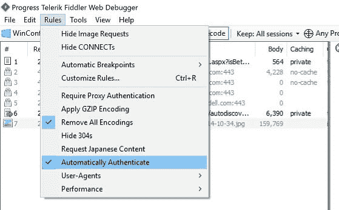

# 用提琴手作为 NPM、梅文、格雷尔的代理人

> 原文：<https://dev.to/0xshetty/using-fiddler-as-proxy-for-npm-maven-gradle-36d7>

通常在公司网络上下载软件包是一件痛苦的事情。一种方法是切换到个人网络，然后下载软件包。
这里有一个解决办法，使用任何提供您的凭证的代理服务器。但事情是，每次我改变我的密码，我打破了我的头，终于意识到，由于在代理设置旧证书包不下载。这是我如何解决这个问题，使用[提琴手](https://www.telerik.com/download/fiddler)。

一旦你下载了 fiddler，打开 fiddler，然后在规则菜单下选择`Automatically Authenticate`

[](https://res.cloudinary.com/practicaldev/image/fetch/s--H0X7A2PW--/c_limit%2Cf_auto%2Cfl_progressive%2Cq_auto%2Cw_880/https://thepracticaldev.s3.amazonaws.com/i/h06snueiez35f4ys7g3o.jpg) 。

### 为 NPM

使用以下命令
进行设置

```
npm config set proxy http://localhost:8888/
npm config set https-proxy http://localhost:8888/ 
```

<svg width="20px" height="20px" viewBox="0 0 24 24" class="highlight-action crayons-icon highlight-action--fullscreen-on"><title>Enter fullscreen mode</title></svg> <svg width="20px" height="20px" viewBox="0 0 24 24" class="highlight-action crayons-icon highlight-action--fullscreen-off"><title>Exit fullscreen mode</title></svg>

运筹学

手动操作，打开`C:\Users\<user name>\.npmrc`，将代理设置为 fiddler 正在运行的端口，如下图

```
proxy=http://localhost:8888/
https-proxy=http://localhost:8888/
strict-ssl=false 
```

<svg width="20px" height="20px" viewBox="0 0 24 24" class="highlight-action crayons-icon highlight-action--fullscreen-on"><title>Enter fullscreen mode</title></svg> <svg width="20px" height="20px" viewBox="0 0 24 24" class="highlight-action crayons-icon highlight-action--fullscreen-off"><title>Exit fullscreen mode</title></svg>

`strict-ssl`设置为 false 以忽略证书验证，请谨慎使用此选项，因为有很多包是恶意的。
现在试试`npm -i <packagename>`

### 为美文

打开`C:\Users\<user name>\.m2\settings.xml`并在`settings`节点
中添加以下部分

```
<proxies>
    <proxy>
        <id>optional</id>
        <active>true</active>
        <protocol>http</protocol>
        <host>localhost</host>
        <port>8888</port>
        <nonProxyHosts></nonProxyHosts>
    </proxy>
    <proxy>
        <id>optional</id>
        <active>true</active>
        <protocol>https</protocol>
        <host>localhost</host>
        <port>8888</port>
        <nonProxyHosts></nonProxyHosts>
    </proxy>
</proxies> 
```

<svg width="20px" height="20px" viewBox="0 0 24 24" class="highlight-action crayons-icon highlight-action--fullscreen-on"><title>Enter fullscreen mode</title></svg> <svg width="20px" height="20px" viewBox="0 0 24 24" class="highlight-action crayons-icon highlight-action--fullscreen-off"><title>Exit fullscreen mode</title></svg>

### 度

将此属性添加到`gradle.properties`
的根文件夹中

```
systemProp.http.proxyHost=127.0.0.1
systemProp.http.proxyPort=8888
systemProp.https.proxyHost=127.0.0.1
systemProp.https.proxyPort=8888 
```

<svg width="20px" height="20px" viewBox="0 0 24 24" class="highlight-action crayons-icon highlight-action--fullscreen-on"><title>Enter fullscreen mode</title></svg> <svg width="20px" height="20px" viewBox="0 0 24 24" class="highlight-action crayons-icon highlight-action--fullscreen-off"><title>Exit fullscreen mode</title></svg>

希望这有所帮助！

*最初发布于 [Bitsmonkey](https://unrealnerd.github.io/blog/2019/09/22/npm-proxy)*
*照片由 Jonathan 在 Unsplash 上拍摄*