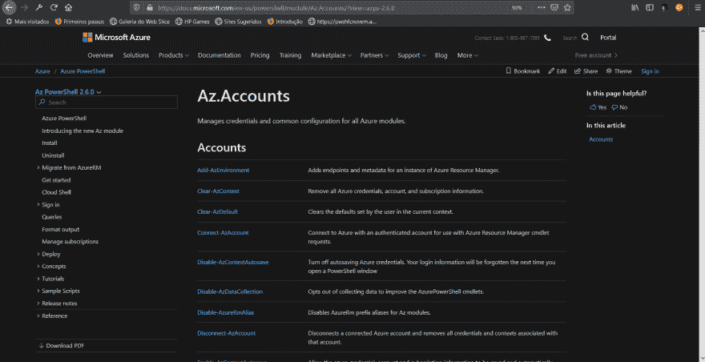
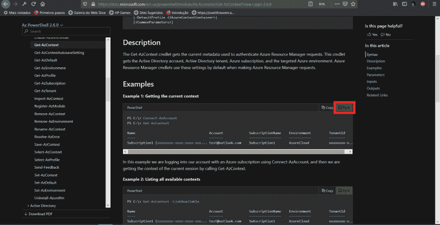
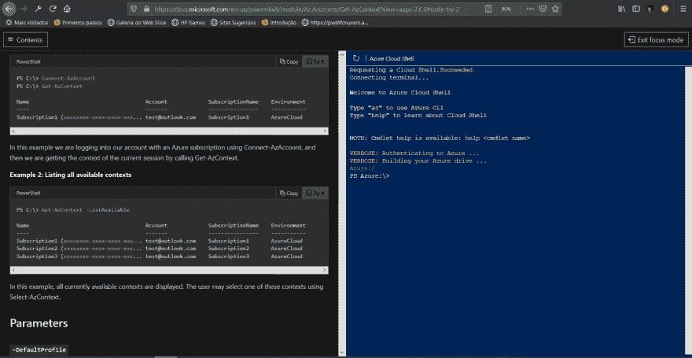
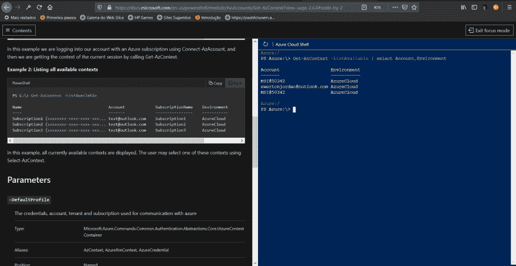
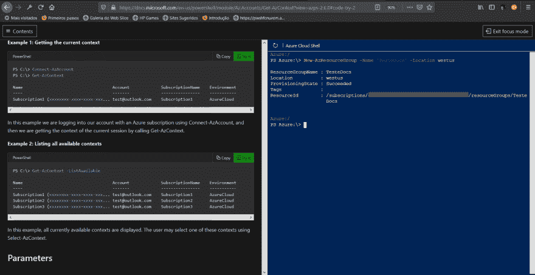
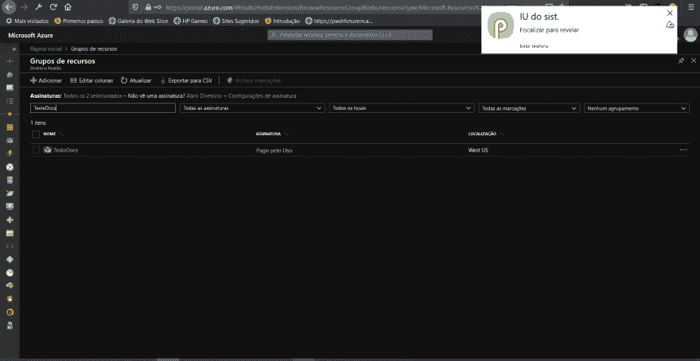

# Azure 云外壳| PowerShell 核心|微软文档📚

> 原文:[https://dev . to/ewertonjordao/azure-cloud-shell-powershell-core-Microsoft-docs-2f ho](https://dev.to/ewertonjordao/azure-cloud-shell-powershell-core-microsoft-docs-2fho)

# 采用直接来自微软 Docs 的蓝云外壳。

你们好吗？今天带来了一个很好的方法来使用 **Azure Resource Manager** (通过 PowerShell Az 模块)，对于那些想学习使用该模块的人来说，或者在记忆无法帮助我们的那一天您可以直接从正式的模块文档快速、轻松地启动 Azure Cloud Shell 会话。

对于本演示，我需要一个蓝色账户，您可以免费启动，一个存储账户[存储账户](https://docs.microsoft.com/en-us/azure/storage/common/storage-account-overview)。**蓝云外壳**是一个预配置了一些工具、az cli、termux、vim、nano、kubectl 等的工作站。通过此工作站，我可以使用命令行通过门户或*应用程序管理我的资源。

现在，我们将访问 Microsoft docs，在模块浏览器中，我可以列出 Az 模块。*提供和说明。

例如，我将使用 Az.Accounts 模块。

[T2】](https://res.cloudinary.com/practicaldev/image/fetch/s--Miyc9Ned--/c_limit%2Cf_auto%2Cfl_progressive%2Cq_auto%2Cw_880/https://thepracticaldev.s3.amazonaws.com/i/ujvoqiwbaqgfxdo7mgm7.png)

[T2】](https://res.cloudinary.com/practicaldev/image/fetch/s--C75ZLT44--/c_limit%2Cf_auto%2Cfl_progressive%2Cq_auto%2Cw_880/https://thepracticaldev.s3.amazonaws.com/i/lyg4ewh66jk17tcyfnvg.png)

[T2】](https://res.cloudinary.com/practicaldev/image/fetch/s--fzBhTdG9--/c_limit%2Cf_auto%2Cfl_progressive%2Cq_auto%2Cw_880/https://thepracticaldev.s3.amazonaws.com/i/0sty1ahh98j0d5x9qnlm.png)

[T2】](https://res.cloudinary.com/practicaldev/image/fetch/s--nlSnCtr9--/c_limit%2Cf_auto%2Cfl_progressive%2Cq_auto%2Cw_880/https://thepracticaldev.s3.amazonaws.com/i/1q3o1ip8fo5apn1gjoi7.png)

请记住，在 Azure Cloud Shell 中运行的内容将以 Azure 配置，也就是说，如果这是一个删除/更改命令，而不考虑上下文，则可能会影响生产应用程序。

[T2】](https://res.cloudinary.com/practicaldev/image/fetch/s--3KRzTIDz--/c_limit%2Cf_auto%2Cfl_progressive%2Cq_auto%2Cw_880/https://thepracticaldev.s3.amazonaws.com/i/4yf3czfvr1hpn3ktbaa4.png)

[T2】](https://res.cloudinary.com/practicaldev/image/fetch/s--BCf7ubzx--/c_limit%2Cf_auto%2Cfl_progressive%2Cq_auto%2Cw_880/https://thepracticaldev.s3.amazonaws.com/i/tiss72kahlmiqri76mxj.png)

好了，各位。这是 azure cloud shell 和 PowerShell Az 模块如何易于使用的演示。*，直接来自 Microsoft Docs。

*我朋友的帖子讲述了如何在手机[【Renato Groff】](https://medium.com/@renato.groffe/microsoft-azure-app-gerenciando-do-seu-celular-recursos-na-nuvem-32b5494eaa58)上使用蓝云外壳，本文演示了如何直接从蓝云应用程序中部署忽必烈群集。

**(∞别忘了，PS 是生命】**