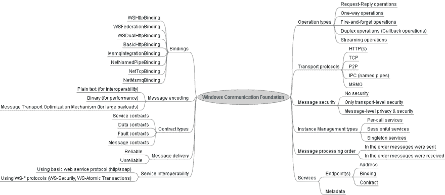

# 你的团队领导不能回答的 22 个基本 WCF 面试问题

> 原文：<https://dev.to/aershov24/22-essential-wcf-interview-questions-your-team-lead-can-t-answer-3fkg>

windows Communication Foundation(WCF)是用于构建面向服务的应用程序的框架。不管它的年龄，WCF 它仍然是一个框架，可以让你建立真正复杂的解决方案，控制数据流的各个方面，并保持任何有经验的基本技能。NET 开发者。

> 最初发表于 [Fullstack。永远不要错过技术面试](https://www.fullstack.Cafe)

### Q1:WCF 是什么？

> 主题: **WCF**
> 难度:⭐

Windows Communication Foundation(WCF)是一个用于构建面向服务的应用程序的框架。使用 WCF，您可以将数据作为异步消息从一个服务端点发送到另一个服务端点。服务终结点可以是 IIS 承载的持续可用服务的一部分，也可以是应用程序中承载的服务。端点可以是从服务端点请求数据的服务的客户端。这些消息可以像以 XML 形式发送的单个字符或单词一样简单，也可以像二进制数据流一样复杂。

🔗**来源:**【docs.microsoft.com】T2

### Q2:你能说出 WCF 服务的基本组成部分吗？

> 主题: **WCF**
> 难度:⭐⭐

请看这张思维导图，了解 WCF 服务的各个组成部分:

[](https://res.cloudinary.com/practicaldev/image/fetch/s--unwbmiKy--/c_limit%2Cf_auto%2Cfl_progressive%2Cq_auto%2Cw_880/http://1.bp.blogspot.com/_ilf9yT58u-k/R5dVNShe9nI/AAAAAAAAACM/jvIaKFVrU8g/s1600/Windows%2BCommunication%2BFoundation%2BMindmap.png)

🔗**来源:**【codeproject.com】T2

### Q3:什么是 WCF 的服务合同？

> 主题: **WCF**
> 难度:⭐⭐

一个**服务契约**定义了服务向外界公开的操作。服务契约是 WCF 服务的接口，它告诉外界该服务能做什么。它可能具有服务级别设置，例如服务的名称和服务的命名空间。

```
[ServiceContract]
interface IMyContract { 
    [OperationContract]
    string MyMethod();
}

class MyService: IMyContract {
    public string MyMethod() {
        return "Hello World";
    }
} 
```

🔗**来源:**【dotnettricks.com】T2

### Q4:解释什么是 SOA？

> 主题: **WCF**
> 难度:⭐⭐

**SOA** 代表* *面向服务的架构。面向服务的架构是软件开发中的一种架构方法，其中应用程序被组织为“服务”。服务是一组包含连接数据库或其他服务的业务逻辑的方法。例如，你去酒店点餐。你点的菜首先送到柜台，然后送到厨房，在那里准备食物，最后由服务员上菜。

**面向服务架构的一些重要特征**

*   SOA 服务应该独立于其他服务。更改服务不应该影响调用服务的客户端。
*   服务应该是独立的。**服务应该能够* *定义自己(用 Web 服务描述语言(WSDL))。它应该能够告诉客户端它做的所有操作是什么，它使用的所有数据类型是什么，以及它将返回什么样的值。

🔗**来源:**【c-sharpcorner.com】T2

### WCF 的特色和优势是什么？

> 主题: **WCF**
> 难度:⭐⭐

WCF 的特色**

windows Communication Foundation(WCF)是一个安全、可靠且可伸缩的消息传递平台。NET 框架 3.0，

*   面向服务
*   互用性
*   多种消息模式
*   服务元数据
*   数据契约
*   安全性
*   多重传输和编码
*   可靠的排队消息
*   持久消息
*   处理
*   AJAX 和 REST 支持
*   展开性

**WCF 的优势**:

1.  面向服务
2.  独立于位置
3.  独立于语言
4.  独立于平台
5.  支持多重操作
6.  WCF 可以像 COM+一样维护事务
7.  它可以维持状态
8.  它可以控制并发性
9.  它可以托管在 IIS、WAS、自托管、Windows 服务上。

🔗**来源:**【docs.microsoft.com】T2

### WCF 的交通是什么？

> 主题: **WCF**
> 难度:⭐⭐⭐

WCF 编程模型将端点操作(以服务契约的形式表达)与连接两个端点的传输机制分离开来。这使您可以灵活地决定如何向网络公开您的服务。传输层位于信道堆栈的最低层。传输向另一个应用程序发送消息或从另一个应用程序接收消息的序列化形式。Windows Communication Foundation(WCF)中使用的主要传输有:

*   HTTP，
*   HTTPS，
*   传输控制协议（Transmission Control Protocol）
*   命名管道。

🔗**来源:**【weblogs.asp.net】T2

### Q7:什么是 WCF 装订，你知道多少？

> 主题: **WCF**
> 难度:⭐⭐⭐

**绑定**指定 Windows Communication Foundation(WCF)服务端点如何与其他端点通信。最基本的，绑定必须指定要使用的*传输*(例如，HTTP 或 TCP)。您还可以通过绑定设置其他特征，如安全性和事务支持。

WCF 提供了九种内置绑定:

*   **BasicHttpBinding** :基本的 web 服务通信。将 WCF 服务公开为旧版 ASMX web 服务。用于互操作性。默认情况下没有安全性。
*   **WSHttpBinding** :支持 WS-*的 Web 服务。支持事务和可靠的消息传递。
*   **WSDualHttpBinding** :具有双工契约和事务支持的 Web 服务。
*   WSFederationHttpBinding :具有联合安全性的 Web 服务。支持交易。
*   **MsmqIntegrationBinding** :直接与 MSMQ 应用程序通信。支持交易。
*   **NetMsmqBinding**:WCF 应用程序之间使用队列进行通信。支持交易。
*   **NetNamedPipeBinding** :同一台计算机上的 WCF 应用程序之间的通信。支持双工合约和交易。
*   **NetPeerTcpBinding** :计算机之间通过点对点服务的通信。支持双工合约。
*   **NetTcpBinding** :跨计算机的 WCF 应用程序之间的通信。支持双工合约和交易。

🔗**来源:**【weblogs.asp.net】T2

### Q8:托管 WCF 服务有哪些可能的方式？

> 主题: **WCF**
> 难度:⭐⭐⭐

对于托管的**Windows Communication Foundation**服务，我们至少需要一个托管进程、一个`ServiceHost`实例和一个已配置的`Endpoint`。托管服务的可能方法有:

1.  托管在托管应用程序中/自托管
    1.  控制台应用程序
    2.  Windows 应用程序
    3.  Windows 服务
2.  在 Web 服务器上托管
    1.  IIS 6.0(ASP.NET 应用程序仅支持 HTTP)
    2.  windows Process Activation Service(WAS)即 IIS 7.0 支持 HTTP、TCP、NamedPipes 和 MSMQ。

🔗**来源:**【codeproject.com】T2

### Q9:WCF 的消息契约是什么？

> 主题: **WCF**
> 难度:⭐⭐⭐

有时，对 SOAP 消息结构的完全控制与对其内容的控制(由数据契约定义)一样重要。当互操作性很重要时，或者为了在消息或消息部分的级别上控制安全问题时，尤其如此。在这些情况下，您可以创建一个*消息契约*，使您能够指定所需的精确 SOAP 消息的结构。

🔗**来源:**【c-sharpcorner.com】T2

### Q10:在 WCF 什么是运营合同？

> 主题: **WCF**
> 难度:⭐⭐⭐

在服务合同中定义了一个**操作合同**。它定义了操作的参数和返回类型。操作契约还可以定义操作级别的设置，如操作的事务流、操作的方向(单向、双向或双向)以及操作的错误契约。

```
[ServiceContract]
interface IMyContract { 
    [FaultContract(typeof(MyFaultContract))]
    [OperationContract]
    string MyMethod();
} 
```

🔗**来源:**【dotnettricks.com】T2

### Q11:说出一些 WCF 不同类型的合同

> 主题: **WCF**
> 难度:⭐⭐⭐

WCF 契约规定了服务及其操作。WCF 有五种类型的合同:

*   服务合同，
*   作业合同，
*   数据契约，
*   消息契约
*   过错合同。

🔗**来源:**【dotnettricks.com】T2

### Q12:解释一下 ASP.NET 和 WCF Web API 的区别？

> 主题: **WCF**
> 难度:⭐⭐⭐

在下面列出的场景中，您应该选择 WCF:

*   如果您需要使用 TCP、MSMQ 或 MIME 等协议发送数据
*   如果消费客户端只知道如何消费 SOAP 消息，那么 WEB API 就是一个开发 RESTful/HTTP 服务的框架。

考虑:

| WCF | ASP.NET Web API |
| --- | --- |
| 启用支持多种传输协议(HTTP、TCP、UDP 和自定义传输)的构建服务，并允许在它们之间切换。 | 仅限 HTTP。HTTP 的一流编程模型。更适合从各种浏览器、移动设备等进行访问，支持广泛的覆盖范围。 |
| 启用支持同一消息类型的多种编码(文本、MTOM 和二进制)的构建服务，并允许在它们之间切换。 | 支持构建支持各种媒体类型(包括 XML、JSON 等)的 Web APIs。 |
| 支持使用 WS-*标准构建服务，如可靠的消息传递、事务、消息安全性。 | 使用基本协议和格式，如 HTTP、WebSockets、SSL、JSON 和 XML。不支持更高级别的协议，如可靠的消息传递或事务。 |
| 支持请求-回复、单向和双工消息交换模式。 | HTTP 是请求/响应，但是通过 SignalR 和 WebSockets 集成可以支持其他模式。 |
| WCF SOAP 服务可以用 WSDL 来描述，允许自动化工具为具有复杂模式的服务生成客户端代理。 | 描述 Web API 的方法有很多种，从描述代码片段的自动生成的 HTML 帮助页面到 OData 集成 API 的结构化元数据。 |
| 配有。NET 框架。 | 装运。NET framework，但它是开源的，也可以带外独立下载。 |

🔗**来源:**【stackoverflow.com】T2

### 问题 13:为什么我们需要流媒体？

> 主题: **WCF**
> 难度:⭐⭐⭐

当您有大量数据要传输时，WCF 的流传输模式是一种可行的替代方式，可以替代在内存中整体缓冲和处理消息的默认行为。

在 WCF，任何接收消息只有在整个消息被接收后才被发送。我在这里的意思是，第一个消息在接收端被缓冲，一旦它被完全接收，它就被传递到接收端。这种方法的主要问题是，当消息被缓冲时，接收端没有响应。因此，WCF 的默认消息处理方式对于小消息是可以的，但是对于大消息，这种方式就不好了。因此，为了解决这个问题，WCF 开始行动起来。

🔗**来源:**【c-sharpcorner.com】T2

### 问题 14:什么是互操作性，如何通过 WCF 服务实现互操作性？

> 主题: **WCF**
> 难度:⭐⭐⭐⭐

**互操作性**是通过标准协议(比如 SOAP)与其他平台进行通信的能力。SOAP 的主要好处之一是它是独立于平台的。

WCF 被设计和构建为与支持 web 服务规范的 Web 服务进行互操作，该规范被称为 WS-*规范。因此，WCF 提供了三个系统提供的绑定来促进
的互操作性。这些绑定显示在以下列表中:

*   **BasicHttpBinding** : WCF 服务可以使用这个绑定来配置和公开端点。这些端点又可以与*通信。基于 asmx 的 web 服务以及符合 WS-I Basic Profile 1.1 的客户端和服务。
*   **WsHttpBinding** :支持分布式事务以及安全可靠的会话。
*   **WsDualHttpBinding** :支持双工通信和通过 SOAP 中介的通信。

🔗**来源:**【codeproject.com】T2

### Q15:您何时会使用 WCF 双工服务？

> 主题: **WCF**
> 难度:⭐⭐⭐⭐

如果你想实现回调模式，你需要双工。回调意味着客户端不知道服务器上什么时候发生了一些事件。如果您不知道事件何时发生，您有两种选择可以实施:

*   轮询-每隔 X 分钟发送一次请求，检查事件是否发生。服务器应该返回事件细节(如果发生的话)或者返回一个标志，表明您需要继续呼叫。在高级场景中，服务器也可以返回建议的超时。
*   回调-客户端发送某种形式的描述，如果事件发生，服务器应该做什么。这可能是指向 C 中的函数的指针，在。NET 或 WCF 的端点架构。服务器记住这些信息，并在时间到了的时候从他们那边发出呼叫。如你所见，双工/回叫意味着在某些时候服务器作为客户端工作(发起通信),这是一个很大的变化。

WCF 双工通信可能需要特殊的网络配置，因为在许多情况下，网络允许您调用外部服务(您作为客户端工作)，但禁止外部资源调用您(外部服务作为客户端工作)。这是出于安全目的而实现的。

🔗**来源:**【medium.com】T2

### Q16:如果我通过[operation contract(isone way = true)]更改没有返回值的方法的操作契约，会有什么不同吗？

> 主题: **WCF**
> 难度:⭐⭐⭐⭐

是的，它会——更重要的是,**还会提高可伸缩性。一旦服务器接收到调用，就释放客户端，客户端不必等待处理完成。这有助于尽快释放客户机和服务器上的资源。**

🔗**来源:**【stackoverflow.com】T2

### Q17:解释二进制 vs MTOM vs WCF 流媒体？

> 主题: **WCF**
> 难度:⭐⭐⭐⭐⭐

*   **MTOM** 是一种标准，它使用多部分 mime 编码的消息来发送消息的大部分，这些部分对于作为纯二进制的 base64 编码来说过于昂贵。SOAP 消息本身作为消息的初始部分发送，并包含对二进制部分的引用，web 服务软件栈(如 WCF)可以将这些二进制部分组合在一起，以创建消息的单一表示。
*   二进制编码完全是 WCF 的专利，并不仅仅与大型信息有关。它给出了 XML 信息集的二进制表示，这种表示比基于文本的格式更加紧凑，解析速度也更快。如果你碰巧正在发送大的二进制数据块，那么它正好适合正在发送的其他字节。
*   **流式传输**可用于任何消息格式。这更多地是关于数据何时通过网络写入，而不是在提交给网络传输之前完全缓存在内存中。较小的消息在发送前进行缓冲更有意义，而较大的消息，尤其是包含较大的二进制块或流的消息，必须进行流式传输，否则将耗尽内存资源。

🔗**来源:**【stackoverflow.com】T2

### Q18:在 IIS 上托管 WCF 服务，Windows 服务和自托管 app 有什么区别？

> 主题: **WCF**
> 难度:⭐⭐⭐⭐⭐

这个问题没有标准答案。IIS 为您提供了许多开箱即用的功能，如应用程序域重载、监控等。这就是为什么你应该首先回答这个问题:你是否需要所有这些特性？如果不是-可以考虑 windows 服务。

其他需要考虑的事项:

*   IIS 为您提供按需加载——这可能是一个加号或减号。当请求进来时，构造 ServiceHost，然后实例化托管的服务类，并处理请求。没有什么需要 24 小时运行。但与此同时，每次有消息进来时，这种设置都需要更多的时间和精力，并且作为程序员，您对您的服务主机没有多少控制权，真的。
*   自托管通常要快几倍，因为您的 ServiceHost 已经启动并运行了——但您需要确保它真的启动并运行，无论何时有消息传入，都没有“按需”加载——它要么启动并可以服务于请求，要么不能。但是您对服务主机有更多的控制权——何时以及如何构建等等。，您可以选择并定义您认为合适的服务地址。

和一些来自微软的信息:

| 托管环境 | 常见场景 | 主要优势和局限性 |
| --- | --- | --- |
| 托管应用程序(“自托管”) | -开发期间使用的控制台应用程序。-丰富的 WinForm 和 WPF 客户端应用程序访问服务。 | -灵活。-易于部署。-不是服务的企业解决方案。 |
| Windows 服务(以前称为 NT 服务) | -在 IIS 外部托管的长期运行的 WCF 服务。 | -服务进程生命周期由操作系统控制，不是消息激活的。-受所有版本的 Windows 支持。-安全环境。 |
| IIS 5.1, IIS 6.0 | -使用 HTTP 协议在互联网上运行与 ASP.NET 内容并行的 WCF 服务。 | -工艺回收。-怠速停机。-过程健康监控。-基于消息的激活。-仅限 HTTP。 |
| Windows 进程激活服务(WAS) | -使用各种传输协议运行 WCF 服务，而无需在互联网上安装 IIS。 | -不需要 IIS。-工艺回收。-怠速停机。-过程健康监控。-基于消息的激活。-适用于 HTTP、TCP、命名管道和 MSMQ。 |
| IIS 7.0 | -运行包含 ASP.NET 内容的 WCF 服务。-使用各种传输协议在互联网上运行 WCF 服务。 | -是福利。-与 ASP.NET 和 IIS 内容集成。 |

🔗**来源:**【codeproject.com】T2

### Q19:我们可以将 WSHttpBinding 与请求-回调(也称为双工)交换模式一起使用吗？

> 主题: **WCF**
> 难度:⭐⭐⭐⭐⭐

HTTP 协议不支持双工通信——响应仅对每个请求有效，所以答案是否定的。这阻止了基于 HTTP 的绑定(如`BasicHttpBinding`和`WSHttpBinding`)支持双工。为了解决这个限制，WCF 提供了`WSDualHttpBinding`。此绑定使用复合双工通信，这意味着创建两个通信通道来支持双向调用。

🔗**来源:**【medium.com】T2

### Q20:WCF 消息交换模式中请求-响应和双工的主要区别是什么？

> 主题: **WCF**
> 难度:⭐⭐⭐⭐⭐

主要区别在于，客户端建立到服务的通道后，服务可以随时独立调用客户端。在请求-响应中，服务只有在收到来自客户端的请求后才进行通信。因此，通过使用双工，您可以从客户端的角度接收类似事件的行为。显然，这种增强需要维护一个会话(服务上的实例模式 PerSession)。

🔗**来源:**【stackoverflow.com】T2

### Q21:我应该使用 WCF 还是原始套接字？

> 主题: **WCF**
> 难度:⭐⭐⭐⭐⭐

插座很低级。今天，除非你真的需要，否则我绝不会降低到套接字这样的低级水平。使用高层次的抽象会更有生产力和创造性。远程处理或 WCF 的最大优点是，您可以在服务器和客户端之间传递对象，并在每一端调用它们的方法。还要注意，通过 WCF 的 Net.tcp 通信的性能比普通套接字通信差得多。这是因为 WCF 简化了很多事情，但是这些简化和概括减慢了处理速度。所以看情况。

🔗**来源:**【stackoverflow.com】T2

### Q22:什么取代了 WCF？网芯？

> 主题: **WCF**
> 难度:⭐⭐⭐⭐⭐

on.NET 核心已经支持 WCF 客户端。中不支持 WCF 服务器端。NET Core，因为它是 Windows 特有的技术。NET Core 应该是跨平台的。WCF 不太可能移植到。NET 核心，因为大部分代码依赖于 Windows 内部库。对于服务器端思想，您可以使用一些替代方法:

1.  IpcServiceFramework -一个. NET 核心轻量级进程间通信框架，允许通过命名管道和/或 TCP 调用服务(以类似于 WCF 的方式，目前不可用于)。网芯)。还支持 SSL 上的安全通信。
2.  gRPC -一个高性能、开源的 RPC 框架，最初由 Google 开发。该框架基于远程过程调用的客户机-服务器模型。客户端应用程序可以直接调用服务器应用程序上的方法，就像它是本地对象一样。
3.  **核心 WCF** -核心 WCF 是 Windows 通信框架(WCF)的一个端口。网芯。该项目的目标是使现有的 WCF 项目转移到。网芯。

🔗**来源:**【stackoverflow.com】T2

> 谢谢🙌阅读，祝你面试好运！
> *如果你喜欢这篇文章，请分享给你的开发者伙伴！*
> *查看更多全栈面试问题&答案上👉[www . full stack . cafe](https://www.fullstack.cafe)T9】*