# 使用 MicroStack、left rd 2 . x 和 k3b 实现网格服务...

> 原文:# t0]https://dev . to/deep 75/实施-d-un-service-mesh-with-micro tack-left rd-2-x-et-k3b-31 BD

[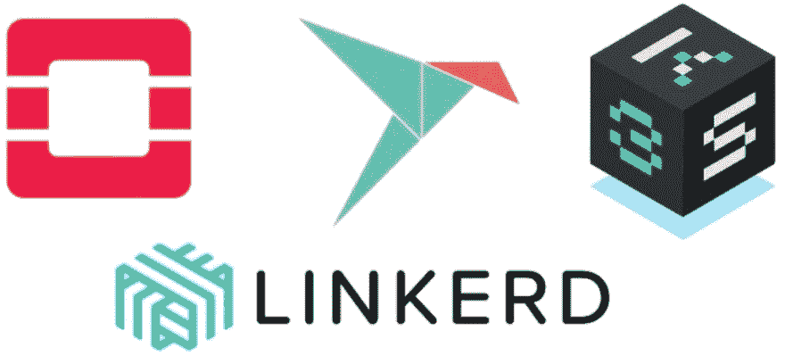](https://res.cloudinary.com/practicaldev/image/fetch/s--q7d48VjW--/c_limit%2Cf_auto%2Cfl_progressive%2Cq_auto%2Cw_880/https://cdn-images-1.medium.com/max/1024/1%2AUIEQQ3sVLuFy6bK8uHeV2A.jpeg)

Canonical 最近发表了一篇有趣的文章，题为“不，库比涅斯不是新的 OpenStack(可以理解其背后的业务问题)，强调 OpenStack 与库比涅斯的主要区别在于:

*   openstack 的主要设计目的是创建多租户基础架构
*   库比涅斯专为管理服务而设计…

不，Kubernetes 不是新的 OpenStack，Canonical - Container Journal 说

它们适用于通过节点级隔离或命名空间在库群集中实现“多租户”的某些做法，例如:

*   [kubernetes 集群中的多租户](https://dev.to/ankitbansal/multi-tenancy-in-kubernetes-cluster-44me)
*   [集群多租户| Kubernetes 引擎文档|谷歌云](https://cloud.google.com/kubernetes-engine/docs/concepts/multitenancy-overview)

[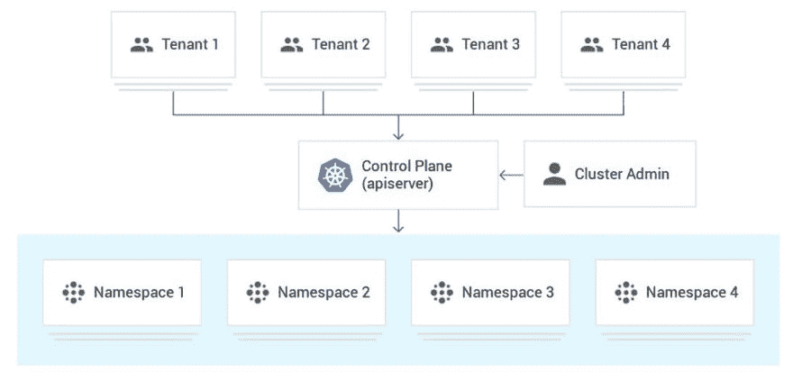](https://res.cloudinary.com/practicaldev/image/fetch/s--PzhJFVRH--/c_limit%2Cf_auto%2Cfl_progressive%2Cq_auto%2Cw_880/https://cdn-images-1.medium.com/max/1024/1%2Avy1W8SYa2TgJ6WG8deHKgw.jpeg)

无论如何，我将利用 Stein 版本中的第一个 MicroStack 口(仍在边缘)来启动链接网格服务。请记住，microstack 是 openstack 的一个版本，旨在部署在工作站上，例如在边缘计算和 IoT 环境中:

*   [微堆栈](https://opendev.org/x/microstack)
*   [微堆栈-快速打开堆栈](https://microstack.run/)

[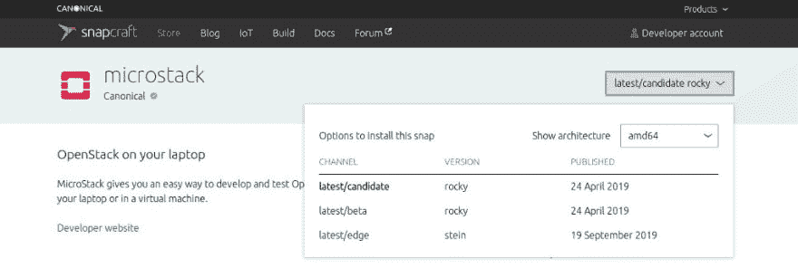](https://res.cloudinary.com/practicaldev/image/fetch/s--D2T7bydA--/c_limit%2Cf_auto%2Cfl_progressive%2Cq_auto%2Cw_880/https://cdn-images-1.medium.com/max/1024/1%2AL_x0G69OxcLHaE0fkuIwmg.jpeg)

[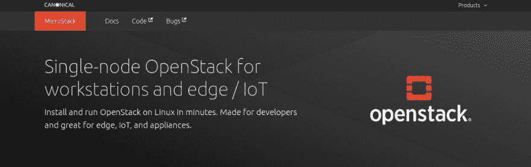](https://res.cloudinary.com/practicaldev/image/fetch/s--I-9mREkN--/c_limit%2Cf_auto%2Cfl_progressive%2Cq_auto%2Cw_880/https://cdn-images-1.medium.com/max/1024/1%2ASBAnLJ1ZH3Se9u9sMwxGSQ.jpeg)

而这只是通过捕捉:

[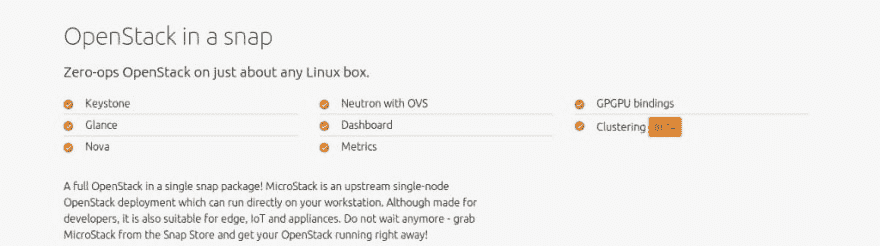](https://res.cloudinary.com/practicaldev/image/fetch/s--UupbLp4l--/c_limit%2Cf_auto%2Cfl_progressive%2Cq_auto%2Cw_880/https://cdn-images-1.medium.com/max/1024/1%2ANvDLgKvParMvxBRQ35jLwQ.jpeg)

我在一篇文章里提到过：

[一个群集在一分钟内在其站上使用 Microstack …](https://medium.com/@abenahmed1/un-cluster-openstack-sur-sa-station-en-une-minute-avec-microstack-8da478196299)

因此，我将在 Ubuntu 18.04 lt 中的 Scaleway 上体验 C2M 裸机实例(16 go ram 和 100 go 磁盘):

[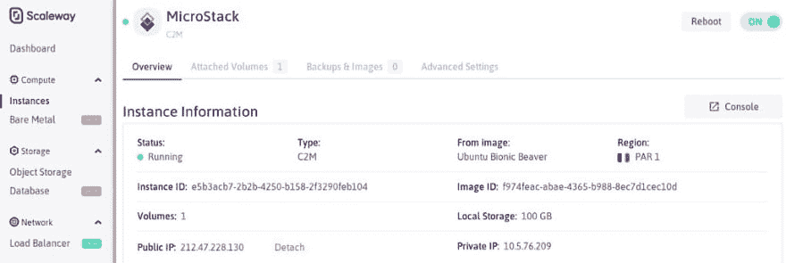](https://res.cloudinary.com/practicaldev/image/fetch/s--NodJTl_7--/c_limit%2Cf_auto%2Cfl_progressive%2Cq_auto%2Cw_880/https://cdn-images-1.medium.com/max/1024/1%2A4Q7rGBJ8u3Fh5CDXR7J2sg.jpeg)

斯坦版 microstack 的安装通过 Snap 完成:

[在你的 Linux 发行版上安装 microstack](https://snapcraft.io/microstack)

```
$ snap install microstack --edge --classic 
```

[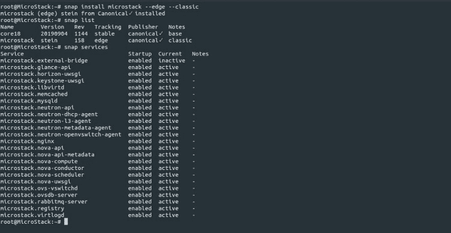](https://res.cloudinary.com/practicaldev/image/fetch/s--ljT8T_Fb--/c_limit%2Cf_auto%2Cfl_progressive%2Cq_auto%2Cw_880/https://cdn-images-1.medium.com/max/1024/1%2AU0OKlLZdZDwdUFBn-Nnp6g.jpeg)

借助 openstack 在几分钟内启动:

```
$ microstack.init 
```

[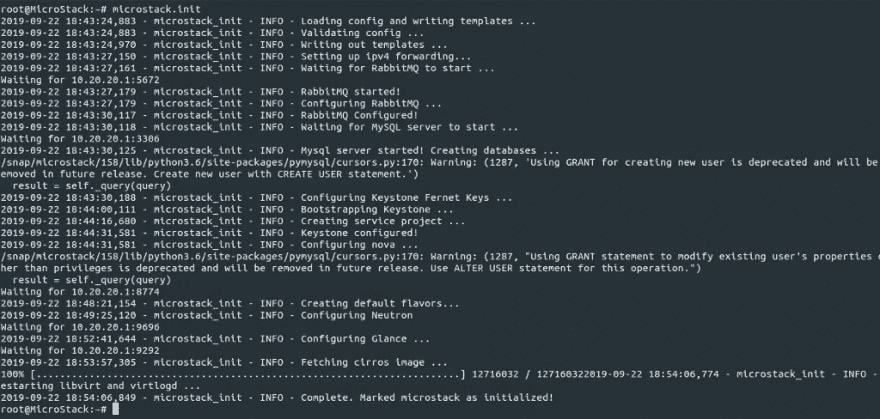](https://res.cloudinary.com/practicaldev/image/fetch/s--3tump38_--/c_limit%2Cf_auto%2Cfl_progressive%2Cq_auto%2Cw_880/https://cdn-images-1.medium.com/max/1024/1%2AMkfT0_xlJyXQvNNxvkfg_g.jpeg)

通过 SSH 下的端口重定向，我将连接到 Horizon 控制板(默认情况下，id 为“t0”admin/keystore“”:

[SSH 隧道-本地、远程&动态](https://dev.to/__namc/ssh-tunneling---local-remote--dynamic-34fa)

[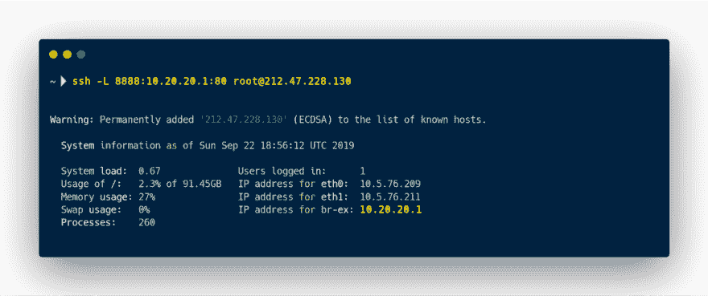](https://res.cloudinary.com/practicaldev/image/fetch/s--GMJv681P--/c_limit%2Cf_auto%2Cfl_progressive%2Cq_auto%2Cw_880/https://cdn-images-1.medium.com/max/1024/1%2A44wCWqwPZceFkSZ7mPd2cQ.png)

[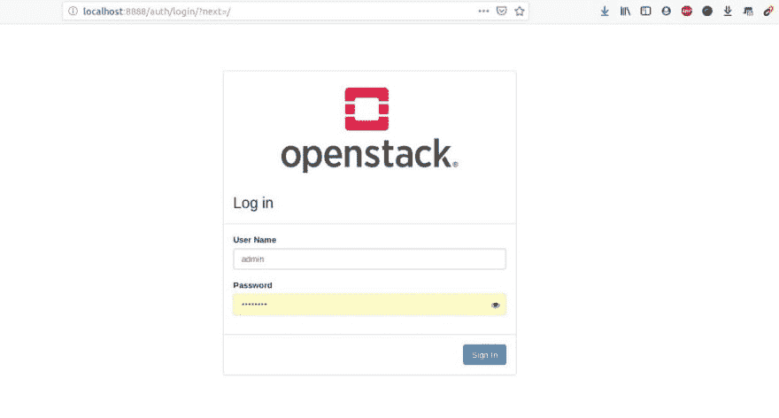](https://res.cloudinary.com/practicaldev/image/fetch/s--FAGmi_Ci--/c_limit%2Cf_auto%2Cfl_progressive%2Cq_auto%2Cw_880/https://cdn-images-1.medium.com/max/1024/1%2A67HBtlLwOSwzAuqaskTsfw.jpeg)

[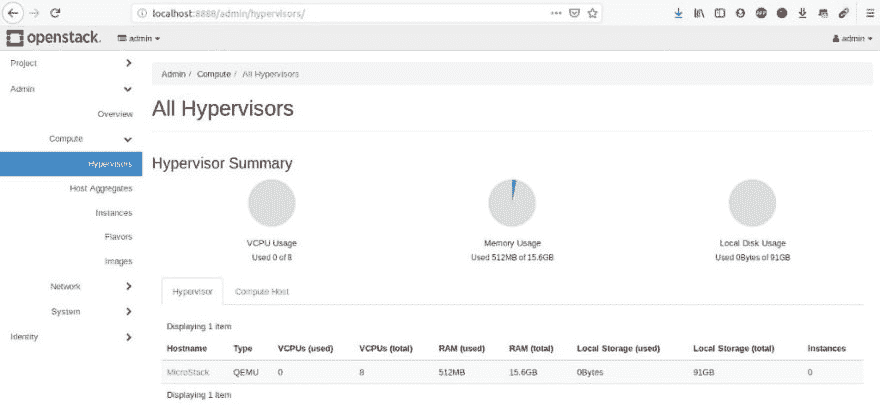](https://res.cloudinary.com/practicaldev/image/fetch/s--UdiPbJkc--/c_limit%2Cf_auto%2Cfl_progressive%2Cq_auto%2Cw_880/https://cdn-images-1.medium.com/max/1024/1%2A33YB_jzUzo98dyVEA7V7DQ.jpeg)

[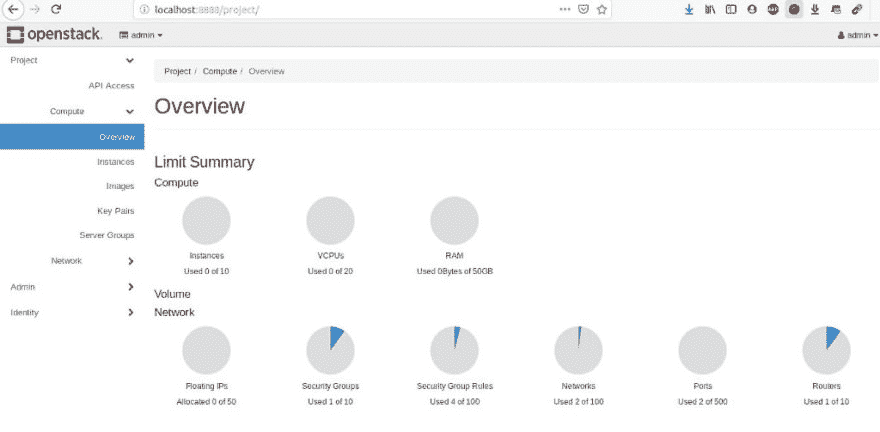](https://res.cloudinary.com/practicaldev/image/fetch/s--Y2HPKJrX--/c_limit%2Cf_auto%2Cfl_progressive%2Cq_auto%2Cw_880/https://cdn-images-1.medium.com/max/1024/1%2AhxCw5EoLrCDAthJgiBSXoA.jpeg)

我有一个路由器，它有两个默认网络(公共和专用) :

[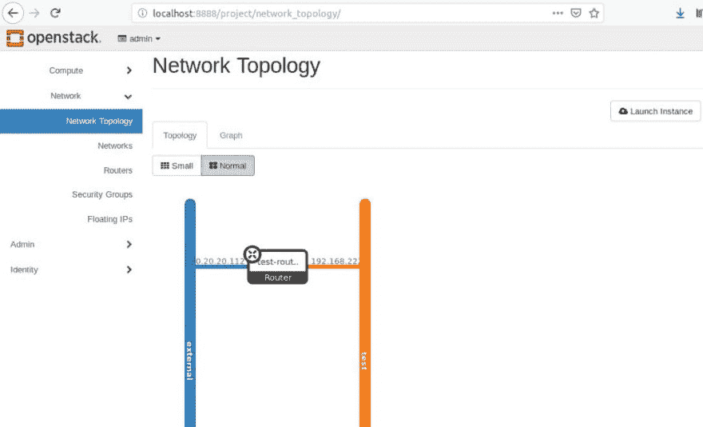](https://res.cloudinary.com/practicaldev/image/fetch/s--9TbZkfCS--/c_limit%2Cf_auto%2Cfl_progressive%2Cq_auto%2Cw_880/https://cdn-images-1.medium.com/max/1024/1%2A4fF-GJ2zUQcIwonTEN5Fdg.jpeg)

和这些默认 API 访问:

[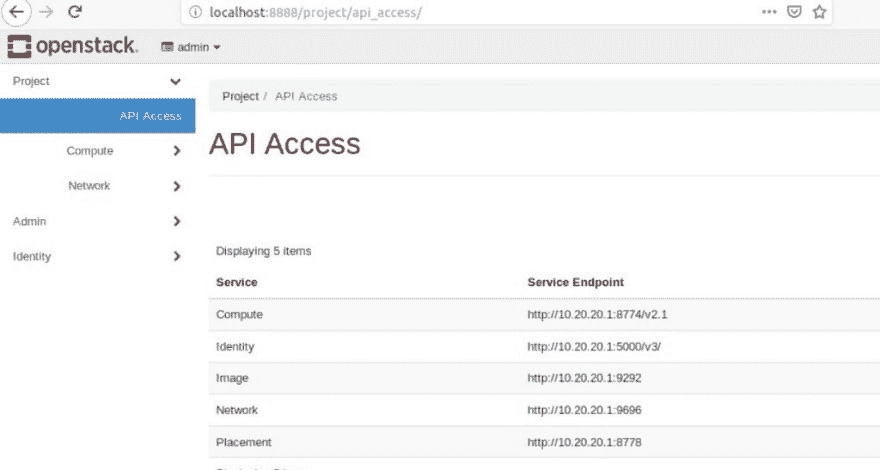](https://res.cloudinary.com/practicaldev/image/fetch/s--hi_vm3x1--/c_limit%2Cf_auto%2Cfl_progressive%2Cq_auto%2Cw_880/https://cdn-images-1.medium.com/max/1024/1%2AmcyCIfXH_qXRe3tDEqEKOA.jpeg)

我可以加载 Ubuntu 18.04 映像，该映像将用于使用 k3b 创建群集:

```
$ microstack.openstack image create Ubuntu-18.04-LTS --disk-format qcow2 --container-format bare \
 --public --file ./bionic-server-cloudimg-amd64.img 
```

[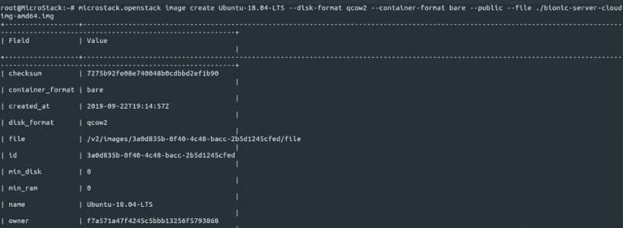](https://res.cloudinary.com/practicaldev/image/fetch/s--DoYnB5cx--/c_limit%2Cf_auto%2Cfl_progressive%2Cq_auto%2Cw_880/https://cdn-images-1.medium.com/max/1024/1%2AqTABczqSHOcjsxDbLwfzfg.jpeg)

[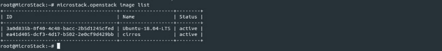](https://res.cloudinary.com/practicaldev/image/fetch/s--Nuy8rntb--/c_limit%2Cf_auto%2Cfl_progressive%2Cq_auto%2Cw_880/https://cdn-images-1.medium.com/max/1024/1%2AtMMA99Mvq43hIBfn0ydO-g.jpeg)

我通过控制面板使用默认专用网络(不需要提供公共网络)启动 3 个 Ubuntu 实例:

[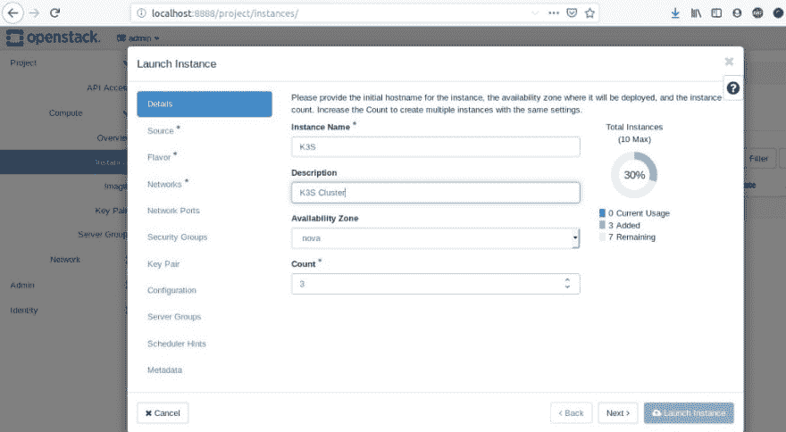](https://res.cloudinary.com/practicaldev/image/fetch/s--OddSKAVP--/c_limit%2Cf_auto%2Cfl_progressive%2Cq_auto%2Cw_880/https://cdn-images-1.medium.com/max/1024/1%2AJ2DMwMu_u77AOC2ftQzPhw.jpeg)

部署 ZeroTier 时:

[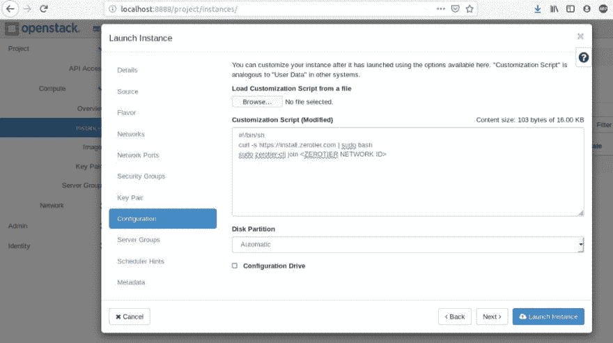](https://res.cloudinary.com/practicaldev/image/fetch/s--fkAf3RJ_--/c_limit%2Cf_auto%2Cfl_progressive%2Cq_auto%2Cw_880/https://cdn-images-1.medium.com/max/1024/1%2AzDw3JssXqd7jvAad9zMc8g.jpeg)

最后，我有三个实例可以通过 ZeroTier 中提供的 IP 地址以及我以前通过 Horizon 控制板加载的 SSH 密钥对进行访问:

[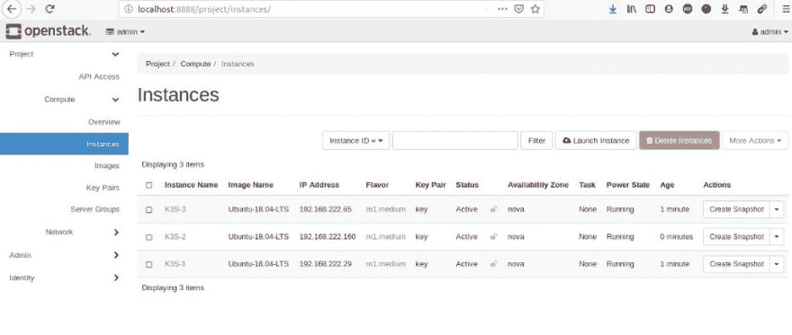](https://res.cloudinary.com/practicaldev/image/fetch/s--6yP54RqT--/c_limit%2Cf_auto%2Cfl_progressive%2Cq_auto%2Cw_880/https://cdn-images-1.medium.com/max/1024/1%2ALFzTbpi2xqgjQsBfAUleUg.jpeg)

[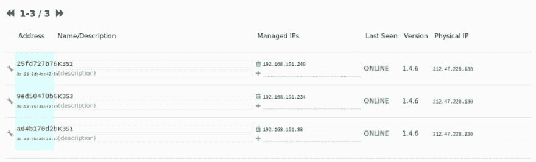](https://res.cloudinary.com/practicaldev/image/fetch/s--LTZVTn8y--/c_limit%2Cf_auto%2Cfl_progressive%2Cq_auto%2Cw_880/https://cdn-images-1.medium.com/max/1024/1%2Azj9ptNhAmK58nn42lEjRsg.jpeg)

我在 ZeroTier 中为每个实例启用了以太网桥接，以准备使用金属:

[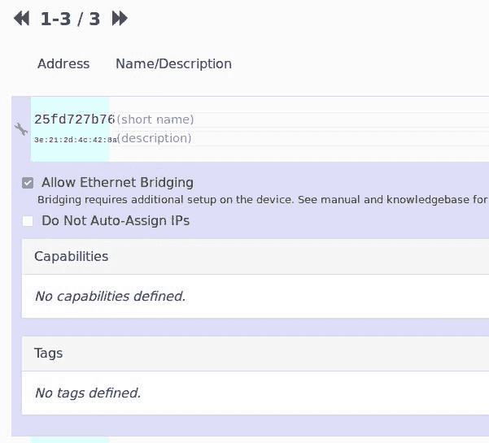](https://res.cloudinary.com/practicaldev/image/fetch/s---piVfk-r--/c_limit%2Cf_auto%2Cfl_progressive%2Cq_auto%2Cw_880/https://cdn-images-1.medium.com/max/601/1%2AG-x9ba5zFWm8V0O-tj9jrg.jpeg)

我可以使用 k3b 使用最新版本(v0.9.0)来初始化我的库群集:

[牧场主/k3s](https://github.com/rancher/k3s/releases)

[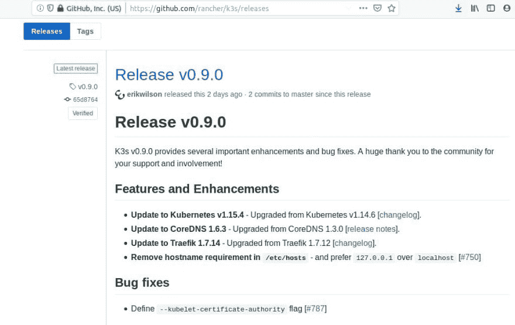](https://res.cloudinary.com/practicaldev/image/fetch/s--FWJqw5EN--/c_limit%2Cf_auto%2Cfl_progressive%2Cq_auto%2Cw_880/https://cdn-images-1.medium.com/max/1022/1%2Av1slwdlcaUGds74QnLbC5g.jpeg)

以此现已广为人知的主节点小脚本:

```
$ curl -sfL https://get.k3s.io | sh - 
```

[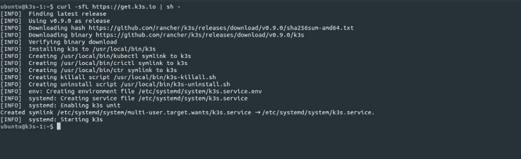](https://res.cloudinary.com/practicaldev/image/fetch/s--hgWSM0N4--/c_limit%2Cf_auto%2Cfl_progressive%2Cq_auto%2Cw_880/https://cdn-images-1.medium.com/max/1024/1%2AzUd4Dr91X8cfMRphmcYoQA.jpeg)

我通过此脚本连接我的两个工作节点:

```
$ curl -sfL https://get.k3s.io | K3S\_URL=https://192.168.191.38:6443 K3S\_TOKEN=XXX sh - 
```

[](https://res.cloudinary.com/practicaldev/image/fetch/s--UuxuMN2Z--/c_limit%2Cf_auto%2Cfl_progressive%2Cq_auto%2Cw_880/https://cdn-images-1.medium.com/max/1024/1%2AB2jn5jkQ-pztrJycEvF9jw.jpeg)

[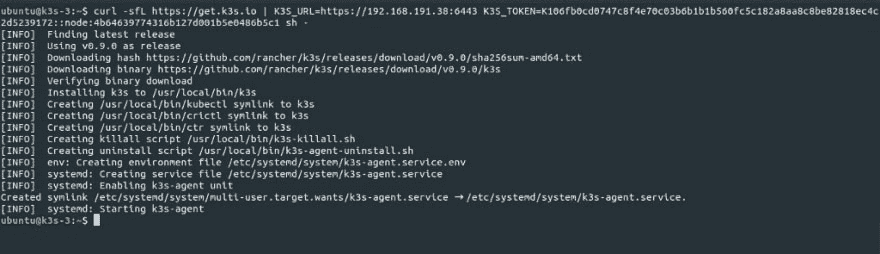](https://res.cloudinary.com/practicaldev/image/fetch/s--QhH55ow2--/c_limit%2Cf_auto%2Cfl_progressive%2Cq_auto%2Cw_880/https://cdn-images-1.medium.com/max/1024/1%2AQV36bgqFLSxFJNJ-Vx6_QA.jpeg)

群集准备就绪:

[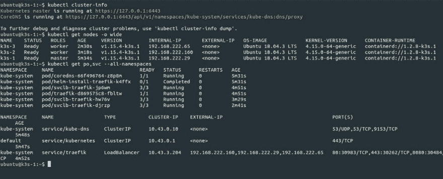](https://res.cloudinary.com/practicaldev/image/fetch/s--ck556GNO--/c_limit%2Cf_auto%2Cfl_progressive%2Cq_auto%2Cw_880/https://cdn-images-1.medium.com/max/1024/1%2AetIUME2cxtec8wS2vyN1Vw.jpeg)

基于零位的金属展开:

```
$ kubectl apply -f https://raw.githubusercontent.com/google/metallb/v0.8.1/manifests/metallb.yaml 
```

[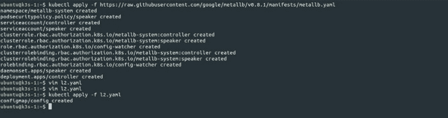](https://res.cloudinary.com/practicaldev/image/fetch/s--MsD6jGnM--/c_limit%2Cf_auto%2Cfl_progressive%2Cq_auto%2Cw_880/https://cdn-images-1.medium.com/max/1024/1%2A8NnrFL1WJE7zlKBsKX010g.jpeg)

[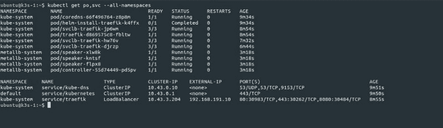](https://res.cloudinary.com/practicaldev/image/fetch/s--FaUSfn8H--/c_limit%2Cf_auto%2Cfl_progressive%2Cq_auto%2Cw_880/https://cdn-images-1.medium.com/max/1024/1%2AsPAaO4VvgwUhEZZt27xA-w.jpeg)

使用 DHCP 中的此 IP 地址段:

```
kubectl apply -f l2.yaml 
```

[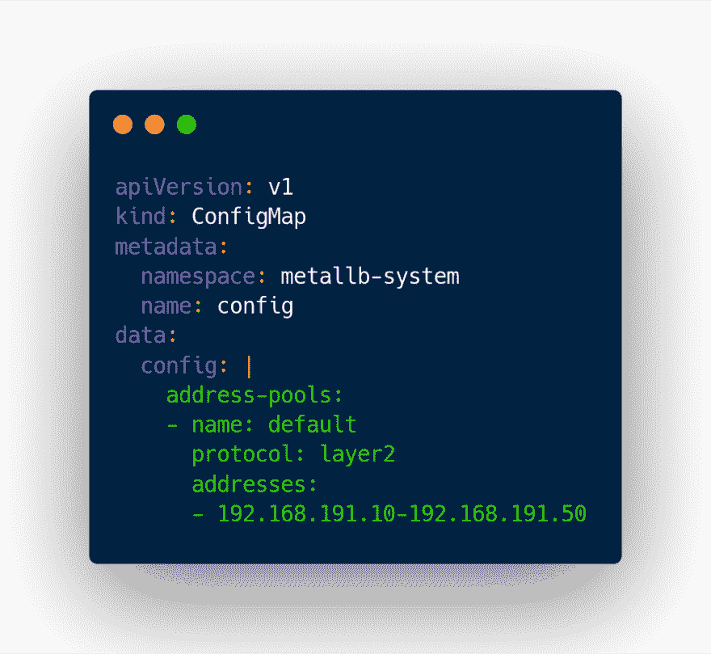](https://res.cloudinary.com/practicaldev/image/fetch/s--ELH1n02b--/c_limit%2Cf_auto%2Cfl_progressive%2Cq_auto%2Cw_880/https://cdn-images-1.medium.com/max/892/1%2Aj8B9oQGAYuVwIfDJk1evyw.png)

一切准备就绪，可以使用 left link 2 . x 部署网格服务。

> 网格服务是一种控制应用程序中不同元素之间共享数据的方式。与其他通信管理系统不同，网格服务是直接在应用程序中创建的专用基础架构层。此可见的基础架构层可以指示应用程序中不同元素之间的交互方式。因此，随着应用程序的发展，它可以更轻松地优化通信并避免停机。linkerd 是 Buoyant、William Morgan 和 Oliver Gould 的共同创始人于 2015 年创建的。linkerd 基于 finag(Twitter 上开发的 JVM 的可扩展 RPC 系统)，用于构建基于微服务、多语言的应用程序，并用于在多个地点同时使用，如 Expedia、Monzo、Salesforce 或 PayPal。

*   [主页](https://linkerd.io/)
*   [浮力的管道服务网正式成为 Linkerd 2](https://www.infoq.com/news/2018/07/conduit-merges-linkerd2/)

linkerd 2 . x 代码(在最新的导管版本之后)是完全开源的，可从 github 存储库中获取:

[左/左 2](https://github.com/linkerd/linkerd2)

> linkerd 是许多常用的“服务网格”工具之一(使用 Istio / Envoy、cilium 或 consul connect)。

[](https://res.cloudinary.com/practicaldev/image/fetch/s--FDhZeYom--/c_limit%2Cf_auto%2Cfl_progressive%2Cq_auto%2Cw_880/https://cdn-images-1.medium.com/max/373/0%2AAFv7nzXv9k-7hP_b.jpg)

linkerd 由控制计划和数据计划组成:

*   控制计划是在专用命名空间中运行的一组服务。这些服务可用于聚合遥测数据、提供面向用户的 API、向数据计划代理提供控制数据等。它们共同决定数据计划的行为。
*   数据计划由在每个服务实例旁边运行的透明代理组成。这些代理会自动管理进出服务的所有流量。由于这些代理是透明的，它们充当高度仪器化的非进程网络栈，向控制计划发送遥测信号，并接收控制计划的控制信号。

[架构](https://linkerd.io/2/reference/architecture/)

[](https://res.cloudinary.com/practicaldev/image/fetch/s--e1WeSrjO--/c_limit%2Cf_auto%2Cfl_progressive%2Cq_auto%2Cw_880/https://cdn-images-1.medium.com/max/1024/0%2ASB3VmlGg5lBxMR7M.png)

就像普罗米修斯和格拉凡纳的结合使用一样：

[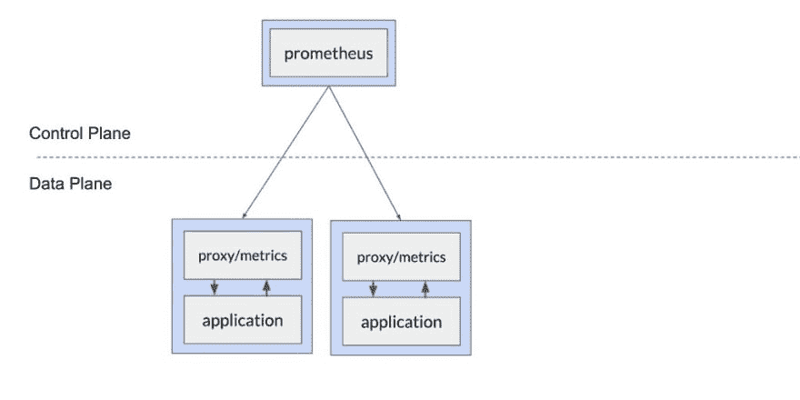](https://res.cloudinary.com/practicaldev/image/fetch/s--_goUU0M1--/c_limit%2Cf_auto%2Cfl_progressive%2Cq_auto%2Cw_880/https://cdn-images-1.medium.com/max/1024/1%2AHux4yDhIqb5sgX6JBbQL6w.jpeg)

我将检索将与 links(链接)交互的命令行界面(CLI)，包括在 kubles 群集上安装控制计划时:t0]

```
$ curl -sL https://run.linkerd.io/install | sh 
```

[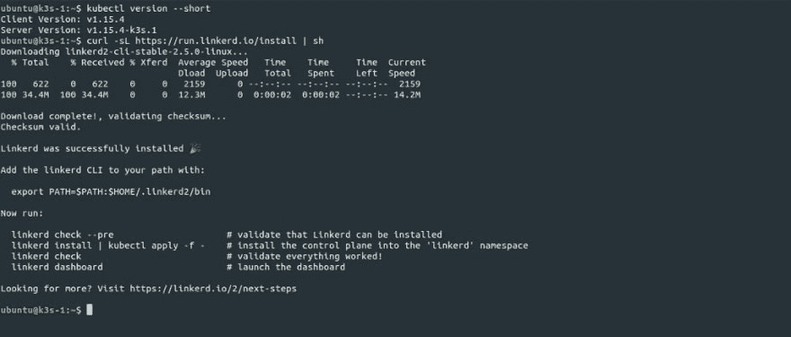](https://res.cloudinary.com/practicaldev/image/fetch/s--xNW5Zqh9--/c_limit%2Cf_auto%2Cfl_progressive%2Cq_auto%2Cw_880/https://cdn-images-1.medium.com/max/1024/1%2AdT9RNT7kFIKL0opURycmNw.jpeg)

我检查左二进制文件*是否已安装并正常工作:* 

```
$ export PATH=$PATH:$HOME/.linkerd2/bin

$ linkerd version 
```

并正确配置了 kublers 群集以安装 left control plan:

```
$ linkerd check --pre 
```

[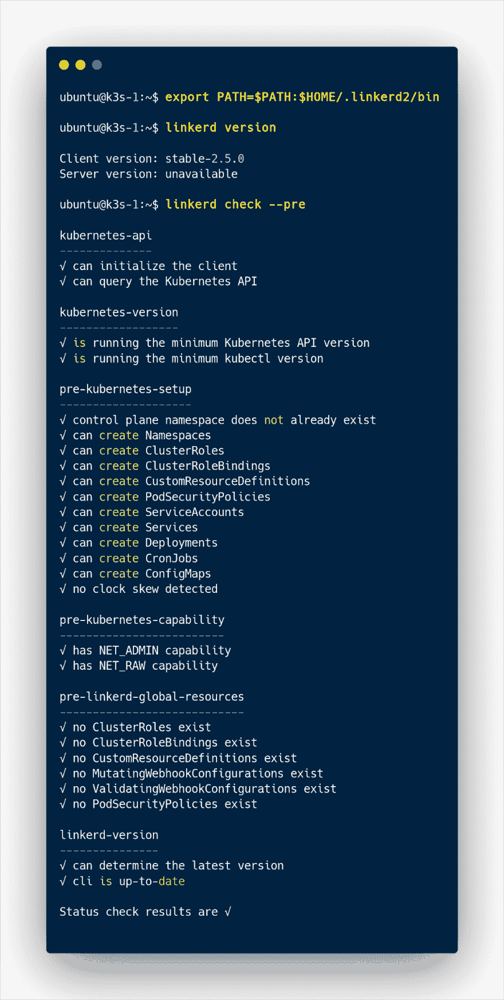](https://res.cloudinary.com/practicaldev/image/fetch/s--jFxoRVNb--/c_limit%2Cf_auto%2Cfl_progressive%2Cq_auto%2Cw_880/https://cdn-images-1.medium.com/max/1024/1%2AR4uLPA0b7sO57D7DWpsipw.png)

现在是在其自己的命名空间(默认名称为 left rd)中安装控制计划的时候了:*left install*命令生成具有控制计划所需全部资源的库清单…

```
$ linkerd install | kubectl apply -f - 
```

[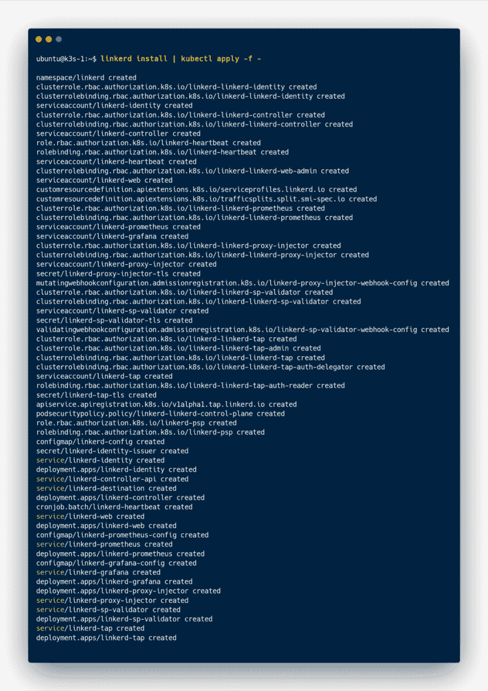](https://res.cloudinary.com/practicaldev/image/fetch/s--uiJtTnYA--/c_limit%2Cf_auto%2Cfl_progressive%2Cq_auto%2Cw_880/https://cdn-images-1.medium.com/max/1024/1%2A8m_PQkD9Jk4RoNic72ulWA.png)

我验证部署是否成功:

```
$ linkerd check

$ kubectl -n linkerd get deploy 
```

[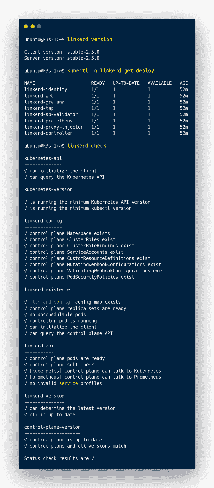](https://res.cloudinary.com/practicaldev/image/fetch/s--yk1vtKwW--/c_limit%2Cf_auto%2Cfl_progressive%2Cq_auto%2Cw_880/https://cdn-images-1.medium.com/max/1024/1%2AnqHTqM0hX3sRnEqjcLdZ7Q.png)

安装并运行控制计划后，可通过以下命令和 serveo:t0 访问带有 link 的当前控制面板

```
$ linkerd dashboard &

$ ssh -R linkerd:80:localhost:50750 serveo.net 
```

[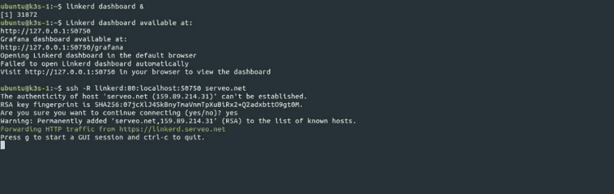](https://res.cloudinary.com/practicaldev/image/fetch/s--bzTufNF---/c_limit%2Cf_auto%2Cfl_progressive%2Cq_auto%2Cw_880/https://cdn-images-1.medium.com/max/1024/1%2AqywBZMRcgNfvuvJETe09Ow.jpeg)

Serveo 将返回仪表板 URL:

[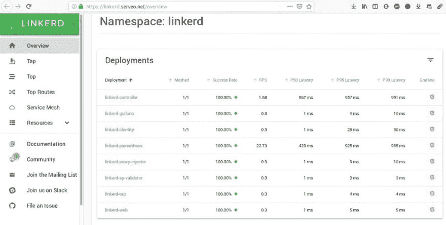](https://res.cloudinary.com/practicaldev/image/fetch/s--1Tcc3kil--/c_limit%2Cf_auto%2Cfl_progressive%2Cq_auto%2Cw_880/https://cdn-images-1.medium.com/max/1024/1%2Ab8RfBrJxQw4UV8j0ahpx7w.jpeg)

[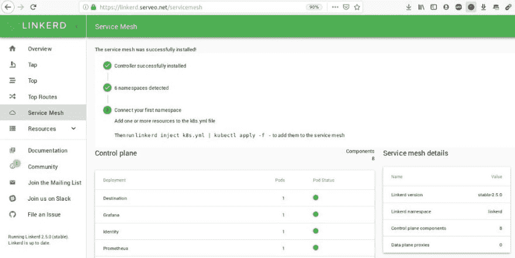](https://res.cloudinary.com/practicaldev/image/fetch/s--bZ0O2qpb--/c_limit%2Cf_auto%2Cfl_progressive%2Cq_auto%2Cw_880/https://cdn-images-1.medium.com/max/1024/1%2ADFHbGozx4ouum6A1CTC7LQ.jpeg)

我们已经可以通过看仪表盘本身来观察到产生的流量了！

```
$ linkerd -n linkerd top deploy/linkerd-web 
```

[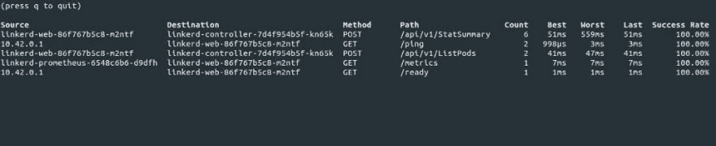](https://res.cloudinary.com/practicaldev/image/fetch/s--PYKMlzF_--/c_limit%2Cf_auto%2Cfl_progressive%2Cq_auto%2Cw_880/https://cdn-images-1.medium.com/max/1024/1%2A1DzMmuEu4gZ1vbFpZuy6BQ.jpeg)

[](https://res.cloudinary.com/practicaldev/image/fetch/s--BYXlRR-T--/c_limit%2Cf_auto%2Cfl_progressive%2Cq_auto%2Cw_880/https://cdn-images-1.medium.com/max/927/1%2A7FAhlZyVzCzWPcOC2bjbbw.jpeg)

为了了解 linkerd 的工作原理，我为 kubricks 安装了独立的“emojivoto”应用程序，该应用程序使用 grp 和 HTTP 调用的组合，允许用户通过以下命令选择自己喜欢的 mojivoto:

```
$ curl -sL https://run.linkerd.io/emojivoto.yml \
 | kubectl apply -f - 
```

[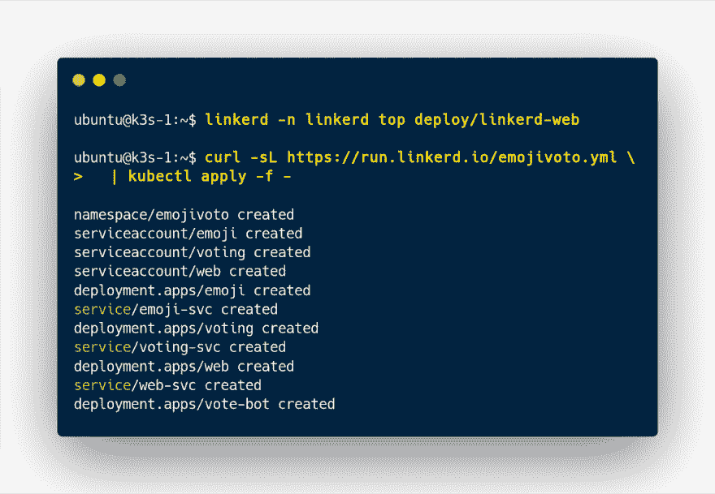](https://res.cloudinary.com/practicaldev/image/fetch/s--ZISV7imh--/c_limit%2Cf_auto%2Cfl_progressive%2Cq_auto%2Cw_880/https://cdn-images-1.medium.com/max/1024/1%2A6TWW8mJBltISCYOlVh3ejQ.png)

metallb 将返回以前配置为访问此应用程序的段的 IP 地址:

[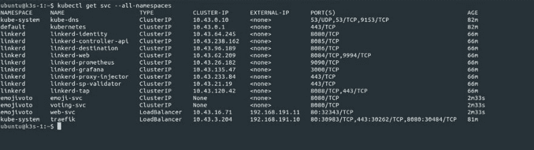](https://res.cloudinary.com/practicaldev/image/fetch/s--TMiNSClw--/c_limit%2Cf_auto%2Cfl_progressive%2Cq_auto%2Cw_880/https://cdn-images-1.medium.com/max/1024/1%2AAZto7U0jCYrcG-Fu13NslA.jpeg)

[](https://res.cloudinary.com/practicaldev/image/fetch/s--70dBGVh3--/c_limit%2Cf_auto%2Cfl_progressive%2Cq_auto%2Cw_880/https://cdn-images-1.medium.com/max/1024/1%2AMY--ZVz8zN7LlVBi2TcR4Q.jpeg)

[](https://res.cloudinary.com/practicaldev/image/fetch/s--2E85nQ_q--/c_limit%2Cf_auto%2Cfl_progressive%2Cq_auto%2Cw_880/https://cdn-images-1.medium.com/max/1024/1%2APPWFjZt1fHms3k1jMymLMw.jpeg)

我在这个血红蛋白程序上加了链接。这是通过执行一个命令，该命令将检索 emojivoto 命名空间中的所有当前部署，通过“*left inject*”运行清单，然后将其重新应用到群集。命令*左注*通过提示左注添加(“注入”)数据计划代理:
为 pod 规范添加注释

```
$ kubectl get -n emojivoto deploy -o yaml \
 | linkerd inject - \
 | kubectl apply -f - 
```

[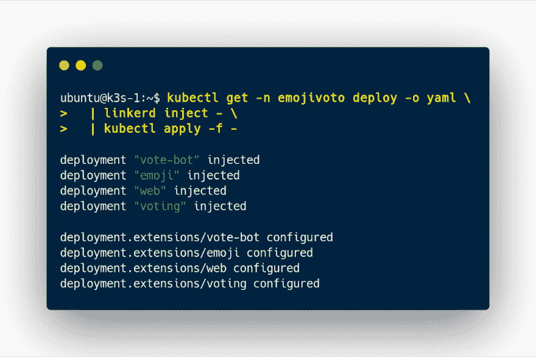](https://res.cloudinary.com/practicaldev/image/fetch/s--ls2E4EJ_--/c_limit%2Cf_auto%2Cfl_progressive%2Cq_auto%2Cw_880/https://cdn-images-1.medium.com/max/1024/1%2AVHsRhjG7sqpf3ycUyIfjmw.png)

您可以在链接控制面板上查看 e momento 应用程序:

[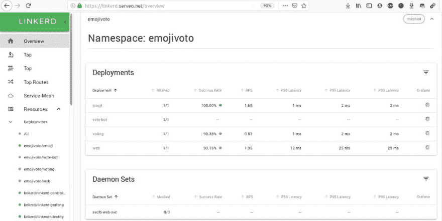](https://res.cloudinary.com/practicaldev/image/fetch/s--h6XCRusP--/c_limit%2Cf_auto%2Cfl_progressive%2Cq_auto%2Cw_880/https://cdn-images-1.medium.com/max/1024/1%2Ao1AwY2c0ZsnWQRKlk4VaiA.jpeg)

[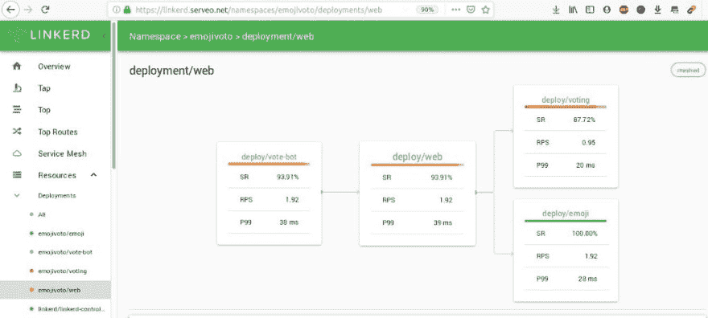](https://res.cloudinary.com/practicaldev/image/fetch/s--4T4uh0kh--/c_limit%2Cf_auto%2Cfl_progressive%2Cq_auto%2Cw_880/https://cdn-images-1.medium.com/max/1024/1%2AawRNiIsq75Jo7x4Kb1C8lw.jpeg)

[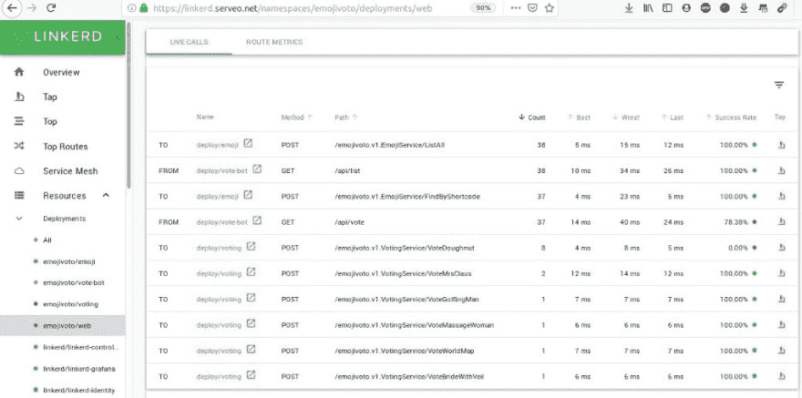](https://res.cloudinary.com/practicaldev/image/fetch/s--4Ez5JRbk--/c_limit%2Cf_auto%2Cfl_progressive%2Cq_auto%2Cw_880/https://cdn-images-1.medium.com/max/1024/1%2Ah_YG0TQbJGaiN7Hi2u26qg.jpeg)

由于此演示应用程序随负载生成器一起提供，因此可以使用以下控件查看实时流量测量:

```
$ linkerd -n emojivoto stat deploy

$ linkerd -n emojivoto top deploy

$ linkerd -n emojivoto check --proxy 
```

[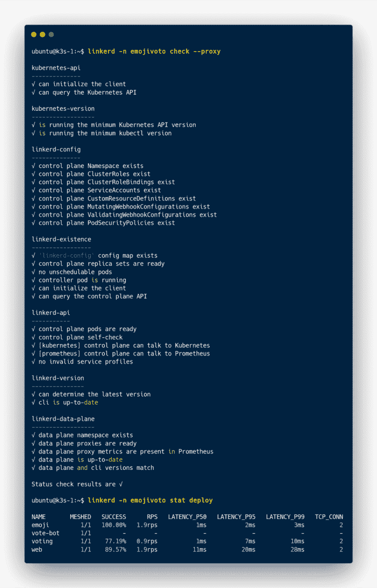](https://res.cloudinary.com/practicaldev/image/fetch/s--CRcQVbXr--/c_limit%2Cf_auto%2Cfl_progressive%2Cq_auto%2Cw_880/https://cdn-images-1.medium.com/max/1024/1%2AYtzrS1bwPHgManFRlBZk5A.png)

或直接通过 Grafana 提供的控制板(使用 Prometheus 后端) :

[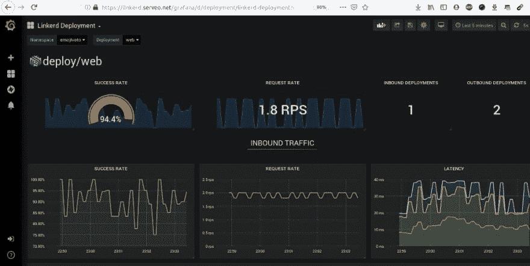](https://res.cloudinary.com/practicaldev/image/fetch/s--iyusg_A9--/c_limit%2Cf_auto%2Cfl_progressive%2Cq_auto%2Cw_880/https://cdn-images-1.medium.com/max/1024/1%2AuyLWFeJ1O3nk-EmsE5KKtw.jpeg)

[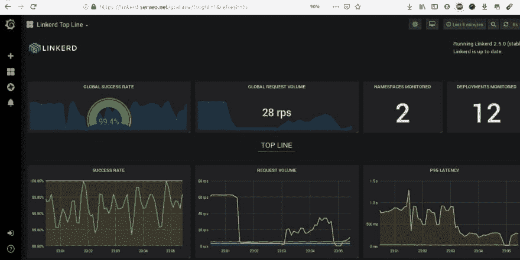](https://res.cloudinary.com/practicaldev/image/fetch/s--z8QveWWs--/c_limit%2Cf_auto%2Cfl_progressive%2Cq_auto%2Cw_880/https://cdn-images-1.medium.com/max/1024/1%2ADcNVVC_u06JkLChK-KKU0A.jpeg)

[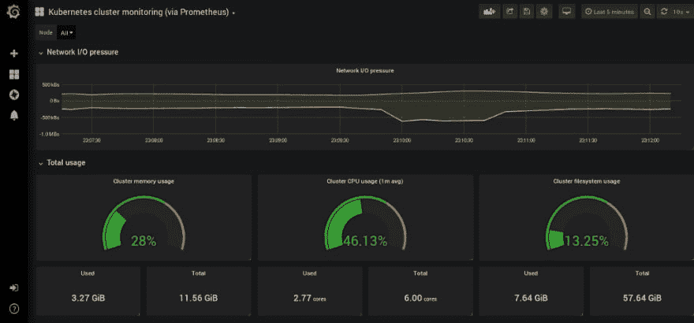](https://res.cloudinary.com/practicaldev/image/fetch/s--xa96Lhpz--/c_limit%2Cf_auto%2Cfl_progressive%2Cq_auto%2Cw_880/https://cdn-images-1.medium.com/max/1024/1%2AHI7EvJUBF-4ERxHB5VvMjg.jpeg)

[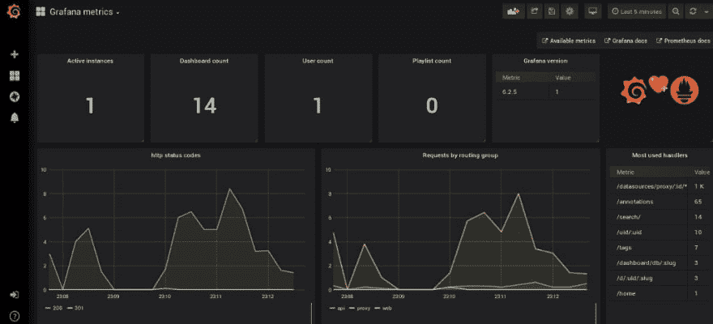](https://res.cloudinary.com/practicaldev/image/fetch/s--7MdIAgMJ--/c_limit%2Cf_auto%2Cfl_progressive%2Cq_auto%2Cw_880/https://cdn-images-1.medium.com/max/1024/1%2AJbzwP1ykWMN3i3CCqQ1T_A.jpeg)

我通过以下脚本在应用程序网页上生成负载(每秒 20 次调用):

[简单负载测试脚本(在 bash 中)](https://medium.com/@bigomega/simple-load-testing-script-in-bash-a8c5a4968dc7)

```
$ curl -L [https://goo.gl/S1Dc3R](https://goo.gl/S1Dc3R) | bash -s 20 "[http://](http://api.myserver.com/get_info)192.168.191.11" 
```

[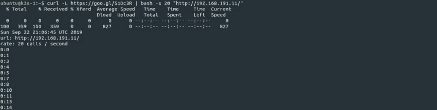](https://res.cloudinary.com/practicaldev/image/fetch/s--DS3_LTDd--/c_limit%2Cf_auto%2Cfl_progressive%2Cq_auto%2Cw_880/https://cdn-images-1.medium.com/max/1024/1%2ACwU1D3uCf4EiuqLuqwJOAA.jpeg)

随着 Grafana 的这些变化:

[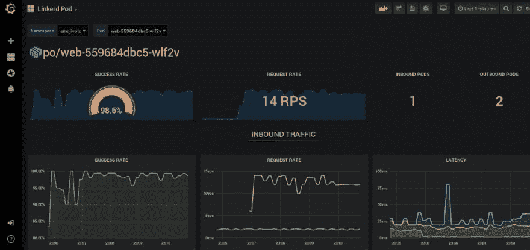](https://res.cloudinary.com/practicaldev/image/fetch/s--RtN0KTf1--/c_limit%2Cf_auto%2Cfl_progressive%2Cq_auto%2Cw_880/https://cdn-images-1.medium.com/max/1024/1%2ACEyrPUfkvVdE2w9ZU6-aJg.jpeg)

[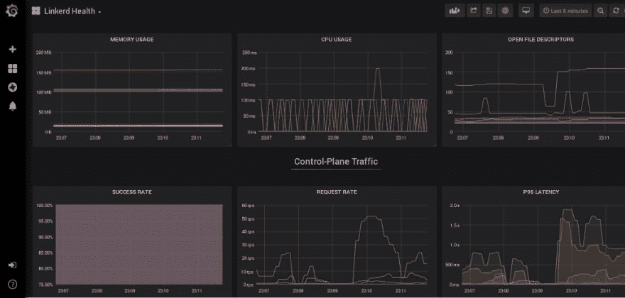](https://res.cloudinary.com/practicaldev/image/fetch/s--xTWVuguy--/c_limit%2Cf_auto%2Cfl_progressive%2Cq_auto%2Cw_880/https://cdn-images-1.medium.com/max/1024/1%2AYL_nGXikC8hwDWwt0SZj-w.jpeg)

[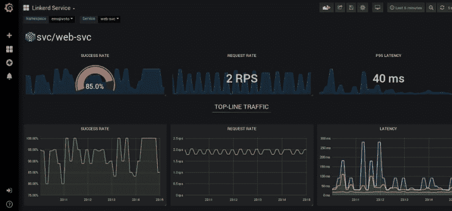](https://res.cloudinary.com/practicaldev/image/fetch/s--xSilX7Nr--/c_limit%2Cf_auto%2Cfl_progressive%2Cq_auto%2Cw_880/https://cdn-images-1.medium.com/max/1024/1%2AnrbF_gZnp8qAPyz3ThG9jA.jpeg)

我将使用传统的 FC 演示程序(此处仅包含一个砖)重复此过程:

[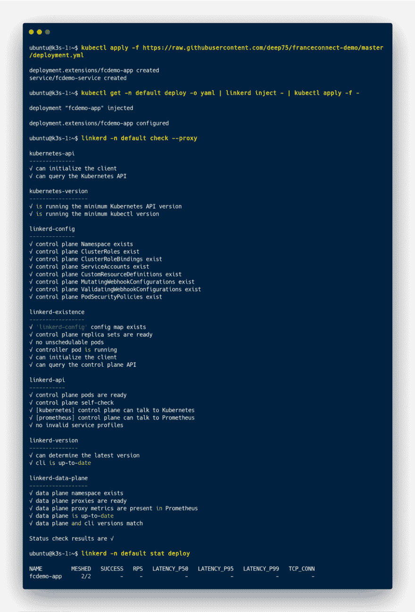](https://res.cloudinary.com/practicaldev/image/fetch/s--HozOaI5V--/c_limit%2Cf_auto%2Cfl_progressive%2Cq_auto%2Cw_880/https://cdn-images-1.medium.com/max/1024/1%2Ahj9SoEJQsdAo4Eyp1gZcnA.png)

[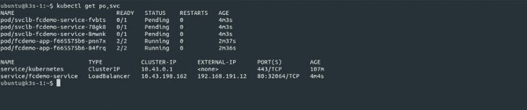](https://res.cloudinary.com/practicaldev/image/fetch/s--2fsilGmm--/c_limit%2Cf_auto%2Cfl_progressive%2Cq_auto%2Cw_880/https://cdn-images-1.medium.com/max/1024/1%2A2R5U89YTh0m-r4UPS4jYbA.jpeg)

我有 FC 演示程序的金属返回的 IP 地址:

[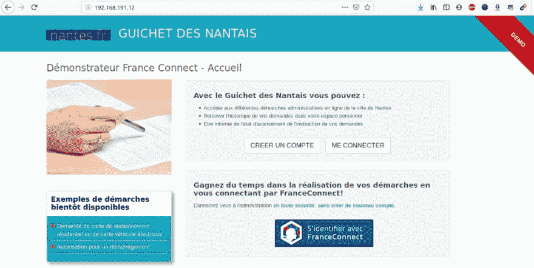](https://res.cloudinary.com/practicaldev/image/fetch/s--TeuonfiA--/c_limit%2Cf_auto%2Cfl_progressive%2Cq_auto%2Cw_880/https://cdn-images-1.medium.com/max/1024/1%2AzM6K1h39crmvdg4ICVJxuA.jpeg)

使用*左旋注射*，FC 演示程序可在左旋控制板中跟踪:

[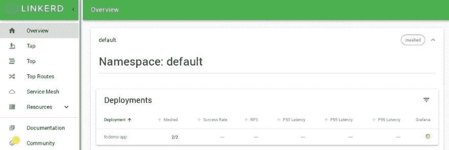](https://res.cloudinary.com/practicaldev/image/fetch/s--Jkev31aO--/c_limit%2Cf_auto%2Cfl_progressive%2Cq_auto%2Cw_880/https://cdn-images-1.medium.com/max/1024/1%2A0j3wUHwCmPiTgXYGx8fU8Q.jpeg)

[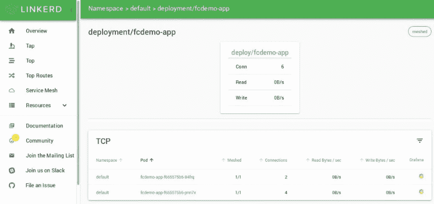](https://res.cloudinary.com/practicaldev/image/fetch/s--4uChE1je--/c_limit%2Cf_auto%2Cfl_progressive%2Cq_auto%2Cw_880/https://cdn-images-1.medium.com/max/1024/1%2ApnOUl6cskIPHlSWhuiDqWg.jpeg)

将负载生成器脚本(每秒 30 次调用)重复用于 FC 演示程序的 IP 地址:

[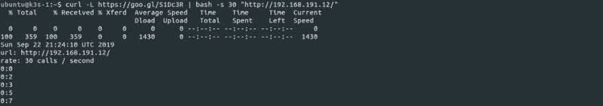](https://res.cloudinary.com/practicaldev/image/fetch/s--hL6GAtue--/c_limit%2Cf_auto%2Cfl_progressive%2Cq_auto%2Cw_880/https://cdn-images-1.medium.com/max/1024/1%2ABrm8SnqYAhn4gmWDyfz7Dw.jpeg)

并获得实时指标-实时:

[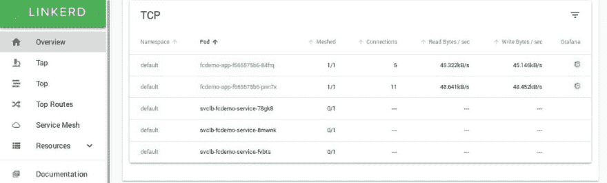](https://res.cloudinary.com/practicaldev/image/fetch/s--A58YcKjD--/c_limit%2Cf_auto%2Cfl_progressive%2Cq_auto%2Cw_880/https://cdn-images-1.medium.com/max/1024/1%2Aj9FM-iYVJQ73Fhp4cFoNVA.jpeg)

[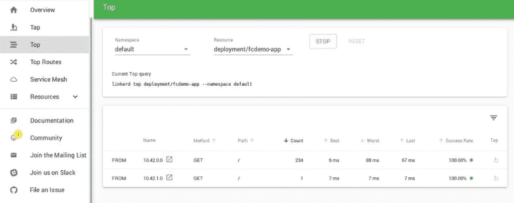](https://res.cloudinary.com/practicaldev/image/fetch/s--HodrbWcB--/c_limit%2Cf_auto%2Cfl_progressive%2Cq_auto%2Cw_880/https://cdn-images-1.medium.com/max/1024/1%2AwqPmA0CwU-J7sk70dSGefg.jpeg)

[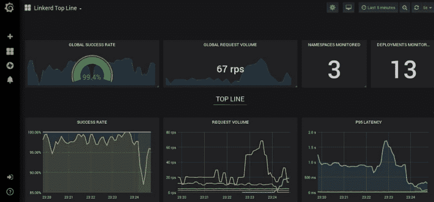](https://res.cloudinary.com/practicaldev/image/fetch/s--Y_2CM8U1--/c_limit%2Cf_auto%2Cfl_progressive%2Cq_auto%2Cw_880/https://cdn-images-1.medium.com/max/1024/1%2AoKI8k6yvQ_5BRqUPjLtlKA.jpeg)

为了跟踪微克的状态，我在这里使用 Dynatrace OneAgent:

[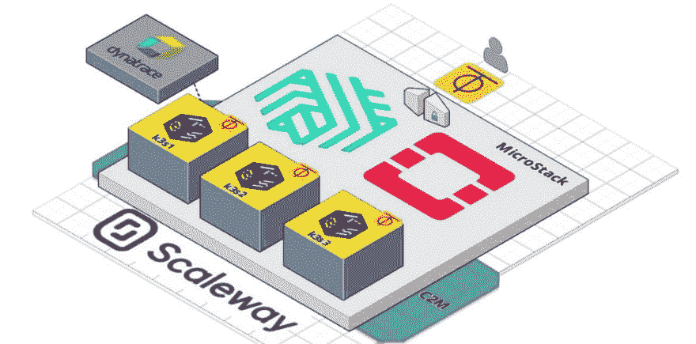](https://res.cloudinary.com/practicaldev/image/fetch/s--k0uht2Mo--/c_limit%2Cf_auto%2Cfl_progressive%2Cq_auto%2Cw_880/https://cdn-images-1.medium.com/max/1024/1%2ApvSZ9PwoRIVN4pyB0V26Yw.jpeg)

[Dynatrace OneAgent | Dynatrace 帮助](https://www.dynatrace.com/support/help/setup-and-configuration/dynatrace-oneagent/)

[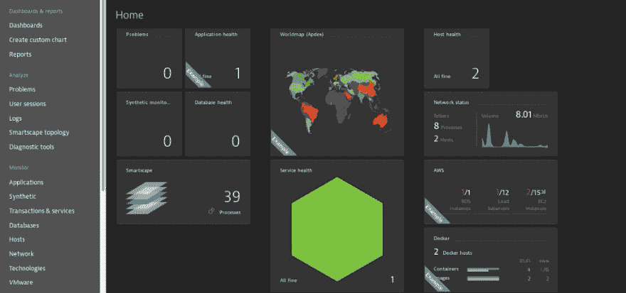](https://res.cloudinary.com/practicaldev/image/fetch/s--xapDwzIb--/c_limit%2Cf_auto%2Cfl_progressive%2Cq_auto%2Cw_880/https://cdn-images-1.medium.com/max/1024/1%2AkFXRumxsauE7v4OFq9fBWQ.jpeg)

[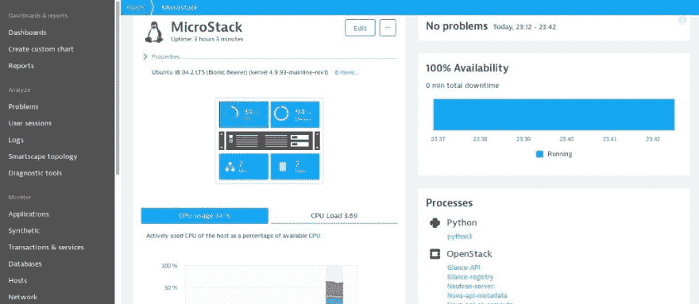](https://res.cloudinary.com/practicaldev/image/fetch/s--M_-QR-HA--/c_limit%2Cf_auto%2Cfl_progressive%2Cq_auto%2Cw_880/https://cdn-images-1.medium.com/max/1024/1%2AzfACUI0mNzhzsdFzzlrrfQ.jpeg)

[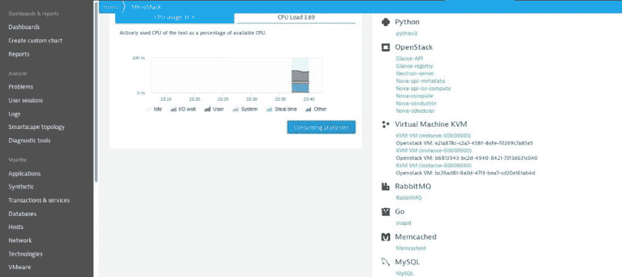](https://res.cloudinary.com/practicaldev/image/fetch/s--H9pA40kO--/c_limit%2Cf_auto%2Cfl_progressive%2Cq_auto%2Cw_880/https://cdn-images-1.medium.com/max/1024/1%2Ala1iZkK9M8SgpnoblTnWdA.jpeg)

[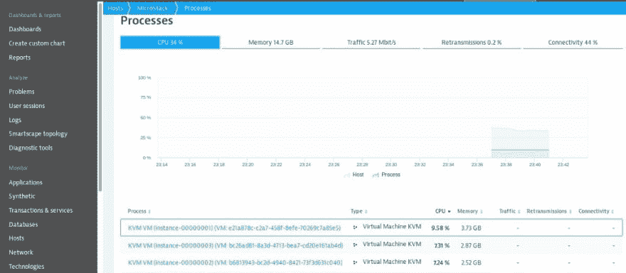](https://res.cloudinary.com/practicaldev/image/fetch/s--e3A_oQG_--/c_limit%2Cf_auto%2Cfl_progressive%2Cq_auto%2Cw_880/https://cdn-images-1.medium.com/max/1024/1%2AyWL0O_db0-mOcjdXERpRSQ.jpeg)

[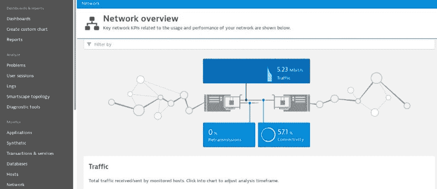](https://res.cloudinary.com/practicaldev/image/fetch/s--ZHc6D_9G--/c_limit%2Cf_auto%2Cfl_progressive%2Cq_auto%2Cw_880/https://cdn-images-1.medium.com/max/1024/1%2AvzSs-ZUxO9TpgEWeVeBGPw.jpeg)

以 k3b 群集的主节点为中心:

[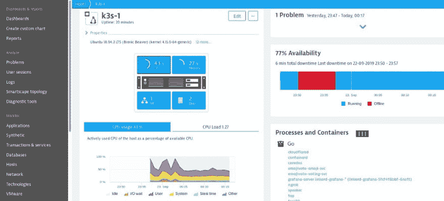](https://res.cloudinary.com/practicaldev/image/fetch/s--YMPwIC64--/c_limit%2Cf_auto%2Cfl_progressive%2Cq_auto%2Cw_880/https://cdn-images-1.medium.com/max/1024/1%2APxt7OBJWlzZpqCwk6IU3vw.jpeg)

[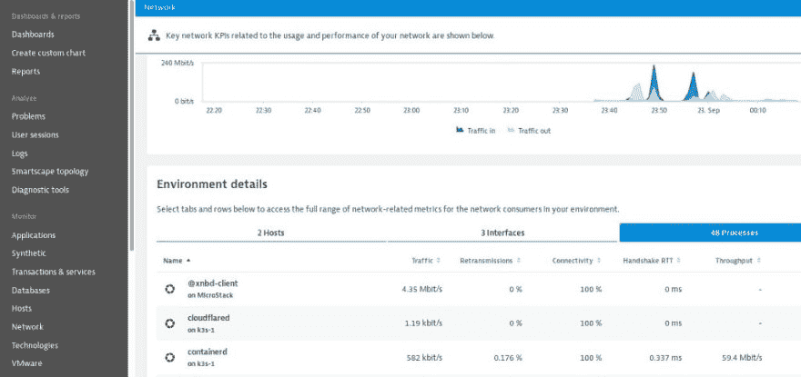](https://res.cloudinary.com/practicaldev/image/fetch/s--pz4kYEC6--/c_limit%2Cf_auto%2Cfl_progressive%2Cq_auto%2Cw_880/https://cdn-images-1.medium.com/max/1024/1%2AThgSP20x3ElNFW7PjokVOg.jpeg)

或干脆通过 *htop* :

[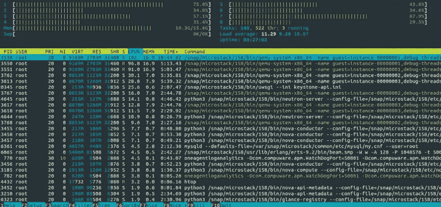](https://res.cloudinary.com/practicaldev/image/fetch/s--wOuGCLwD--/c_limit%2Cf_auto%2Cfl_progressive%2Cq_auto%2Cw_880/https://cdn-images-1.medium.com/max/1024/1%2A1p7_zWWb09CCmOyv9T5seA.jpeg)

在 MicroStack 中使用 k3b 的网格服务示例，但在边缘计算不断增长的环境中，本可以使用 StarlingX 项目来完成此示例:

*   [Home | StarlingX](https://www.starlingx.io/)
*   OpenDev:自由软件需要自由工具

[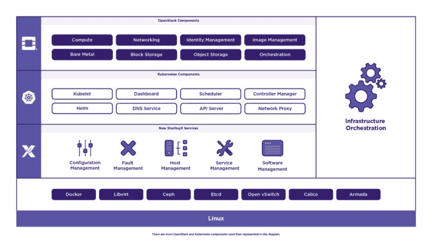](https://res.cloudinary.com/practicaldev/image/fetch/s--W9GV_G2Y--/c_limit%2Cf_auto%2Cfl_progressive%2Cq_auto%2Cw_880/https://cdn-images-1.medium.com/max/1024/0%2AYYFm0AvINuk2d1BP.jpg)

它可以部署在具有所有三种功能(控制器、计算和存储，以及 IoT 服务)的单个裸机实例上，即使后端已找到将在其上部署压缩 OpenStack 砖的群集:

[StarlingX 文档:裸机多功能一体机 R2.0](https://docs.starlingx.io/deploy_install_guides/current/bare_metal_aio_simplex.html)

[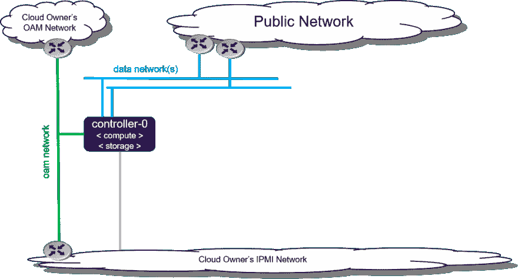](https://res.cloudinary.com/practicaldev/image/fetch/s--QaZ6jOvN--/c_limit%2Cf_auto%2Cfl_progressive%2Cq_auto%2Cw_880/https://cdn-images-1.medium.com/max/1024/0%2A9aNLmKbLf_Nnlz6q.png)

[StarlingX Docs:安装 OpenStack](https://docs.starlingx.io/deploy_install_guides/current/install_openstack.html)

下一个！……

[](https://res.cloudinary.com/practicaldev/image/fetch/s--2194aas3--/c_limit%2Cf_auto%2Cfl_progressive%2Cq_auto%2Cw_880/https://cdn-images-1.medium.com/max/600/1%2AmWOvluriTSoefsPohLO8uQ.jpeg)*