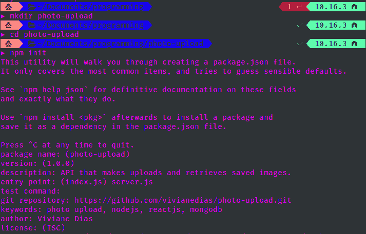

# 使用 Stack MERN(第 1/2 部分)加载前端/后端集成映像

> [https://dev . to/viviandias/upload-image-com-integraao-front-back-using stack mers part-1-2-515n](https://dev.to/vivianedias/upload-de-imagens-com-integracao-front-back-end-utilizando-stack-mern-parte-1-2-515n)

一段时间前我在开发一个项目时，我需要上传图片整合一个登记表。我发现很少文章能谈及这个问题也能按我需要的方式运作。最后，我实现了我最初想要的，决定写这篇文章来分享我在过程中学到的一些技巧。本教程中使用的技术有:NodeJS 和 mongodb。

## [](#vis%C3%A3o-geral)概述

本文的目的是创建一个能够创建用户然后在页面上显示其配置文件的应用程序。这很简单，但有一个区别:前端的一个图像上载字段，服务器将该图像保存到数据库中，然后您可以检索该图像并将其返回。

此处使用的内容并非专用于此案例(性能分析)，而是一些更为通用的内容，可以在不同的情况下使用。我选择不仅仅显示上载的功能，而是显示整个流程，因为我觉得集成部分是此流的关键部分，并且没有出现在任何文章中。

上传方法简单，可能不是图像上传需求较大的应用程序的最佳选择，但如果您只做简单的 webapp 或个人项目，我相信本文适合您！步骤如下:

*   安装依赖关系
*   剧本
*   项目结构
*   设置 MongoDB
*   Editando `server.js`
*   莫德洛斯
    *   想象一下
    *   用户
*   罗塔斯
    *   巴西科
    *   创建用户
    *   搜索用户
    *   上传影像
*   结束了

## [](#setup-do-backend)设置做后端

首先导航到要保存项目的文件夹，在我的情况下:

```
cd ~/Documents/programming/photo-upload-tutorial/photo-upload 
```

下一步是使用`npm init`命令启动项目。此命令将创建一个包含有关该应用程序的各种信息的‘t1’，但最重要的是，它将保存以后运行该应用程序所需的库。执行此命令后，终端将询问您一些问题，然后根据您的喜好填写，我的问题如下所示:

[T2】](https://res.cloudinary.com/practicaldev/image/fetch/s--tqsQ8W12--/c_limit%2Cf_auto%2Cfl_progressive%2Cq_auto%2Cw_880/https://thepracticaldev.s3.amazonaws.com/i/f7h8s0ivnd1zofe688wn.png)

### [](#instalar-depend%C3%AAncias)安装依赖项

之后，安装我们将在项目中使用的依赖项:

```
npm i body-parser cors express helmet mongoose multer --save 
```

```
npm i nodemon --save-dev 
```

#### [](#explicando-um-pouco-sobre-os-comandos-utilizados)稍微解释一下所使用的命令:

*   i: Installar
*   --save:将库保存到文件`package.json`中，如果其他人也要运行此项目，则所有使用的库都已存在。
*   --save-dev:与上一个非常相似，但在这种情况下，此库将仅在开发模式下安装。

### [](#scripts)脚本

现在开始写剧本！目前只有脚本`"test"`存在。再加两个，其对象`scripts`在`package.json`应改为:

```
 "scripts": {
    "test": "echo \"Error: no test specified\" && exit 1",
    "start": "node server.js",
    "server": "nodemon server.js"
  } 
```

### [](#estrutura%C3%A7%C3%A3o-do-projeto)项目结构

然后，创建构建应用程序所需的所有文件夹和文件。按照以下方案进行:

图片上传/
客户端/
【配置/
【db . js】
【keys . js】

图片。js
【users . js】

### [](#setup-mongodb)设置 MongoDB

在这一部分中，我们将使用 [MongoDB](https://www.mongodb.com/) 设置我们的数据库。

#### [](#criando-o-banco-de-dados)创建数据库

我不打算详细介绍莽哥的安装情况，但提示是相当详细的文献中的‘t0’教程。安装后，在终端上运行以下命令:

##### Para acce sar o terminal do MongoDB

```
mongo 
```

##### [](#criaracessar-o-novo-banco-de-dados)创建/访问新数据库

```
use nome-do-banco 
```

##### [](#inserindo-dados-no-banco-para-ele-aparecer-na-listagem)将数据输入银行，使其出现在列表中

```
db.nome-do-banco.insert({ "user": "qualquer nome" }); 
```

##### [](#vendo-se-o-banco-aparece-na-lista-de-bancos-de-dados-dispon%C3%ADveis)查看该银行是否出现在可用数据库列表中

```
show dbs 
```

##### [](#criando-um-novo-usu%C3%A1rio)创建新用户

```
db.createUser({
  user: "nome do usuário que vai acessar o seu banco de dados",
  pwd: "senha do usuário p/ acessar o banco de dados",
  roles:[{
    role: "readWrite",
    db: "nome do banco de dados que esse usuário terá acesso"
  }]
}) 
```

#### [](#conectando-servidor-e-banco-de-dados)服务与服务银行

创建银行后，我们需要将其连接到服务器。为此，请导航到文件“`db.js`”并输入:

```
const mongoose = require('mongoose')
const keys = require('./keys')

const MONGO_USERNAME = '[nome do usuário que você criou anteriormente]'
const MONGO_PASSWORD = keys.dbPassword
const MONGO_HOSTNAME = 'localhost'
const MONGO_PORT = '27017'
const MONGO_DB = '[nome do banco de dados criado anteriormente]'

const url = `mongodb://${MONGO_USERNAME}:${MONGO_PASSWORD}@${MONGO_HOSTNAME}:${MONGO_PORT}/${MONGO_DB}`

// Conectar com MongoDB
mongoose
  .connect(url, { useNewUrlParser: true })
  .then(() => console.log('MongoDB Connected'))
  .catch(err => console.log(err)) 
```

请注意，在“`MONGO_PASSWORD`”中引用了一个变量，这是因为将数据库密码或 API 发布到存储库不是一种良好的安全做法。有鉴于此，我在另一个名为`keys.js`的文件中设置了银行密码，该文件不受 git(添加到`.gitignore`的情况下)的跟踪，也不会上传到远程存储库，只停留在现场。

```
 module.exports = {
    dbPassword: "senha do usuário para acessar o banco",
  } 
```

### [](#editando-raw-serverjs-endraw-)编辑`server.js`

因为我们已经为应用程序创建了基本框架，所以请转到“`server.js`”并添加将运行应用程序的基本代码，调用路径和数据库，并向下箭头一些详细信息。

```
 const express = require('express')
  const bodyParser = require('body-parser')
  const cors = require('cors')
  const helmet = require('helmet')
  const db = require('./config/db')

  const users = require('./routes/api/users')

  // Executando express
  const app = express()

  // Middleware do body parser
  app.use(bodyParser.urlencoded({ extended: false }))
  app.use(bodyParser.json())

  // Adicionando Helmet para melhorar a segurança da API
  app.use(helmet())

  // Habilitando CORS para todos os requests
  app.use(cors())

  // Usar Routes
  app.use('/api/users', users)

  // Acessar arquivos de imagem salvos
  app.use(express.static('public'))

  // Definir porta que o app irá rodar
  const port = process.env.PORT || 5000
  app.listen(port, () => console.log(`Server running on port ${port}`)) 
```

### [](#modelos)Modelos

我们需要将填写好的前端表单数据保存到某个位置，为此，我们在将要连接的服务器上点击`Schemas`，并将该数据保存到数据库中，以便以后检索。在本项目中，我们将创建两个文件，一个用于用户，另一个用于图像，方法是修改这两个文件，其中包含以下相应的内容:

#### [](#users)用户

```
const mongoose = require('mongoose')
const Schema = mongoose.Schema

// Criar Schema
const UserSchema = new Schema({
  name: {
    type: String,
    required: true
  },
  username: {
    type: String,
    required: true,
    unique: true
  },
  imgId: {
    type: Schema.Types.ObjectId,
    required: true
  },
  description: {
    type: String,
    required: true
  },
  location: {
    type: String,
    required: true,
  },
  createdAt: {
    type: Date,
    default: Date.now
  }
})

module.exports = User = mongoose.model('users', UserSchema) 
```

#### [](#images)图像

```
const mongoose = require('mongoose')
const Schema = mongoose.Schema

// Criar Schema relacionado ao Users, através do userId
const ImageSchema = new Schema({
  fieldname: {
    type: String,
    required: true
  },
  originalname: {
    type: String,
    required: true
  },
  encoding: {
    type: String,
    required: true
  },
  mimetype: {
    type: String,
    required: true
  },
  destination: {
    type: String,
    required: true
  },
  filename: {
    type: String,
    required: true
  },
  path: {
    type: String,
    required: true
  },
  size: {
    type: String,
    required: true
  },
  createdAt: {
    type: Date,
    default: Date.now
  }
})

module.exports = Images = mongoose.model('images', ImageSchema) 
```

### [](#rotas)值班表

定义模板后，我们将进入应用程序运行的关键时刻之一:创建管线。在本项目中，我们将创建四条路由，每条路由都将在客户端使用特定的 HTTP 方法调用后运行。它们将位于文件`routes/api/users.js`内，并将是:

*   创建用户(POST)
*   搜索用户(GET)
*   储存影像(POST)
*   查找图像(GET)

#### [](#b%C3%A1sico)巴西科

必要时导入 os arquvios 和书目 no arquvios`routes/api/users.js`

```
 const express = require('express')
  const router = express.Router()
  const multer = require('multer')
  const path = require('path')

  // Carregar modelo User
  const User = require('../../models/Users')
  // Carregar modelo Images
  const Images = require('../../models/Images')

  [restante do codigo]

  module.exports = router 
```

#### [](#cria-o-usu%C3%A1rio)创建用户

```
// @route   POST api/users/register
// @desc    Register user
// @access  Public
router.post('/register', (req, res) => {
  let errors = {}
  User.findOne({ username: req.body.username })
    .then(user => {
      // Caso já exista um usuário com esse username, ele retorna um erro
      if (user) {
        errors.username = 'Esse username já foi usado'
        return res.status(400).json(errors)
      } else {
        const newUser = new User({
          name: req.body.name,
          username: req.body.username,
          imgId: req.body.imgId,
          description: req.body.description,
          location: req.body.location
        })
        newUser.save()
          .then(user => res.json(user))
          .catch(err => {
            // Caso dê um erro ao buscar usuário, a api retorna um erro
            console.log(err);
            res.status(404).json({ user: 'Erro ao salvar usuário' })
          })
      }
    })
    .catch(err => {
      // Caso dê um erro ao buscar usuário, a api retorna um erro
      console.log(err);
      res.status(404).json({ user: 'Erro ao cadastrar usuário' })
    })
}) 
```

#### [](#busca-o-usu%C3%A1rio)搜索用户

```
// @route   GET api/users/:username
// @desc    Buscar usuário pelo username
// @access  Public
router.get('/:username', (req, res) => {
  const errors = {}
  User.findOne({ username: req.params.username })
    .then(user => {
      // Caso não haja nenhum usuário com esse username, a api retorna um erro
      if (!user) {
        errors.nousers = 'Esse usuário não existe'
        res.status(404).json(errors)
      }
      // Retorna o usuário
      res.json(user)
    })
    .catch(err => {
      // Caso dê um erro ao buscar usuário, a api retorna um erro
      console.log(err);
      res.status(404).json({ user: 'Erro ao buscar usuário' })
    })
}) 
```

#### [](#upload-da-imagem)上传图像

上载时，我们将使用[罚款](https://github.com/expressjs/multer)，这是一个方便此过程的软件包，它提供了现成的功能来帮助我们箭头这些照片的存储位置、支持的扩展名类型过滤器(如果我们一次只想要上载一次或多次)，等等。

```
const upload = multer({
  storage: storage,
  limits: {
    fileSize: 5000000
  },
  fileFilter: function (req, file, cb) {
    checkFileType(file, cb)
  }
}).single('img')

// Check file type
const checkFileType = (file, cb) => {
  // Allow ext
  const fileTypes = /jpeg|jpg|png|gif/

  // Check ext
  const extname = fileTypes.test(path.extname(file.originalname).toLowerCase())
  // Check mime
  const mimetype = fileTypes.test(file.mimetype)
  if (mimetype && extname) {
    return cb(null, true)
  } else {
    cb('Erro: Insira apenas imagens')
  };
} 
```

##### [](#ent%C3%A3o-descrevemos-como-essa-chamada-post-ir%C3%A1-funcionar)那么我们介绍一下这个邮政电话将如何工作

```
// @route   POST api/users/upload
// @desc    Upload img usuário
// @access  Public
router.post('/upload', (req, res) => {
  upload(req, res, (err) => {
    const errors = {}

    // Caso haja erro no upload, cair aqui
    if (err) {
      errors.upload = err
      return res.status(404).json(errors)
    }

    // Caso o usuário não insira n  enhuma imagem e tente fazer upload, cair aqui
    if (!req.file) {
      errors.upload = 'Insira uma foto de perfil'
      return res.status(400).json(errors)
    }

    // Salvar img
    new Images(req.file)
      .save()
      .then(img => res.json({
        msg: 'Upload da imagem foi bem sucedido!',
        file: `uploads/${img.filename}`,
        id: img._id
      }))
      .catch(() => {
        errors.upload = 'Ocorreu um erro ao fazer o upload da imagem'
        res.status(404).json(errors)
      })
  })
}) 
```

##### [](#depois-como-buscar-essa-imagem-no-banco-e-retonar-ela-como-um-raw-json-endraw-)之后，如何在银行里检索这张照片，并将其保留为`.json`

```
// @route   GET api/users/image
// @desc    Buscar img usuário
// @access  Public
router.get('/image/:imgId', (req, res) => {
  const errors = {}
  Images.findById(req.params.imgId)
    .then(img => {
      res.send(img)
    })
    .catch(() => {
      errors.upload = 'Ocorreu um erro ao carregar a imagem'
      res.status(404).json(errors)
    })
}) 
```

## [](#conclus%C3%A3o)结论

好了！您的 API 已就绪，可以进行测试:，要运行服务器，请在项目文件夹中运行“`npm run server`”。为了便于测试，我将把完整的调用、它们的 HTTP 方法和 body(当是 POST 时)放在此处。

### [](#salva-imagem)保存图像

(帖子)`localhost:5000/api/users/upload`

如果您要在诸如 Postman 之类的程序中进行测试，则此处的密钥可以是任何密钥，并且值必须是一个图像(文件)，其中包含函数`checkFileType()`中的某个箭头类型。上传成功后，保存映像的“`id`”因为如果您要测试该映像，它将对用户注册表正文有用。除了成功返回 API 外，您还可以检查图像是否已保存在`public/uploads/`文件夹中。

### [](#busca-imagem)寻找形象

`localhost:5000/api/users/image/:imgId`(获取)

### [](#cria-o-usu%C3%A1rio)创建用户

`localhost:5000/api/users/register`
(POST)

```
{
  "name": "Vivi",
  "imgId": "5d87ace32732d74ba134bca5",
  "description": "Meu nome é Viviane, tenho 21 anos e amo tomar café depois do almoço ;)",
  "location": "São Paulo",
  "username": "vivianedias"
} 
```

### [](#busca-o-usu%C3%A1rio)搜索用户

`localhost:5000/api/users/:username`(获取)

在结束发言之前，我谨提请注意该守则的具体部分。在文件
中，我们添加了一行对应用程序功能至关重要的内容:

```
app.use(express.static('public')) 
```

这条线所做的就是使文件夹`/public`成为静止的路线，这样我们以后就可以使用保存在前面的图片了！

好吧，我们完成了这篇文章的第一部分，前端很快就走了:希望大家喜欢，建议和疑问都欢迎，这篇文章的全部代码都将在这里。