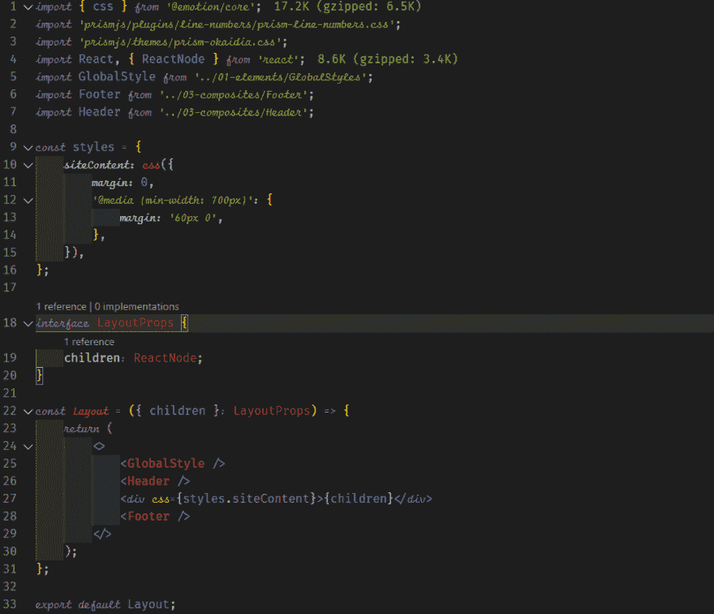

# 在 VS 代码中添加带连字的草书字体

> 原文：<https://dev.to/ankursheel/add-cursive-fonts-with-ligatures-to-vs-code-46o2>

自从我发现 FiraCode 以来，我一直把它作为我在 VS 代码中选择的字体。在输入代码时使用连字真的很有用，并且已经改变了游戏规则。然而，最近我在文本编辑器中看到一些带有草书字体的 VS 代码截图，我想要一些。但是，我也想保留那些被菲拉科德糟蹋过的绷带。

利用我的谷歌搜索技巧，我找到了一些文章，似乎最简单的方法是安装一个已经内置了草书字体的主题，比如 [this](https://marketplace.visualstudio.com/items?itemName=idbartosz.darkpp-italic) 。然而，我喜欢改变主题的灵活性，所以这对我来说不是一个可行的选择。

## 最终输出

[](https://res.cloudinary.com/practicaldev/image/fetch/s--xhqM6K0d--/c_limit%2Cf_auto%2Cfl_progressive%2Cq_auto%2Cw_880/https://thepracticaldev.s3.amazonaws.com/i/k1n8jgfdu3sdgm34rzhf.png)

现在，我们知道了我们要实现的目标，让我们看看如何实现它。

## 更新 VS 代码的设置

我在寻找一种封装了连字和草书字体的字体，这让我找到了由肯·克罗肯创作的 Fira Code iScript。它结合了两种字体- Fira Code 作为常规字体，Script12 作为斜体字体。

在我的系统上安装字体后，我改变了编辑器设置，使用 *Fira Code iScript* 作为*字体家族*的第一选项。

```
"editor.fontFamily":  "'Fira Code iScript', 'Fira Code', Consolas, 'Courier New', monospace", 
```

VS 代码使用 TextMate 语法来定义它需要如何呈现代码。可以在[官方文档](https://code.visualstudio.com/api/language-extensions/syntax-highlight-guide)中了解更多。在 VS 代码 *settings.json* 中，你可以通过修改*editor . token color customizations*下的 *textMateRules* 来覆盖当前主题的字体样式。

```
{  "editor.tokenColorCustomizations":  {  "textMateRules":  [  {  "name":  "",  //  optional  name  for  the  block  "scope":  [],  //  array  of  Scopes  to  which  the  style  should  be  applied  to  "settings":  {  "fontStyle":  "italic"  //  the  font  style  that  should  be  applied  }  }  ]  }  } 
```

您可能想知道如何在上面的 JSON 中设置范围。幸运的是，VS code 有一个命令可以帮助我们-**Developer:Inspect TM Scopes**。在确保活动光标位于要检查的令牌上之后，可以使用命令面板(Ctrl + Shift + P)来触发此操作。

范围检查器显示以下信息:

*   当前令牌。
*   关于令牌的元数据以及关于其计算外观的信息。
*   应用于令牌的主题规则。
*   完整的范围列表，最具体的范围在顶部。

我们将使用的是*范围列表*。无论您想将哪个标记变成斜体，都将其添加到*范围*数组中的范围中。你可以看到我的当前配置的例子

## 我的当前配置

```
{  "editor.tokenColorCustomizations":  {  "textMateRules":  [  {  "name":  "comment",  "scope":  ["comment"],  "settings":  {  "fontStyle":  "italic"  }  },  {  "name":  "Keyword Storage",  "scope":  ["keyword",  "storage",  "keyword.control"],  "settings":  {  "fontStyle":  "italic"  }  },  {  "name":  "Entity",  "scope":  [  "entity.name.type.class",  //class  names  "entity.other.attribute-name",  "entity.name.method",  "entity.name.tag"  ],  "settings":  {  "fontStyle":  "italic"  }  },  {  "name":  "Variable",  "scope":  [  "variable.language",  "meta.paragraph.markdown",  "support.type.property-name.json",  "string.other.link.title.markdown"  ],  "settings":  {  "fontStyle":  "italic"  }  },  {  "name":  "Markdown",  "scope":  [  "meta.paragraph.markdown",  "string.other.link.title.markdown",  "markup.underline.link.markdown"  ],  "settings":  {  "fontStyle":  "italic"  }  },  {  "name":  "Json",  "scope":  ["support.type.property-name.json"],  "settings":  {  "fontStyle":  "italic"  }  }  ]  }  } 
```

## 结论

完成这些步骤后，我的编辑器中就有了连字和草书字体。