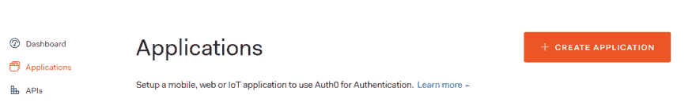
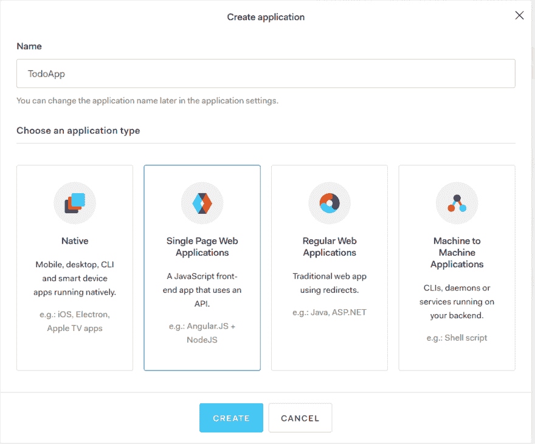
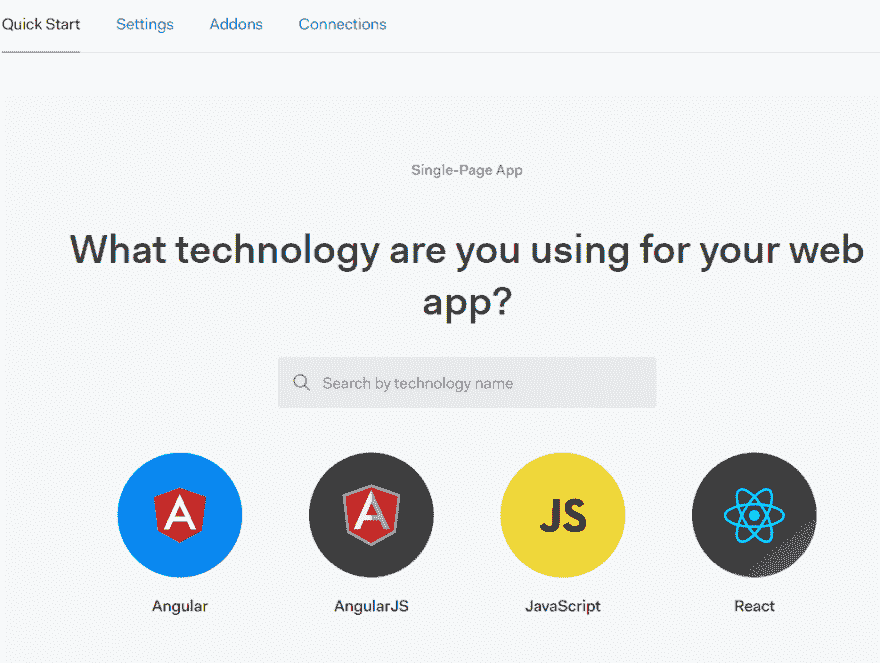

# 使用 Auth0 Pt 保护微服务。1(用户界面)

> 原文:[https://dev . to/bbenefield 89/securing-your-microservice-with-auth 0-20 E3](https://dev.to/bbenefield89/securing-your-microservices-with-auth0-20e3)

# [](#overview)概述

这将是一系列的帖子，在这些帖子中，我将带您使用 React 创建一个 **SPA，并使用**微服务架构**创建您的后端，使用 [Spring 框架](https://spring.io/)(资源 API，认证服务器)，使用 [Auth0](https://auth0.com/) 保护您的前端和微服务。**

你也可以继续玩[这个帖子的代码](https://github.com/bbenefield89/SpringTodo/tree/bbenefield89/tutorial_pt1)。这个分支`bbenefield89/tutorial_pt1`，现在只是 UI 部分。如果你愿意，你也可以看看`master`分支，但是这个分支是我在写这个系列的时候专门用来玩的。

如果你决定使用我提供的代码，你需要在`todoapp_ui/src/auth_config.json`创建一个文件，在里面你需要在 **Auth0** 上提供一些特定于你的**应用**的凭证。

**示例 auth_config.json**

```
{  "domain":  "myAuth0Username.auth0.com",  "clientId":  "as98d6ashasdH"  } 
```

# [](#what-is-a-microservice)什么是微服务

> 简而言之，微服务架构风格是一种将单个应用程序开发为一套小服务的方法，每个小服务都在自己的进程中运行，并通过轻量级机制(通常是 HTTP 资源 API)进行通信。
> 
> -詹姆斯·刘易斯和马丁·福勒(2014)

澄清一下，一个**微服务**是你整个应用的一个小子集。这与**单片应用**完全相反，在这种应用中，所有东西都被编写并包含在同一个代码库中，所有东西都在同一个**端口**上运行，而每个**微服务**都是独立的，并在不同的**端口**上运行。

使用**微服务架构**的优势在于，我们将应用分解成更小、更易消化的代码片段。主要来自前端，**反应**，我的想法是我们如何编写组件。例如，假设我们正在编写一个组件来接收一些数据，遍历这些数据，并将其显示给用户。

```
class TodoList extends Components {

    // state

    render() {
        return (
            <ul>
                {this.state.todos.map(todo => {
                    return <li key={todo.id}>{todo.title}</li>
                })}
            </ul>
        )
    }

    // methods grabbing data and saving in state

} 
```

虽然这并不是最糟糕的事情，但是我们可以把我们的组件分开，这样我们的每个组件只关心一件事情。我们现在将创建一个组件`TodoList`，它将呈现一个待办事项列表。然后，我们将创建一个`TodoItem`组件，该组件只与一个 todo 项相关。

**todolist . js
的缩写**

```
class TodoList extends Components {

    // state

    render() {
        return (
            <ul>
                {this.state.todos.map(todo => {
                    return <TodoItem key={todo.id} title={todo.title} />
                })}
            </ul>
        )
    }

    // methods grabbing data and saving in state

} 
```

**TodoItem.js**

```
function TodoItem({ title }) {
    return (
        <li>{title}</li>
    )
} 
```

虽然这只是一个小例子，但它应该能达到作为**微服务**例子的目的。我想指出的是，我并不是说 React 组件是微服务，但这只是解释什么是微服务的一种简单方式。我们现在有两个独立的“服务”,它们只关心一件事。 **TodoList** 关注的是数据的迭代， **TodoItem** 关注的是如何处理作为道具传递的数据。

现在，我们将着手创建我们的**微服务**的方式将是一个**资源服务(Todo API)** 和一个**授权服务**的形式。这也可以扩展，随着项目的增长，你可以继续写一些其他的服务，**电子邮件/通知服务**，**消息队列服务**等等。

*   **前端**:用 **Auth0** 处理 UI 和认证

*   **资源服务**:负责我们待办事项的 CRUD 操作

*   **授权服务**:负责授权对我们任何**微服务**的请求

# [](#aside)暂且不提

理解**认证**和**授权**之间的区别很重要。

*   **认证**:当你登录一个应用程序时，你被**认证**

*   **授权**:当你在请求资源、API、网页等的时候。，然后检查您是否被**授权**访问资源。

# [](#lets-write-some-code)让我们写一些代码

有了这个解释，我们终于可以开始写一些代码了。在这篇文章中，我们将为我们的应用程序编写 UI。我们还将编写逻辑来保护前端路由，这些路由只能由已经被授权访问页面的用户访问。

## [](#create-react-app)创建 React App

打开你的终端，使用由`npm`提供的`npx`命令，让我们创建我们的前端样板

```
user@group:~/$ npx create-react-app todoapp_ui 
```

创建样板应用程序后，让我们继续在我们最喜欢的 IDE 中打开应用程序。

## [](#install-auth0-dependency)安装 Auth0 依赖项

接下来，我们需要安装`@auth0/auth0-spa-js`依赖项，以便**授权**用户。我们还将使用我们在成功地**认证**一个用户之后收到的`access_token`来稍后**授权对我们的**资源服务器**的**请求。

```
user@group:~/todoapp_ui$ npm i @auth0/auth0-spa-js 
```

## [](#create-auth0-account-application-free)创建 Auth0 账户+申请(免费)

在继续之前，我们需要用 [Auth0](https://auth0.com) 建立一个账户。之后，继续创建您的第一个**应用程序**。继续点击左侧的`Applications`链接。

从那里，看向屏幕的最右边，点击橙色的大按钮`+ CREATE APPLICATION`。

[T2】](https://res.cloudinary.com/practicaldev/image/fetch/s--zcj4_ikQ--/c_limit%2Cf_auto%2Cfl_progressive%2Cq_auto%2Cw_880/https://thepracticaldev.s3.amazonaws.com/i/86xj0s8lh9cyg1kj15aw.PNG)

给你的 app 命名，我的命名为`TodoApp`，选择**单页 Web 应用**选项。

[T2】](https://res.cloudinary.com/practicaldev/image/fetch/s--eCHhPGNV--/c_limit%2Cf_auto%2Cfl_progressive%2Cq_auto%2Cw_880/https://thepracticaldev.s3.amazonaws.com/i/xh14gqoyj6qbb0o1hjmf.PNG)

选择**快速启动**选项卡并选择**反应**，或者您可以使用另一种类型，但对于本教程，我们将使用**反应**。

[T2】](https://res.cloudinary.com/practicaldev/image/fetch/s--fCUvMTUI--/c_limit%2Cf_auto%2Cfl_progressive%2Cq_auto%2Cw_880/https://thepracticaldev.s3.amazonaws.com/i/pn278jbfozg9vzy9ezkk.PNG)

从这里开始，与其重写来自 **Auth0** 的 **Steve Hobbs** 所写的一切，我建议你继续跟随他的教程。就按照这个具体教程来，不要去下一个教程，**调用一个 API** 。

## [](#manually-testing-our-frontend)手动测试我们的前端

在你完成了从 **Auth0** 开始的教程后，你应该有一个功能完整的前端，有公共和私有路由。已经登录的用户应该能够在你的应用程序上访问他们的**个人资料**，那些没有**授权的用户**应该被重定向到**主页**。

## [](#conclusion)结论

在这篇文章中，我们了解了如何轻松地保护我们的前端路由，并且只需几个简单的步骤就可以完成用户认证。

在下一篇文章中，我们将开始构建**资源服务**来获取我们的用户 **Todos** 。首先，它会不安全，在最后一篇文章中，我们将编写逻辑来保护来自完全不同的**微服务**的端点。