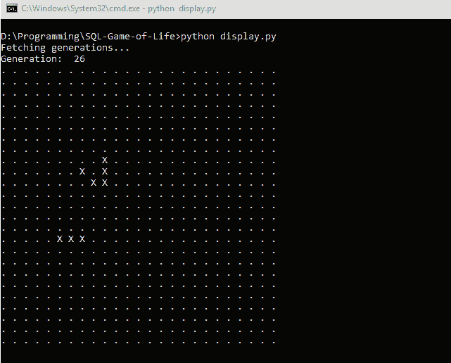

# 编码憎恶:康威在 TSQL 的生活游戏

> 原文：<https://dev.to/barrettotte/coding-abomination-conway-s-game-of-life-in-tsql-40fd>

GIF 可以看这里
[https://github . com/barrettotte/SQL-Game-of-Life/blob/master/demo . GIF](https://github.com/barrettotte/SQL-Game-of-Life/blob/master/demo.gif)

一天早上，在我上下班的路上，我正在分区，意识到我想用 SQL 做一个非常愚蠢的副业项目。我最喜欢做的事情之一是使用一种非常规的语言，我认为实现生活的游戏是一个完美的小项目。

## 游戏人生

如果你对康威的《生活游戏》不熟悉，我鼓励你在这里阅读更多相关内容[https://en.wikipedia.org/wiki/Conway%27s_Game_of_Life](https://en.wikipedia.org/wiki/Conway%27s_Game_of_Life)

它使用的“算法”非常简单。对于环境(板)中的每个单元(像素)，有 4 个规则来确定下一代。

1.  任何少于两个活邻居的活细胞都会死亡，就好像是由于人口减少。
2.  任何有两个或三个活邻居的活细胞都会延续到下一代。
3.  任何有三个以上活邻居的活细胞都会死亡，好像是由于人口过多。
4.  任何一个死细胞，只要有三个活的邻居，就会变成活细胞，就像通过繁殖一样。

(摘自之前链接的维基页面)

通过这些简单的规则，“有机体”可以表现出不同的行为。在我的例子中，我实现了一个“信号灯”和一个“滑翔机”。它们也可以在我链接的维基页面上找到。

## 实现

对于这个项目，我可以使用 TSQL 的内置打印功能，但我想要真正的动画。为此，我必须利用一点 Python 来显示我的存储过程使用 stdout 缓冲区生成的数据。

我做的存储过程存储的是每一代的单元格数据。如果我获取每一代的细胞数据，我可以将它输入到一个绘图函数中，以表示动画中的每一帧。

现在，我会说存储过程运行得很糟糕。但是，**目标是让一个基本的滑翔机穿越屏幕**。我 100%确定我可以做一些花式连接或什么的。但是，我最终使用 SQL 作为通用语言。

## 来源

该项目由一个存储过程和一个 python 显示脚本组成。
这里什么都能找到[https://github.com/barrettotte/SQL-Game-of-Life](https://github.com/barrettotte/SQL-Game-of-Life)

## 编码可憎

把你的时间花在编程有用的东西或学习新的科目上是很好的。但是，我认为最有趣的事情之一是做一些非常晦涩和无用的项目。

当制作一些只有少数人实现的超级奇异的东西时，你会惊讶于你学到了多少。它迫使你跳出框框去思考，去接触一门语言中你通常不会处理的部分。

我发现每隔一段时间编写一个令人厌恶的代码是一个很好的抗疲劳练习。在完成一个有趣的令人厌恶的编码后，我感到精神焕发，可以去处理另一个兼职项目。重要的是选择你相对感兴趣的东西，否则你不会玩得很开心。

几个月前我做的另一个有趣的讨厌的东西是一个只用 XSLT[https://github.com/barrettotte/XSLT-Perlin2D](https://github.com/barrettotte/XSLT-Perlin2D)的 2D·柏林噪音 SVG 生成器。
我最终学会了 XSLT 中的一些巧妙技巧，我甚至不知道这是可能的。