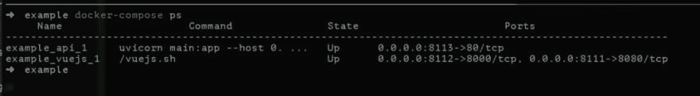

# 来吧，戴夫，伏。js 系列 Ep1 型无级变速器

> 原文::1230【https://dev . to/mrchoke/dev-view-js-ep1-1 FGD】

web dev 的世界更广阔，能找到一把与之相配的利剑很累 js + Vuetifyjs + FastAPI 让我们来看一下

### [](#docker)码头工人

谁不知道 Docker 去找阅读，别人写的很多，但如果你想在 Windows 上读我的书，我从来没有试过。如果有人

很多人都想知道 docker 到底是怎么回事

*   [EP1 真正扮演的 docker](https://medium.com/nectec/ep1-docker-%E0%B8%97%E0%B8%B5%E0%B9%80%E0%B8%A5%E0%B9%88%E0%B8%99-%E0%B8%97%E0%B8%B5%E0%B8%88%E0%B8%A3%E0%B8%B4%E0%B8%87-60e58b1cb095)。
*   [【ep2 docker 实际播放】t1㎡](https://medium.com/nectec/ep2-docker-%E0%B8%97%E0%B8%B5%E0%B9%80%E0%B8%A5%E0%B9%88%E0%B8%99-%E0%B8%97%E0%B8%B5%E0%B8%88%E0%B8%A3%E0%B8%B4%E0%B8%87-71d1a7f3f3bb)
*   [【ep3 docker ti 实际播放】t1㎡](https://medium.com/nectec/ep3-docker-%E0%B8%97%E0%B8%B5%E0%B9%80%E0%B8%A5%E0%B9%88%E0%B8%99-%E0%B8%97%E0%B8%B5%E0%B8%88%E0%B8%A3%E0%B8%B4%E0%B8%87-9d08d7b4b8dd)
*   [【ep4 docker 实际播放】t1㎡](https://medium.com/nectec/ep4-docker-%E0%B8%97%E0%B8%B5%E0%B9%80%E0%B8%A5%E0%B9%88%E0%B8%99-%E0%B8%97%E0%B8%B5%E0%B8%88%E0%B8%A3%E0%B8%B4%E0%B8%87-c4dafb7a7e37)

### [](#docker-compose)复合坞站

我准备了一套 dev 所用的 docker 服务(重申对于 dev)，它是一个 docker-compose 文件，它将包括

#### [](#vuejs)vuejs

nodejs 用于项目管理，我将服务命名为 vuejs 将执行 vue-cli 安装。如果此下拉服务需要重新安装，这并不复杂。

#### [](#api)api

python service 是一个基于 python 的服务，我以 fastAPI 为例，详细的研究内容如下:

[https://fast API . tiano golo . com](https://fastapi.tiangolo.com/)

### [](#%E0%B9%80%E0%B8%A3%E0%B8%B4%E0%B9%88%E0%B8%A1%E0%B8%81%E0%B8%B1%E0%B8%99%E0%B9%80%E0%B8%A5%E0%B8%A2)开始！我的天啊！

```
git clone [https://github.com/mrchoke/vuejs\_fastapi](https://github.com/mrchoke/vuejs_fastapi) 
```

进入克隆所在的目录，然后运行 up service

。

```
cd vuejs\_fastapi/ep1

docker-compose up -d 
```

通过使用
命令检查每个服务运行是否完整

```
docker-compose ps 
```

[T2】](https://res.cloudinary.com/practicaldev/image/fetch/s--3z2GCXQQ--/c_limit%2Cf_auto%2Cfl_progressive%2Cq_auto%2Cw_880/https://cdn-images-1.medium.com/max/1024/1%2ABWDRxRLjnt9UMQy9vJnqTg.png)

见日志〔t0〕字

```
docker-compose logs -f

ถ้ากรณีใช้ไปนานๆแล้ว log มันเยอะ อาจจะ limit output สัก 50 บรรทัดต่อ service ไม่ต้องรอนาน

docker-compose logs -f --tail 50 
```