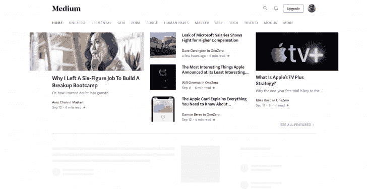
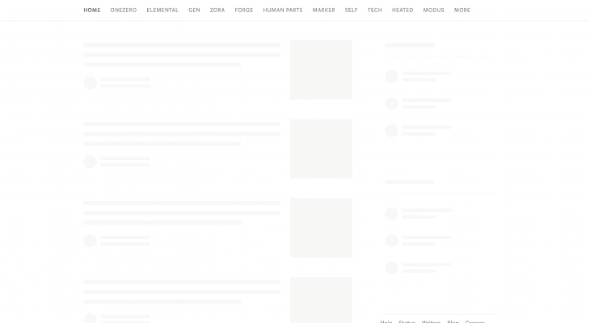
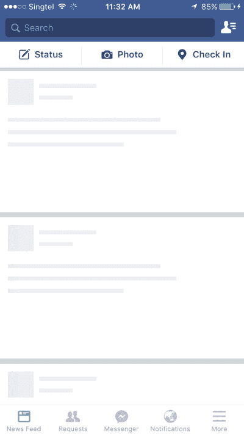

# 通过显示骨架用户界面来改善 React 应用程序中的 UX

> 原文：<https://dev.to/bnevilleoneill/improve-ux-in-react-apps-by-showing-skeleton-ui-5a3i>

**作者:[帕拉马南森](https://blog.logrocket.com/author/paramananthamharrison/)哈里森** ✏️

### 简介

框架屏幕是不包含实际内容的用户界面；相反，它以类似于实际内容的形式显示页面的加载元素。

框架屏幕向用户显示内容正在加载，提供内容完全加载后的模糊预览。

前端开发人员出于各种原因使用框架 ui。

其中最主要的是 UI 在视觉上简化用户体验的能力，模仿内容加载速度，并逐步加载内容，而不需要一次获取页面上的所有内容。

Slack、Youtube、脸书、Pinterest 和其他大型科技公司在加载内容以提升 UX 时显示骨架屏幕。

<figure>[](https://res.cloudinary.com/practicaldev/image/fetch/s--MTqFxSh0--/c_limit%2Cf_auto%2Cfl_progressive%2Cq_auto%2Cw_880/https://blog.logrocket.com/wp-content/uploads/2019/09/Medium-skeleton-ui-nocdn.png) 

<figcaption id="caption-attachment-6454">中等内容加载</figcaption>

</figure>

<figure>[](https://res.cloudinary.com/practicaldev/image/fetch/s--1ZrcrWzO--/c_limit%2Cf_auto%2Cfl_progressive%2Cq_auto%2Cw_880/https://blog.logrocket.com/wp-content/uploads/2019/09/Medium-content-loading-nocdn.png) 

<figcaption id="caption-attachment-6455">中等骨架 UI</figcaption>

</figure>

除了框架屏幕之外，这些用户界面通常被称为内容占位符、内容加载器和 ghost 元素。

### 骷髅屏幕如何提升 UX

骨架用户界面类似于真实的用户界面，因此用户甚至在内容出现之前就能了解网站加载的速度。让我们通过两个屏幕的对比来看看它的实际效果:

<figure>[](https://res.cloudinary.com/practicaldev/image/fetch/s--di-d5bAO--/c_limit%2Cf_auto%2Cfl_progressive%2Cq_auto%2Cw_880/https://blog.logrocket.com/wp-content/uploads/2019/09/No-skeleton-UI-nocdn.png) 

<figcaption id="caption-attachment-6455">空脸书页面无加载器</figcaption>

</figure>

<figure>[](https://res.cloudinary.com/practicaldev/image/fetch/s--KYsVKBCO--/c_limit%2Cf_auto%2Cfl_progressive%2Cq_auto%2Cw_880/https://blog.logrocket.com/wp-content/uploads/2019/09/facebook-skeleton-ui-nocdn.png) 

<figcaption id="caption-attachment-6455">空脸书带骷髅 UI</figcaption>

</figure>

两个屏幕都没有加载实际内容，但是空页面对用户来说似乎较慢，而框架屏幕看起来更丰富、更快，并且感觉响应更快。

尽管真实内容在两个屏幕上的加载速度相同，但骨架屏幕提供了更好的 UX。

### 不同的骨架 UI

有几种不同种类的框架 UI。主要的是内容占位符和图像(或颜色)占位符。

像 Medium、Slack 和 Youtube 这样的公司在他们的主页上的框架 UI 中使用内容占位符。

它们很容易构建，因为它们不需要关于实际内容数据的任何细节，而是仅仅模仿 UI。

与此同时，Pinterest 和 Unsplash 这两个以图片为主的网站使用了颜色占位符。颜色占位符更难构建，因为它们需要关于实际内容数据的细节。

### 工作原理

首先，加载一个骨架而不是图像(通常带有灰色或灰白色背景)。

获取数据后，从图像元数据中加载图像的实际颜色。

这些元数据是在通过后端算法上传时从图像中获取的，并在图像上进行处理。

最后，延迟加载图像，以允许用户使用交叉点观察器 API 实际查看内容。

### 演示

在我们的教程中，我们将通过创建一个 YouTube 主页的模拟来探索 React 中的骨架 UI。

在我们开始之前，让我们列出 React 中已经可用的最流行的框架 UI 开发包:

*   [React 内容加载器](https://github.com/danilowoz/react-content-loader)
*   [反应占位符](https://github.com/buildo/react-placeholder)
*   [反作用加载骨骼](https://github.com/dvtng/react-loading-skeleton)

这些软件包维护得相当好，但是它们也有缺点。在决定在我们的应用程序中使用哪一个之前，我们将看看每一个的优缺点。

### React 内容加载器

**优点**

*   基于 SVG 的 API 您可以使用任何 SVG 形状来创建骨架元素
*   易于创建动画占位符，从左到右发光(脉冲动画)
*   有一些预先设计好的内容加载器(如脸书、Instagram 等)
*   可以用于任何复杂的框架 UI，因为 SVG 支持许多形状

**缺点**

*   您需要分别为所有组件创建自定义骨架组件
*   SVG 不同于 CSS 元素，因此创建带有自定义对齐的自定义元素需要很长的学习时间
*   由于 SVG 的依赖性，浏览器支持可能会不一致，所以 skeleton 在不同的浏览器上可能会有不同的外观和感觉

下面是一个使用`react-content-loader` :
的骨架组件的例子

```
import ContentLoader from "react-content-loader";

    // API support all SVG shapes - rect is a SVG shape for rectangle
    const SkeletonComponent = () => (
      <ContentLoader>
        <rect x="0" y="0" rx="5" ry="5" width="70" height="70" />
        <rect x="80" y="17" rx="4" ry="4" width="300" height="13" />
        <rect x="80" y="40" rx="3" ry="3" width="250" height="10" />
      </ContentLoader>
    ) 
```

<svg width="20px" height="20px" viewBox="0 0 24 24" class="highlight-action crayons-icon highlight-action--fullscreen-on"><title>Enter fullscreen mode</title></svg> <svg width="20px" height="20px" viewBox="0 0 24 24" class="highlight-action crayons-icon highlight-action--fullscreen-off"><title>Exit fullscreen mode</title></svg>

### 反应占位符

**优点**

*   基于组件的 API
*   使用占位符组件轻松创建自定义框架 UI
*   支持脉冲动画，可以通过道具控制

**缺点**

*   与 React content loader 类似，我们需要单独维护一个框架组件，因此更新组件的样式也需要更新框架组件
*   学习曲线不是非常线性的，因为不同的需求有多个组成部分

下面是一个使用`react-placeholder` :
的骨架组件的例子

```
import { TextBlock, RectShape } from 'react-placeholder/lib/placeholders';
import ReactPlaceholder from 'react-placeholder';

// 
const MyCustomPlaceholder = () => (
  <div className='my-custom-placeholder'>
    <RectShape color='gray' style={{width: 30, height: 80}} />
    <TextBlock rows={7} color='yellow'/>
  </div>
);

// This is how the skeleton component is used
<ReactPlaceholder ready={ready} customPlaceholder={<MyCustomPlaceholder />}>
  <MyComponent />
</ReactPlaceholder> 
```

<svg width="20px" height="20px" viewBox="0 0 24 24" class="highlight-action crayons-icon highlight-action--fullscreen-on"><title>Enter fullscreen mode</title></svg> <svg width="20px" height="20px" viewBox="0 0 24 24" class="highlight-action crayons-icon highlight-action--fullscreen-off"><title>Exit fullscreen mode</title></svg>

### 反应加载骨骼

**优点**

*   非常简单的 API——它只有一个组件，带有用于所有定制的道具
*   很容易学
*   可以作为单独的框架组件使用，也可以直接放在任何组件中，所以我们可以灵活地使用它
*   支持动画和主题化

**缺点**

*   对于简单的骨架 UI 非常好，但是对于复杂的骨架很难

下面是一个 React 加载骨架的例子:

```
import Skeleton, { SkeletonTheme } from "react-loading-skeleton";

const SkeletonCompoent = () => (
  <SkeletonTheme color="#202020" highlightColor="#444">
    <section>
      <Skeleton count={3} />
      <Skeleton width={100} />
      <Skeleton circle={true} height={50} width={50} />
    </section>
  </SkeletonTheme>
); 
```

<svg width="20px" height="20px" viewBox="0 0 24 24" class="highlight-action crayons-icon highlight-action--fullscreen-on"><title>Enter fullscreen mode</title></svg> <svg width="20px" height="20px" viewBox="0 0 24 24" class="highlight-action crayons-icon highlight-action--fullscreen-off"><title>Exit fullscreen mode</title></svg>

对于完整的演示，我们将使用`react-loading-skeleton`。

也就是说，所有三个库都足以满足简单的用例。请随意浏览文档，选择您觉得在应用程序中使用最舒服的一个。

### 使用 React 的骨架 UI 示例

我们将构建一个类似 YouTube 的 UI，并展示 skeleton UI 是如何工作的。

首先，让我们创建 YouTube UI:

```
import React from "react";
    // Youtube fake data
    import youtubeData from "./data";
    // Styles for the layout
    import "./App.css";

    // Each Card item component which display one video - shows thumbnail, title and other details of a video
    const Card = ({ item, channel }) => {
      return (
        <li className="card">
          <a
            href={`https://www.youtube.com/watch?v=${item.id}`}
            target="_blank"
            rel="noopener noreferrer"
            className="card-link"
          >
            
            <h4 className="card-title">{item.title}</h4>
            <p className="card-channel">
              <i>{channel}</i>
            </p>
            <div className="card-metrics">
              {item.views} &bull; {item.published}
            </div>
          </a>
        </li>
      );
    };

    // Card list component
    const CardList = ({ list }) => {
      return (
        <ul className="list">
          {list.items.map((item, index) => {
            return <Card key={index} item={item} channel={list.channel} />;
          })}
        </ul>
      );
    };

    // App component - each section have multiple videos
    const App = () => {
      return (
        <div className="App">
          {youtubeData.map((list, index) => {
            return (
              <section key={index}>
                <h2 className="section-title">{list.section}</h2>
                <CardList list={list} />
                <hr />
              </section>
            );
          })}
        </div>
      );
    }

    export default App; 
```

<svg width="20px" height="20px" viewBox="0 0 24 24" class="highlight-action crayons-icon highlight-action--fullscreen-on"><title>Enter fullscreen mode</title></svg> <svg width="20px" height="20px" viewBox="0 0 24 24" class="highlight-action crayons-icon highlight-action--fullscreen-off"><title>Exit fullscreen mode</title></svg>

接下来，我们输入假的 YouTube 数据:

```
const youtubeData = [
  {
    section: "JavaScript Tutorials by freeCodeCamp",
    channel: "freeCodeCamp.org",
    items: [
      {
        id: "PkZNo7MFNFg",
        image: "https://img.youtube.com/vi/PkZNo7MFNFg/maxresdefault.jpg",
        title: "Learn JavaScript - Full Course for Beginners",
        views: "1.9M views",
        published: "9 months ago"
      },
      {
        id: "jaVNP3nIAv0",
        image: "https://img.youtube.com/vi/jaVNP3nIAv0/maxresdefault.jpg",
        title: "JavaScript, HTML, CSS - Rock Paper Scissors Game",
        views: "216K views",
        published: "1 year ago"
      }
    ]
  },
  {
    section: "Small steps on React",
    channel: "Learn with Param",
    items: [
      {
        id: "ylbVzIBhDIM",
        image: "https://img.youtube.com/vi/ylbVzIBhDIM/maxresdefault.jpg",
        title: "useState example by building a text-size changer",
        views: "148 views",
        published: "3 days ago"
      }
    ]
  }
];
export default youtubeData 
```

<svg width="20px" height="20px" viewBox="0 0 24 24" class="highlight-action crayons-icon highlight-action--fullscreen-on"><title>Enter fullscreen mode</title></svg> <svg width="20px" height="20px" viewBox="0 0 24 24" class="highlight-action crayons-icon highlight-action--fullscreen-off"><title>Exit fullscreen mode</title></svg>

让我们在加载实际数据之前展示一下框架 UI。由于我们的数据是假的，我们需要像模拟 API 数据一样，在两秒钟的超时后加载:

```
import React, { useState, useEffect } from "react";

const App = () => {
  const [videos, setVideos] = useState([]);
  // Load this effect on mount
  useEffect(() => {
    const timer = setTimeout(() => {
      setVideos(youtubeData);
    }, 2000);
    // Cancel the timer while unmounting
    return () => clearTimeout(timer);
  }, []);

  return (
    <div className="App">
      {videos.map((list, index) => {
        ...
      })}
    </div>
  );
}; 
```

<svg width="20px" height="20px" viewBox="0 0 24 24" class="highlight-action crayons-icon highlight-action--fullscreen-on"><title>Enter fullscreen mode</title></svg> <svg width="20px" height="20px" viewBox="0 0 24 24" class="highlight-action crayons-icon highlight-action--fullscreen-off"><title>Exit fullscreen mode</title></svg>

你会看到一个三秒钟的白屏，然后数据突然加载。

现在，我们将安装`react-loading-skeleton` :

```
yarn add react-loading-skeleton 
```

<svg width="20px" height="20px" viewBox="0 0 24 24" class="highlight-action crayons-icon highlight-action--fullscreen-on"><title>Enter fullscreen mode</title></svg> <svg width="20px" height="20px" viewBox="0 0 24 24" class="highlight-action crayons-icon highlight-action--fullscreen-off"><title>Exit fullscreen mode</title></svg>

让我们为我们的视频数据创建一个框架组件:

```
import Skeleton from "react-loading-skeleton";

/* 
   Separate Skeleton component 
  - It is created with the same shape as Card component
  - Pros: Component will be isolated from the skeletons so the component won't become complex or heavy
  - Cons: Maintaining separate skeleton component will make it harder to maintain when UI changes and style gets changed
*/
const CardSkeleton = () => {
  return (
    <section>
      <h2 className="section-title">
        <Skeleton height={28} width={300} />
      </h2>
      <ul className="list">
        {Array(9)
          .fill()
          .map((item, index) => (
            <li className="card" key={index}>
              <Skeleton height={180} />
              <h4 className="card-title">
                <Skeleton height={36} width={`80%`} />
              </h4>
              <p className="card-channel">
                <Skeleton width={`60%`} />
              </p>
              <div className="card-metrics">
                <Skeleton width={`90%`} />
              </div>
            </li>
          ))}
      </ul>
    </section>
  );
}; 
```

<svg width="20px" height="20px" viewBox="0 0 24 24" class="highlight-action crayons-icon highlight-action--fullscreen-on"><title>Enter fullscreen mode</title></svg> <svg width="20px" height="20px" viewBox="0 0 24 24" class="highlight-action crayons-icon highlight-action--fullscreen-off"><title>Exit fullscreen mode</title></svg>

您也可以通过将骨架直接嵌入到组件中来创建骨架组件，就像这样:

```
import Skeleton from "react-loading-skeleton";

/*
  Cards component with embedded skeleton UI
  - Pros: This is much easier to maintain for UI and styles changes
  - Cons: UI will become complex and heavy with lot of unnecessary elements in it
*/
const Card = ({ item, channel }) => {
  return (
    <li className="card">
      <a
        href={item.id ? `https://www.youtube.com/watch?v=${item.id}` : `javascript:void(0)`}
        target="_blank"
        rel="noopener noreferrer"
        className="card-link"
      >
        {
          item.image ? 
           
          : 
          <Skeleton height={180} /> 
        }
        <h4 className="card-title">
          {
            item.title ? item.title : 
            <Skeleton height={36} width={`80%`} />
          }
        </h4>
        <p className="card-channel">
          { channel ? <i>{channel}</i> : <Skeleton width={`60%`} /> }
        </p>
        <div className="card-metrics">
          {
            item.id ? 
            <>{item.views} &bull; {item.published}</>
            :
            <Skeleton width={`90%`} />
        </div>
      </a>
    </li>
  );
}; 
```

<svg width="20px" height="20px" viewBox="0 0 24 24" class="highlight-action crayons-icon highlight-action--fullscreen-on"><title>Enter fullscreen mode</title></svg> <svg width="20px" height="20px" viewBox="0 0 24 24" class="highlight-action crayons-icon highlight-action--fullscreen-off"><title>Exit fullscreen mode</title></svg>

在我的示例中，我使用了独立的骨架组件，但是您可以随意使用最适合您需求的样式组件。这完全取决于个人喜好和组件的复杂程度。

最后，这里是实际数据加载之前的`CardSkeleton`组件:

```
const App = () => {
  const [videos, setVideos] = useState([]);
  // Manage loading state - default value false
  const [loading, setLoading] = useState(false);

  useEffect(() => {
    // set the loading state to true for 2 seconds
    setLoading(true);

    const timer = setTimeout(() => {
      setVideos(youtubeData);
      // loading state to false once videos state is set
      setLoading(false);
    }, 2000);

    return () => clearTimeout(timer);
  }, []);

  // Show the CardSkeleton when loading state is true
  return (
    <div className="App">
      {loading && <CardSkeleton />}
      {!loading &&
        videos.map((list, index) => {
          return (
            <section key={index}>
              <h2 className="section-title">{list.section}</h2>
              <CardList list={list} />
              <hr />
            </section>
          );
        })}
    </div>
  );
}; 
```

<svg width="20px" height="20px" viewBox="0 0 24 24" class="highlight-action crayons-icon highlight-action--fullscreen-on"><title>Enter fullscreen mode</title></svg> <svg width="20px" height="20px" viewBox="0 0 24 24" class="highlight-action crayons-icon highlight-action--fullscreen-off"><title>Exit fullscreen mode</title></svg>

我们现在有了一个功能齐全的框架 UI 的例子。我们的示例在显示数据之前加载框架 2 秒钟。[点击此处查看它的实际应用。](https://skeleton-ui.netlify.com/)

这个例子的代码库可以在 [Github](https://github.com/learnwithparam/logrocket-skeleton-ui) 中找到。我已经写了分支，所以你可以运行所有的中间阶段，并看到不同之处。

### 结论

骨架屏幕大大提高了 UX，因为它减轻了用户对完全空白屏幕的挫折感，并让用户在加载内容之前就知道内容是什么样子的。

在 React 应用程序中使用框架 UI 很容易。

如果您不想使用现有的包，也可以通过创建 div 元素来创建自己的框架 UI，div 元素通过创建矩形和圆形元素来模仿框架。

在评论区分享你使用 skeleton UI 的经验。

* * *

**编者按:**看到这个帖子有问题？你可以在这里找到正确的版本。

## Plug: [LogRocket](https://logrocket.com/signup/) ，一款适用于网络应用的 DVR

[](https://res.cloudinary.com/practicaldev/image/fetch/s--6FG5kvEL--/c_limit%2Cf_auto%2Cfl_progressive%2Cq_auto%2Cw_880/https://i2.wp.com/blog.logrocket.com/wp-content/uploads/2017/03/1d0cd-1s_rmyo6nbrasp-xtvbaxfg.png%3Fresize%3D1200%252C677%26ssl%3D1)

[log rocket](https://logrocket.com/signup/)是一个前端日志工具，让你重放问题，就像它们发生在你自己的浏览器中一样。LogRocket 不需要猜测错误发生的原因，也不需要向用户询问截图和日志转储，而是让您重放会话以快速了解哪里出错了。它可以与任何应用程序完美配合，不管是什么框架，并且有插件可以记录来自 Redux、Vuex 和@ngrx/store 的额外上下文。

除了记录 Redux 动作和状态，LogRocket 还记录控制台日志、JavaScript 错误、stacktraces、带有头+体的网络请求/响应、浏览器元数据、自定义日志。它还使用 DOM 来记录页面上的 HTML 和 CSS，甚至为最复杂的单页面应用程序重新创建像素级完美视频。

[免费试用](https://logrocket.com/signup/)。

* * *

帖子[通过展示骨架 UI 来改善 React 应用中的 UX](https://blog.logrocket.com/improve-ux-in-react-apps-by-showing-skeleton-ui/)最先出现在[日志博客](https://blog.logrocket.com)上。