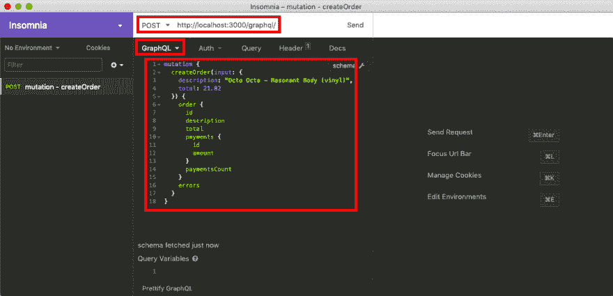
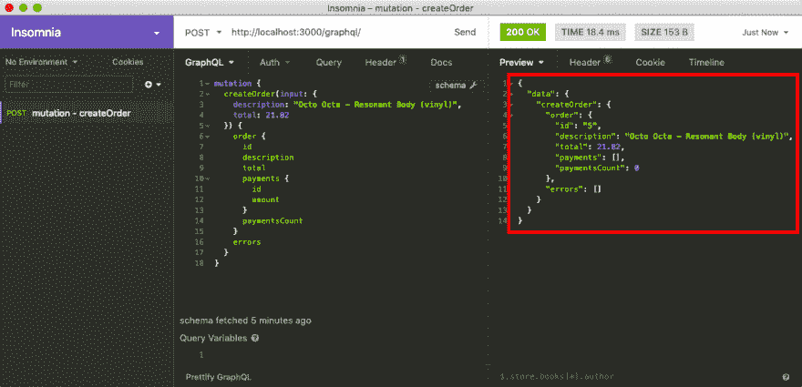
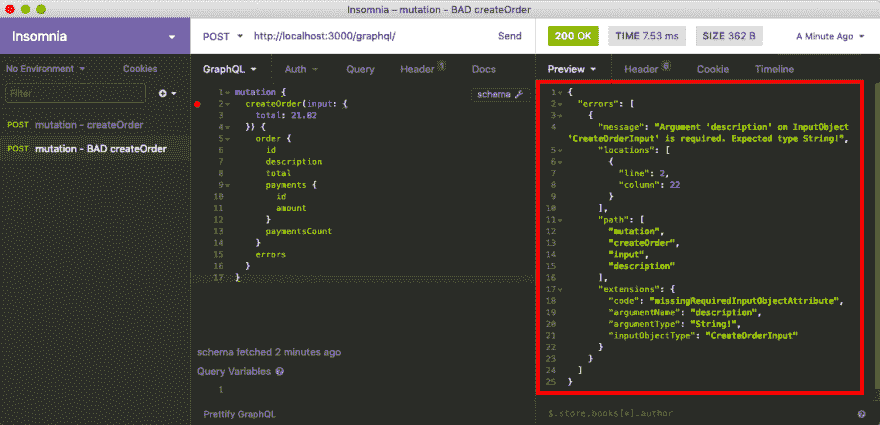

# Ruby on Rails GraphQL API 教程:使用突变创建数据

> 原文:[https://dev . to/isalevine/ruby-on-rails-graph QL-API-tutorial-creating-data-with-mutations-39ab](https://dev.to/isalevine/ruby-on-rails-graphql-api-tutorial-creating-data-with-mutations-39ab)

从上一期继续，我们将介绍 GraphQL 中的另一种类型的请求:**突变。**

突变允许我们创建、更新或破坏数据库中的数据。再加上查询读取数据的能力，我们现在有了一整套 CRUD 操作！

在本教程中，我们将重点构建一个简单的变异，在数据库中创建一个新的`Order`记录。

再次强调，本教程很大程度上改编自马特·博尔特 的[这本令人惊叹的教程。再次感谢你，马特！！](https://mattboldt.com/2019/01/07/rails-and-graphql/)

# [](#overview)概述

在第二篇文章中，我们将逐步完成以下任务:

*   创建所需的突变文件
*   创建我们的第一个突变(向数据库添加一个新的`Order`)
*   将路由添加到`/app/graphql/types/mutation_type.rb`
*   在[失眠](https://insomnia.rest/)中编写并执行我们的第一个 GraphQL 突变

让我们开始吧！

# [](#what-is-a-graphql-mutation)什么是 GraphQL 突变？

来自 [GraphQL 文档](https://graphql.org/learn/queries/):

> 大多数关于 GraphQL 的讨论都集中在数据获取上，但是任何完整的数据平台都需要一种方法来修改服务器端的数据。

*(重点地雷)*

突变就是修改(创建、更新、销毁)数据库中数据的请求。

### [图 QL 变异格式](#graphql-mutation-format)

类似于查询，这是我们的第一个 GraphQL 变体的样子:

```
mutation  {  createOrder(input:  {  description:  "Octo Octa - Resonant Body (vinyl)",  total:  21.82  })  {  order  {  id  description  total  payments  {  id  amount  }  paymentsCount  }  errors  }  } 
```

需要注意的几件事:

*   在最上面，我们将请求定义为`mutation`而不是`query`——这对于正确路由请求是必要的，我们将在下面讨论
*   `createOrder`是我们给突变取的名字，我们称它为一个函数，参数在括号内:`createOrder( input: {} )`
*   变异接受结构化为散列的`input`，其中我们为`description`传递一个字符串，为`amount`传递一个浮点数(我们可以将这些输入设置为可选的，或者使它们成为必需的)
*   在`createOrder()`的右括号后面，我们添加了另一个散列来描述我们想要从变异中返回的数据
    *   注意，它看起来**与我们的第一个查询**基本相同，除了我们还返回了`errors`以及我们创建的新的`order`
    *   这个 return 是**可选的**，但是这是一个好主意——您可以在一个原子操作中既改变数据库又查询数据，这非常高效！

好了，现在我们知道了我们的变异请求看起来会是什么样子，让我们实际构建代码吧！

# [](#adding-mutations-to-our-app)添加突变到我们的/app/

导航到`/app/graphql/mutations`目录，您会注意到它是空的(除了那个空的`.keep`文件)。目前，我们的应用程序没有任何突变。要添加它们，我们需要做一些事情:

1.  为我们的突变创建一个`BaseMutation`类来继承
2.  创建一个继承自`BaseMutation`的特定突变(`createOrder`
3.  将路由添加到`/app/graphql/types/mutation_type.rb`(很像我们在上一篇文章中对`/app/graphql/types/query_type.rb`所做的)

之后，我们可以为每个想要添加的新突变重复步骤 2 和 3！

# [](#creating-a-mutation)制造突变

### [](#create-new-file-raw-appgraphqlmutationsbasemutationrb-endraw-)创建新文件`/app/graphql/mutations/base_mutation.rb`

让我们创建一个基本类型，让我们的其他突变继承。在(大部分)空的`/app/graphql/mutations`目录中创建一个新的`base_mutation.rb`文件，并添加代码:

```
# /app/graphql/mutations/base_mutation
class Mutations::BaseMutation < GraphQL::Schema::RelayClassicMutation
end 
```

就是这样！

注意，我们继承的模块是`RelayClassicMutation`——graph QL Ruby gem 实际上有另一个 [`GraphQL::Schema::Mutation`](https://graphql-ruby.org/mutations/mutation_classes) 模块，但是`RelayClassicMutation`给了我们一些很好的功能，[尤其是简化了`input:`来接受一个散列](https://graphql-ruby.org/api-doc/1.9.12/GraphQL/Schema/RelayClassicMutation)。

### [](#create-new-file-for-our-specific-mutation)为我们的特定突变创建新文件

在同一个`/app/graphql/mutations`目录中，添加另一个文件。这将与变异同名，但是在 snake-case 中:对于`createOrder`变异，将文件命名为`/app/graphql/mutations/create_order.rb`。

下面是我们将添加到文件中以创建变异的内容:

```
# /app/graphql/mutations/create_order.rb
class Mutations::CreateOrder < Mutations::BaseMutation
    argument :description, String, required: true
    argument :total, Float, required: true

    field :order, Types::OrderType, null: false
    field :errors, [String], null: false

    def resolve(description:, total:)
        order = Order.new(description: description, total: total, reference_key: SecureRandom.uuid)
        if order.save
            {
                order: order,
                errors: []
            }
        else
            {
                order: nil,
                errors: order.errors.full_messages
            }
        end
    end
end 
```

让我们在声明该类后浏览一下我们看到的内容:

#### [](#arguments)论据

```
# /app/graphql/mutations/create_order.rb
    argument :description, String, required: true
    argument :total, Float, required: true 
```

这里，我们指定了变异请求可以接受的参数。在`argument`之后，我们供应三样东西:

1.  参数的名称(`:description`)——我们将使用它作为输入的键值对中的键
2.  数据类型(`String` ) -如果没有提供正确的数据类型，变异请求将抛出错误
3.  必需的，作为一个布尔值(`required: true` ) -这允许我们指定一个参数是否必须存在才能成功
    *   如果不存在，将抛出一个错误
    *   `required: false`将使参数可选

#### [](#fields)字段

```
# /app/graphql/mutations/create_order.rb
    field :order, Types::OrderType, null: false
    field :errors, [String], null: false 
```

这里，我们指定了我们的变异请求**返回的字段**。我们的两个字段`:order`和`:errors`将处理两种情况:

*   如果变异**成功**，将返回一个`Order`对象(就像查询一样)
*   如果突变**失败**，我们将得到一组错误

在`field`之后，我们供应三样东西:

1.  字段的名称(`:order`，`:errors`)——我们将使用它作为返回数据的键值对中的键
2.  数据类型(`Types::OrderType`，`[String]`)——这些告诉我们返回的数据类型
    *   与查询一样，我们可以指定任何数据类型，包括在`/app/graphql/types/`目录中创建的自定义类型
    *   我们也可以返回另一种类型的数组，比如通过`[String]`返回字符串形式的错误数组
3.  null，作为布尔值(`required: true` ) -这允许我们指定是否允许我们在返回数据中接收`nil`字段
    *   `null: false`将抛出一个错误字段为`nil`
    *   `null: true`将允许`nil`数据无错误返回

#### [](#resolve)解决()

```
# /app/graphql/mutations/create_order.rb
    def resolve(description:, total:)
        order = Order.new(description: description, total: total)
        if order.save
            {
                order: order,
                errors: []
            }
        else
            {
                order: nil,
                errors: order.errors.full_messages
            }
        end
    end 
```

这就是奇迹发生的地方！所有的突变都有一个`resolve()`函数，该函数返回(作为一个散列)突变本身将返回的内容。让我们单步执行代码:

*   `resolve()`采用我们上面指定的`arguments`
*   我们立即使用 ActiveRecord 创建一个新的`Order`，使用来自`arguments`的数据
*   在一个熟悉的 Rails 模式中，我们测试`Order`是否可以保存在数据库中
    *   如果**成功**，我们返回一个包含新保存的`Order`实例的带有`order`键的散列，以及一个空的错误数组
    *   如果**失败**，我们返回一个`nil` `Order`，以及一个错误数组

这是一个非常简单的`resolve()`方法，但是可以很容易地添加到！只要**resolve()函数最终为变异的响应**返回一个散列，就可以在`CreateOrder`类中创建和调用助手函数。

我们已经准备好进行第一次变异了！但首先，我们必须确保我们的应用程序知道如何正确路由突变请求。

### [](#add-routing-to-raw-appgraphqltypesmutationtyperb-endraw-)添加路由到`/app/graphql/types/mutation_type.rb`

默认情况下，我们的`/app/graphql/types/mutation_type.rb`将被创建，只有一个返回“Hello World”的测试字段，我们被指示删除它。现在就去删除它，这样我们的类看起来漂亮又空:

```
# /app/graphql/types/mutation_type.rb
module Types
  class MutationType < Types::BaseObject
  end
end 
```

完美，一张白纸！

在这里，我们现在简单地指定一个`field`来查找我们的突变名称，并路由到正确的突变类:

```
# /app/graphql/types/mutation_type.rb
module Types
  class MutationType < Types::BaseObject

    field :create_order, mutation: Mutations::CreateOrder

  end
end 
```

现在，当我们发送一个名为`createOrder`的 GraphQL 变体时，我们提供的参数将被发送到我们刚刚在`/app/graphql/mutations/create_order.rb`中创建的`Mutations::CreateOrder`类！

我们*终于*准备好测试了！！

# [](#executing-our-first-mutation)执行我们的第一次变异

继续在您的终端中运行`rails s`，在`http://localhost:3000/graphql/`上启动我们的 Rails 服务器。

接下来，打开失眠症并创建一个新的 POST 请求，并将其设置为一个 GraphQL 结构化查询。

然后，加入我们上面的变异代码:

```
mutation  {  createOrder(input:  {  description:  "Octo Octa - Resonant Body (vinyl)",  total:  21.82  })  {  order  {  id  description  total  payments  {  id  amount  }  paymentsCount  }  errors  }  } 
```

请注意，与我们上次创建的查询有一些不同之处:

*   最上面一行写的是`mutation {}`而不是`query {}`——这是正确路由到`/app/graphql/types/mutation_type.rb`所必需的
*   在内部，我们调用`createOrder()`作为函数，并提供`input:`作为包含我们的字段作为键的散列
*   紧随`createOrder()`调用之后，我们还为返回的数据提供了一个结构，包括一个`order`和`errors`

这就是我们现在在失眠中得到的:

[T2】](https://res.cloudinary.com/practicaldev/image/fetch/s--3e5t6YGZ--/c_limit%2Cf_auto%2Cfl_progressive%2Cq_auto%2Cw_880/https://thepracticaldev.s3.amazonaws.com/i/1hu3klrpy00cyp0zzxkd.png)

继续发送请求，你会看到它返回**成功**。我们可以访问我们新创建的(并保存！)`Order`通过`order`键。我们还可以看到我们的错误数组是空的:

[T2】](https://res.cloudinary.com/practicaldev/image/fetch/s--yp30C30x--/c_limit%2Cf_auto%2Cfl_progressive%2Cq_auto%2Cw_880/https://thepracticaldev.s3.amazonaws.com/i/4y9knmd0c95bg4wzkoby.png)

现在，让我们测试一个**失败的**突变。完全删除输入的`description:`字段:

```
mutation  {  createOrder(input:  {  total:  21.82  })  {  order  {  id  description  total  payments  {  id  amount  }  paymentsCount  }  errors  }  } 
```

然后重新发送请求，您会看到它返回一个错误，描述一个名为“description”的缺失的必需输入字段:

[T2】](https://res.cloudinary.com/practicaldev/image/fetch/s--ThntjISR--/c_limit%2Cf_auto%2Cfl_progressive%2Cq_auto%2Cw_880/https://thepracticaldev.s3.amazonaws.com/i/lmtj6zatu0ytos9lhbbb.png)

太好了！GraphQL Ruby gem 提供的错误*非常*明确，所以确保在调试时仔细阅读它们。

# [](#conclusion)结论

我们现在已经实现了一个能够从我们的数据库中读取`Orders`的 GraphQL API，现在还可以创建新的`Orders`！从这里，我们可以构建新的变异来处理数据的更新和删除。

[这也是本文中代码的回购。请随意修改它！](https://github.com/isalevine/devto-graphql-ruby-api)

再次感谢 ***马特·博尔特*** 和[他令人敬畏的 Rails GraphQL 教程](https://mattboldt.com/2019/01/07/rails-and-graphql/)帮助我走到这一步！< 3

对于在 Rails 中使用 GraphQL，或者一般情况下使用 GraphQL，有什么技巧或建议吗？欢迎在下面投稿！