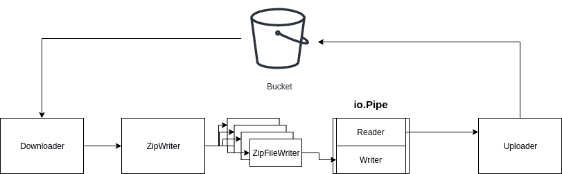

# 在“转到数据流”中使用 io.Reader/io.Writer

> 原文：<https://dev.to/flowup/using-io-reader-io-writer-in-go-to-stream-data-3i7b>

## 让我们直接进入任务:

你必须压缩在云上可用的文件(如 AWS S3 桶)。你能想到的第一个解决方案可能是下载每个文件，处理它(添加到 ZIP 文件)，删除一个文件，然后将最终的 ZIP 文件上传到云。简单吧？

# 天真解

有一个示例代码可以完成这个解决方案:

```
var (
    downloader *s3manager.Downloader
    uploader *s3manager.Uploader
)

func zipS3Files(in []*s3.GetObjectInput, result *s3manager.UploadInput) error {
    filesToZip := make([]string, 0, len(in))
    // Download each file to local
    for _, file := range in {
        pathToFile := os.TempDir() + "/" + path.Base(*file.Key)
        f, _:= os.Create(pathToFile)
        downloader.Download(f, file)
        f.Close()
        filesToZip = append(filesToZip, pathToFile)
    }
    // Create file for ZIP
    zipFile := os.TempDir() + "/" + path.Base(*result.Key)
    f, _:= os.Create(zipFile)
    defer f.Close()
    zipWriter := zip.NewWriter(f)
    for _, file := range filesToZip {
        // Create writer for file inside ZIP
        w, _:= zipWriter.Create(file)
        // Open file which will be zipped
        inFile, _:= os.Open(file)
        // Actual process (zip) file
        io.Copy(w, inFile)
        inFile.Close()
    }
    zipWriter.Close()
    // Seek to begin
    f.Seek(0, 0)
    // Upload zip
    result.Body = f
    _, err = uploader.Upload(result)
    return err
} 
```

我不打算讨论这个解决方案，因为我认为它非常简单。迭代每个文件，将其下载到磁盘，创建 zip，再次迭代文件并将其添加到 zip，最后上传到 bucket。

太好了，可以用了吧？我们解决任务。但是也许我们可以改进它。比如我们可以使用`DownloadWithIterator`，但这超出了本文的范围。

但是为什么我们需要存储文件和压缩到磁盘呢？这不符合要求。此外，即使在不需要的时候，我们也在使用磁盘。如果我们想在 AWS Lambda 中运行这段代码呢？在`/tmp`中，我们被限制在 512MB 的存储空间。你可以想到，好吧，不用磁盘，用内存。是的，但我们仍然受到内存的限制，在 Lambda 中它最多可以达到 3GB，所以我们再次达到了极限。

# 流解

如果我们可以创建一个管道，将数据从 bucket 传输到`zip.Writer`，然后产生一个 bucket，会怎么样？不涉及磁盘。怎么会？通过使用伟大而简单的接口`io.Reader`和`io.Writer`与`io.Pipe`。让我们重写代码。

[](https://res.cloudinary.com/practicaldev/image/fetch/s--E0B4gRqw--/c_limit%2Cf_auto%2Cfl_progressive%2Cq_auto%2Cw_880/https://thepracticaldev.s3.amazonaws.com/i/30rjw6963u789sroz443.png)

首先，我们创建一个管道，用于将文件传递给`zip.Writer`，然后再传递给`uploader`。

```
pr, pw := io.Pipe() 
```

然后从 pipe writer 创建`zip.Writer`。

```
zipWriter := zip.NewWriter(pw) 
```

这位作家写道，任何东西都会通过管道。

现在我们迭代每个文件并在`zip.Writer`
中创建一个写入器

```
for _, file := range in {
            w, _ := zipWriter.Create(path.Base(*file.Key)) 
```

我们来看看下载的函数签名。

```
func (d Downloader) Download(w io.WriterAt, input *s3.GetObjectInput, options ...func(*Downloader)) (n int64, err error) 
```

它需要`io.WriterAt`，其中`os.File`满足这个接口，但是`zipWriter.Create`返回`io.Writer`。AWS SDK 正在使用`io.WriterAt`进行并发下载。我们可以通过设置
来禁用该功能

```
downloader.Concurrency = 1 
```

我们创建自己的结构，它将提供方法`WriteAt`，因此它将满足接口`io.WriterAt`。它将忽略偏移，因此像`io.Writer`一样工作。由于并发下载，AWS SDK 正在使用`io.WriterAt`，因此它可以在偏移位置写入(例如，在文件的中间)。通过禁用并发下载，我们可以安全地忽略 offset 参数，因为它将按顺序下载。

```
type FakeWriterAt struct {
    w io.Writer
}

func (fw FakeWriterAt) WriteAt(p []byte, offset int64) (n int, err error) {
    // ignore 'offset' because we forced sequential downloads
    return fw.w.Write(p)
} 
```

贷记到 [Stackoverflow 用户 CoolAJ86](https://stackoverflow.com/a/55788634)

现在，我们可以通过将 writer 封装到我们的`FakeWriterAt`中来下载文件。

```
downloader.Download(FakeWriterAt{w}, file) 
```

下载完每个文件后，我们需要关闭我们的 writers

```
zipWriter.Close()
pw.Close() 
```

通过这种方式，我们将一个文件下载到`zipWriter`内部的编写器中，文件经过处理后写入管道编写器。

现在我们需要将 ZIP 文件上传回桶中。我们正在向管道写入数据，但是没有任何东西从管道中读取数据。我们将 UploadInput 的主体设置为管道阅读器。

```
result.Body = pr
uploader.Upload(result) 
```

最后一步是并行运行下载和上传，这样当一些数据块被下载和处理后，就可以立即上传。我们使用`go func()..`并行运行这两个步骤，并与等待组同步。

这是最后的代码:

```
func zipS3Files(in []*s3.GetObjectInput, result *s3manager.UploadInput) error {
    // Create pipe
    pr, pw := io.Pipe()
    // Create zip.Write which will writes to pipes
    zipWriter := zip.NewWriter(pw)
    wg := sync.WaitGroup{}
    // Wait for downloader and uploader
    wg.Add(2)
    // Run 'downloader'
    go func() {
        // We need to close our zip.Writer and also pipe writer
        // zip.Writer doesn't close underylying writer
        defer func() {
            wg.Done()
            zipWriter.Close()
            pw.Close()
        }()
        for _, file := range in {
            // Sequantially downloads each file to writer from zip.Writer
            w, err := zipWriter.Create(path.Base(*file.Key))
            if err != nil {
                fmt.Println(err)
            }
            _, err = downloader.Download(FakeWriterAt{w}, file)
            if err != nil {
                fmt.Println(err)
            }
        }

    }()
    go func() {
        defer wg.Done()
        // Upload the file, body is `io.Reader` from pipe
        result.Body = pr
        _, err := uploader.Upload(result)
        if err != nil {
            fmt.Println(err)
        }
    }()
    wg.Wait()
    return nil
} 
```

如您所见，没有适当的错误处理，这超出了本文的范围。另外，当`downloader.Download`失败时怎么办？我们也想上传失败。当您想使用`context`时，这是一个很好的用例。
我们可以创建上下文，例如超时。

```
ctx, cancel := context.WithTimeout(context.Background(), time.Minute * 4) 
```

下载和上传上下文。如果下载失败，我们可以调用`cancel()`然后取消上传。

# 结论

关于时间性能，我尝试处理 20MB 到 5MB 的文件。使用这种方法需要 5 秒，而使用第一个简单的解决方案需要 7 秒。但是不涉及磁盘，所以您可以将它用于 AWS Lambda，但是您仍然被限制在 5 分钟的运行时间内。

最后，我只想指出标准库的设计有多棒。坚持简单的界面。