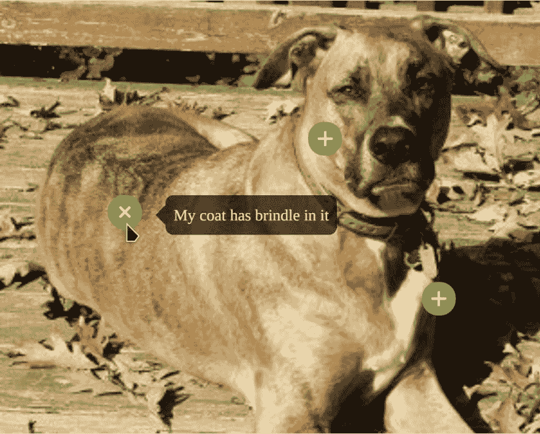

# CSS 响应热点

> 原文:[https://dev.to/jimfrenette/css-responsive-hotspots-1j25](https://dev.to/jimfrenette/css-responsive-hotspots-1j25)

此代码示例展示了如何完全用 CSS 和 HTML 为响应图像创建热点。当图像根据视窗宽度的变化而缩放时，热点及其各自的工具提示将相应地移动。

最初发表于[jimfrenette.com/css/responsive-hotspots](https://jimfrenette.com/css/responsive-hotspots/)

[](https://jimfrenette.com/code-editors/sandbox/responsive-hotspots/ "Demo and edit in our sandbox") 
[在我们的沙盒中演示和编辑](https://jimfrenette.com/code-editors/sandbox/responsive-hotspots/)

##### [](#html)HTML

```
<div class="hotspot-demo-1">
    <div class="hotspot-demo-1-left">
        
        <div class="spots">
            <div id="spot-01">
                <a class="spot">+</a>
                <blockquote>These are my dog tags
                    <span class="notch notch-right"></span>
                </blockquote>
            </div>
            <div id="spot-02">
                <a class="spot">+</a>
                <blockquote>I am loyal and love my humans 
                    <span class="notch notch-top"></span>
                </blockquote>
            </div>
            <div id="spot-03">
                <a class="spot">+</a>
                <blockquote>My coat has brindle in it
                    <span class="notch notch-left"></span>
                </blockquote>
            </div>
        </div>
    </div>
</div> 
```

##### [](#css)CSS

```
 blockquote {
    position: relative;
    display: none;
    border-radius: 8px;
    padding: 8px;
    text-align: center;
    line-height: 1.5em;
    color: #fff;
    background-color: rgba(0,0,0,0.7);
}
blockquote .notch {
    position: absolute;
    padding: 0;
    width: 0;
    height: 0;
}
blockquote .notch-top {
    top: -10px;
    left: 50%;
    margin-left: -10px;
    border-top: 0;
    border-right: 10px solid transparent;
    border-bottom: 10px solid rgba(0,0,0,0.7);
    border-left: 10px solid transparent;
}
blockquote .notch-right {
    top: 50%;
    right: -10px;
    margin-top: -10px;
    border-top: 10px solid transparent;
    border-right: 0;
    border-bottom: 10px solid transparent;
    border-left: 10px solid rgba(0,0,0,0.7);
}
blockquote .notch-bottom {
    bottom: -10px;
    left: 50%;
    margin-left: -10px;
    border-top: 10px solid rgba(0,0,0,0.7);
    border-right: 10px solid transparent;
    border-bottom: 0;
    border-left: 10px solid transparent;
}
blockquote .notch-left {
    top: 50%;
    left: -10px;
    margin-top: -10px;
    border-top: 10px solid transparent;
    border-right: 10px solid rgba(0,0,0,0.7);
    border-bottom: 10px solid transparent;
    border-left: 0;
}
img {
    display: block;
    width: 100%;
}
.hotspot-demo-1-left {
    position: relative;
    width: 50%;
}
.spots {
    position: absolute;
    left: 0;
    top: 0;
    width: 100%;
    height: 100%;
}
.spot {
    position: absolute;
    text-align: center;
    line-height: 32px;
    font-size: 32px;
    font-weight: bold;
    color: #fff;
    width: 32px;
    height: 32px;
    border: 1px solid #5FB404;
    border-radius: 16px;
    background-color: #5FB404;
}
.spot:hover {
    -webkit-transform: rotate(45deg);
    -moz-transform: rotate(45deg);
    -ms-transform: rotate(45deg);
    -o-transform: rotate(45deg);
    transform: rotate(45deg);
}
#spot-01, #spot-02, #spot-03 {
    display: inline-block;
    min-width: 250px;
}   
#spot-01 {
    position: absolute;
    top: 65%;
    left: 78%;
}
#spot-01:hover > blockquote {
    display: block;
    top: -16px;
    left: -91%
}
#spot-02 {
    position: absolute;
    top: 28%;
    left: 57%;
}
#spot-02:hover > blockquote {
    display: block;
    top: 36px;
    left: -43%;
}
#spot-03 {
    position: absolute;
    top: 45%;
    left: 20%;
}
#spot-03:hover > blockquote {
    display: block;
    top: -16px;
    left: 18px;
} 
```