# NoSQL 工作台-亚马逊 DynamoDB 排行榜

> 原文:[https://dev . to/t 04 glovern/no SQL-work bench-Amazon-dynamo db-leader board-26e 1](https://dev.to/t04glovern/nosql-workbench-amazon-dynamodb-leaderboard-26e1)

*这个帖子最初写于[devo pstar](https://devopstar.com/)T3。来看看[这里](https://devopstar.com/2019/09/22/nosql-workbench-amazon-dynamodb-leaderboard/)*

DynamoDB 是一个完全由 AWS 管理的 NoSQL 数据库，以简单易用而闻名。只要要解决的问题不需要复杂的模式，这种简单性对新手来说非常好。大多数人在设计多表系统时都会遇到问题。这通常是新手使用 DynamoDB 变得非常复杂的地方。

在本帖中，我们将讲述如何利用亚马逊的新 NoSQL 工作台工具来设计 DynamoDB 模式。

## [](#goal)目标

在这篇文章中，我们将在 DynamoDB 上建立一个游戏排行榜系统。这个问题看起来很简单，但是隐藏的复杂性很快就会显现出来。为此，我们将完成以下步骤。

*   下载和设置 NoSQL 工作台
*   设计一个 DynamoDB 表
*   使用 SQL 导入功能导入数据
*   创建全局二级索引以检索高分

## [](#nosql-workbench)NoSQL 工作台

[NoSQL 工作台可以从这里](https://docs.aws.amazon.com/amazondynamodb/latest/developerguide/workbench.settingup.html)下载，在苹果电脑&的两个窗口上都有。

**注意** : *不幸的是还没有 Linux 客户端*

一旦安装完毕，打开它，看看主界面

[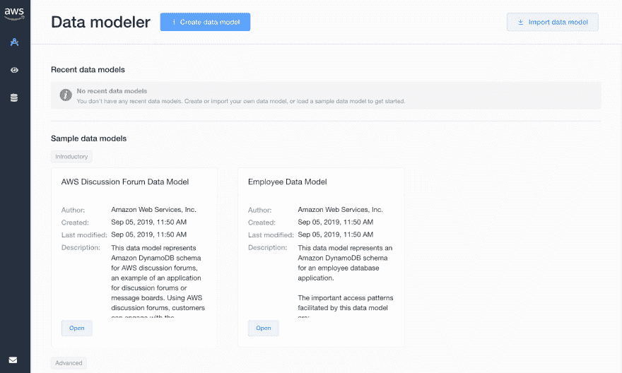T2】](https://res.cloudinary.com/practicaldev/image/fetch/s--kAPw5LIE--/c_limit%2Cf_auto%2Cfl_progressive%2Cq_auto%2Cw_880/https://raw.githubusercontent.com/t04glovern/aws-dynamodb-leaderboard/master/.blog/img/aws-nosql-workbench-01.png)

### [](#design-a-schema)设计一个模式

假设你是一家手机游戏初创公司，开发了一款非常成功的视频游戏，名为 **AppleKart** 。AppleKart 有多种游戏模式:

*   大价钱
*   计时赛
*   战役

每种模式都有一个全球记分牌形式的多人模式。我们希望保持我们正在处理的数据的简单，所以我们决定惟一键是用户标识符(UserID)。我们面临的问题是，需要为每个用户的每个游戏模式存储一个分数字段。

首先想到的可能是做下面看到的事情:

[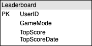T2】](https://res.cloudinary.com/practicaldev/image/fetch/s--TlXUGCF7--/c_limit%2Cf_auto%2Cfl_progressive%2Cq_auto%2Cw_880/https://raw.githubusercontent.com/t04glovern/aws-dynamodb-leaderboard/master/.blog/img/aws-leaderboard-schema-01.png)

这里的问题是，UserID 是我们得到的唯一键。为不同的游戏模式添加新条目时，先前的条目将被覆盖。传统上，我们可能会为每个游戏模式使用一个单独的桌子，但是在 NoSQL 我们没有这种奢侈。

相反，我们可以利用排序键；当与主键配对时，它使得条目是唯一的。

[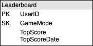T2】](https://res.cloudinary.com/practicaldev/image/fetch/s--Q0_1FaGv--/c_limit%2Cf_auto%2Cfl_progressive%2Cq_auto%2Cw_880/https://raw.githubusercontent.com/t04glovern/aws-dynamodb-leaderboard/master/.blog/img/aws-leaderboard-schema-02.png)

### [](#create-data-model)创建数据模型

记住前面的信息，让我们使用 NoSQL 工作台设计一个简单的模型。首先通过点击数据建模器顶部的按钮*来创建一个新的数据模型。*

[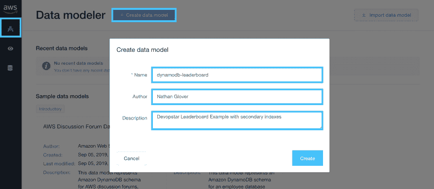T2】](https://res.cloudinary.com/practicaldev/image/fetch/s--usHvb_Y1--/c_limit%2Cf_auto%2Cfl_progressive%2Cq_auto%2Cw_880/https://raw.githubusercontent.com/t04glovern/aws-dynamodb-leaderboard/master/.blog/img/aws-leaderboard-schema-03.png)

接下来，我们可以定义我们的表属性:

*   **牌桌名称**:排行榜
*   **主键**:用户标识*{字符串}*
*   **排序键**:游戏模式*{字符串}*
*   **其他属性**:
    *   **TopScore***{数字}*
    *   ***【字符串】***

 **[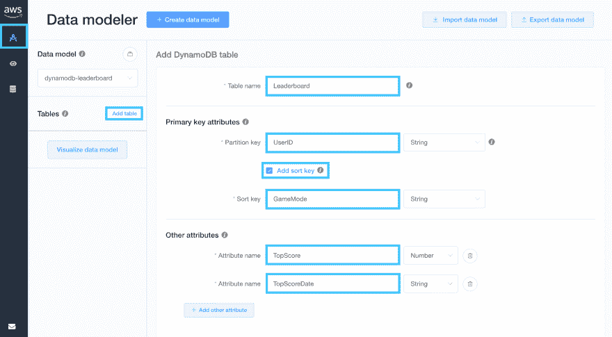T2】](https://res.cloudinary.com/practicaldev/image/fetch/s--DZO3Y-75--/c_limit%2Cf_auto%2Cfl_progressive%2Cq_auto%2Cw_880/https://raw.githubusercontent.com/t04glovern/aws-dynamodb-leaderboard/master/.blog/img/aws-leaderboard-schema-04.png)

根据上面的输入创建表格，我们将继续添加一些数据

### [](#importing-sample-data)导入样本数据

有了表模型设置，是时候导入一些数据来使用了。首先，导航到 NoSQL 工作台可视化工具并选择您的`Leaderboard`表

从手动导入数据开始，一想到必须手动添加这些数据，你很快就会厌倦。

[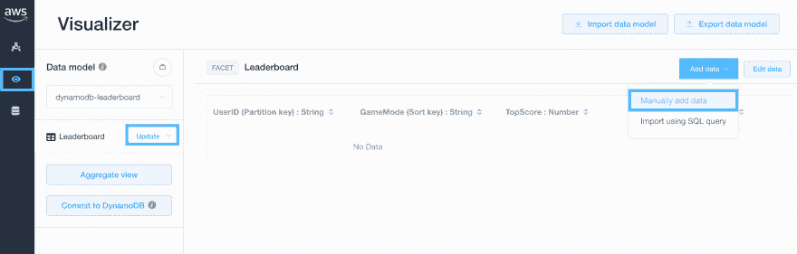T2】](https://res.cloudinary.com/practicaldev/image/fetch/s--lb2CsqIb--/c_limit%2Cf_auto%2Cfl_progressive%2Cq_auto%2Cw_880/https://raw.githubusercontent.com/t04glovern/aws-dynamodb-leaderboard/master/.blog/img/aws-nosql-data-import-01.png)

幸运的是，还有第二个选项可以使用 SQL 查询进行导入。我已经介绍了一种使用数据运行简单 SQL server 的 dockerized 方法。

**注意**:这一步需要 *Docker & docker-compose*

首先拉下这个库的副本，并切换到目录

```
git clone https://github.com/t04glovern/aws-dynamodb-leaderboard
cd aws-dynamodb-leaderboard 
```

然后使用`docker-compose up -d`调出 SQL 容器，接着使用`docker ps -a`查看状态。

```
docker-compose up -d
# Creating network "aws-dynamodb-leaderboard_default" with the default driver
# Pulling db (mysql:5.7)...
# 5.7: Pulling from library/mysql
# 8f91359f1fff: Pull complete
# 6bbb1c853362: Pull complete
# e6e554c0af6f: Pull complete
# f391c1a77330: Pull complete
# 414a8a88eabc: Pull complete
# fee78658f4dd: Pull complete
# 9568f6bff01b: Pull complete
# 76041efb6f83: Pull complete
# ea54dbd83183: Pull complete
# 566857d8f022: Pull complete
# 01c09495c6e7: Pull complete
# Digest: sha256:f7985e36c668bb862a0e506f4ef9acdd1254cdf690469816f99633898895f7fa
# Status: Downloaded newer image for mysql:5.7
# Creating aws-dynamodb-leaderboard_db_1 ... done

docker ps -a
# CONTAINER ID        IMAGE               COMMAND                  CREATED             STATUS              PORTS                               NAMES
# f3430e53ff51        mysql:5.7           "docker-entrypoint.s…"   18 seconds ago      Up 17 seconds       0.0.0.0:3306->3306/tcp, 33060/tcp   aws-dynamodb-leaderboard_db_1 
```

回到 NoSQL 工作台，现在打开从 SQL 数据库导入数据。

[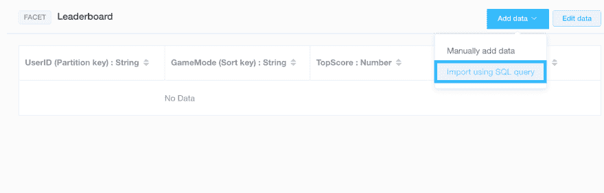T2】](https://res.cloudinary.com/practicaldev/image/fetch/s--j-NMv15n--/c_limit%2Cf_auto%2Cfl_progressive%2Cq_auto%2Cw_880/https://raw.githubusercontent.com/t04glovern/aws-dynamodb-leaderboard/master/.blog/img/aws-dynamodb-leaderboard-01.png)

为了导入数据，您需要定义一个要运行的语句。在我们的例子中，可以在下面找到

```
select UserID as UserID, GameMode as GameMode, TopScore, TopScoreDate from devopstar.LeaderboardItems; 
```

我已经包含了一个如何通过使用`as`操作符来重新映射键的例子。单击 Import 进入下一个模式，该模式将提示输入 SQL 连接详细信息

*   **数据库** : MySQL
*   **主机名**:本地主机
*   **用户名** : devopstar
*   **密码** : devopstar

[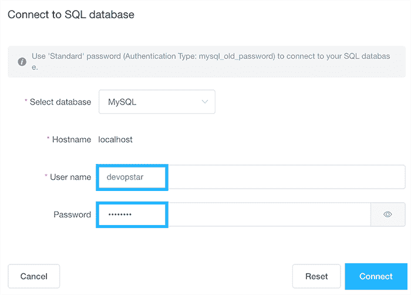T2】](https://res.cloudinary.com/practicaldev/image/fetch/s--a1OUjmLe--/c_limit%2Cf_auto%2Cfl_progressive%2Cq_auto%2Cw_880/https://raw.githubusercontent.com/t04glovern/aws-dynamodb-leaderboard/master/.blog/img/aws-dynamodb-leaderboard-02.png)

收到成功提示后，您可以再次点击`Import`查看查询结果

[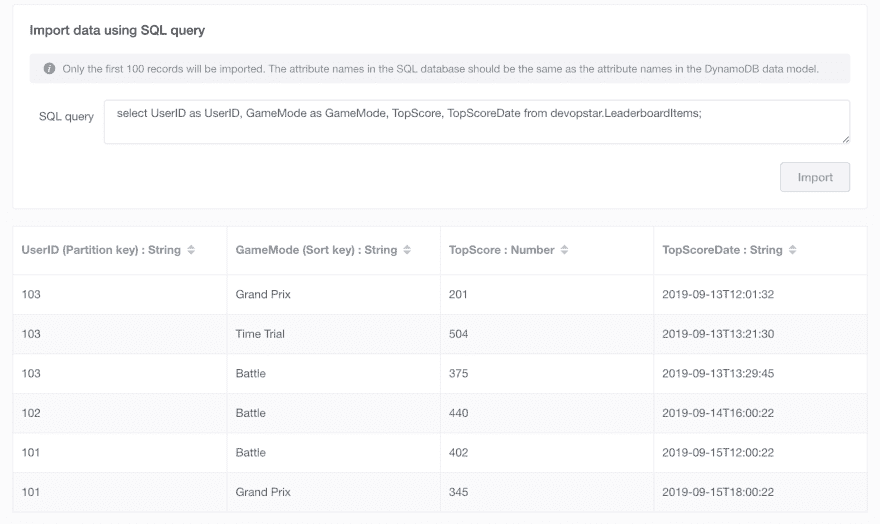T2】](https://res.cloudinary.com/practicaldev/image/fetch/s--lTYzyiG3--/c_limit%2Cf_auto%2Cfl_progressive%2Cq_auto%2Cw_880/https://raw.githubusercontent.com/t04glovern/aws-dynamodb-leaderboard/master/.blog/img/aws-dynamodb-leaderboard-03.png)

点击 Visualizer 选项卡上的`Update`然后点击`Aggregate view`，检查数据导入是否成功

[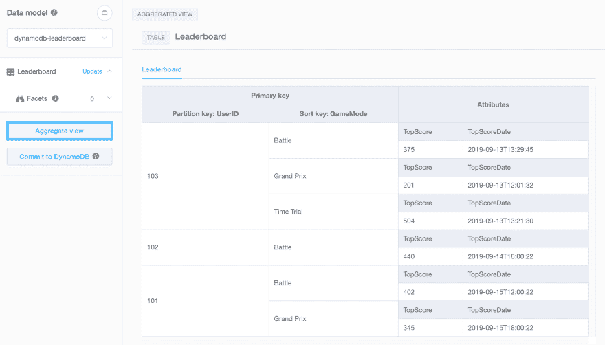T2】](https://res.cloudinary.com/practicaldev/image/fetch/s--sxUh5qPC--/c_limit%2Cf_auto%2Cfl_progressive%2Cq_auto%2Cw_880/https://raw.githubusercontent.com/t04glovern/aws-dynamodb-leaderboard/master/.blog/img/aws-nosql-data-import-02.png)

### [](#global-secondary-index)全球二级指数

虽然看起来令人印象深刻，但我们还没有解决任何重大问题。我们不可避免要面对的主要问题是**如何检索给定游戏模式的最高分数？**

这是人们可能会使用第二个表格进行排名的另一个例子。相反，我们可以利用全局二级索引(GSI)来创建访问数据的不同方式。下面是我们如何实现这一目标:

[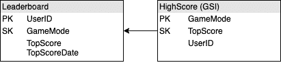T2】](https://res.cloudinary.com/practicaldev/image/fetch/s--KH3WwILs--/c_limit%2Cf_auto%2Cfl_progressive%2Cq_auto%2Cw_880/https://raw.githubusercontent.com/t04glovern/aws-dynamodb-leaderboard/master/.blog/img/aws-leaderboard-schema-05.png)

这个索引将允许我们为每个给定的游戏模式排序 TopScore 属性。让我们编辑现有的模型，以包含新的索引

[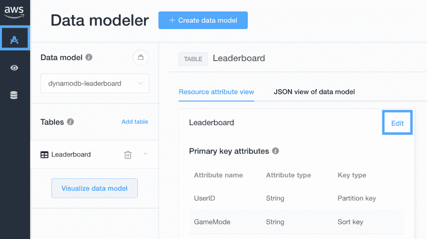T2】](https://res.cloudinary.com/practicaldev/image/fetch/s--NyEEM2oZ--/c_limit%2Cf_auto%2Cfl_progressive%2Cq_auto%2Cw_880/https://raw.githubusercontent.com/t04glovern/aws-dynamodb-leaderboard/master/.blog/img/aws-dynamodb-leaderboard-04.png)

创建一个新的 GSI，并按如下方式设置模式

[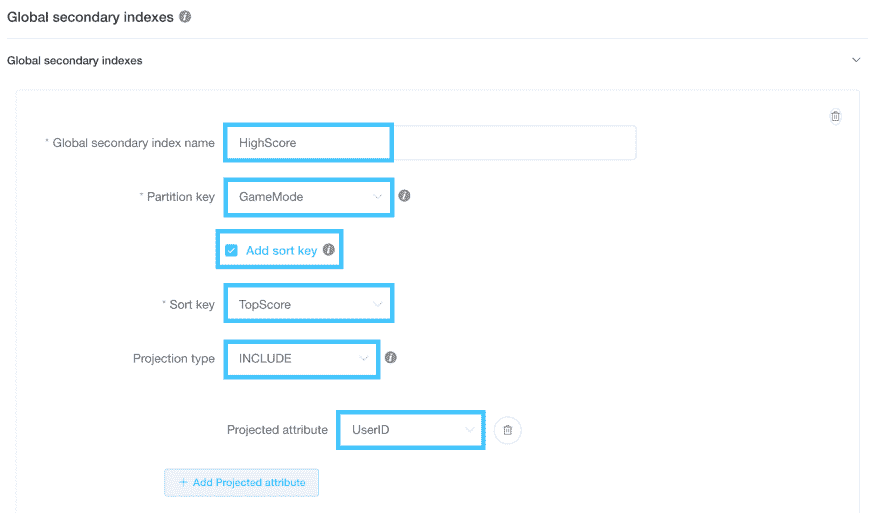T2】](https://res.cloudinary.com/practicaldev/image/fetch/s--fxgmhmOb--/c_limit%2Cf_auto%2Cfl_progressive%2Cq_auto%2Cw_880/https://raw.githubusercontent.com/t04glovern/aws-dynamodb-leaderboard/master/.blog/img/aws-dynamodb-leaderboard-05.png)

保存更改，如果您导航回可视化工具，您应该会看到 GSI 在运行

[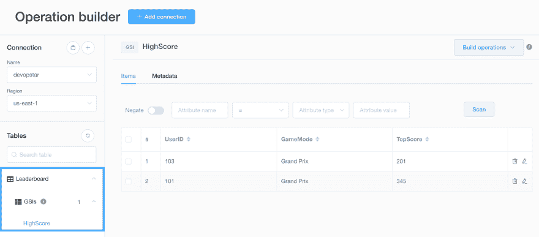T2】](https://res.cloudinary.com/practicaldev/image/fetch/s--ZAtq0VcJ--/c_limit%2Cf_auto%2Cfl_progressive%2Cq_auto%2Cw_880/https://raw.githubusercontent.com/t04glovern/aws-dynamodb-leaderboard/master/.blog/img/aws-dynamodb-leaderboard-06.png)

注意:在试图渲染这个 GSI 的时候，似乎出现了一个 NoSQL 工作台的错误。将来可能会修复它，但是现在您可以根据下面 DynamoDB 中提交的模式看到它的样子:

[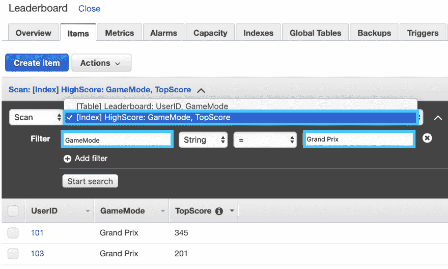T2】](https://res.cloudinary.com/practicaldev/image/fetch/s--0cL-IA2j--/c_limit%2Cf_auto%2Cfl_progressive%2Cq_auto%2Cw_880/https://raw.githubusercontent.com/t04glovern/aws-dynamodb-leaderboard/master/.blog/img/aws-dynamodb-leaderboard-07.png)

## [](#final-thoughts)最后的想法

您可以通过运行下面的
来清理 MySQL 的 docker 容器

```
docker-compose down -v 
```

NoSQL 工作台是初学者和专家的一个伟大的工具。它允许您以一种简单直观的方式构建模式设计的原型，同时承认数据可能还不是 NoSQL 格式，并提供工具来满足这种需求。**