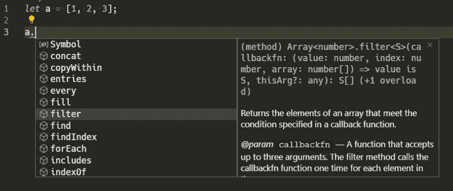
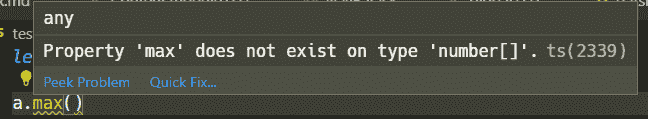
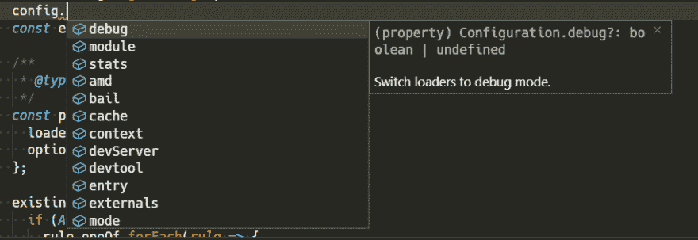

# 在不改变代码的情况下，开始对 JavaScript 进行类型检查

> 原文：<https://dev.to/anantoghosh/start-type-checking-your-javascript-without-changing-your-code-1h7k>

## 索引

> *   Introduction to
> *   [Enable type check](#enable-javascript-type-checking)
>     *   [Project-level type check](#type-checking-at-project-level)
>     *   [Check](#type-checking-at-per-file) by file type
> *   [Add type](#adding-types)
>     *   [Inference type](#inferring-types)
>     *   [Manually specify the variable type](#manually-specifying-types)

## 简介

现在这篇文章并不是要说服你开始检查 JavaScript 的类型。相反，如果您对类型检查感兴趣，但*还不想将代码转换成类型脚本*，本文将告诉您如何做。
这种方法的一个主要好处是你可以逐渐地为每个文件添加类型检查。

## 启用 JavaScript 类型检查

安装打字稿

`npm install -g typescript`

> *   Visual Studio code can be checked without installing typescript separately.
> *   On other editors, you may need to configure the Typescript language server to contain js files.
> *   Otherwise, use tsccli: `tsc filename.js --allowJs --checkJs --noEmit`.

### 项目级类型检查

*   在项目根目录下创建一个`jsconfig.json`文件:

```
{
  "compilerOptions": {
    "checkJs": true
  }
} 
```

<svg width="20px" height="20px" viewBox="0 0 24 24" class="highlight-action crayons-icon highlight-action--fullscreen-on"><title>Enter fullscreen mode</title></svg> <svg width="20px" height="20px" viewBox="0 0 24 24" class="highlight-action crayons-icon highlight-action--fullscreen-off"><title>Exit fullscreen mode</title></svg>

这也允许您指定其他选项

```
{
  "compilerOptions": {
    "checkJs": true,
    "noEmit": true, // Do not transpile (only type checking)
    "jsx": "react",
    "target": "es2016",
    "moduleResolution": "node",
    "lib": ["es2016", "dom"],
    "strict": true,
    "noImplicitAny": false,
    "baseUrl": "src"
  },
  "exclude": ["node_modules", "public"]
} 
```

<svg width="20px" height="20px" viewBox="0 0 24 24" class="highlight-action crayons-icon highlight-action--fullscreen-on"><title>Enter fullscreen mode</title></svg> <svg width="20px" height="20px" viewBox="0 0 24 24" class="highlight-action crayons-icon highlight-action--fullscreen-off"><title>Exit fullscreen mode</title></svg>

### 按文件进行类型检查

*   在您想要检查的文件上添加`// @ts-check`注释

## 添加类型

### 推断类型

只要有可能，Typescript 将自动推断变量的类型，并提供相关的自动完成和错误报告。

[](https://res.cloudinary.com/practicaldev/image/fetch/s--Xy-AGgbv--/c_limit%2Cf_auto%2Cfl_progressive%2Cq_auto%2Cw_880/https://thepracticaldev.s3.amazonaws.com/i/10r6bptnplc4rgfowkxl.png)

[](https://res.cloudinary.com/practicaldev/image/fetch/s--r6F7Hy7O--/c_limit%2Cf_auto%2Cfl_progressive%2Cq_auto%2Cw_880/https://thepracticaldev.s3.amazonaws.com/i/0fq6zlf7ofr8vmzb44f5.png)

### 手动指定类型

> 您可以使用 JSDOC 注释来指定类型

#### [变量上的](#on-variables)

```
/** @type {number | null} */
let a; // a will be assumed to be a number or null 
```

<svg width="20px" height="20px" viewBox="0 0 24 24" class="highlight-action crayons-icon highlight-action--fullscreen-on"><title>Enter fullscreen mode</title></svg> <svg width="20px" height="20px" viewBox="0 0 24 24" class="highlight-action crayons-icon highlight-action--fullscreen-off"><title>Exit fullscreen mode</title></svg>

```
/** @type {{ prop1: string, prop2: number[] }} */
let b; // Object b will have two properties prop1 which is a string and prop2 which would be a number array 
```

<svg width="20px" height="20px" viewBox="0 0 24 24" class="highlight-action crayons-icon highlight-action--fullscreen-on"><title>Enter fullscreen mode</title></svg> <svg width="20px" height="20px" viewBox="0 0 24 24" class="highlight-action crayons-icon highlight-action--fullscreen-off"><title>Exit fullscreen mode</title></svg>

#### 关于函数参数

```
/**
 * @param {Object} options - Object type
 * @param {string} options.prop1 - Property of Object options
 * @param {number} options.prop2 - Property of Object options
 * @param {string} arg1 - A string param.
 * @param {string} [arg2] - Optional param.
 * @param {string} [arg3="defaultValue"] - Optional param with default value
 * @return {string} return type
 */
function demo(options, arg1, arg2, arg3) {
  return arg1 + arg2 + arg3;
} 
```

<svg width="20px" height="20px" viewBox="0 0 24 24" class="highlight-action crayons-icon highlight-action--fullscreen-on"><title>Enter fullscreen mode</title></svg> <svg width="20px" height="20px" viewBox="0 0 24 24" class="highlight-action crayons-icon highlight-action--fullscreen-off"><title>Exit fullscreen mode</title></svg>

#### 定义自己的类型

```
/**
 * @typedef {Object} MyObject - Define Object type MyObject
 * @property {string} prop1 - Property of Object MyObject
 * @property {number} prop2 - Property of Object MyObject
 */
/** @type {MyObject} */
let MyObject; 
```

<svg width="20px" height="20px" viewBox="0 0 24 24" class="highlight-action crayons-icon highlight-action--fullscreen-on"><title>Enter fullscreen mode</title></svg> <svg width="20px" height="20px" viewBox="0 0 24 24" class="highlight-action crayons-icon highlight-action--fullscreen-off"><title>Exit fullscreen mode</title></svg>

#### 导入类型定义

> 这是最酷的部分。您可以从 d.ts 文件导入类型定义，并获取 npm 软件包的类型信息。

```
/**
 * @typedef {import('webpack').Configuration} WebpackConfig
 * @typedef {import('webpack').RuleSetRule} RuleSetRule
 * @typedef {import('webpack').RuleSetLoader} RuleSetLoader
 */

/**
 * @type {WebpackConfig}
 */
const config = getConfig(); // config has the structure of the Webpack config object! 
```

<svg width="20px" height="20px" viewBox="0 0 24 24" class="highlight-action crayons-icon highlight-action--fullscreen-on"><title>Enter fullscreen mode</title></svg> <svg width="20px" height="20px" viewBox="0 0 24 24" class="highlight-action crayons-icon highlight-action--fullscreen-off"><title>Exit fullscreen mode</title></svg>

##### 演示

`config`具有 webpack 配置对象属性的对象。

[](https://res.cloudinary.com/practicaldev/image/fetch/s--HT1okPHx--/c_limit%2Cf_auto%2Cfl_progressive%2Cq_auto%2Cw_880/https://thepracticaldev.s3.amazonaws.com/i/lo6hypnprzd03u148pc0.png)

### JSDOC 注释的完整列表

所有可用的注释和技巧都可以在这里阅读:

[https://www . typescriptlang . org/docs/handbook/type-checking-JavaScript-files . html](https://www.typescriptlang.org/docs/handbook/type-checking-javascript-files.html)

* * *

*[在 twitter 上关注我](https://twitter.com/anantoghosh)*
*我的网站: [mein.in](https://mein.in)*