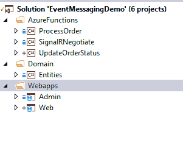

# Azure SignalR 函数-简介

> 原文:[https://dev . to/vinothrao/azure-signalr-functions-an-intro-2b 71](https://dev.to/vinothrao/azure-signalr-functions-an-intro-2b71)

通过 Azure functions SignalR 集成和 ServiceBus 将实时消息推送到 web 应用程序:

对于 signalR 来说，例子总是聊天应用。我想采取不同的路线，并提供如下实时场景的例子。

1.  当客户下订单时，管理员会收到通知
2.  当管理员接受/拒绝订单时，客户将收到通知。

随着实时协作的增加，我们经常处于这样一种情况，即在某个时间某个事件发生时向应用程序提供更新。为了从服务器向用户提供实时更新或推送内容，我们使用微软提供的 signalR 库。简而言之，当我们想把一些内容从服务器推送到客户端应用程序(例如:webapp)时，我们使用 signalR。让我用我创建的演示项目来解释一下，然后事情就清楚了。

使用了以下 Azure 服务:

1.  服务总线队列–分离管理员和客户端
2.  Azure 的 SignalR 功能——推送实时通知。
3.  Azure 功能服务总线绑定——处理消息。
4.  蓝色信号

以下是项目结构:

[T2】](https://res.cloudinary.com/practicaldev/image/fetch/s--TNDHSy3r--/c_limit%2Cf_auto%2Cfl_progressive%2Cq_auto%2Cw_880/https://thepracticaldev.s3.amazonaws.com/i/75mjumoxrzbxzsz2cvym.png)

Azure 函数:
处理订单-当客户下订单时，服务总线绑定处理传入的消息，并将消息“order Placed”传递给 signalR，后者将被推送到 admin webapp。

SignalRNegotiate :
这个协商函数是 Azure signalR 服务所必需的，在这个服务中，客户端进行握手并获取 signalR 的连接细节。这是信号发布者和订户两端之间的通信点。
UpdateOrderStatus :
当管理员接受/拒绝订单状态时，将调用此函数，并将相应的消息发送给信号员，然后推送给客户。
以上 3 个功能需要 Azure SignalR 连接字符串。Azure signalR 可以从 Azure 门户创建。

让我们深入研究一下这个应用程序。

在客户应用 HomeController - > Place Order 方法中，订单的细节被放入服务总线队列，这将触发 Azure 函数“ProcessOrder”。“process order”azure 函数将详细信息保存到数据库，并在 signalR 通知中心放置一条带有特定目标名称的消息，在我们的示例中是“productordered”。监听这个信号的人将被通知，数据将被共享。
使用(var CTX = new EventMessagingDemoContext())
{
CTX。Orders.Add(订单)；
ctx。save changes()；
}
信号消息。add async(
new signal rmessage
{
Target = " product ordered "，
Arguments = new[]{ order }
})；
}
在管理端，SignalR 服务通过 Javascript 连接。withURl()函数指定了“协商”Azure 函数。通过这种方式，它接收 SignalR 连接并等待“productordered”目标上的消息。一旦收到，警报将与消息一起显示。

var 连接=新信号 r。HubConnectionBuilder()
。with URL("[http://localhost:7074/API/"](http://localhost:7074/api/%22))
。配置日志(信号。
。build()；

```
 connection.start().then(function () {
        console.log("connected");
    });

    connection.on('productOrdered', function (order) {
        alert("order recieved for the product " + order.ProductName + ".Please refresh!");
    }); 
```

与通过 SignalR 向客户传达接受/拒绝信息的方式相同。

源代码可以在:
[https://github.com/vinothrao/EventMessagingDemo](https://github.com/vinothrao/EventMessagingDemo)找到

结论:
通过上面的例子，我们可以对 SignalR 的工作原理和用途有一个基本的概念和理解。