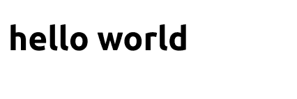
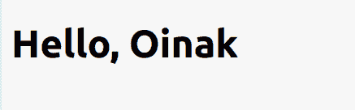
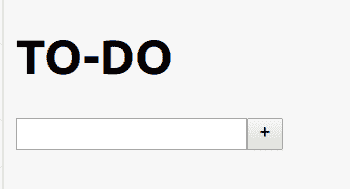
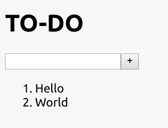
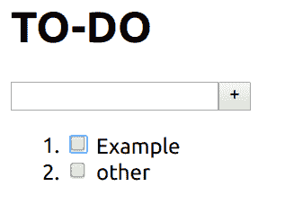
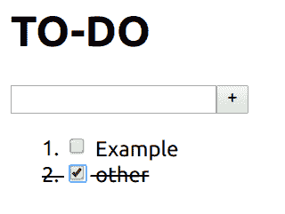
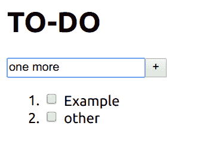
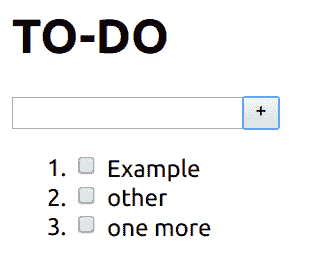
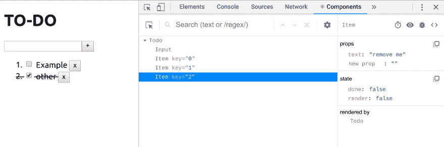
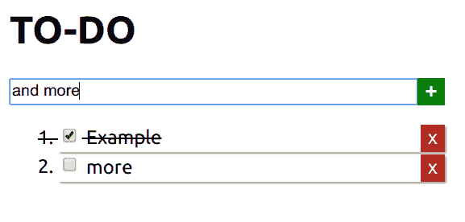

# 反应第一步

> 原文：<https://dev.to/oinak/react-first-steps-27ie>

他们开始在工作中使用 react，所以我把自己设置为最少的基于教程的实验(注意脚下！我一边学习*，一边*打帖子)。

你可以使用 [jsbin](http://jsbin.com) 或者 [repl-it](https://repl.it/) 来实现这个，但是我已经安装了 [yarn](https://yarnpkg.com/lang/en/) ，所以我从 repl.it 复制了配置示例:

# (纱线配置):

```
{
  "name": "runner",
  "version": "0.1.0",
  "private": true,
  "dependencies": {
    "react": "^16.9.0",
    "react-dom": "^16.9.0",
    "react-scripts": "2.1.5"
  },
  "scripts": {
    "start": "react-scripts start",
    "build": "react-scripts build",
    "test": "react-scripts test",
    "eject": "react-scripts eject"
  },
  "eslintConfig": {
    "extends": "react-app"
  },
  "browserslist": [
    ">0.2%",
    "not dead",
    "not ie <= 11",
    "not op_mini all"
  ]
} 
```

<svg width="20px" height="20px" viewBox="0 0 24 24" class="highlight-action crayons-icon highlight-action--fullscreen-on"><title>Enter fullscreen mode</title></svg> <svg width="20px" height="20px" viewBox="0 0 24 24" class="highlight-action crayons-icon highlight-action--fullscreen-off"><title>Exit fullscreen mode</title></svg>

这样你就可以用`yarn install`命令安装依赖项。

# 极简 app:

**Html:**
我只在一个基本的空 HTML5 文件中添加了`<div id="app"></div>`，因为 React 需要一个元素来渲染。

根据纱线惯例在`public/index.html`保存。

```
<!DOCTYPE html>
<html>
<head>
  <meta charset="utf-8">
  <meta name="viewport" content="width=device-width">
  <title>React 101</title>
</head>
<body>
  <div id="app"></div>
</body>
</html> 
```

<svg width="20px" height="20px" viewBox="0 0 24 24" class="highlight-action crayons-icon highlight-action--fullscreen-on"><title>Enter fullscreen mode</title></svg> <svg width="20px" height="20px" viewBox="0 0 24 24" class="highlight-action crayons-icon highlight-action--fullscreen-off"><title>Exit fullscreen mode</title></svg>

**Javascript:**

根据纱线惯例在`src/index.js`保存。

```
import React from 'react';
import ReactDOM from 'react-dom';

ReactDOM.render(
  <h1>hello world</h1>,
  document.getElementById('app')
) 
```

<svg width="20px" height="20px" viewBox="0 0 24 24" class="highlight-action crayons-icon highlight-action--fullscreen-on"><title>Enter fullscreen mode</title></svg> <svg width="20px" height="20px" viewBox="0 0 24 24" class="highlight-action crayons-icon highlight-action--fullscreen-off"><title>Exit fullscreen mode</title></svg>

用`yarn build`建造这个

这是必需的，因为我将使用 [JSX](https://jsx.github.io/) 来编写模板的等价反应。JSX 是一种语言，可以翻译成普通的 html，但允许变量插值和一些逻辑嵌入。

> 您可以使用 [React *而不使用* JSX](https://reactjs.org/docs/react-without-jsx.html) (使用`createElement`或`e`助手)，或者在没有构建步骤的情况下使用它(通过用巴别塔脚本编译)，但是使用它是最受欢迎的选项，而且如果您无论如何都要有一个构建步骤，那么使用它通常是微不足道的。我不推荐(我在 React 上没有足够的经验来给出明智的意见)，只是解释为什么我在这篇文章中使用它。

用`yarn start`在你的浏览器上测试它

它将默认在`localhost:3000`本地提供服务，但是 *Ruby on Rails* 也是如此，所以如果你在你的机器上同时使用它们，不要试图同时运行它们，或者改变其中任何一个的配置。

**输出:**
T3T5】

# 组件和道具

让我们添加 React 所谓的*组件*，即接口的一个独立部分，具有自己的标记、逻辑和状态。

```
// imports omitted from now on for brevity

function Hello(props) {
  return <h1>Hello, {props.name}</h1>; }

ReactDOM.render(
  <Hello name="Oinak" />,
  document.getElementById('app')
); 
```

<svg width="20px" height="20px" viewBox="0 0 24 24" class="highlight-action crayons-icon highlight-action--fullscreen-on"><title>Enter fullscreen mode</title></svg> <svg width="20px" height="20px" viewBox="0 0 24 24" class="highlight-action crayons-icon highlight-action--fullscreen-off"><title>Exit fullscreen mode</title></svg>

**输出:**

[](https://res.cloudinary.com/practicaldev/image/fetch/s--LU-1GLze--/c_limit%2Cf_auto%2Cfl_progressive%2Cq_auto%2Cw_880/https://thepracticaldev.s3.amazonaws.com/i/rs2ao86u9psphujoscse.png)

这里发生了很多事:

接收`props`并返回 JSX 的函数是最小的组件。
T1】

花括号允许在 JSX 内部插值；
`Hello {props.name}`变成了“你好 Oinak”

大写上的一个标签被一个同名的组件代替，它的属性变成道具:
`<Hello name="Oinak" />`调用`Hello({ name: 'Oinak'})`，被它的输出:`<h1> Hello, Oinak</h1>`代替。

功能组件是完整的 ES6 风格类的简写:

```
// function Hello(props) { return <h1>Hello, {props.name}</h1>;}
class Hello extends React.Component {
  render() {
    return <h1>Hello, {this.props.name}</h1>;
  }
} 
```

<svg width="20px" height="20px" viewBox="0 0 24 24" class="highlight-action crayons-icon highlight-action--fullscreen-on"><title>Enter fullscreen mode</title></svg> <svg width="20px" height="20px" viewBox="0 0 24 24" class="highlight-action crayons-icon highlight-action--fullscreen-off"><title>Exit fullscreen mode</title></svg>

它们的意思是一样的，但是如果你不需要对构造函数、状态等做任何事情，这个函数会更短...

因此，让我们建立一个实际上做一些事情的应用程序，我将在这里疯狂原创并建立一个待办事项列表，因为这是互联网历史上从来没有人用来学习 js 框架的东西。

因此，首先，我从前面的代码中获取并为输入创建一个组件:

```
class Input extends React.Component {
  render() {
    return (
      <div className="Input">
        <input type="text" />
        <input type="button" value="+" />
      </div>
    );
  }
}

ReactDOM.render(
  <div>
    <h1>TO-DO</h1>
    <Input />
  </div>,
  document.getElementById('app')
); 
```

<svg width="20px" height="20px" viewBox="0 0 24 24" class="highlight-action crayons-icon highlight-action--fullscreen-on"><title>Enter fullscreen mode</title></svg> <svg width="20px" height="20px" viewBox="0 0 24 24" class="highlight-action crayons-icon highlight-action--fullscreen-off"><title>Exit fullscreen mode</title></svg>

现在`Input`组件有了一个文本框和一个按钮，上面有一个加号。

这个想法是你在盒子上写下你的列表项文本，完成后点击“+”按钮。

这段代码对于输入 GUI 来说已经足够好了:

[](https://res.cloudinary.com/practicaldev/image/fetch/s--hjVWkRzt--/c_limit%2Cf_auto%2Cfl_progressive%2Cq_auto%2Cw_880/https://thepracticaldev.s3.amazonaws.com/i/si0eas8p7w4u3dow1w0e.png)

但是它什么也没做。

我还需要两样东西，存储新项目和显示它们的代码。让我们从后者开始:

我选择将列表表示为一个 html 有序列表，所以每一项都只是一个列表项`<li>Like this</li>`。有了那个想法，`Item`组件可以这样。

```
class Item  extends React.Component {
  render(){
    return <li>{this.props.text}</li>
  }
} 
```

<svg width="20px" height="20px" viewBox="0 0 24 24" class="highlight-action crayons-icon highlight-action--fullscreen-on"><title>Enter fullscreen mode</title></svg> <svg width="20px" height="20px" viewBox="0 0 24 24" class="highlight-action crayons-icon highlight-action--fullscreen-off"><title>Exit fullscreen mode</title></svg>

这段代码假设您像这样调用它:`<Item text="Hello">`，以便默认的 React 构造函数将一个`text`属性保存到`props`中。

现在，我将主调用改为`ReactDOM.render`以使用项目组件:

```
ReactDOM.render(
  <div>
    <h1>TO-DO</h1>
    <Input />
    <ol>
      <Item text="Hello" />
      <Item text="World" />
    </ol>
  </div>,
  document.getElementById('app')
); 
```

<svg width="20px" height="20px" viewBox="0 0 24 24" class="highlight-action crayons-icon highlight-action--fullscreen-on"><title>Enter fullscreen mode</title></svg> <svg width="20px" height="20px" viewBox="0 0 24 24" class="highlight-action crayons-icon highlight-action--fullscreen-off"><title>Exit fullscreen mode</title></svg>

然后你得到这个:
[](https://res.cloudinary.com/practicaldev/image/fetch/s--cX79HdUv--/c_limit%2Cf_auto%2Cfl_progressive%2Cq_auto%2Cw_880/https://thepracticaldev.s3.amazonaws.com/i/wz3ovpd3st8rmb979j86.png)

我们有一个*模型*！

对于接下来的步骤，我们需要一些新概念:

## 事件处理

**状态** :
我们通过`this.state = ...`在构造函数中设置初始状态，但是当组件的渲染依赖于它们的状态时，我们需要*告诉* _ React 我们需要一个新的渲染，这就是`setState`方法的作用，它更新状态并触发新的渲染。有两个版本:

```
this.setState({ key: value }); 
```

<svg width="20px" height="20px" viewBox="0 0 24 24" class="highlight-action crayons-icon highlight-action--fullscreen-on"><title>Enter fullscreen mode</title></svg> <svg width="20px" height="20px" viewBox="0 0 24 24" class="highlight-action crayons-icon highlight-action--fullscreen-off"><title>Exit fullscreen mode</title></svg>

并且，如果当前状态依赖于先前状态或道具:

```
this.setState(function(state,props){
  return {
    // something based on previous state or props
  };
}) 
```

<svg width="20px" height="20px" viewBox="0 0 24 24" class="highlight-action crayons-icon highlight-action--fullscreen-on"><title>Enter fullscreen mode</title></svg> <svg width="20px" height="20px" viewBox="0 0 24 24" class="highlight-action crayons-icon highlight-action--fullscreen-off"><title>Exit fullscreen mode</title></svg>

我们还需要函数绑定，将事件处理程序的`this`绑定到组件。

```
class Item  extends React.Component {
  constructor(props){
    super(props);
    this.state = { done: false };
    this.toggleDone = this.toggleDone.bind(this); // bind this
  }

  toggleDone() {
    // this is the component because of the binding
    this.setState({done: !this.state.done, render: true});
  }

  render() {
    // change style depending on state:
    const elementStyle = (this.state.done ? {textDecoration: 'line-through'} : {});
    return (
      <li style={elementStyle}>
       <input type='checkbox' value={this.state.done} onClick={this.toggleDone} />
       <span> {this.props.text} </span>
      </li>
    );
  }
} 
```

<svg width="20px" height="20px" viewBox="0 0 24 24" class="highlight-action crayons-icon highlight-action--fullscreen-on"><title>Enter fullscreen mode</title></svg> <svg width="20px" height="20px" viewBox="0 0 24 24" class="highlight-action crayons-icon highlight-action--fullscreen-off"><title>Exit fullscreen mode</title></svg>

这样，我们能够改变`Item`组件的状态，React 将自动改变它们的渲染。

**之前点击:**

[](https://res.cloudinary.com/practicaldev/image/fetch/s--YFONa6-2--/c_limit%2Cf_auto%2Cfl_progressive%2Cq_auto%2Cw_880/https://thepracticaldev.s3.amazonaws.com/i/c5es2unjph9eefmfocjl.png)

**点击后:**

[](https://res.cloudinary.com/practicaldev/image/fetch/s--Zu6Qdvvj--/c_limit%2Cf_auto%2Cfl_progressive%2Cq_auto%2Cw_880/https://thepracticaldev.s3.amazonaws.com/i/n4id51gjuitil9n8iov2.png)

内联样式不会让你的设计伙伴高兴，但是我们稍后会谈到这个问题。

## 处理组件外的事件

现在我们有一个问题，添加元素的界面在`Input`组件中，但是受此事件影响的**状态**必须在外部，因为它会影响所有的*应用*，并将由`Item`呈现

这是我们新的`Input` :

```
class Input extends React.Component {
  constructor(props) {
    super(props);
    this.state = {text: ''};                  // initially empty
    this.onChange = this.onChange.bind(this); // store input text on state
    this.addItem = this.addItem.bind(this);   // handle '+' button
  }

  addItem() {
    this.props.onAddItem(this.state.text); // call external handler
    this.setState({text: ''});             // empty the field
  }

  onChange(e){ this.setState({text: e.target.value}); }

  render() {
    return (
      <div className="Input">
        <input type="text" onChange={this.onChange} value={this.state.text}/>
        <input type="button" value="+" onClick={this.addItem}/>
      </div>
    );
  }
} 
```

<svg width="20px" height="20px" viewBox="0 0 24 24" class="highlight-action crayons-icon highlight-action--fullscreen-on"><title>Enter fullscreen mode</title></svg> <svg width="20px" height="20px" viewBox="0 0 24 24" class="highlight-action crayons-icon highlight-action--fullscreen-off"><title>Exit fullscreen mode</title></svg>

这里处理两个事件:

### 输入

文本输入`change`调用 onChange，类似于上一节中的`toggleDone`，但是在本例中，我将来自输入的当前文本存储在组件的 state 属性:`text`中。

### 添加项目

当您单击加号按钮时，我们从状态中读取当前文本并调用`this.props.onAddItem`，而`props`意味着这是从外部传递的事件处理程序。之后，我们清除文本字段，为新项目做准备。

我们现在还不能测试这一点，因为我们需要相应的外部变化:

## 待办事宜组件

我们需要一个放置应用程序状态的地方，以及监听输入但在其他地方执行的事件处理程序:

```
class Todo extends React.Component{
  constructor(props){
    super(props);
    // initial state to verify rendering even before adding items
    this.state = { items: ["Example", "other"] };

    // bind the event listener, just like before
    this.addItem = this.addItem.bind(this);
  }

  addItem(value){
    // add the new item to the items list
    this.setState( { items: this.state.items.concat(value) } );
  }

  render(){
    // there is no `for` on JSX, this is how you do lists:
    const listItems = this.state.items.map((i,n) =>
      <Item key={n.toString()} text={i} />
    );

    return (
      <div>
        <h1>TO-DO</h1>
        <Input onAddItem={this.addItem}/>
        <ol>
          {listItems}
        </ol>
      </div>
    );
  }
} 
```

<svg width="20px" height="20px" viewBox="0 0 24 24" class="highlight-action crayons-icon highlight-action--fullscreen-on"><title>Enter fullscreen mode</title></svg> <svg width="20px" height="20px" viewBox="0 0 24 24" class="highlight-action crayons-icon highlight-action--fullscreen-off"><title>Exit fullscreen mode</title></svg>

注意`Todo`渲染上的`<Input onAddItem={this.addItem}/>`部分。它是连接`Todo`的`addItem`和`Input`的`onAddItem`的纽带。我故意用了不同的名字，这样就不会那么混乱了。

当你点击`Input`上的“+”按钮时，它读取自己的`state.text`并调用`Todo`的`addItem`，后者将该文本视为`value`，并将其添加到`this.state.items`列表中。通过用`setState`做这件事，我们告诉 React】需要一个新的渲染。

新的渲染基于`this.state.items`计算`listItems`，并为它们中的每一个渲染一个`Item`组件。

要使用它，您需要将对`ReactDOM.render`的调用更改为:

```
ReactDOM.render(
  <Todo />,
  document.getElementById('app')
); 
```

<svg width="20px" height="20px" viewBox="0 0 24 24" class="highlight-action crayons-icon highlight-action--fullscreen-on"><title>Enter fullscreen mode</title></svg> <svg width="20px" height="20px" viewBox="0 0 24 24" class="highlight-action crayons-icon highlight-action--fullscreen-off"><title>Exit fullscreen mode</title></svg>

**前点击:**
[](https://res.cloudinary.com/practicaldev/image/fetch/s--HeaOTixP--/c_limit%2Cf_auto%2Cfl_progressive%2Cq_auto%2Cw_880/https://thepracticaldev.s3.amazonaws.com/i/v4a59q2e87qsdhuz2qub.png)

**后点击:**
[](https://res.cloudinary.com/practicaldev/image/fetch/s--rmY0prNw--/c_limit%2Cf_auto%2Cfl_progressive%2Cq_auto%2Cw_880/https://thepracticaldev.s3.amazonaws.com/i/p8yg08kb6batds8vo7op.png)

## 额外学分

现在，我们可以添加项目并检查它们，这样我们就基本完成了，但我想更进一步，所以我将添加一些改进:

### 删除元素:

```
class Item  extends React.Component {
  constructor(props){
    super(props);
    this.state = { done: false, render: true };   // store render flag
    this.toggleDone = this.toggleDone.bind(this);
    this.destroy = this.destroy.bind(this);       // new event handler
  }

  toggleDone() {
    this.setState({done: !this.state.done, render: true});
  }

  destroy(){ // set render flag to false
    this.setState({done: this.state.done, render: false});
  }

  render() {
    // returning null removes the element from DOM (but not memory!)
    if (this.state.render === false) { return null; }
    const elementStyle = (this.state.done ? {textDecoration: 'line-through'} : {});
    return (
      <li style={elementStyle}>
       <input type='checkbox' value={this.state.done} onClick={this.toggleDone} />
       <span> {this.props.text} </span>
       <input type="button" onClick={this.destroy} className='remove' value='x'/>
      </li>
    );
  }
} 
```

<svg width="20px" height="20px" viewBox="0 0 24 24" class="highlight-action crayons-icon highlight-action--fullscreen-on"><title>Enter fullscreen mode</title></svg> <svg width="20px" height="20px" viewBox="0 0 24 24" class="highlight-action crayons-icon highlight-action--fullscreen-off"><title>Exit fullscreen mode</title></svg>

我向项目添加了一个新的按钮类型输入，并将其 click 事件链接到 destroy 处理程序。该函数只是将新的`render`状态属性设置为 false，但是如果该属性为 false，我们的新呈现策略将返回 *null* 。当组件从 render 函数返回 null 时，React 会将其从 DOM 中移除。

它不会从内存中移除，如果您使用开发人员工具检查 Todo 的状态，它仍然在那里。就性能而言，这可能是不好的，但对于“撤销删除”功能的实现来说却是好的。你是法官。

[](https://res.cloudinary.com/practicaldev/image/fetch/s--ECo-CviM--/c_limit%2Cf_auto%2Cfl_progressive%2Cq_auto%2Cw_880/https://thepracticaldev.s3.amazonaws.com/i/0fd4r8j4ic1bc5emfcf7.png)

### 样式

到目前为止，您看到的不仅仅是原始的 html 元素。然而，React 允许应用每个组件的样式。方法是创建一个 src/Foo.css 文件，并将`import './Foo.css';`添加到您的应用程序或组件文件中。

如果你想知道如何去这，我留下下面的文件:
[](https://res.cloudinary.com/practicaldev/image/fetch/s--zvM78aN8--/c_limit%2Cf_auto%2Cfl_progressive%2Cq_auto%2Cw_880/https://thepracticaldev.s3.amazonaws.com/i/knknye5l1196r6gaxq76.png)

**`src/index.js`**T3】

```
//jshint esnext:true

import React from 'react';
import ReactDOM from 'react-dom';
import './Input.css';
import './Item.css';

class Input extends React.Component {
  constructor(props) {
    super(props);
    this.state = {text: ''}
    this.onChange = this.onChange.bind(this);
    this.addItem = this.addItem.bind(this);
  }

  addItem() {
    this.props.onAddItem(this.state.text);
    this.setState({text: ''});
  }

  onChange(e){
    this.setState({text: e.target.value});
  }

  render() {
    return (
      <div className="Input">
        <input type="text" onChange={this.onChange} value={this.state.text}/>
        <input type="button" value="+" onClick={this.addItem}/>
      </div>
    );
  }
}

class Item  extends React.Component {
  constructor(props){
    super(props);
    this.state = { done: false, render: true };
    this.toggleDone = this.toggleDone.bind(this);
    this.destroy = this.destroy.bind(this);
  }

  toggleDone() {
    this.setState({done: !this.state.done, render: true});
  }

  destroy(){
    this.setState({done: this.state.done, render: false});
  }

  render() {
    // returning null removes the element from DOM (but not memory!)
    if (this.state.render === false) { return null; }
    const elementStyle = (this.state.done ? {textDecoration: 'line-through'} : {});
    return (
      <li style={elementStyle}>
       <input type='checkbox' value={this.state.done} onClick={this.toggleDone} />
       <span> {this.props.text} </span>
       <input type="button" onClick={this.destroy} className='remove' value='x'/>
      </li>
    );
  }
}

class Todo extends React.Component{
  constructor(props){
    super(props);
    this.state = { items: ["Example", "other"] };
    this.addItem = this.addItem.bind(this);
  }

  addItem(value){
    this.setState( { items: this.state.items.concat(value) } );
  }

  render(){
    console.log(`render items: ${this.state.items}`)
    const listItems = this.state.items.map((i,n) => <Item key={n.toString()} text={i} />)
    return (
      <div>
        <h1>TO-DO</h1>
        <Input onAddItem={this.addItem}/>
        <ol>
          {listItems}
        </ol>
      </div>
    );
  }
}

ReactDOM.render(
  <Todo />,
  document.getElementById('app')
); 
```

<svg width="20px" height="20px" viewBox="0 0 24 24" class="highlight-action crayons-icon highlight-action--fullscreen-on"><title>Enter fullscreen mode</title></svg> <svg width="20px" height="20px" viewBox="0 0 24 24" class="highlight-action crayons-icon highlight-action--fullscreen-off"><title>Exit fullscreen mode</title></svg>

**`src/Input.css`**T3】

```
.Input input[type=text]{
  width: 25em;
}
.Input input[type=button]{
  background-color: green;
  color: white;
  font-weight: bold;
  border: none;
  font-size: 18px;
  vertical-align: top;
} 
```

<svg width="20px" height="20px" viewBox="0 0 24 24" class="highlight-action crayons-icon highlight-action--fullscreen-on"><title>Enter fullscreen mode</title></svg> <svg width="20px" height="20px" viewBox="0 0 24 24" class="highlight-action crayons-icon highlight-action--fullscreen-off"><title>Exit fullscreen mode</title></svg>

**`src/Item.css`**T3】

```
li {
 width: 20em;
 height: 1.4em;
 box-shadow: 1px 1px 2px rgba(0,0,0,0.5);
 margin: 2px 0px;
}

li > input[type=button].remove {
  float: right;
  background-color: firebrick;
  color: white;
  border: none;
  padding: 2px 6px;
  text-align: center;
  text-decoration: none;
  display: inline-block;
  font-size: 16px;
}

li.done {
  text-decoration: line-through;
  color: grey;
}

li.pending {
  color: blue;
} 
```

<svg width="20px" height="20px" viewBox="0 0 24 24" class="highlight-action crayons-icon highlight-action--fullscreen-on"><title>Enter fullscreen mode</title></svg> <svg width="20px" height="20px" viewBox="0 0 24 24" class="highlight-action crayons-icon highlight-action--fullscreen-off"><title>Exit fullscreen mode</title></svg>

## 免责声明

*   这是我的第一个 React 应用，它很可能是错误的
*   React 建议每个组件一个 js 和一个 css 文件，为了简洁起见，我没有遵循这个约定
*   你可以使用更多的 ES6 特性，或者根本不用，这不是框架强加的。

你怎么想呢?

对你有用吗？

你有什么建议让我改进吗？