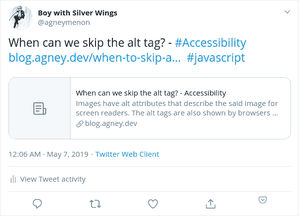
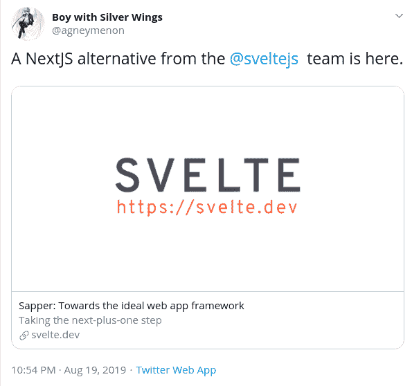
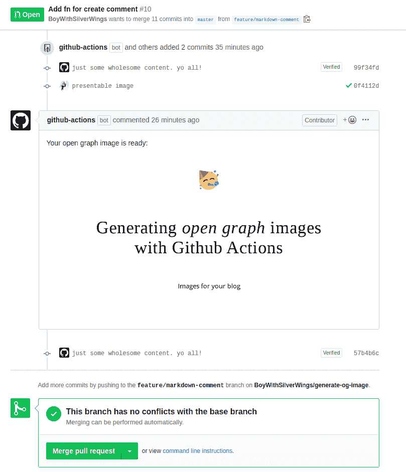

# 使用 Github 操作打开图形图像

> 原文：<https://dev.to/boywithsilverwings/open-graph-images-with-github-actions-32cj>

开放图表图像是那些当你分享 URL 时显示在你的社交媒体卡上的图像。

下面是如何添加一个:

```
<meta property="og:image" content="http://ia.media-imdb.cimg/rock.jpg" /> 
```

简单吧？

为了比较，这里有两条推特:

[](https://res.cloudinary.com/practicaldev/image/fetch/s--r4sdKILL--/c_limit%2Cf_auto%2Cfl_progressive%2Cq_auto%2Cw_880/https://thepracticaldev.s3.amazonaws.com/i/g7u4xgj2icglopd69ttw.png)

我想我们都同意这很乏味。

现在我们来看另一个，但现在是打开的图形图像:

[](https://res.cloudinary.com/practicaldev/image/fetch/s--KpyLEajz--/c_limit%2Cf_auto%2Cfl_progressive%2Cq_auto%2Cw_880/https://thepracticaldev.s3.amazonaws.com/i/glb79ybx4zbkaptb9ghk.png)

好多了。

但是转到 photoshop 来创建这个图像是相当困难的，反正它基本上是通用的。

# Github 行动救援

[从市场安装](https://github.com/marketplace/actions/generate-og-image)

[Generate OG Image](https://github.com/marketplace/actions/generate-og-image) 是一个可定制的开放图形图像生成器，运行在 Github Actions 上，这意味着它对公共存储库是免费的。

您可以通过向您的`action.yml` :
添加以下行来将其添加到您现有的工作流中

```
name: 'Generate  OG  Images'
on: pull_request

jobs:
  generate_og_job:
    runs-on: ubuntu-latest
    name: Generate OG Images
    steps:
      - name: Checkout
        uses: actions/checkout@v1
      - name: Generate Image
        uses: BoyWithSilverWings/generate-og-image@1.0.3
        env:
          GITHUB_TOKEN: ${{ secrets.GITHUB_TOKEN }}
          GITHUB_CONTEXT: ${{ toJson(github) }}
        with:
          path: static/post-images/ 
```

此处需要注意的步骤:

1.  它需要`GITHUB_TOKEN`来访问降价文件并提交生成的图像。
2.  `GITHUB_CONTEXT`给出更多信息拉取请求。
3.  `actions/checkout@v1`允许访问动作里面的文件。
4.  `path`指需要的路径。

下次当您使用带有`ogImage`属性的 markdown 文件向 repo 发送 PR 时，它会创建打开的图形图像并将其插入代码库。

[](https://res.cloudinary.com/practicaldev/image/fetch/s--kzF0qO1---/c_limit%2Cf_auto%2Cfl_progressive%2Cq_auto%2Cw_880/https://thepracticaldev.s3.amazonaws.com/i/dzbepn1he7qoy1qw5iqp.png)

有关更多属性、定制和使用案例，请阅读[自述文件](https://github.com/marketplace/actions/generate-og-image)

# 它是如何工作的？

1.  操纵木偶的人

    它使用 Github Actions docker 上的一个 puppeteer 实例在 web 浏览器上截屏当前输出。HTML 由输入变量生成。

2.  Web 组件

    HTML 的样式由 web 组件控制。它使用用 lit 元素创建的这个 web 组件作为默认组件。但是你可以用任何东西代替。
    这使得在使用动作时，你的图像风格可以保持高度个性化。

如果你试用了，请告诉我。