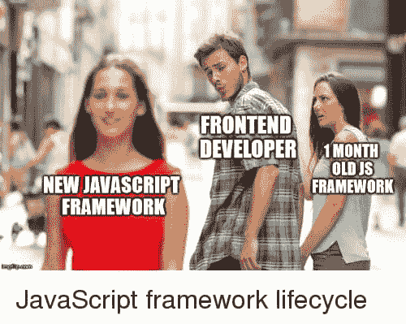
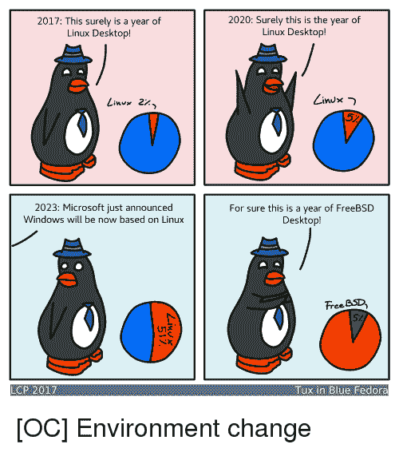

# 抛弃 ReactJS 或 Angular 并使用更好的 web 标准(如 web 组件)是⌚time 的做法😍第一部分

> 原文:[https://dev . to/lampewebdev/it-is-time-to-dition-react js-or-angular-and-use-better-web-standards-like-web-components-part-1-3mba](https://dev.to/lampewebdev/it-is-time-to-ditch-reactjs-or-angular-and-use-better-web-standards-like-web-components-part-1-3mba)

到 2019 年，我们都同意组件是构建快速、优雅和可维护的 UI 的方式。问题是，每个框架，像 ReactJs、Angular(JS)、VueJs 或其他一些较小的 UI 框架，都使用自己的模式和解决方案来解决常见问题。这些框架提高了可重用性，并且易于使用。此外，我经常听到的一点是，他们大多是由大公司支持的，如谷歌或脸书。让我们讨论一下这是否是真的，社区是否可以做得更好，是否有更好的选择。

Web 开发处于一个独特的位置。网站、Web 应用程序、PWA 或任何你想称之为它们的东西都在浏览器中运行，最终，它们都是 HTML、CSS 和 Javascript(也许还有 Web 汇编)。目标应该是尽可能熟练地使用这些工具。我的意思不是在没有任何类型的库或框架的情况下使用它们。你应该使用它们，但是如果我们有太多的选择怎么办？过度选择会发生！你瘫痪了，因为你有太多的选择。不是快，而是慢，因为不知道配什么前端 UI 库。

[T2】](https://res.cloudinary.com/practicaldev/image/fetch/s--gJHYh967--/c_limit%2Cf_auto%2Cfl_progressive%2Cq_auto%2Cw_880/https://thepracticaldev.s3.amazonaws.com/i/i380o932dazhoyeazca0.png)

好的，你现在想:“我每次都会用 reactjs。”。这可能是一种解决方案。它可能是一个完美的解决方案，但仍然有缺陷，其他 UI 框架仍然存在。这意味着我们不是作为一个社区一起工作，而是将自己分割成这些小社区。当你看到这些工具中的大多数都缺少我们日常使用的功能时，情况会变得更糟。ReactJS 中的路由一点也不好玩。表单验证也不好玩，没人想做。因此，人们需要为这些 UI 框架再次创建库，大多数情况下需要 2 或 3 个库来做这些事情。我们不仅把我们的努力分成了这些组的 UI 框架，而且我们还削减了我们的努力，重新发明轮子。想想我们作为一个社区在这里浪费了多少工作时间？

我能看出人们现在的想法，但这是一件好事！真的吗？请谷歌:“Linux 桌面之年。”。桌面 Linux 也有同样的问题。侏儒，KDE，XFCE，肉桂，伴侣，LXDE，和男人更多。他们都试图解决一件事:让 Linux 在桌面上变得更好。他们成功了吗？你可以在下面的评论中告诉我。

[T2】](https://res.cloudinary.com/practicaldev/image/fetch/s--s1f3MA-8--/c_limit%2Cf_auto%2Cfl_progressive%2Cq_auto%2Cw_880/https://thepracticaldev.s3.amazonaws.com/i/5wpn61wmyjx8t9dw8eh2.png)

下一点是可重用性。有人记得从 Angular 1 跳到 Angular 2 吗？是的，就像一个完全不同的框架。现在我们有了棱角，一点也不困惑。你现在想，“但是等等！Reactjs 没有突破性的变化”。你是对的；他们没有像 react v1 和 react v2 这样的隐式更改！我谅你也不敢尝试在不使用钩子的地方发布 react 代码！一半的评论会是关于“你为什么不用钩子？？?"。当您必须将 react 代码从基于类的组件重写为基于函数的组件时，也会发生同样的情况。现在我问你一个问题，你必须对自己诚实，摘掉“我是一名开发人员，想使用新的花哨狗屎”的帽子，戴上“我想解决真正的问题，给人们真正需要的解决方案。”。这些改变真的给你的客户带来了任何价值吗？给你的用户？对你的生意？你的代码现在读起来真的更舒服了吗？如果你真的对自己诚实，那么你可能仍然喜欢基于类的组件。我想我们现在可以说，也许我们被营销欺骗了？

等等，什么？营销与此有什么关系？看到的人往往会忘记。谁创造了 ReactJS？脸书，谁创造了安古拉杰？谷歌。这些公司以什么闻名？如果你现在说社交网络和互联网搜索，那么你又戴错了帽子！他们以广告和营销著称！如果你想知道一家公司真正在做什么，不是看他们的产品，而是看他们如何赚钱。

“它背靠大公司，所以它必须是好的”的尾巴。。我经常听到这种说法，而这个人甚至没有思考超过 1 秒钟。这句话承诺，只是因为你在用的框架背后有一个很有钱的公司，一天都不会走掉。谷歌以扼杀项目闻名。甚至有这样一个网站:[https://killedbygoogle.com/](https://killedbygoogle.com/)。还是，要用有角的？好吧，但是脸书呢？脸书在许多项目中使用 reactjs。他们也一直在寻找新的工程师，如果加入你团队的人已经知道你正在使用的框架库，这不是很有效率吗？这是你必须自己决定的事情。

我希望你现在能看到我们现在在 web 开发社区中遇到的一些问题。

我们如何解决这个问题？我个人认为我们已经有了解决所有这些问题的正确方法。标准！对，正确的标准！W3C 是一个优秀的联盟，社区中应该有更多的人参与进来。但这是另一篇博文的主题。

为什么标准能帮助我们解决所有问题？当一项技术成为标准时，所有主流浏览器都已经实现并准备使用它。因此，这意味着作为一名开发人员，我不需要额外的库，也不需要考虑不同浏览器中的边缘情况。如果有错误或问题，那么它有责任为所有用户修复这个错误。所以修复它是在一只手里，而不是在成千上万的开发者手里。这也有助于社区的分裂。如果您可以编写一个组件并在 VueJS、Angular 和 ReactJS 中使用它，会怎么样？那不是很棒吗？所以更多开发人员可以在一个日历组件上工作，并使它成为一个优秀的组件，而不是拥有 20 个半烤日历组件？如果没有一家大公司的支持，这一切会怎样？相反，我们作为一个社区和所有浏览器供应商？

如果这一切都发生了而我们忘记了呢？

是的，我们！这项技术被称为“Web 组件 v1”。

早在 2014 年，对于我们作为一个社区是否应该使用 web 组件或 ReactJS 进行了一场大讨论。如你所知，我们决定和 ReactJS 合作。在那个时候，这可能是正确的选择，因为 web 组件还太年轻，规范还没有准备好。这就是为什么我们称它们为`web components v0`并且从 2018 年开始我们现在有 v1。现在，所有的大玩家都接受了这个规范，并且已经实现了它，除了 edge(当然)。此外，还有针对旧浏览器的聚合填充。

那么你如何使用它们，如何将它们整合到你当前的项目中呢？

我们将在下周讨论这个问题，因为这篇博文已经很长了。把这一个看做讨论，并在下面自由评论！

**👋说你好！**[insta gram](https://www.instagram.com/lampewebdev/)|[Twitter](https://twitter.com/lampewebdev)|[LinkedIn](https://www.linkedin.com/in/michael-lazarski-25725a87)|[Medium](https://medium.com/@lampewebdevelopment)|[Twitch](https://dev.to/twitch_live_streams/lampewebdev)|[YouTube](https://www.youtube.com/channel/UCYCe4Cnracnq91J0CgoyKAQ)