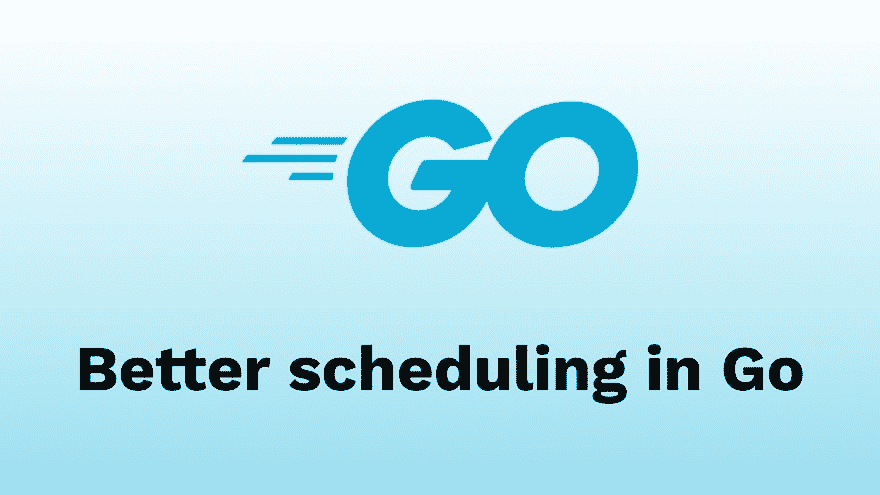

# Go 中更好的调度

> 原文：<https://dev.to/stephenafamo/better-scheduling-in-go-4f7e>

[](https://res.cloudinary.com/practicaldev/image/fetch/s--g32yznFA--/c_limit%2Cf_auto%2Cfl_progressive%2Cq_auto%2Cw_880/https://i0.wp.com/stephenafamo.com/blog/wp-content/uploads/2019/09/cropped-Scheduling-in-Go.png%3Ffit%3D1334%252C750%26ssl%3D1)

在很多情况下，我们希望能够在 Go 中安排功能。虽然现在有很多工具可以进行调度(比如 [Cron](https://en.wikipedia.org/wiki/Cron) )，但是我更希望我的程序的整个工作过程都包含在同一个代码/二进制文件中，这样我就不必去系统 crontab 去发现发生了什么。

谢天谢地， [`time`](https://golang.org/pkg/time/) 标准库已经附带了**很多**工具来安排事件。让我们看看其中的一些以及何时使用它。

> 查看一下 **Kronika** ，这个包在时间包周围添加了一些不错的助手。
> 
> [https://github.com/stephenafamo/kronika](https://github.com/stephenafamo/kronika)

## 利用 [`time.After()`](https://golang.org/pkg/time/#After)

[`time.After()`](https://golang.org/pkg/time/#After) 允许我们在一个持续时间之后执行一个动作。例如:

**注:**辅助常量`time.Second`、`time.Minute`、`time.Hour`均为 [`time.Duration`](https://golang.org/pkg/time/#Duration) 类型。因此，如果我们必须提供一个持续时间，我们可以将这些常数乘以一个数字(例如`time.Second * 5`)，表达式返回一个 [`time.Duration`](https://golang.org/pkg/time/#Duration) 。

```
package main

import (
    "fmt"
    "time"
)

func main() {
    // This will block for 5 seconds and then return the current time
    theTime := <-time.After(time.Second * 5)
    fmt.Println(theTime.Format("2006-01-02 15:04:05"))
} 
```

<svg width="20px" height="20px" viewBox="0 0 24 24" class="highlight-action crayons-icon highlight-action--fullscreen-on"><title>Enter fullscreen mode</title></svg> <svg width="20px" height="20px" viewBox="0 0 24 24" class="highlight-action crayons-icon highlight-action--fullscreen-off"><title>Exit fullscreen mode</title></svg>

```
2019-09-22 09:33:05 
```

<svg width="20px" height="20px" viewBox="0 0 24 24" class="highlight-action crayons-icon highlight-action--fullscreen-on"><title>Enter fullscreen mode</title></svg> <svg width="20px" height="20px" viewBox="0 0 24 24" class="highlight-action crayons-icon highlight-action--fullscreen-off"><title>Exit fullscreen mode</title></svg>

## 利用 [`time.Ticker`](https://golang.org/pkg/time/#Ticker)

[`time.After()`](https://golang.org/pkg/time/#After) 对一次性行动来说是伟大的，但克朗乔布斯的权力是在执行重复的行动。

所以，为此我们使用了 [`time.Ticker`](https://golang.org/pkg/time/#Ticker) 。对于大多数用例，我们可以使用助手函数 [`time.Tick()`](https://golang.org/pkg/time/#Tick) 来创建一个 ticker。例如:

```
package main

import (
    "fmt"
    "time"
)

func main() {
    // This will print the time every 5 seconds
    for theTime := range time.Tick(time.Second * 5) {
        fmt.Println(theTime.Format("2006-01-02 15:04:05"))
    }
} 
```

<svg width="20px" height="20px" viewBox="0 0 24 24" class="highlight-action crayons-icon highlight-action--fullscreen-on"><title>Enter fullscreen mode</title></svg> <svg width="20px" height="20px" viewBox="0 0 24 24" class="highlight-action crayons-icon highlight-action--fullscreen-off"><title>Exit fullscreen mode</title></svg>

```
2019-09-22 10:07:54
2019-09-22 10:07:59
2019-09-22 10:08:04
2019-09-22 10:08:09
2019-09-22 10:08:14 
```

<svg width="20px" height="20px" viewBox="0 0 24 24" class="highlight-action crayons-icon highlight-action--fullscreen-on"><title>Enter fullscreen mode</title></svg> <svg width="20px" height="20px" viewBox="0 0 24 24" class="highlight-action crayons-icon highlight-action--fullscreen-off"><title>Exit fullscreen mode</title></svg>

**注意:**使用`Ticker`时，第一个事件会在延迟后**触发。**

### 使用 [`time.Tick()`](https://golang.org/pkg/time/#Tick) 的危险性

当我们使用 [`time.Tick()`](https://golang.org/pkg/time/#Tick) 函数时，我们不能直接访问底层的 [`time.Ticker`](https://golang.org/pkg/time/#Ticker) ，因此我们不能正确关闭它。

如果我们从来不需要显式停止跑马灯(例如，如果跑马灯将一直运行)，那么这可能不是一个问题。但是，如果我们简单地忽略 ticker，资源将不会被释放，也不会被垃圾收集。

### 局限性使用 [`time.Tick()`](https://golang.org/pkg/time/#Tick)

有几件事我们不能用 [`time.Ticker`](https://golang.org/pkg/time/#Ticker) 轻易做到:

*   指定开始时间
*   停止跳动

## 扩展 [`time.Tick()`](https://golang.org/pkg/time/#Tick) 使用自定义功能

为了克服 [`time.Tick()`](https://golang.org/pkg/time/#Tick) 的限制，我创建了一个助手函数，在我的项目中使用。

```
func cron(ctx context.Context, startTime time.Time, delay time.Duration) <-chan time.Time {
    // Create the channel which we will return
    stream := make(chan time.Time, 1)

    // Calculating the first start time in the future
    // Need to check if the time is zero (e.g. if time.Time{} was used)
    if !startTime.IsZero() {
        diff := time.Until(startTime)
        if diff < 0 {
            total := diff - delay
            times := total / delay * -1

            startTime = startTime.Add(times * delay)
        }
    }

    // Run this in a goroutine, or our function will block until the first event
    go func() {

        // Run the first event after it gets to the start time
        t := <-time.After(time.Until(startTime))
        stream <- t

        // Open a new ticker
        ticker := time.NewTicker(delay)
        // Make sure to stop the ticker when we're done
        defer ticker.Stop()

        // Listen on both the ticker and the context done channel to know when to stop
        for {
            select {
            case t2 := <-ticker.C:
                stream <- t2
            case <-ctx.Done():
                close(stream)
                return
            }
        }
    }()

    return stream
} 
```

<svg width="20px" height="20px" viewBox="0 0 24 24" class="highlight-action crayons-icon highlight-action--fullscreen-on"><title>Enter fullscreen mode</title></svg> <svg width="20px" height="20px" viewBox="0 0 24 24" class="highlight-action crayons-icon highlight-action--fullscreen-off"><title>Exit fullscreen mode</title></svg>

### 函数中发生了什么

该函数接收 3 个参数。

1.  一个  :每当上下文取消，跑马灯就会停止。因此，我们可以创建一个带有取消功能、超时或截止时间的上下文，当上下文被取消时，该功能将优雅地释放它的资源。
2.  A `Time`:开始时间作为参考，知道什么时候开始计时。如果开始时间在未来，它将不会开始计时。如果是在以前。该函数通过添加适当的延迟倍数来计算未来的第一个事件。
3.  A `Duration`:这是滴答之间的间隔。从开始时间开始计算。

## 使用自定义功能的例子

**每周二下午两点运行**

```
ctx := context.Background()

startTime, err := time.Parse(
    "2006-01-02 15:04:05",
    "2019-09-17 14:00:00",
) // is a tuesday
if err != nil {
    panic(err)
}

delay := time.Hour * 24 * 7 // 1 week

for t := range cron(ctx, startTime, delay) {
    // Perform action here
    log.Println(t.Format("2006-01-02 15:04:05"))
} 
```

<svg width="20px" height="20px" viewBox="0 0 24 24" class="highlight-action crayons-icon highlight-action--fullscreen-on"><title>Enter fullscreen mode</title></svg> <svg width="20px" height="20px" viewBox="0 0 24 24" class="highlight-action crayons-icon highlight-action--fullscreen-off"><title>Exit fullscreen mode</title></svg>

**每小时运行一次，整点运行**

```
ctx := context.Background()

startTime, err := time.Parse(
    "2006-01-02 15:04:05",
    "2019-09-17 14:00:00",
) // any time in the past works but it should be on the hour
if err != nil {
    panic(err)
}

delay := time.Hour // 1 hour

for t := range cron(ctx, startTime, delay) {
    // Perform action here
    log.Println(t.Format("2006-01-02 15:04:05"))
} 
```

<svg width="20px" height="20px" viewBox="0 0 24 24" class="highlight-action crayons-icon highlight-action--fullscreen-on"><title>Enter fullscreen mode</title></svg> <svg width="20px" height="20px" viewBox="0 0 24 24" class="highlight-action crayons-icon highlight-action--fullscreen-off"><title>Exit fullscreen mode</title></svg>

**每 10 分钟运行一次，一周后开始**

```
ctx := context.Background()

startTime, err := time.Now().AddDate(0, 0, 7) // see https://golang.org/pkg/time/#Time.AddDate
if err != nil {
    panic(err)
}

delay := time.Minute * 10 // 10 minutes

for t := range cron(ctx, startTime, delay) {
    // Perform action here
    log.Println(t.Format("2006-01-02 15:04:05"))
} 
```

<svg width="20px" height="20px" viewBox="0 0 24 24" class="highlight-action crayons-icon highlight-action--fullscreen-on"><title>Enter fullscreen mode</title></svg> <svg width="20px" height="20px" viewBox="0 0 24 24" class="highlight-action crayons-icon highlight-action--fullscreen-off"><title>Exit fullscreen mode</title></svg>

## 结论

有了这个功能，我可以更好地控制项目的进度。希望它对你也有一些用处。

> 查看一下 **Kronika** ，这个包在时间包周围添加了一些不错的助手。
> 
> [https://github.com/stephenafamo/kronika](https://github.com/stephenafamo/kronika)

让我知道你的想法。

《围棋更好的调度》一文最先出现在[斯蒂芬·阿法莫的博客](https://stephenafamo.com/blog)上。