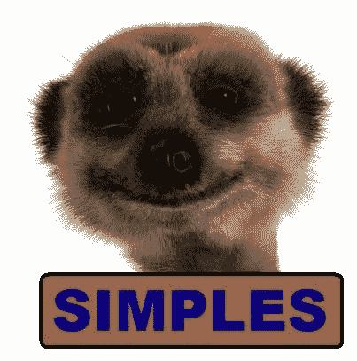

# 页面可见性 API，让我们帮助用户节省电池寿命和数据😀

> 原文:[https://dev . to/ya shints/page-visibility-API-let-s-help-users-save-their-battery-life-and-data-2 moa](https://dev.to/yashints/page-visibility-api-let-s-help-users-save-their-battery-life-and-data-2moa)

你想要那些开着 200 个标签的人吗？你是否厌倦了一直带着笔记本充电器？嗯，我在这里让你知道，如果我们知道如何使用**页面可见性 API** ，我们可以帮助用户节省电池、数据和时间。

## [](#the-why)这个为什么

假设您的用户打开了几个选项卡，一个运行沉重的动画，另一个从服务器获取大量数据，另一个运行 YouTube 上的视频。这些都需要用户电脑的资源，这就是为什么有时打开几个标签，你会突然意识到你的电池快没电了，或者你的数据限额快用完了。

> 💡如果你可以在用户没有看标签页/窗口的时候暂停当前的操作，会怎么样？

有了`Page Visibility API`，你就可以做到。

## [](#page-visibility-api)页面可见性 API

这个 API 允许开发者知道用户是否已经失去了对页面的关注，或者已经再次返回到页面。当用户最小化或者切换到另一个标签页/窗口时，API 会发送一个`visibilitychange`事件让监听器知道页面的状态。

页面可见性 API 是你工具箱中一个非常有用的工具，当页面对用户不可见时，它可以让你不执行不必要的操作。

该 API 向`Document`接口添加了以下属性:

*   `hidden`:只读属性，如果页面处于对用户隐藏的状态，则返回 true。
*   `visibilityState`:表示单据当前可见状态的 [`DOMString`](https://developer.mozilla.org/en-US/docs/Web/API/DOMString) 。它可以有四个值，`visible`、`hidden`、`prerender`和`unloaded`。

您还可以监听`visibilitychange`事件，该事件将在可见性改变时触发您的回调函数:

```
function handleVisibilityChange () {
    if (document.hidden) {
        // stop that task 🛑
    } else {
        // you can start it again go ▶️
    }
}

document.addEventListener('visibilitychange', handleVisibilityChange, false); 
```

<svg width="20px" height="20px" viewBox="0 0 24 24" class="highlight-action crayons-icon highlight-action--fullscreen-on"><title>Enter fullscreen mode</title></svg> <svg width="20px" height="20px" viewBox="0 0 24 24" class="highlight-action crayons-icon highlight-action--fullscreen-off"><title>Exit fullscreen mode</title></svg>

## [](#-raw-visibilitystate-endraw-)`visibilityState`

如前所述，该属性可以有四个不同的值，每个值代表一个不同的选项卡/窗口状态:

*   **可见**:表示标签页/窗口可见或部分可见。换句话说，这意味着该页面是非最小化窗口的前景标签。
*   **隐藏**:页面因最小化或设备屏幕关闭而不可见。
*   预呈现器:页面正在被预呈现，用户看不到。
*   **卸载**:表示用户即将关闭当前页面。

> ⚠️你需要知道不是所有的浏览器都支持后两种状态。

## [](#demo)演示

最简单的场景是在页面上播放视频，所以我们将以此为例。让我们在页面上使用一个简单的视频元素，当用户聚焦在另一个标签上时，这个元素会暂停。

```
<body>
    <h1>Demo: Page Visibility API</h1>

    <main>
        <video id="videoElement" 
               poster="http://media.w3.org/2010/05/sintel/poster.png" width="400"
               controls="" >
           <source id='mp4' src="http://media.w3.org/2010/05/sintel/trailer.mp4" type='video/mp4'/>
        <source id='webm' src="http://media.w3.org/2010/05/sintel/trailer.webm" type='video/webm'/>
        <source id='ogv' src="http://media.w3.org/2010/05/sintel/trailer.ogv" type='video/ogg'/>
            <p>Sorry, there's a problem playing this video. Please try using a different browser</p>
        </video>
    </main>

    <script>    

    (function() {
        'use strict';

        // Set the name of the "hidden" property and the change event for visibility
        var hidden, visibilityChange; 
        if (typeof document.hidden !== "undefined") {
          hidden = "hidden";
          visibilityChange = "visibilitychange";
        } else if (typeof document.mozHidden !== "undefined") { // Firefox up to v17
          hidden = "mozHidden";
          visibilityChange = "mozvisibilitychange";
        } else if (typeof document.webkitHidden !== "undefined") { // Chrome up to v32, Android up to v4.4, Blackberry up to v10
          hidden = "webkitHidden";
          visibilityChange = "webkitvisibilitychange";
        }

        var videoElement = document.getElementById("videoElement");

        // If the page is hidden, pause the video;
        // if the page is shown, play the video
        function handleVisibilityChange() {
          if (document[hidden]) {
            videoElement.pause();
          } else {
            videoElement.play();
          }
        }

        // Warn if the browser doesn't support addEventListener or the Page Visibility API
        if (typeof document.addEventListener === "undefined" || typeof document[hidden] === "undefined") {
          alert("This demo requires a modern browser that supports the Page Visibility API.");
        } else {
          // Handle page visibility change 
          document.addEventListener(visibilityChange, handleVisibilityChange, false);

          // When the video pauses and plays, change the title.
          videoElement.addEventListener("pause", function(){
            document.title = 'Paused';
          }, false);

          videoElement.addEventListener("play", function(){
            document.title = 'Playing'
          }, false);
        }

    })();
    </script>

</body> 
```

<svg width="20px" height="20px" viewBox="0 0 24 24" class="highlight-action crayons-icon highlight-action--fullscreen-on"><title>Enter fullscreen mode</title></svg> <svg width="20px" height="20px" viewBox="0 0 24 24" class="highlight-action crayons-icon highlight-action--fullscreen-off"><title>Exit fullscreen mode</title></svg>

我们所做的就是获取对视频元素的引用，并挂钩到`visibilitychange`事件。当页面隐藏时，我们只需暂停视频。一旦焦点回来，我们就播放它。

[T2】](https://res.cloudinary.com/practicaldev/image/fetch/s--5z35xPF4--/c_limit%2Cf_auto%2Cfl_progressive%2Cq_auto%2Cw_880/https://thepracticaldev.s3.amazonaws.com/i/d6eg0xliu2zp2fm264cp.jpg)

我在 Glitch 上创建了一个 [live 版本，你可以看看。播放视频并点击另一个标签。视频会暂停，一旦你回来，它会再次播放。](https://aluminum-argon.glitch.me)

## [](#summary)总结

一个好的 web 应用不一定需要热门的功能和令人印象深刻的 UX。有时候，一个正在运行的 web 应用程序对用户的吸引力是独一无二的。希望这篇小文章能帮助你在很多方面帮助你的用户。

快乐探索😊。