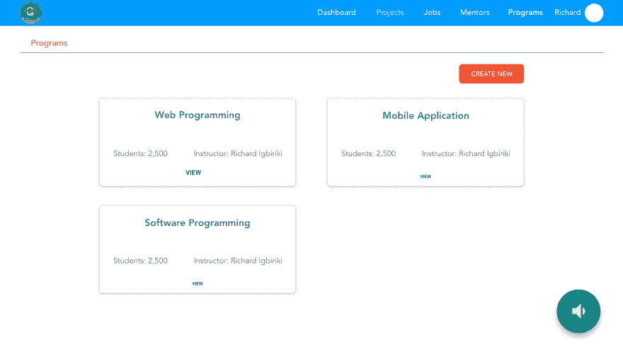

# 用 Jest 和 Enzyme 重构 React 组件的可测试性

> 原文:[https://dev . to/richardigbiriki/refactoring-react-components-for-testability-with-jest-and-enzyme-m7b](https://dev.to/richardigbiriki/refactoring-react-components-for-testability-with-jest-and-enzyme-m7b)

### [](#disclaimer)免责声明

我不能肯定或否认这篇文章是我上一篇文章的延续:[用 Jest 和 Enzyme](https://dev.to/richardigbiriki/testing-your-first-react-component-with-jest-and-enzyme-p38) 测试你的第一个 react 组件，但是如果这是你第一次阅读关于测试 React 组件的文章，我礼貌地建议你先看看那篇文章。

### [](#introduction)简介

测试您的 react 组件是一项激动人心的工作(以我的经验来看)，然而，如果您的组件是`large`并且带有`state`的波纹，那么它可能会有一个急转弯。因此，它被认为是一个好的(也许是最好的？)练习将组件拆分成更小的独立组件...优选纯组分。使用纯组件可以防止组件生命周期方法中可能出现的不必要的副作用。在这篇文章中，我们将把一个组件分解成更小的纯组件，并为这些组件编写测试。

让我们开始吧。

### [](#our-component)我们的分量

[T2】](https://res.cloudinary.com/practicaldev/image/fetch/s--m2-8SV3r--/c_limit%2Cf_auto%2Cfl_progressive%2Cq_auto%2Cw_880/https://thepracticaldev.s3.amazonaws.com/i/ivstwghmi0717d8u93wu.png)

#### [](#observations)观察

在这个组件中，我们可以看到每个程序都有一个盒子。这是一个可测试的单元，应该是它自己的组件。我们也有一个'程序'文本和一个'创建新的'按钮在副标题，这也可以移动到自己的组件。记住这种可能的分裂，让我们看看最初的实现会是什么样子。我们将只查看`render`方法。

```
return (
const { loading, message, programs } = this.state;

<div loading={loading} message={message} programs={programs}  className="container jumbo-header">
        <div className="jumbo-box">
            <div className="jumbo">
            <p id="title" className="ml-3 text">Programs</p>
            </div>
         </div>

        {/* show message if there is a status mesage */}
        {message && <div className='text-center'>
            <h5 id="message" className='text-info'> {message} </h5>
        </div>}

        {/* If fetching programs, show loading spinner */}
        {loading && <Spinner animation="grow" variant="info" />}

        <Container className="mt-3">
            <div className="admin-button" style={{height:'3rem'}}>
                <Link id="new-link" to='/programs/new'>
                    <Button id='new-button' className="create float-right">Create New</Button>
                </Link>
            </div>

            {/* return all programs as Card items if they exist */}
            { programs && programs.map((data, i) =>
                <Card data={data} key={data.id} className="pro-box ml-5 shadow p-2 mt-4 rounded float-left" border="light" style={{width: '30rem'}}>
                   <h4 id="title" className="text-center mt-2">{data.title}</h4>
                   <div className="pro-text d-flex pt-5 text-center">
                      <p id="length" className="ml-5 text-center">Duration: {data.length}</p>
                      <p id="instructor" className="ml-5">Instructor: {data.instructor}</p>
                  </div>
                      <p className="pro-anchor text-center pt-4">VIEW</p>
                </Card>
            )}
        </Container>
    </div>

) 
```

<svg width="20px" height="20px" viewBox="0 0 24 24" class="highlight-action crayons-icon highlight-action--fullscreen-on"><title>Enter fullscreen mode</title></svg> <svg width="20px" height="20px" viewBox="0 0 24 24" class="highlight-action crayons-icon highlight-action--fullscreen-off"><title>Exit fullscreen mode</title></svg>

这里，我们有一个**正确的**但是大的 UI 实现。然而，这种实现使得测试程序`Card`变得更加困难。如果您能够以某种方式绕过这个困难，测试组件本身将会导致不必要的副作用，正如我前面提到的。

根据我们最初的观察，让我们把这个渲染方法分成更简单的纯组件。

### [](#main-component)主要成分

我们上面的主要组件将被重构以返回一个次要组件，如下所示:

```
render() {
        //Programs component is more easily testable as a pure function
        const { programs, message, loading } = this.state;
        return(
            <ProgramsComponent programs={programs} message={message} loading={loading} />
        )
    } 
```

<svg width="20px" height="20px" viewBox="0 0 24 24" class="highlight-action crayons-icon highlight-action--fullscreen-on"><title>Enter fullscreen mode</title></svg> <svg width="20px" height="20px" viewBox="0 0 24 24" class="highlight-action crayons-icon highlight-action--fullscreen-off"><title>Exit fullscreen mode</title></svg>

继续前进...

### [](#programs-component)程序组件

我们的程序组件将呈现副标题、微调按钮和一条消息(如果有的话)。它还将尝试呈现一个单独的`Item`组件，该组件代表每个可用程序的一个程序。

```
const ProgramsComponent = ({ programs, message, loading }) => (

    <div loading={loading} message={message} programs={programs}  className="container jumbo-header">
        <div className="jumbo-box">
            <div className="jumbo">
            <p id="title" className="ml-3 text">Programs</p>
            </div>
         </div>

        {message && <div className='text-center'><h5 id="message" className='text-info'> {message} </h5></div>}

        {loading && <Spinner animation="grow" variant="info" />}

        <Container className="mt-3">
            <div className="admin-button" style={{height:'3rem'}}>
                <Link id="new-link" to='/programs/new'>
                    <Button id='new-button' className="create float-right">Create New</Button>
                </Link>
            </div>

             {/* Move program details to another component */}
            { programs && programs.map((data, i) =>
                <Item key={data._id} data={data} />
            )}

        </Container>
    </div>
); 
```

<svg width="20px" height="20px" viewBox="0 0 24 24" class="highlight-action crayons-icon highlight-action--fullscreen-on"><title>Enter fullscreen mode</title></svg> <svg width="20px" height="20px" viewBox="0 0 24 24" class="highlight-action crayons-icon highlight-action--fullscreen-off"><title>Exit fullscreen mode</title></svg>

继续我们最后的部分...

### [](#item-component)物品组件

我们的项目组件将只负责呈现一个程序。这使我们能够将这个组件作为一个单元来测试(re:单元测试)。我刚才解释`unit testing`是这篇文章的副作用吗？有意思！

这是我们的项目组件。

```
const Item = ({ data }) => (
    <Card data={data} key={data.id} className="pro-box ml-5 shadow p-2 mt-4 rounded float-left" border="light" style={{width: '30rem'}}>
        <h4 id="title" className="text-center mt-2">{data.title}</h4>
        <div className="pro-text d-flex pt-5 text-center">
        <p id="length" className="ml-5 text-center">Duration: {data.length}</p>
        <p id="instructor" className="ml-5">Instructor: {data.instructor}</p>
        </div>
        <p className="pro-anchor text-center pt-4">VIEW</p>
    </Card>
); 
```

<svg width="20px" height="20px" viewBox="0 0 24 24" class="highlight-action crayons-icon highlight-action--fullscreen-on"><title>Enter fullscreen mode</title></svg> <svg width="20px" height="20px" viewBox="0 0 24 24" class="highlight-action crayons-icon highlight-action--fullscreen-off"><title>Exit fullscreen mode</title></svg>

我们已经成功地将一个大的组件分成了两个更小的纯组件，可以分别进行测试。为了简洁起见(这已经太长了)，我们将在本帖中严格限制我们的测试覆盖范围。

### [](#testing-our-components)测试我们的组件

我们的单元测试至少可以分为三个阶段。

1.  当组件获取程序时。装载阶段。

2.  当组件已完成加载但没有内容时。空荡荡的舞台。

3.  当组件完成加载时，没有消息，但有内容。这可以进一步分为一个或多个项目的测试场景。

4.  测试我们的项目组件。

是的，我知道，这可能听起来已经有很多工作了。Doh。然而，我们同意保持简短，所以下面是不同阶段的测试。

#### [](#stage-1-and-2-loadin-and-empty-content)阶段 1 和阶段 2:装载和清空内容

```
 describe('tests general requirements and an loading component', () => {

             //Start with an empty loading component
             const wrapper = shallow(<ProgramsComponent loading={true} message={null} programs={[]} />);

            describe('tests general component requirements', () => {

                it('should have page title', ()=> {
                    expect(wrapper.find('#title')).toHaveLength(1);
                    expect(wrapper.find('#title').text()).toEqual('Programs');
                });

                //...More tests for button and Link

            });

            describe('tests empty program', () => {
                it('should be loading', () => {
                    expect(wrapper.props().loading).toEqual(true);
                });

                it('should have a spinner', () => {
                    expect(wrapper.find('Spinner')).toHaveLength(1);
                });

                it('should not have Item', () => {
                    expect(wrapper.props().programs.length).toEqual(0);
                    expect(wrapper.find('Item')).toHaveLength(0);
                });

               //...Test for no message

            });

        }); 
```

<svg width="20px" height="20px" viewBox="0 0 24 24" class="highlight-action crayons-icon highlight-action--fullscreen-on"><title>Enter fullscreen mode</title></svg> <svg width="20px" height="20px" viewBox="0 0 24 24" class="highlight-action crayons-icon highlight-action--fullscreen-off"><title>Exit fullscreen mode</title></svg>

#### [](#stage-3-available-content)第三阶段:可用内容

```
 describe('tests component with multiple programs', () => {
            const programs=[
                {
                    _id:1,
                    title: 'Web Development',
                    length: '3 Months',
                    instructor: 'Richard Igbiriki'
                },
                {
                    _id:2,
                    title: 'Mobile Development',
                    length: '3 Months',
                    instructor: 'Richard Igbiriki'
                },
                {
                    _id:3,
                    title: 'Software Development',
                    length: '3 Months',
                    instructor: 'Richard Igbiriki'
                }
            ];
            const wrapper = shallow(<ProgramsComponent loading={false} message={null} programs={programs} />);

            it('should have three Items', () => {
                expect(wrapper.find('Item')).toHaveLength(3);
            });

            it('should update items on props update', () => {
                //remove one item
                const i = programs.pop();
                wrapper.setProps({ programs });
                expect(wrapper.find('Item')).toHaveLength(2);
                //add item
                programs.push(i);
                wrapper.setProps({ programs });
                expect(wrapper.find('Item')).toHaveLength(3);
            });
            //...More tests
        }); 
```

<svg width="20px" height="20px" viewBox="0 0 24 24" class="highlight-action crayons-icon highlight-action--fullscreen-on"><title>Enter fullscreen mode</title></svg> <svg width="20px" height="20px" viewBox="0 0 24 24" class="highlight-action crayons-icon highlight-action--fullscreen-off"><title>Exit fullscreen mode</title></svg>

#### [](#stage-4-item-component)阶段 4:项目组件

```
 describe('Tests Item component', () => {
        const data = {
            _id:1,
            title: 'Web Development',
            length: '3 Months',
            instructor: 'Richard Igbiriki'
        }
        const wrapper = shallow(<Item data={data} />);

        it('should have data props', () => {
            expect(wrapper.props().data).toBeDefined();
        });

        it('should have a title', () => {
            expect(wrapper.find('#title')).toHaveLength(1);
            expect(wrapper.find('#title').text()).toEqual(data.title);
        });

        it('should have a length', () => {
            expect(wrapper.find('#length')).toHaveLength(1);
            expect(wrapper.find('#length').text()).toEqual('Duration: '+data.length);
        });

        it('should have an instructor', () => {
            expect(wrapper.find('#instructor')).toHaveLength(1);
            expect(wrapper.find('#instructor').text()).toEqual('Instructor: '+data.instructor);
        });
    }); 
```

<svg width="20px" height="20px" viewBox="0 0 24 24" class="highlight-action crayons-icon highlight-action--fullscreen-on"><title>Enter fullscreen mode</title></svg> <svg width="20px" height="20px" viewBox="0 0 24 24" class="highlight-action crayons-icon highlight-action--fullscreen-off"><title>Exit fullscreen mode</title></svg>

### [](#explanation-testing-matchers)解释:测试匹配器

在我们所有的测试中，我们在 expect 上使用了 3 到 5 个[匹配器](https://airbnb.io/enzyme/docs/api/shallow.html)和 2 到 3 个[方法进行比较。](https://jestjs.io/docs/en/expect)

#### [](#matchers)赛者

1.  **。find:** 接受一个选择器并查找匹配的节点。

2.  **。props** 获取节点上设置的道具。

3.  **。setProps** 更新节点上的属性。

4.  **。text** 返回当前节点的文本。

### [](#explanation-raw-expect-endraw-methods)解说:`expect`方法

1.  **。toHaveLength(n)** 期望返回值具有长度或大小为 n 的元素。

2.  **。toEqual(variable)** 期望返回值等于*变量*。

### [](#conclusion)结论

耶！！！我们完了。

这比我预期的要长，但是我再次希望你阅读和尝试的时候和我写的时候一样有趣。

对于那些没有在 Twitter 上关注我的人，这些帖子包含了我和我的团队目前正在进行的项目，这就是为什么我没有任何 github repo 的链接。如果需要，我会继续写下去。

谢谢你。