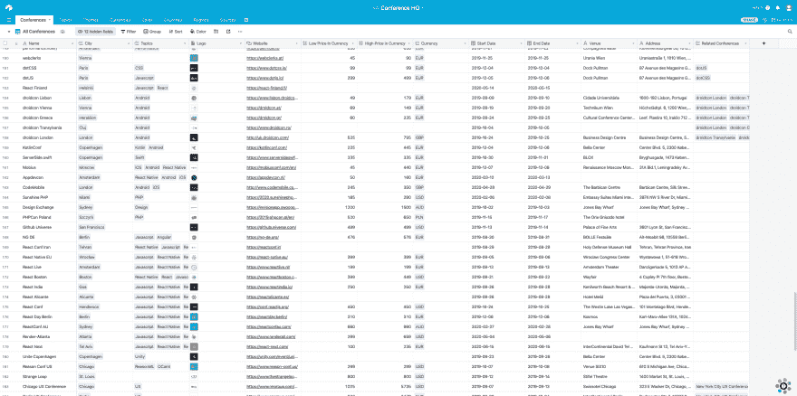

# 使用 air table 作为后端

> 原文：<https://dev.to/bjornlindholmdk/using-airtable-as-a-backend-5079>

# 使用 Airtable 作为后端

我最近推出了第一版[会议总部](http://conferencehq.io)。该项目的一个有趣的部分是由 Airtable 支持的后端。我最初在 Laravel 中构建了自己的 API，但在那时我放弃了这个项目。我稍后将回到这一点。

## 什么是 Airtable

Airtable 是电子表格和数据库的混合体。它比 Firebase 简单，但有一些方便的功能，如资产处理，这使它比 Google Sheets 更适合管理内容。

Airtable 的核心是碱基。它相当于数据库或电子表格。在底座里面有桌子。表内是内容所在的地方。这些被称为记录。

Airtable 真正出色的地方是表中每一列可以使用的字段类型。文本、数字和日期字段等标准选项可用。但是也可以使用更高级的字段。

如果您存储客户数据，您可以有一个电子邮件、电话号码或 url 字段。评级、持续时间、条形码、选择和附件字段也可用。附件字段可用于存储要显示或下载的图像或文件。

最后，您可以链接到其他记录，或者从其他记录中读取一个值，并在公式中使用它。

## 我为什么选择 Airtable 作为会议总部

我最初构建了一个 Laravel API 作为后端。但由于各种原因，我放弃了这个项目一段时间，当我恢复它时，我想要一个更简单的解决方案。

Airtable 是解决这一问题的正确方案。会议总部的核心是一个会议列表。自定义 API 解决方案是多余的，Airtable 让我可以专注于其他事情，而不是花时间维护 API。我估计我已经花了大约 3 个小时来建立这个基地。

这很容易设置，尤其是如果您有使用数据库的经验。资产处理对会议总部来说很方便，因为我为每个会议存储了一个徽标。不用担心设置和维护服务器也很好。

免费计划对大多数小网站来说已经足够了。

## 何时使用 Airtable

我建议对列表或目录站点使用 Airtable。这可能是一个像[加密货币工作](https://cryptocurrencyjobs.co/)这样的工作板，一个像[游牧名单](https://nomadlist.com)这样的数据库，或者一个像[这样的用 Vue.js](https://madewithvuejs.com) 制作的目录。

如果您计划添加其他内容，如博客文章，我仍然建议对列表部分使用 Airtable。使用 Gridsome 或 Gatsby 这样的静态站点生成器将允许您从不同的来源获取内容。

## 使用 Airtable 的 API

在 Airtable 上创建一个基础之后，他们会自动为这个基础生成 API 文档。这将随着您在数据库中添加或删除表或字段而变化。

有一个官方的 JS 客户端可以使用。如果你使用另一种语言来驱动网站，你可以直接点击端点。

身份验证是通过令牌完成的。不幸的是，不可能将端点公开。这意味着 API 必须从服务器调用，以避免令牌被公开。这就是我选择在像 Nuxt 这样的 SSR 框架上使用静态站点生成器的原因。

API 的速率限制为每秒 5 个请求。除非你有一个流量很大的网站，否则这就足够了。使用静态站点生成器可以缓解这个问题，因为它会在部署站点时获取所有数据。

使用 Airtable API 与使用自定义 API 不同。当涉及到验证和通过关系连接模型时，您没有那么多的自由。

一个例子是，你不能有一对一或一对多的关系。关系总是多对多。再比如你不能自动生成 slugs。我设置了一个公式，从会议名称中删除特殊字符，并将其转换为破折号或空字符串。

但是我还没有发现任何我不能解决的问题，考虑到使用 Airtable 节省的时间，我认为对于简单的网站来说这是值得的。

## 前端

因为 API 认证问题，我选择了 [Gridsome](https://gridsome.org/) 作为静态站点生成器。

最初我想使用 [Nuxt](https://nuxtjs.org/) 并使用服务器端渲染。但是 data Nuxt 从 API 获取数据的方式是通过一个叫做 [asyncData](https://nuxtjs.org/guide/async-data) 的方法。这个方法第一次运行时在服务器上获取数据，但是当用户导航到其他路由时，它将从客户端被调用。这将暴露我的 Airtable API 密钥。

当我运行`gridsome build`命令时，Gridsome 获取所有数据。我在部署站点时会这样做。然后，它将每个页面生成为一个静态 html 文件。

使用 Gridsome(或 React 的 [Gatsby](https://www.gatsbyjs.org/) )的一个优点是可以有多个数据源。这意味着我可以使用 Contentful 或 Netlify CMS 创建一个博客，并通过 Gridsome 获取数据。

Gridsome 还年轻，我遇到了一些警告。最大的是搜索。这项功能还没有在会议总部推出，但我目前正在实现它。

Gridsome 中有一些搜索功能，但它们是有限的。相反，我使用的是 [FlexSearch](https://github.com/nextapps-de/flexsearch) 。当搜索和过滤特性发布后，我会写另一篇文章提供更多的细节。

## 处理表单

我想在未来添加到网站的一个功能是用户添加会议的能力。对此，我提出了两个解决方案。

我可以创建一个[类型的表单](https://www.typeform.com/)或者使用[网络表单](https://www.netlify.com/products/forms/)。由于该网站已经托管在 Netlify 上，我很可能会采用这种解决方案。

为了将获取的内容存储在 Airtable 中，我将使用 Zapier。Zapier 集成了 Netlify 和 Typeform 以及 Airtable。

## 结论

很长一段时间以来，我有一个试图过度设计我的项目的习惯。这总是把我引向一条道路，在这条道路上，我花了大量的时间编写代码，但这些代码永远不会被公之于众。使用 Airtable 节省了我创建后端的几周时间，让我可以将这些时间花在为网站添加功能和内容上。Airtable 对任何网站来说都不是一个可行的解决方案，但如果你想快速启动一个项目或测试一个想法，它真的很可靠。