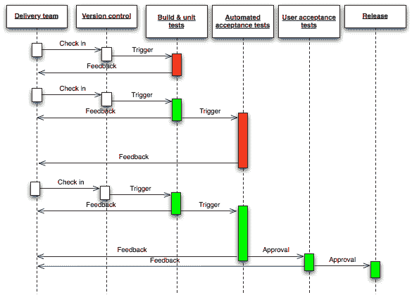

# 如何选择 CI/CD 工具

> 原文:[https://dev.to/giladmaayan/how-to-choose-a-ci-cd-tool-45i8](https://dev.to/giladmaayan/how-to-choose-a-ci-cd-tool-45i8)

持续集成和持续交付概念正在成为软件开发的黄金标准。对于 web 应用程序和软件即服务(SaaS)模型来说尤其如此。软件开发公司越来越多地选择 [CI/CD 工具](https://www.sealights.io/software-development-metrics/6-ci-cd-tools-to-build-your-next-gen-delivery-pi)来自动化开发过程。然而，有许多工具，选择正确的一个可能是一项艰巨的任务。请继续阅读，了解 CI/CD 流程是如何工作的，以及如何为您的项目选择正确的工具。

## 什么是 CI/CD？

持续集成(CI)和持续交付(CD)是一组简化应用程序开发的原则和实践。强大的 CI/CD 管道可靠而频繁地交付代码变更。

持续集成(CI)
持续集成的目标是以一致和自动化的方式构建、打包和测试应用程序。它帮助开发人员在预定的时间将代码提交给中央存储库。自动化工具验证代码，从而提高协作和软件质量。

**连续交付(CD)**
CS 是一种软件开发方法，涉及在短周期内生产软件。CD 工具可以自动向基础设施环境交付应用程序。除了标准的单元测试之外，这个工具还可以自动化测试。

持续测试
安全持续集成和交付要求使用持续测试。要做到这一点，您需要使用一组自动化测试，每个测试都测量回归和性能。CI/CD 模型跨整个 CI/CD 管道执行测试。

 
[图片来源](https://upload.wikimedia.org/wikipedia/commons/7/74/Continuous_Delivery_process_diagram.png)

在交付管道中，每一个软件从开始到发布都要经历几个阶段。这些阶段包括构建、测试和部署软件。CI 整合了这些阶段，从而形成一个连续的循环；部署管道有助于提高所生产软件的质量。

## CI/CD 的好处

实施 CI/CD 模型可以有效地提高您组织的投资回报率(ROI)。以下是持续集成的一些好处:

*   **更快的开发**—部署以连续的周期运行，允许您实时修复缺陷。因此，您可以在更短的时间内准备好产品。[连续交付](https://www.atlassian.com/continuous-delivery/principles/continuous-integration-vs-delivery-vs-deployment)将软件部署自动化到生产中。因此，延迟部署的风险极小。
*   **更快的上市时间**—最后一点的必然结果是产品更快上市。你可以通过提前交货获得竞争优势。这也可以让你在竞争对手之前抓住市场趋势。
*   更好的代码——接收持续的反馈可以帮助开发人员改进他们的技能。一个通用的存储库创建了一个共享的知识库，改进了协作。CI 自动化工具节省了修复时间，并减少了人为错误的机会。

## 选择 CI/CD 工具前需要考虑的事项

建立一个高效的 CI/CD 渠道并非易事。选择正确的工具可以使它变得更容易。以下是一些问题和注意事项，可以帮助您找到适合自己的工具:

*   **评估您的发展目标**—您希望该工具实现什么目标？
*   **评估您的应用需求**—您的项目需要什么应用。检查管道，看看哪些流程需要自动化。不是每个工作流程都应该自动化。
*   **检查兼容性**—考虑工具与您的应用程序语言的兼容性。例如，如果你用 Ruby 构建应用程序，你可以使用 [cucumber.io](https://cucumber.io/) 进行测试。
*   当心太多的自动化—这同样适用于测试应用程序。您应该评估每个故事，以检查它是否需要单元测试。优化测试以在管道中的关键阶段运行。否则，你可能会拖延这个过程，而不是简化它。
*   **托管要求**—查看公司关于托管和数据存储的政策。你应该决定是自己托管还是使用基于云的解决方案。内部解决方案通常需要一个团队来维护基础架构，但允许灵活定制。云解决方案更容易实现；该平台负责 CI/CD 工具的维护、基础设施和安全性。

## 在 CI/CD 工具中寻找什么

开发团队寻找 CD/CD 工具来简化构建、测试和部署过程。一个好的工具应该易于安装和使用。有如此多的选择，以至于这项任务让人感觉难以承受。为了方便起见，这里列出了 CI/CD 工具的推荐功能:

*   **管道代码**—允许 Jenkins 用户用代码定义管道中的作业流程。
*   **支持容器化**——针对运行 Docker 和 Kubernetes 的应用程序。
*   **简单设置**—您可能希望工具在几分钟内准备好运行。这个原则适用于你引入工作流程的任何 [IT 软件](https://technologyadvice.com/it-software/)。
*   **可扩展性**—允许您根据工作负载扩大或缩小规模。
*   **与云平台**整合——比如亚马逊网络服务(AWS)、谷歌云平台(GCP)和微软 Azure。一个易于集成的工具可以加快软件上传到云的速度。
*   **符合法规**—检查 CI/CD 工具是否符合您所在行业的安全和法规要求。
*   **定制**—您可以添加功能和/或创建自己的资源吗？
*   **支持最常见的语言**——比如 Node.js、Ruby、Python、JavaScript。
*   **强大的支持系统**—良好的客户支持服务是任何工具都必须具备的。用户可以从全面更新的文档中获得支持。分享知识和最佳实践的活跃社区也是一个好迹象。

## 总结起来

实现持续集成和持续交付有效地简化了软件开发。不同的 CI/CD 工具可以应用于不同的用例。要为您的组织找到合适的工具，您应该从定义您的目标和需求开始。然后，通过应用上面提到的技巧，你可以选择最适合你的项目。