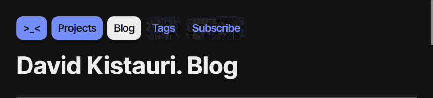

# 在我的网站上设计事物和逻辑

> 原文:[https://dev . to/dtro ode/design-things-and-logic-on-my-website-2o6p](https://dev.to/dtroode/design-things-and-logic-on-my-website-2o6p)

我最近[推出了](https://twitter.com/dtroode/status/1173643274256572416?s=20)我的作品集博客网站，并决定讲述一下[网站](https://davidkistauri.ru)设计中的小事。我在其他博客上偷看了一些东西，比如伊利亚·伯曼的 [Aegea](https://blogengine.me) ，并在我的网站上采纳了。

> 这篇文章中的每个例子都被翻译成英语，因为我的网站是俄语的

## 有表头的东西

标题显示了层次结构。如果我在主页面，页眉是我的名字“大卫·基斯托瑞”，如果我在博客页面，是主页眉+“博客”:“大卫·基斯托瑞。博客”，如果我在标签页上，那就是主标题+“博客”+“标签”:“大卫·基斯托瑞。博客。标签”。

这条规则不适用于模板页面，如文章、产品页面或每个标签的页面，因为“David Kistauri。博客。如果你正在编写如何使用 VS 代码”是对读者的嘲讽，尤其是那些从电话进来的人——头太长了。

## 事物与联系

[T2】](https://res.cloudinary.com/practicaldev/image/fetch/s--B-_BbJOM--/c_limit%2Cf_auto%2Cfl_progressive%2Cq_auto%2Cw_880/https://thepracticaldev.s3.amazonaws.com/i/e6wu3od0p1nztioa5d81.png)

> 博客中的链接——前两个可以点击，第三个——不，因为我们已经在博客中了，还有两个——额外的:博客有标签，你可以订阅它

每页标题上方都有链接。它们分为两种:原发性和继发性。有三个主要链接:主页、项目页面和博客页面——这些是网站的部分。

### 初级链接

如果我不在页面上——如果我在页面上，链接是蓝色的——如果我在页面上，链接是不可点击的，背景是黑色的(暗模式下是白色的)——例如。`/blog/all/`，该链接可点击，背景为黑色(黑暗模式下为白色)，文字为蓝色。此投诉设置是为了通过查看链接来了解层次结构。

### 二级链接

没有恒定的二级链接。有时候没有二级链接。这取决于页面。这些链接是*附加的*。博客有两个次要链接:标签列表和 RSS。这些链接有一个蓝色的文本。

如果你将鼠标悬停在一个主要链接上，这个链接会改变背景颜色，如果你将鼠标悬停在一个次要链接上，这个链接会改变文本颜色。

## 二级链接地点

在[标签](https://davidkistauri.ru/blog/tags)和[注释](https://davidkistauri.ru/blog/all)的列表中，除了表头之外，还有二级链接。这些链接的位置不同——在标签列表中，它们是内嵌的，就像砖块一样，在注释列表中，每个链接都以新的一行开始。

[T2】](https://res.cloudinary.com/practicaldev/image/fetch/s--p2p1y6B5--/c_limit%2Cf_auto%2Cfl_progressive%2Cq_auto%2Cw_880/https://thepracticaldev.s3.amazonaws.com/i/t25lnuavi6yf290c0qa9.jpg)

在我的电报频道中，我有一个关于“砖连接”设计的[注释](https://t.me/dtroode_channel/419)。标签以这种方式定位是因为它们之间有联系——一个笔记可能有很多标签；人们经常访问标签列表来查看主题列表，而不是为了找到一个标签。

笔记的链接是分开放置的，因为每个笔记都是一个独立的内容单元，而“砖块链接”设计使得搜索更加困难。此外，笔记名称很长，所以长砖不酷。

## 用分规分东西

所有部分都用分割线连接(或分割)。分隔线上方有一大页边空白，分隔线下方有一小页边空白。我在 Igor Shtang 的[笔记](https://nobelfaik.livejournal.com/175918.html)中读到过这次接待。

## 用黑暗模式的东西

你需要一个黑暗模式。尤其是如果你正在建立博客——一个有长文章的产品。停止用鲜艳的颜色折磨猫头鹰读者。任务不仅仅是把白色背景变成黑色背景。你需要选择好的颜色，这样在暗版中所有的元素都可以被看到，阴影也可以工作。

明亮的颜色不应该占据很大的面积，应该适当地替代元素、背景和文本的颜色。在帖子列表的[中，我从区块中移除了彩色背景，并设置了它的标题——不太亮，更暗。我将在下一个笔记中告诉你更多关于黑暗主题的内容。](https://davidkistauri.ru/blog)

访问我的网站—[https://davidkistauri . ru](https://davidkistauri.ru)
本文俄文—[https://davidkistauri.ru/blog/all/ya-u-mamy-designer/](https://davidkistauri.ru/blog/all/ya-u-mamy-designer/)