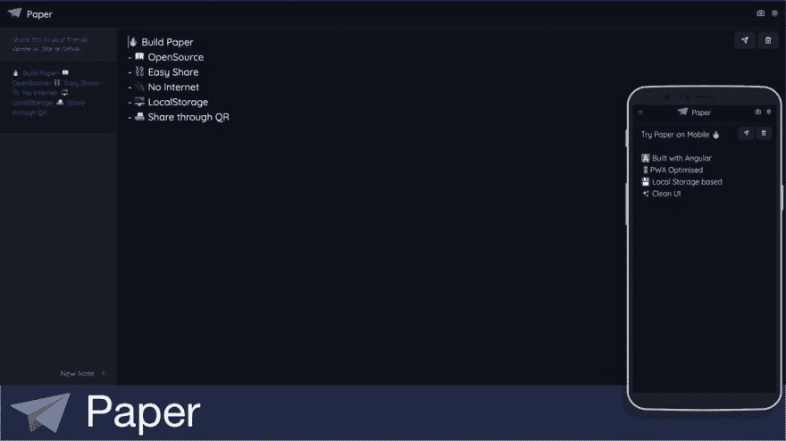
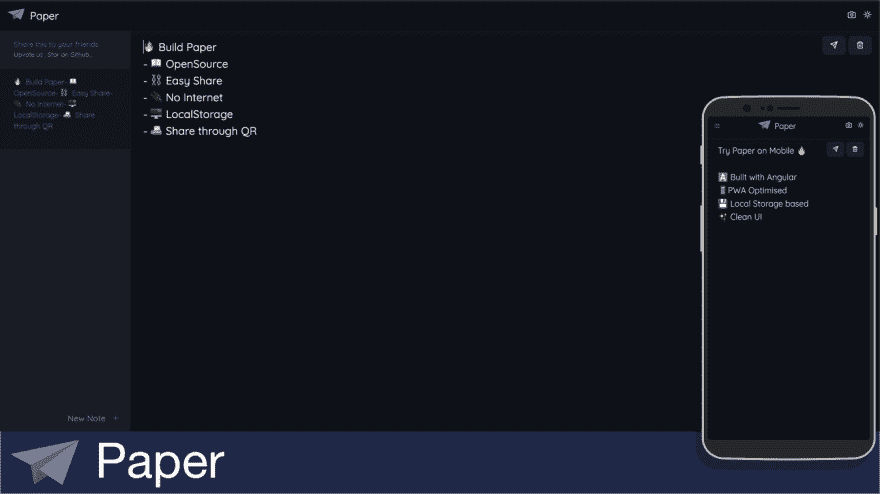

# 🚀Made Paper 是一款离线笔记应用，提供“无网络”分享选项。🖥️🔄📱

> 原文:[https://dev . to/blackmamba/made-paper-an-offline-note-taking-app-with-sharing-4ii 1](https://dev.to/blackmamba/made-paper-an-offline-note-taking-app-with-sharing-4ii1)

[https://www.youtube.com/embed/wXRBCvfp2pQ](https://www.youtube.com/embed/wXRBCvfp2pQ)

纸是我创造的

## [金吉 P👨‍💻🦄](/pjijin)

[👨‍💻Fullstack Developer ⚡️ ✨Laravel ExpressJS 🤘🏻 ⚛️ReactJs VueJs 💻NodeJS PHP 🔥 Firebase 🦄](/pjijin)

[pji Jin](https://twitter.com/PJijin)[pji Jin](https://github.com/PJijin)[https://personal-website . pji Jin 1 . now . sh](https://personal-website.pjijin1.now.sh)

是什么导致了纸的发明？当我们都在做一个兼职项目，想在我们的🖥️之间分享文本/链接时，产生了创造纸张的想法🔄📱计算机/移动，由于 BSNL(印度宽带网络)及其波动的互联网连接，我们想到利用本地存储和二维码开发一个离线笔记共享应用程序。

✅直播预告: [https://paperapp.now.sh](https://paperapp.now.sh)

优点
🔥基于 PWA 的
📖开源
⛓️易分享
🔌没有互联网
🖥️本地存储
📠通过 QR 分享
🌗暗/亮主题
🖥️🔄📱非常适合在 PC 和移动设备/移动设备到移动设备之间共享

缺点
💾有限存储
📳没有基于网络的共享/存储
🐘不支持大文本
📷分享取决于相机，取决于相机质量和背景照明
🖥️🔄🖥️ PC-PC 共享很难实现，因为你不想移动你的笔记本电脑并指向另一台🙄。你可以跳🖥️舞🔄📱🔄🖥️

Paper 是用 Angular 制作的 PWA，它使用本地存储来存储笔记，因此您不能存储超过 10 MB 的笔记，并且不支持通过 QR 共享大型文本(似乎是一个问题)
它使用 QR 码在设备之间共享笔记。

如果你喜欢这个，在 twitter 上分享/关注我们，在 github 上开始吧

> T6】🔥吉欣·帕里雅拉特·⚡️👨‍💻🛠️@ jp 1016 v1🚀在纸上工作
> 一款“无云”笔记应用，支持“无互联网”共享。
> [github.com/JP1016/Paper](https://t.co/wP1YEnvHBo)
> [# OpenSource](https://twitter.com/hashtag/OpenSource)[# Angular](https://twitter.com/hashtag/Angular)[# Maker](https://twitter.com/hashtag/Maker)[# indiedev](https://twitter.com/hashtag/indiedev)[# appdevelopers](https://twitter.com/hashtag/appdevelopers)
> [# github](https://twitter.com/hashtag/github)[# Hacktoberfest](https://twitter.com/hashtag/Hacktoberfest)[# github](https://twitter.com/hashtag/github)
> 🔁RT 如果你喜欢这个2019 年 9 月 16:32pm-2102

##  [ JP1016 ](https://github.com/JP1016) / [论文](https://github.com/JP1016/Paper)

### 🚀一款“无云”笔记应用，支持“无网络”共享。https://paperapp.now.sh

<article class="markdown-body entry-content container-lg" itemprop="text">

# 纸

<g-emoji class="g-emoji" alias="rocket" fallback-src="https://github.githubassets.cimg/icons/emoji/unicode/1f680.png">🚀</g-emoji>一款“无云”笔记应用，支持“无网络”分享。

[T2】](https://raw.githubusercontent.com/JP1016/Paper/master/)

<g-emoji class="g-emoji" alias="white_check_mark" fallback-src="https://github.githubassets.cimg/icons/emoji/unicode/2705.png">✅</g-emoji> 现场预告: [https://paperapp.now.sh](https://paperapp.now.sh)

用<g-emoji class="g-emoji" alias="heart" fallback-src="https://github.githubassets.cimg/icons/emoji/unicode/2764.png">制造的❤️</g-emoji> 用 

## 特征

<g-emoji class="g-emoji" alias="fire" fallback-src="https://github.githubassets.cimg/icons/emoji/unicode/1f525.png">🔥</g-emoji>基于 PWA

<g-emoji class="g-emoji" alias="book" fallback-src="https://github.githubassets.cimg/icons/emoji/unicode/1f4d6.png">📖</g-emoji>开源

<g-emoji class="g-emoji" alias="chains" fallback-src="https://github.githubassets.cimg/icons/emoji/unicode/26d3.png">⛓️</g-emoji> 轻松分享

<g-emoji class="g-emoji" alias="electric_plug" fallback-src="https://github.githubassets.cimg/icons/emoji/unicode/1f50c.png">🔌</g-emoji>没有互联网

<g-emoji class="g-emoji" alias="desktop_computer" fallback-src="https://github.githubassets.cimg/icons/emoji/unicode/1f5a5.png">本地存储</g-emoji>

<g-emoji class="g-emoji" alias="fax" fallback-src="https://github.githubassets.cimg/icons/emoji/unicode/1f4e0.png">📠</g-emoji>通过 QR 分享

<g-emoji class="g-emoji" alias="last_quarter_moon" fallback-src="https://github.githubassets.cimg/icons/emoji/unicode/1f317.png">🌗</g-emoji>深色/浅色主题

## <g-emoji class="g-emoji" alias="handshake" fallback-src="https://github.githubassets.cimg/icons/emoji/unicode/1f91d.png">🤝</g-emoji>贡献

欢迎投稿、问题和功能请求！<g-emoji class="g-emoji" alias="heart_eyes" fallback-src="https://github.githubassets.cimg/icons/emoji/unicode/1f60d.png">😍</g-emoji>

## 表示你的支持

如果这个项目对你有帮助，给一个⭐️奖吧！ <g-emoji class="g-emoji" alias="smiling_face_with_three_hearts" fallback-src="https://github.githubassets.cimg/icons/emoji/unicode/1f970.png">🥰</g-emoji>

如果你喜欢这个应用程序，在 Github 上启动它，在 Twitter 上关注我

Icons made by [Smashicons](https://www.flaticon.com/authors/smashicons "Smashicons") from [www.flaticon.com](https://www.flaticon.com/ "Flaticon")</article>

[View on GitHub](https://github.com/JP1016/Paper)

对产品搜寻
[https://www.producthunt.com/posts/paper-6/](https://www.producthunt.com/posts/paper-6/)投赞成票

🤝欢迎投稿、问题和功能请求！😍