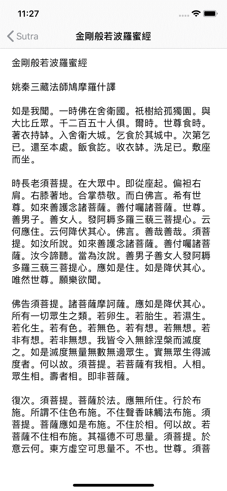
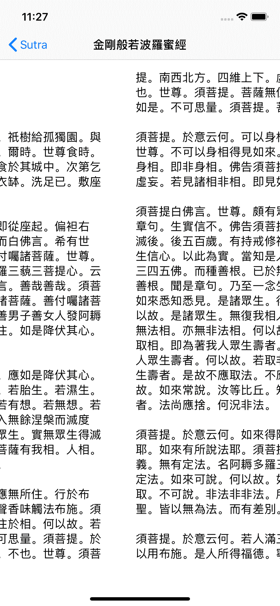
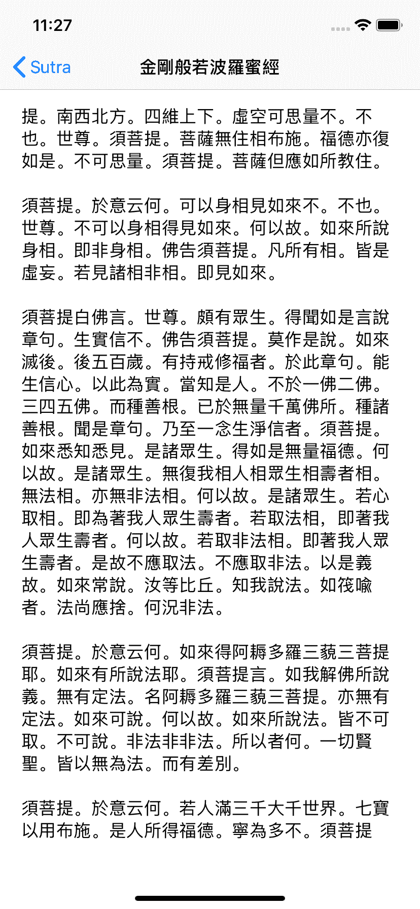
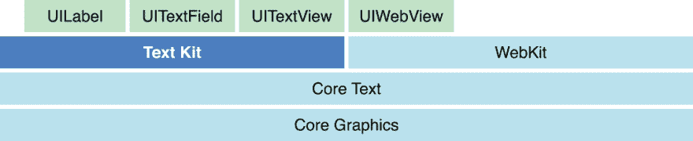
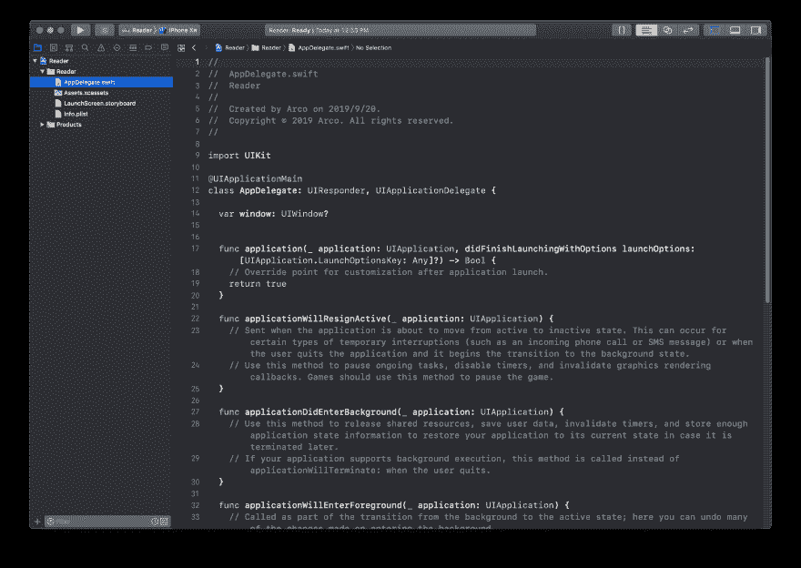
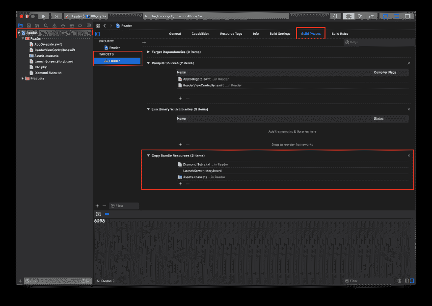
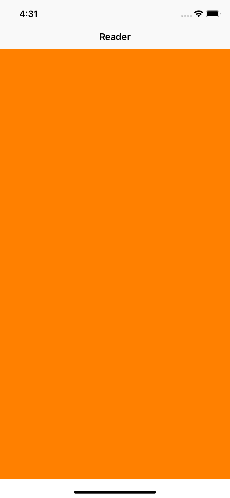
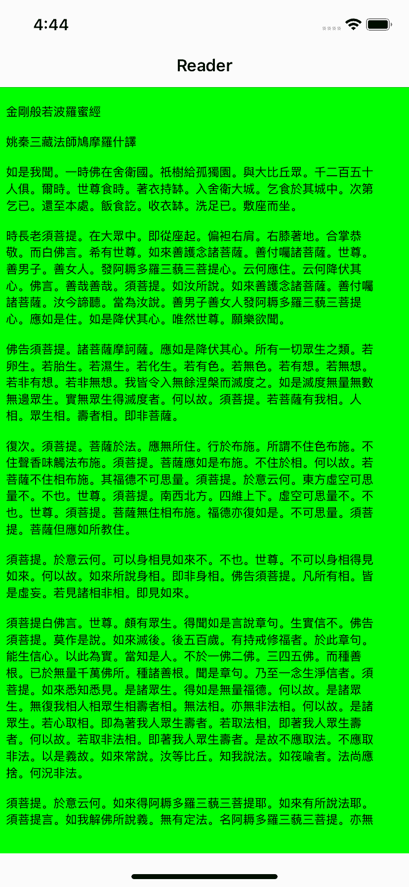
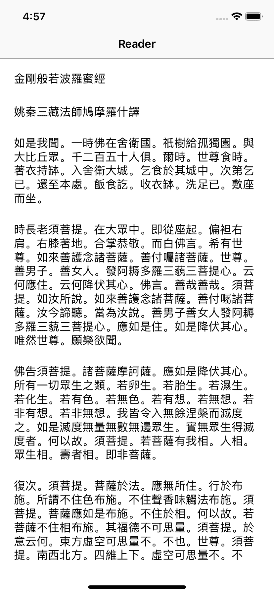
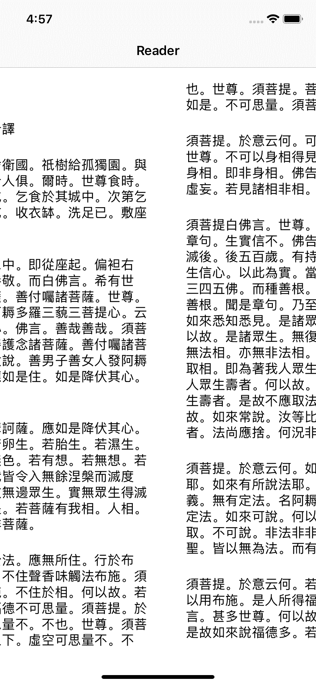

# Making horizontal scrolling Reader with TextKit

> 原文：<https://dev.to/arco_vv/textkit-reader-16c5>

Today, I want to teach you to use TextKit to make a horizontal reading Reader.

## 演示預覽

[](https://res.cloudinary.com/practicaldev/image/fetch/s--JAiVs7N3--/c_limit%2Cf_auto%2Cfl_progressive%2Cq_auto%2Cw_880/https://raw.githubusercontent.com/Arcovv/ImageAssets/master/2019-09-20-textkit-tutorial/Demo_1.png)
[](https://res.cloudinary.com/practicaldev/image/fetch/s--fya7hrl8--/c_limit%2Cf_auto%2Cfl_progressive%2Cq_auto%2Cw_880/https://raw.githubusercontent.com/Arcovv/ImageAssets/master/2019-09-20-textkit-tutorial/Demo_2.png)
[](https://res.cloudinary.com/practicaldev/image/fetch/s--wHyghtiG--/c_limit%2Cf_auto%2Cfl_progressive%2Cq_auto%2Cw_880/https://raw.githubusercontent.com/Arcovv/ImageAssets/master/2019-09-20-textkit-tutorial/Demo_3.png)

## 什麼是文本工具包

TextKit is a powerful tool for managing text storage and executing custom layout of text-based content. There are four categories that need to be recognized and mastered, namely, NSTextStorage, NSLayoutManager, NSTextContainer and TextView corresponding to the platform.

Location of TextKit frame:
[](https://res.cloudinary.com/practicaldev/image/fetch/s--UR_X9eMK--/c_limit%2Cf_auto%2Cfl_progressive%2Cq_auto%2Cw_880/https://raw.githubusercontent.com/Arcovv/ImageAssets/master/2019-09-20-textkit-tutorial/text_kit_arch.png)

## NSTextStorage

NSTextStorage is a subclass of NSMutableAttributedString, which means that you can add and modify the styles in it just as you would with NSAttributedString. At the same time, it is also responsible for managing a series of NSLayoutManager.

You can manage its NSLayoutManager through `addLayoutManager(_:)` and `removeLayoutManager(_:)`.

Finally, it should be noted that NSTextStorage can be accessed by any thread, which means that you can put related text style processing into the background or other non-main threads. Note that you must ensure that only one thread is accessing the NSTextStorage object at a time.

## NSLayoutManager

The NSLayoutManager object is an object that coordinates text layout and presents character held by NSTextStorage. Inside, unicode character are mapped into glyph, set to a series of NSTextContainer objects held by them, and finally presented on the relevant TextView (NSTextView on MacOS and UITextView on iOS).

You can manage the NSTextStorage objects held by it by `addTextContainer(_:)`, `insertTextContainer(_:at:)`, `removeTextContainer(at:)` and other methods.

## NSTextContainer

NSTextContainer will determine its size when it is initialized, and this region is where the text is laid out. Therefore, NSLayoutManager decides when to break lines or lay out the text of the part according to the size of this area.

Basically, the area designated by NSTEXContainer is a rectangle, but you can also tell NSTEXContainer to avoid those positions by adding `exclusionPaths`.

## 文本视图

TextView in TextKit needs to be initialized with different view according to different platforms. In MacOS, we need to use NSTextView for TextKit to present content; While using UITextView in iOS.

## The relationship among them

There is a very famous diagram in the Text Programming Guide to show the relationship between the four:

[](https://res.cloudinary.com/practicaldev/image/fetch/s--GwkaIZHy--/c_limit%2Cf_auto%2Cfl_progressive%2Cq_auto%2Cw_880/https://raw.githubusercontent.com/Arcovv/ImageAssets/master/2019-09-20-textkit-tutorial/textkitarchitecture.png)

The presentation in code is basically as follows:

```
import UIKit

let textStorage = NSTextStorage(attributedString: attributedString)

let textLayout = NSLayoutManager()
textStorage.addLayoutManager(textLayout)

let textContainer = NSTextContainer(size: CGSize(width: 500, height: 500))
textLayout.addTextContainer(textContainer)

let textView = UITextView(
  frame: .init(x: 0, y: 0, width: 500, height: 500),
  textContainer: textContainer
)

PlaygroundPage.current.liveView = textView 
```

Enter fullscreen mode Exit fullscreen mode

## 入门

Create a new project in Xcode, select [T0】 Single View App 【T1], name it [T2】 Reader 【T3], set the Language to [T4】 Swift 【T5], and we can begin.

Since we don't use storyboard, please delete **main. Storyboard** and the corresponding initialization data of Storyboard. In addition, delete [T2】 ViewController.swift 【T3]. We still hope to have a good naming habit when doing any development.

Your Xcode Project will basically look like this:
[](https://res.cloudinary.com/practicaldev/image/fetch/s--9q4ZSCPC--/c_limit%2Cf_auto%2Cfl_progressive%2Cq_auto%2Cw_880/https://raw.githubusercontent.com/Arcovv/ImageAssets/master/2019-09-20-textkit-tutorial/Delete_storyboard.png)

Right-click [T0】 AppDelegate.swift 【T1], select New File and [T2】 Swift File 【T3], name it [T4】 ReaderViewController 【T5], and replace all the contents with the following code:

```
import UIKit

final class ReaderViewController: UIViewController {

  override func viewDidLoad() {
    super.viewDidLoad()

    view.backgroundColor = .white
    navigationItem.title = "Reader"
  }

} 
```

Enter fullscreen mode Exit fullscreen mode

It also replaces all the contents of AppDelegate.swift with the following code:

```
import UIKit

@UIApplicationMain
class AppDelegate: UIResponder, UIApplicationDelegate {

  var window: UIWindow?

  func application(
    _ application: UIApplication,
    didFinishLaunchingWithOptions launchOptions: [UIApplication.LaunchOptionsKey: Any]?)
    -> Bool
  {
    let readerViewControlelr = ReaderViewController()
    let navigationController = UINavigationController(rootViewController: readerViewControlelr)
    window = UIWindow(frame: UIScreen.main.bounds)
    window?.rootViewController = navigationController
    window?.makeKeyAndVisible()
    return true
  }

} 
```

Enter fullscreen mode Exit fullscreen mode

## 导入大文本

Here, I have prepared some [long text content](https://raw.githubusercontent.com/Arcovv/TextKit-Tutorial/master/Reader/Diamond%20Sutra.txt) , dragged it into the project, and added the following method to [T2】 ReaderViewController 【T3]:

```
private func fullContent() -> String {
    let url = Bundle.main.url(forResource: "Diamond Sutra", withExtension: "txt")!
    return try! String(contentsOf: url, encoding: .utf8)
} 
```

Enter fullscreen mode Exit fullscreen mode

You can test whether `print(fullContent().count)` will print the corresponding number in the console in **viewdidload ()** to check whether the function works normally.

> PS: If you encounter an App crash, please go to Project Navigator-Targets-Reader-Build Phases-Copy Bundle Resources to check whether the dragged files are also presented in it. If not, press the plus sign below to add them.

[](https://res.cloudinary.com/practicaldev/image/fetch/s--gOMbe6F0--/c_limit%2Cf_auto%2Cfl_progressive%2Cq_auto%2Cw_880/https://raw.githubusercontent.com/Arcovv/ImageAssets/master/2019-09-20-textkit-tutorial/Bundle_resouces_check.png)

## 设置阅读器

Add `let contentView = UIScrollView()` to [T1】 ReaderViewController 【T2], this view will be used by us to place the scrolling part of the text, and the method of setupContentView () will be added to set our content view:

```
private func setupContentView() {
    contentView.backgroundColor = .orange
    contentView.translatesAutoresizingMaskIntoConstraints = false
    view.addSubview(contentView)

    NSLayoutConstraint.activate([
      contentView.topAnchor.constraint(equalTo: view.safeAreaLayoutGuide.topAnchor),
      contentView.leadingAnchor.constraint(equalTo: view.safeAreaLayoutGuide.leadingAnchor),
      contentView.bottomAnchor.constraint(equalTo: view.safeAreaLayoutGuide.bottomAnchor),
      contentView.trailingAnchor.constraint(equalTo: view.safeAreaLayoutGuide.trailingAnchor)
    ])
} 
```

Enter fullscreen mode Exit fullscreen mode

After running, you should see an orange color screen:
[](https://res.cloudinary.com/practicaldev/image/fetch/s--WSOebJwF--/c_limit%2Cf_auto%2Cfl_progressive%2Cq_auto%2Cw_880/https://raw.githubusercontent.com/Arcovv/ImageAssets/master/2019-09-20-textkit-tutorial/Orange_Screen.png)

> 安装 content view * viewed load()的命令.

Then, add `setupReader()` method and start to build our reader:

```
private func setupReader() {
    // 1
    let attributedString = NSAttributedString(
      string: fullContent(), attributes: [:]
    )

    // 2
    let textStorage = NSTextStorage(attributedString: attributedString)

    // 3
    let textLayout = NSLayoutManager()
    textStorage.addLayoutManager(textLayout)

    // 4
    let textContainer = NSTextContainer(size: contentView.bounds.size)
    textLayout.addTextContainer(textContainer)

    // code here
} 
```

Enter fullscreen mode Exit fullscreen mode

1.  The first step is to construct an NSAttributedString to facilitate the initialization of NSTextStorage. Because we have written the **fullcontent ()** function, we can call it directly and get the text we want to fill in. Attributes is the part of the text style, so we won't deal with it here.
2.  Build our NSTextStorage
3.  Build our NSLayoutManager and add it to textStorage.

Then start processing our TextView section and continue to write in code here:

```
let viewSize = contentView.bounds.size
let textInsets = UIEdgeInsets(top: 16, left: 16, bottom: 16, right: 16)

// 1
var index: Int = 0
var glyphRange: Int = 0
var numberOfGlyphs: Int = 0

repeat {
  // 2
  let textContainer = NSTextContainer(size: viewSize)
  textLayout.addTextContainer(textContainer)

  // 3
  let textViewFrame = CGRect(
    x: CGFloat(index) * viewSize.width,
    y: 0,
    width: viewSize.width,
    height: viewSize.height
  )

  // 4
  let textView = UITextView(
    frame: textViewFrame,
    textContainer: textContainer
  )

  // 5
  textView.isEditable = false
  textView.isSelectable = false
  textView.textContainerInset = textInsets
  textView.showsVerticalScrollIndicator = false
  textView.showsHorizontalScrollIndicator = false
  textView.isScrollEnabled = false
  textView.bounces = false
  textView.bouncesZoom = false

  // 6
  textViews.append(textView)
  contentView.addSubview(textView)

  // 7
  index += 1
  glyphRange = NSMaxRange(textLayout.glyphRange(for: textContainer))
  numberOfGlyphs = textLayout.numberOfGlyphs
} while glyphRange < numberOfGlyphs - 1 // 8 
```

Enter fullscreen mode Exit fullscreen mode

There is a lot of content in this piece, but we can still explain it slowly:

1.  In our Demo preview, the reader can scroll horizontally and continuously, and every text area we see is actually composed and presented by every UITextView. Therefore, we need repeat-while loop to help us deal with this matter, and index/glyphrange/numberofglyghs will help us deal with the conditions of loop.
2.  Construct our NSTextContainer and add it to the textLayout.
3.  Calculate the coordinates of each TextView
4.  Construct UITextView, and pass in our textContainer here
5.  Make some style adjustments to textView to make it look more comfortable during scrolling.
6.  Add each textView to our textViews, and you can calculate how many pages there are based on count; And then add them to the subview of content view.
7.  Through the glyphRange, you can know which point the current glyph has reached, and then compare it with the numberOfGlyphs, and you can judge the interrupt condition.
8.  Calculate when repeat-while is interrupted

將 **setupReader()** 放在 **viewDidLoad** 中運行：

[](https://res.cloudinary.com/practicaldev/image/fetch/s--WSOebJwF--/c_limit%2Cf_auto%2Cfl_progressive%2Cq_auto%2Cw_880/https://raw.githubusercontent.com/Arcovv/ImageAssets/master/2019-09-20-textkit-tutorial/Orange_Screen.png)

Hey? Why are there still no words? We're missing two things here:

*   After calculating and putting each textView into content view, we need to tell content view what your content size is.
*   Our view size is obtained through content view, so we run this code in view did load. What is the size? Of course it is (0, 0).

So, we need to add this code after repeat-while loop:

```
repeat {
    ...
} while glyphRange < numberOfGlyphs - 1 // 8

contentView.contentSize = CGSize(
  width: viewSize.width * CGFloat(textViews.count),
  height: viewSize.height
) 
```

Enter fullscreen mode Exit fullscreen mode

Then take out our **setup reader ()** from **viewdidload ()** and add this code to [T4】 ReaderViewController 【T5]:

```
override func viewDidLayoutSubviews() {
  super.viewDidLayoutSubviews()
  setupReader()
} 
```

Enter fullscreen mode Exit fullscreen mode

**viewdidlayoutsubviews ()** tells us that view has laid out all the subviews under us, so that we can get the correct view size.

[](https://res.cloudinary.com/practicaldev/image/fetch/s--JRg2e5HM--/c_limit%2Cf_auto%2Cfl_progressive%2Cq_auto%2Cw_880/https://raw.githubusercontent.com/Arcovv/ImageAssets/master/2019-09-20-textkit-tutorial/Success_Screen.png)

## 更新样式

Now we still have a few problems to make up for:

*   The background is green. It's ugly.
*   The color of view is not good either.
*   There is no damping effect of page when scrolling left and right.
*   There are still scroll bars under the left and right scroll bars, which are not pretty.
*   The font is too small.
*   The problem is too tight.

先把我們的文本视图和内容视图的**背景色**改成白色；

```
textView.backgroundColor = .white
contentView.backgroundColor = .white 
```

Enter fullscreen mode Exit fullscreen mode

Go to [T0】 setupContentView 【T1] and add something:

```
contentView.showsVerticalScrollIndicator = false
contentView.showsHorizontalScrollIndicator = false
contentView.isPagingEnabled = true 
```

Enter fullscreen mode Exit fullscreen mode

The front two are telling our content view to hide the horizontal and vertical scroll bars; The last one is to tell content view to scroll by paging.

Remember when we initialized attributedString, we didn't add text styles?

```
let attributedString = NSAttributedString(
    string: fullContent(), attributes: [:]
) 
```

Enter fullscreen mode Exit fullscreen mode

Modify this code as follows:

```
let paragraphStyle = NSMutableParagraphStyle()
paragraphStyle.lineHeightMultiple = 1.2

let attributedString = NSAttributedString(
  string: fullContent(),
  attributes: [
    .font: UIFont.preferredFont(forTextStyle: .body),
    .paragraphStyle: paragraphStyle
  ]
) 
```

Enter fullscreen mode Exit fullscreen mode

Is it much more comfortable to run it again now?

[](https://res.cloudinary.com/practicaldev/image/fetch/s--liMUiuKh--/c_limit%2Cf_auto%2Cfl_progressive%2Cq_auto%2Cw_880/https://raw.githubusercontent.com/Arcovv/ImageAssets/master/2019-09-20-textkit-tutorial/Final_1.png)
[T6】](https://res.cloudinary.com/practicaldev/image/fetch/s--1Hs5Ee9h--/c_limit%2Cf_auto%2Cfl_progressive%2Cq_auto%2Cw_880/https://raw.githubusercontent.com/Arcovv/ImageAssets/master/2019-09-20-textkit-tutorial/Final_2.png)

That's all the content of this tutorial. I will put all the codes in [arcovv/textkit-tutorial github](https://github.com/Arcovv/TextKit-Tutorial) . Welcome to ask questions and give directions!