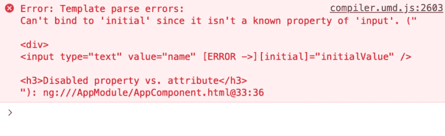

# 属性绑定中的 DOM 属性与 HTML 属性

> 原文:[https://dev . to/deer awan/DOM-property-vs-html-attribute-in-property-binding-48e 4](https://dev.to/deerawan/dom-property-vs-html-attribute-in-property-binding-48e4)

为了更好地理解角度属性绑定是如何工作的，我们需要知道 DOM 属性和 HTML 属性之间的区别。属性绑定是向模板显示来自组件的值的一种方式。

如果我们有这个普通的 HTML，

```
<input type="text" value="name"></input> 
```

如果我们想在 Angular 中绑定一个属性，我们用方括号`[`和`]`将`value`括起来，比如:

```
<input type="text" [value]="name"></input> 
```

我们有`value`和`[value]`。不考虑括号，它们看起来完全一样，但它们是不同的东西。

你必须知道的是

1.  在第一段代码中，`value`是一个 HTML 属性。见 [HTML 输入](https://developer.mozilla.org/en-US/docs/Web/HTML/Element/input#Attributes)。
2.  在第二段代码中，`[value]`中的`value`是一个 DOM 属性。参见 [HTMLInputElement](https://developer.mozilla.org/en-US/docs/Web/API/HTMLInputElement) 。

所以，Angular 在属性绑定中做的永远是目标 DOM 属性，*而不是* HTML 属性。

HTML 属性是否总是与 DOM 属性 1:1 映射？

答案是否定的。

*   其中一些具有 1:1 的映射，例如`value`、`name`、`type`、`id`、`src`
*   其中一些具有不同名称的 1:1 映射，例如`tabindex vs tabIndex`、`rowspan vs rowSpan`、`colspan vs colSpan`
*   有些只存在于 HTML 属性中，例如`role`、`aria`
*   有些只存在于 DOM 属性中，例如`textContent`

# [](#custom-property)自定义属性

Angular 允许我们拥有来自指令或组件的自定义属性。

```
<div [ngStyle]="{'font-size': fontSize}"></div> 
```

`ngStyle`是来自角度指令的自定义属性。其他如`ngClass`、`ngIf`等。

自定义组件示例:

```
<student-list [students]="students"></student-list> 
```

`students`是来自组件`StudentList`的自定义属性，如下所示

`student-list.component.ts`

```
 @Component({
  selector: 'student-list'
  ...
})
export class StudentList {
  @Input() students;
} 
```

从组件的`@Input`读取角度，因此它将识别`students`属性。

属性绑定中 Angular 的默认行为将总是寻找

1.  指令或组件的自定义属性
2.  DOM 属性

如果 Angular 无法从这两个属性中找到属性，它将触发一个错误，例如我们试图指定未知属性`initial`如下:

```
<input type="text" value="name" [initial]="initialValue" /> 
```

[T2】](https://res.cloudinary.com/practicaldev/image/fetch/s--Hwe7oB8I--/c_limit%2Cf_auto%2Cfl_progressive%2Cq_auto%2Cw_880/https://thepracticaldev.s3.amazonaws.com/i/vkmh5vct27atvfxgwcej.jpg)

# [](#summary)总结

Angular 中的属性绑定总是以 DOM 属性而不是 HTML 属性为目标。为了支持自定义属性，Angular 将从指令或组件中查找自定义属性，然后是 DOM 属性。