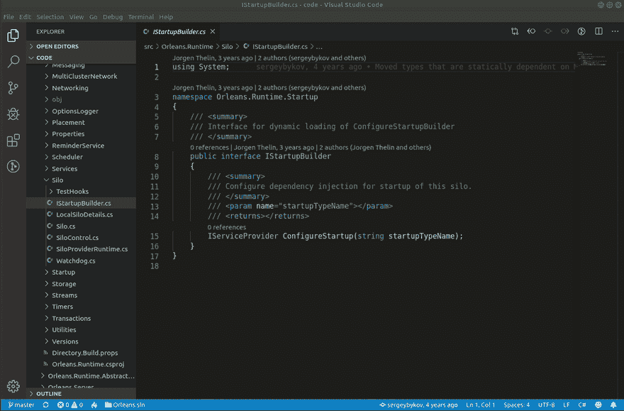
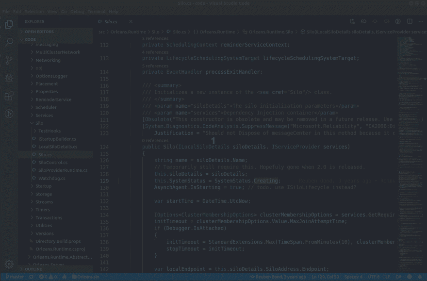
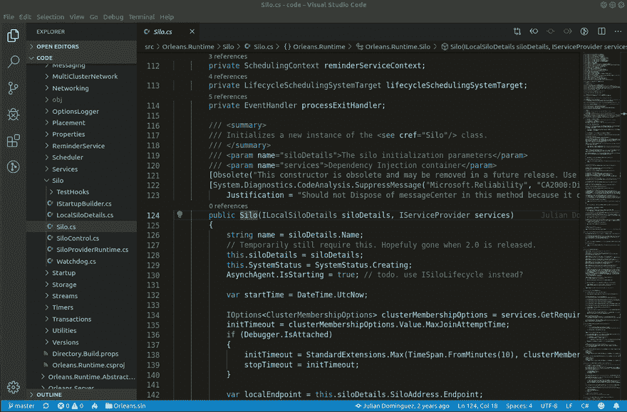
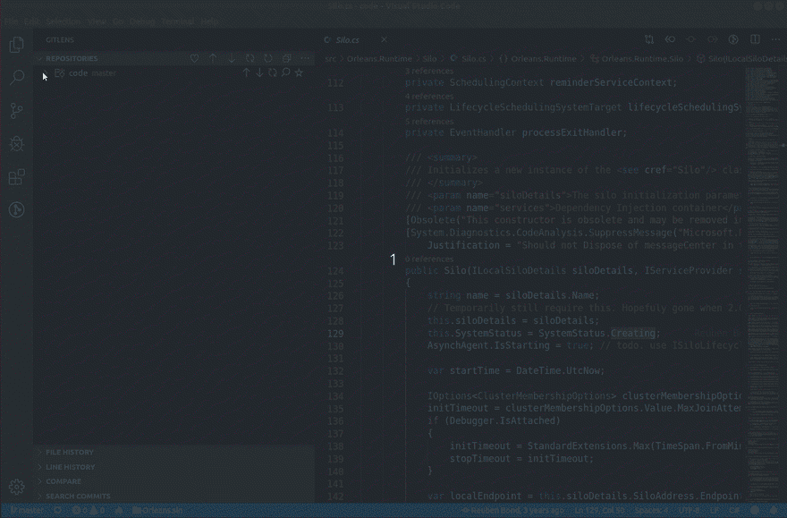

# 吉特斯:我一生中你都去了哪里！

> 原文:[https://dev . to/ai 101 GH/git lens-你一生去过哪里-1c2d](https://dev.to/ai101gh/gitlens-where-have-you-been-all-my-life-1c2d)

最近我越来越多地使用 Visual Studio 代码。我最近偶然发现了 GitLens，我必须说我被它震撼了。

如果我想知道谁最后修改了一行并查看他们对文件所做的所有更改，我只需这样做:

现在假设我有兴趣从一个源文件中找出所有最近的变化，我简单地这样做:

奥莱吉特怪也在那里:

现在，如果我对两个分支或标签之间的变化感兴趣，我可以这样做:

这些只是其中几个伟大的功能。如果您使用 git 和 Visual Studio 代码，这个扩展非常值得一看。