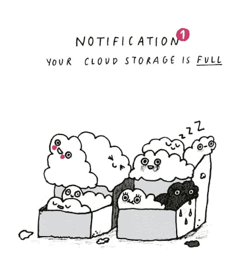
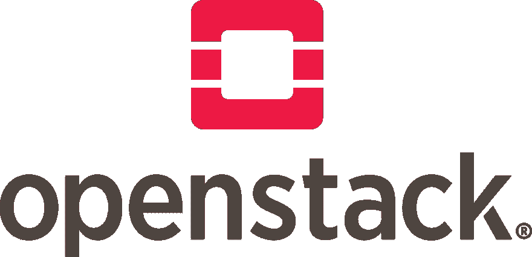

# Cloud 和 OpenStack:简介

> [https://dev . to/openevufcg/cloud-e-open tack-uma-short-introduction Cao-49 CB](https://dev.to/opendevufcg/cloud-e-openstack-uma-breve-introducao-49cb)

# 云计算

云计算或“**云计算**”是一种旨在使应用程序/系统可用的资源更加灵活的技术。在本例中，我们指的是 RAM、内存、CPU 等。通过云，可以创建一个**弹性、动态的基础设施**，也就是说，由于可以按需使用资源**。
 
**为什么云计算对计算的未来如此重要？**让我们举一个实际例子:一个应用。例如，应用程序的增长是**不一致的**。我们可以尝试根据数据估计应用程序的增长或下降趋势，但这仍然是一个复杂的预测。我们会有使用更多资源需求的时段，因为用户数量会增加，反之亦然，在这些资源(例如，由应用程序开发人员购买)闲置的时段中**。这可不好，因为我们想把所有的钱都用在点子上。利用云，用户**动态控制其资源**，同时考虑到当前的需求。这使得**弹性系统**，从而节约了资源和投资。****

 **** 
这里面有一个重要的概念，也是了解这种资源管理的运作方式的关键所在:**资源的提供**。调配的定义之一是:*管理系统运行所需的资源。按需求分配资源。
*

 *管理云资源有多种技术，其中最常用的技术之一是**。
OpenStack 可定义为**多个虚拟化基础架构组件的管理器**。将 OpenStack 想象成一个组件平台，一种云操作系统。OpenStack 使用虚拟资源来运行工具及其组件的组合。这些组件用于创建符合以下云的五项标准的云环境:*国家标准和技术研究院*:网络、分组资源、用户界面、功能调配和自动资源分配/控制。**

 *** * *

# 开放叠:概念

现在您已经了解云计算的含义及其对计算的重要性，并已向 openstack 及其组件介绍了一些重要概念，在处理云计算时需要了解这些概念:

例

该实例只不过是一个虚拟机，其映像、安全组和其他设置已由 OpenStack 管理。

图片

实例映像是实例使用的操作系统。就像我们通常使用的图像的. iso 格式一样，OpenStack 中最常用的云标准格式是 qcow2。此格式的图像可以在大多数发行版的网站上找到，也可以在 OpenStack 网站上找到。

**网络**

OpenStack 的网络功能相当完备。顾名思义，此区域侧重于网络连接，允许为实例创建虚拟网络。这些网络既可以是公共网络，也可以是私人网络。在网络部分，您还可以创建虚拟路由器来连接网络，从而创建公共网络，即连接到 internet。

安全组

可以将安全组定义为应用于实例的防火墙规则集。这些规则由用户根据实例的需要定义。如果用户未创建安全组，OpenStack 将设置一个默认组，默认情况下该组将阻止所有内容。这种阻止所有内容并通过安全组逐步释放访问权限的策略对于实例安全性和完全访问控制至关重要。

**卷**

卷是保留实例数据的虚拟磁盘。将音量想像成电脑上安装的 HD。即使实例重新启动，数据也位于该位置。如果您的实例未使用卷启动，则不会保存数据。

**身份**

这部分是关于 OpenStack 的访问控制。在 Horizon 界面中，您可以创建项目、用户、设置密码，从而控制用户的访问和权限。

**查韦斯公园**

默认情况下，要通过 SSH 访问实例，通常需要在 OpenStack 中注册用户生成的公共密码。注册后，只需在创建实例时应用它即可。

**口味**

flavors 是一组预先确定的配置，用于定义实例特性，如内存和存储容量。也可以理解为服务器可用。可以创建多个 flavors 并将其应用于不同的实例。

* * *

# OpenStack:组件

由于 OpenStack 充当组件管理器，因此了解每个组件的作用非常重要:每个组件都有其管理云基础架构的责任。因为有许多组件，所以我们不需要详细了解每个组件，所以我们将概括介绍最常用的组件:

## OpenStack 计算(Nova)

负责虚拟化框架。它是访问和全面管理 OpenStack 计算资源(包括编程、构建和删除)的工具。

它与虚拟机管理程序(硬件和操作系统之间的软件层)不兼容，并且与大多数虚拟机管理程序兼容。

## 露天堆块堆存煤渣(煤渣)

负责新的 OpenStack 阵列服务。
使用 Cinder，您可以通过 Horizon 界面或 CLI 管理卷。

## OpenStack 对象存储(Swift)

它是一项高度容错的服务，用于存储和检索非结构化数据对象。虽然 Cinder 负责数量，但 Swift 负责对象。

## OpenStack 影像服务(一瞥)

负责虚拟机映像功能。它存储和检索来自多个位置的虚拟机磁盘映像。

## OpenStack 联网(中子)

负责 OpenStack 的网络服务功能。将网络连接到其他 OpenStack 服务。

## OpenStack 标识(KeyStone)

负责身份验证和授权，定义访问 OpenStack 功能的规则。它也是所有服务的端点目录。

## OpenStack 仪表盘(Horizon)

提供用于访问 OpenStack 服务的 web 界面。

根据云服务的需要，基础架构管理员可以插入其他组件，例如 OpenStack monasca，该组件可作为计算机的监控系统(有关详细信息，请访问 openstack 的“T1 组件”页面)。

* * *

## 打开塔克:第一步

您可以使用 OpenStack 开始新的步骤，而无需拥有多台计算机的云基础架构，解决方法如下:**【open stack AIO】**(一体化)。

在 OpenStack 中，您可以创建映像、升级实例、设置安全组、集成公钥和其他功能。不同之处在于，所有操作都只能在一台计算机上运行，例如，可以使用虚拟机。这就是为什么它被认为是 OpenStack 的实验室。openstack 网站上有一个专门的解决方案区域，提供了安装和配置的完整步骤。

还必须指出的是，openstack aio 集成到了为同时管理多台机器而设计的自动化工具**。现在了解焦虑最重要的部分是你的《花花公子》。playbooks 是一组 Plays(指令)，ansible 可以通过它们逐步配置配置过程，这是一个与 shell 脚本非常相似的结构。这些基本上是易于阅读的说明，说明如何进行配置，以便在远程计算机或不同主机上执行活动。**

 **对于 OpenStack 的管理和管理，我们有两种选择:上面提到的 web 界面 Horizon 或‘t1’【open stack-CLI】(客户端行界面)。地平线控制面板包含多个与本材料中已讨论的概念相关的标签。

最后，当我们想到计算的未来时，不可能不想到云。资源是我们地区最大的限制因素之一，因此我们必须以最聪明、最有意识的方式利用资源。OpenStack 之类的工具，以及移动项目的整个开源社区，为我们提供了一个将来仅用于计算的边界的视图。

* * *

非常感谢你的阅读！注意:很快，我们将在 **dev.to** 收到来自 opendevufcg 投稿人的新文章。陪同 openevufcg no[Twitter](https://twitter.com/OpenDevUFCG)、no [Instagram](https://instagram.com/OpenDevUFCG) 当然还有 [GitHub](https://github.com/OpenDevUFCG) 。*********