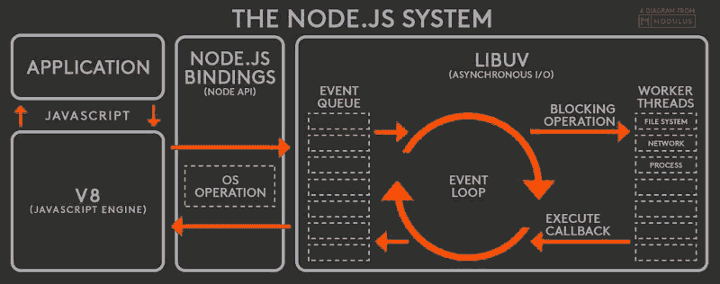

# 事件驱动编程和节点 JS 快速回顾

> 原文:[https://dev . to/thecodesblog/event-driven-programming-and-node-js-quick-review-1fe 2](https://dev.to/thecodersblog/event-driven-programming-and-node-js-quick-review-1fe2)

**事件驱动编程**是一种编程范式，其中程序流程由用户动作(鼠标点击、按键)、传感器输出或来自其他程序/线程的消息等事件决定。实际上，这意味着应用程序作用于事件。

#### NodeJS 线程模型

*   NodeJS 是单线程的。
*   *事件循环*提供 NodeJS 事件驱动编程。
*   *事件循环*调度任务(/事件)
*   每次事件发生时，它都被放入节点的事件队列中
*   在事件循环的每次迭代中，会有一个事件出队并被处理。
*   如果在这个过程中，事件创建了任何额外的事件，那么它们会随着回调被简单地添加到队列的末尾
*   NodeJS 使用回调来避免等待阻塞 I/O。
*   当执行事件时，控制返回到事件循环，并处理另一个事件。
*   当 NodeJS 事件队列上的所有事件都被执行时，NodeJS 终止应用程序。

#### 系统节点

[T2】](https://res.cloudinary.com/practicaldev/image/fetch/s--Kkhd7W8q--/c_limit%2Cf_auto%2Cfl_progressive%2Cq_auto%2Cw_880/https://thecodersblog.com/uploads/687474703a2f2f692e737461636b2e696d6775722e636f6d2f4c6273397a2e706e6770.png)

**NodeJS 的构建模块:**

*   反应器模式
*   libuv
*   绑定集
*   V8
*   核心 JS 库

* *I/O 速度慢:** I/O 是计算机的基本操作，速度很慢。访问 RAM 只需几纳秒，而访问磁盘或网络上的数据只需几毫秒。

* *阻塞 I/O: ** 传统上，一个系统调用一个 I/O 请求，该请求到达一个 web 服务器并被分配给一个可用的线程，或者每个并发连接都有一个线程。在该线程上持续处理请求，直到请求完成并发送响应。当处理函数间的数据时，如 GetFile(文件)& Open(文件)会有一些空闲时间。线程消耗内存，所以每个连接的长时间运行的线程&不使用它是没有效率的。

**传统的非阻塞 I/O:** 系统调用不等待数据读写就立即返回(*又名操作完成* ) * *。** 如果在调用时没有可用的结果，该函数将简单地返回一个预定义的常数，表明此时没有可返回的数据。一个循环遍历资源，当找到资源时(*操作完成*)它被返回。这个循环消耗 CPU 来迭代大部分时间不可用的资源。这被称为忙等待。传统的非阻塞 I/O

* *事件解复用:**

*   这是一种现代的非阻塞 I/O 方式。
*   对于高效的非阻塞 I/O，有同步事件解复用器(*又名* : *事件通知接口*)
*   它收集来自请求和阻塞(*闲置*)的 I/O 事件并对其进行排队，直到有新的事件可供处理。
*   每个事件都与特定的操作相关联。
*   在要监视的资源组上设置事件通知程序。
    *   这个调用是同步的，并且阻塞(*空闲时间*)直到任何被监视的资源准备好进行读取。
    *   当被监视的资源正在被处理并且有一组新的事件可供处理时，事件多路分解器从被监视的资源返回。
*   处理由事件多路分解器返回的每个事件。
*   当处理完所有事件后，流程将再次阻塞(*在事件解复用器上的*之间将有一段空闲时间)，直到新的事件再次可供处理。**这叫做事件循环。**
*   这样，几个 I/O 操作可以在一个线程中处理。
*   **优点**:
    *   最小化空闲时间
    *   让一个线程处理多个请求

##### **反应堆模式**

*   反应器模式有一个处理程序(对于 Nodejs，有一个**回调函数** _)与每个 I/O 操作相关联。
*   当事件循环产生和处理事件时，调用这个处理程序/回调函数。

###### 使用反应器模式的应用程序会发生什么？

*   应用程序通过向事件解复用器提交请求来生成 I/O 请求
    *   应用程序还指定了操作完成时将调用的处理程序/回调函数
*   向事件解复用器提交新请求是一个非阻塞调用，它会立即将控制权返回给应用程序。
*   当 I/O 操作完成时，事件多路分解器将新事件推入事件队列。
*   此时，事件循环遍历事件队列中的项目。
*   对于每个事件，都会调用相关的回调函数。
*   回调函数将在事件循环执行完成时将控制权交给事件循环。
*   在回调函数的执行过程中，可能会请求新的异步操作，从而导致新的操作被插入到事件解复用器中
*   当处理完事件队列中的所有项目，并且事件多路分解器中没有挂起的操作时，Node.js 应用程序将自动退出。

###### libuv -非阻塞 I/O 引擎

*   它发音为“lib u v”
*   每个操作系统都有自己的事件解复用器接口
    *   例如:Linux 上的 epoll，Mac 上的 kqueue on，Windows 上的 T2 IOCP
*   根据请求的类型，即使在同一个操作系统中，每个 I/O 操作的行为也会有很大的不同。
    *   这造成了不一致性
    *   为了克服这种不一致性，Nodejs 核心团队构建了 libuv
*   libuv 是一个 C 库，创建它是为了让 Node.js 兼容每一个操作系统&规范不同操作系统类型的非阻塞行为。
*   **libuv 是一个低级 I/O 引擎**
*   它实现了[反应器模式](https://gist.github.com/amandeepmittal/aa55378c964184fa23c3d21f6848c27d#reactor-pattern)，提供了创建偶数循环、管理事件队列、运行异步 I/O 操作的 API。

###### 套绑定

*   负责将 libuv 和其他底层功能包装和公开给 JavaScript。

###### V8

*   JavaScript 运行时引擎
*   编译并执行 JS
*   由谷歌为 Chrome 浏览器开发
*   Nodejs 速度快的原因
*   V8 因其革命性的设计、速度和高效的内存管理而备受赞誉。

###### 核心 JS 库

实现高级 Node.js API 的核心 JavaScript 库(称为 node-core)