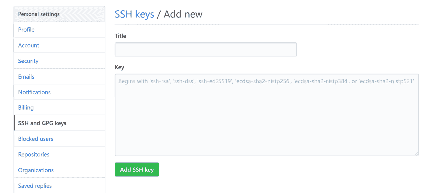

# 使用 SSH 连接到 Github(Windows)

> 原文:[https://dev . to/harshadranganathan/connecting-to-github-with-ssh-windows-a6h](https://dev.to/harshadranganathan/connecting-to-github-with-ssh-windows-a6h)

## [](#prerequisites)先决条件

*   去吧，巴什

## [](#when-to-use-ssh-keys-instead-of-https)何时使用 SSH 密钥代替 HTTPS

*   您的公司防火墙阻止端口 22，那么即使您已经将远程源设置为使用 HTTPS url，身份验证也会失败，因为它是通过 SSH 完成的。

补救措施是设置 SSH 密钥，并通过 HTTPS 端口 443 使用 SSH。

下面是一些不同的应用程序抛出的错误时，该端口被封锁和 HTTPS 远程网址被使用。

### [](#git-bash)去巴士拉

当您尝试推送您的更改时，`Github Login`和`OpenSSH`提示询问您的用户名和密码将会失败，并出现错误`remote no anonymous write access. fatal authentication failed for github`。

### [](#github-desktop-application)Github 桌面应用

您将能够登录到您的 github 桌面应用程序，因为认证是通过 HTTPS 完成的。但是，当您尝试推送您的更改时，将会导致身份验证失败。

下面是桌面应用程序捕获的日志，显示 git push 试图通过 SSH 进行身份验证。

```
2019-09-22T13:16:46.927Z - info: [ui] Executing push: git -c credential.helper= -c protocol.version=2 push origin master:master --progress (took 21.740s)
2019-09-22T13:16:46.927Z - error: [ui] `git -c credential.helper= -c protocol.version=2 push origin master:master --progress` exited with an unexpected code: 128.
stderr:
ssh: connect to host github.com port 22: Connection timed out
fatal: Could not read from remote repository.

Please make sure you have the correct access rights
and the repository exists.

(The error was parsed as 2: Authentication failed. Some common reasons include:

- You are not logged in to your account: see File > Options.
- You may need to log out and log back in to refresh your token.
- You do not have permission to access this repository.
- The repository is archived on GitHub. Check the repository settings to confirm you are still permitted to push commits.
- If you use SSH authentication, check that your key is added to the ssh-agent and associated with your account.) 
```

## [](#generate-new-ssh-key)生成新的 SSH 密钥

*   运行 Git Bash。

*   使用您的电子邮件 id 作为注释生成 SSH 密钥。

```
$ ssh-keygen -t rsa -b 4096 -C "your_email@example.com" 
```

*   当提示您“输入保存密钥的文件”时，按 Enter 键将密钥保存在默认位置(/c/Users/username/)。ssh/id_rsa)。您的公钥也将保存在这里。

*   将公钥复制到剪贴板。

```
$ clip < ~/.ssh/id_rsa.pub 
```

## [](#add-public-ssh-key-to-your-github-account)将公共 SSH 密钥添加到您的 GitHub 帐户

转到 Github 帐户中的`Settings`添加 SSH 公钥。

在`SSH keys`选项卡下，选择`New SSH key`。

给出一个标题，并将密钥粘贴到文本区域。

[T2】](https://rharshad.com/assets/img/2019/09/github-ssh-keys.png)

## [](#add-private-ssh-key-to-the-sshagent)向 ssh-agent 添加私有 SSH 密钥

Git bash 工具附带了一个 ssh 代理。

在 git bash 中运行下面的命令，创建一个新的`~/.profile` (or) `~/.bashrc`文件。

```
$ vi ~/.profile 
```

将下面的脚本粘贴到您的`~/.profile` (or) `~/.bashrc`文件中，以便在您运行 git bash shell 时自动启动 ssh-agent。

```
env=~/.ssh/agent.env

agent_load_env () { test -f "$env" && . "$env" >| /dev/null ; }

agent_start () {
    (umask 077; ssh-agent >| "$env")
    . "$env" >| /dev/null ; }

agent_load_env

# agent_run_state: 0=agent running w/ key; 1=agent w/o key; 2= agent not running
agent_run_state=$(ssh-add -l >| /dev/null 2>&1; echo $?)

if [! "$SSH_AUTH_SOCK"] || [$agent_run_state = 2]; then
    agent_start
    ssh-add
elif ["$SSH_AUTH_SOCK"] && [$agent_run_state = 1]; then
    ssh-add
fi

unset env 
```

这个脚本将从您的默认位置`~/.ssh/id_rsa`加载 ssh 代理中的身份。

```
Identity added: /c/Users/username/.ssh/id_rsa (your_email@example.com) 
```

## [](#use-ssh-over-https)在 HTTPS 上使用 SSH

只有当您的公司防火墙阻止端口 22 时，才需要此步骤。

在您的`.ssh`目录中创建一个新的配置文件，即/c/Users/username/。ssh/config

将以下内容粘贴到文件中，以使用端口 443 通过 SSH 连接到主机`ssh.github.com`。

```
Host github.com
  Hostname ssh.github.com
  Port 443 
```

在 git bash 中运行下面的命令，验证配置正在工作。忽略任何身份验证失败。

```
$ ssh -vT git@github.com

OpenSSH_8.0p1, OpenSSL 1.1.1c 28 May 2019
debug1: Reading configuration data /c/Users/username/.ssh/config
debug1: /c/Users/username/.ssh/config line 1: Applying options for github.com
debug1: Connecting to ssh.github.com [192.30.253.122] port 443.
debug1: Connection established. 
```

您可以看到 SSH 连接现在是通过端口 443 建立的。

## [](#verification)验证

要检查是否一切正常，请执行以下步骤:

*   运行新的 git bash shell。

*   检查身份是否已添加到 ssh 代理中。

```
$ ssh-add -l 
```

*   通过尝试连接到[git@github.com](mailto:git@github.com)来检查密钥是否被使用。

```
$ ssh -vT git@github.com

OpenSSH_8.0p1, OpenSSL 1.1.1c 28 May 2019
debug1: Reading configuration data
debug1: Offering public key
debug1: Server accepts key
debug1: Authentication succeeded (publickey).
Authenticated to ssh.github.com 
```

*   使用 SSH url 克隆存储库。

接下来，每次推/拉都将使用 SSH 密钥向 Github 认证。

## [](#references)参考文献

[https://help . github . com/en/articles/connecting-to-github-with-ssh](https://help.github.com/en/articles/connecting-to-github-with-ssh)

[https://help . github . com/en/articles/using-ssh-over-the-https-port](https://help.github.com/en/articles/using-ssh-over-the-https-port)