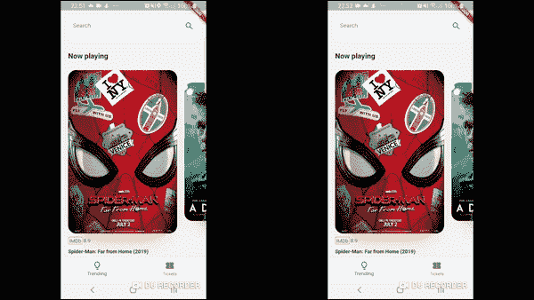

# 在颤动英雄动画中使用自定义曲线

> 原文：<https://dev.to/orestesgaolin/using-custom-curve-in-flutter-hero-animations-4bom>

有时默认的英雄行为是不够的，你想添加一些自定义的味道。一个简单的方法是自定义过渡动画的曲线。

在这篇文章中，你会看到一个例子，允许使用任何自定义曲线来动画英雄的边界。在我的例子中，它在垂直轴上扩张得更快一些。

[](https://res.cloudinary.com/practicaldev/image/fetch/s--pdrB0JJS--/c_limit%2Cf_auto%2Cfl_progressive%2Cq_66%2Cw_880/https://roszkowski.dimg/hero.gif)

**内容**

*   英雄地产
*   什么是创建中间
*   如何更改默认实现

# 英雄属性

Hero 类有几个方便的属性，允许定制它的行为。这些是:

*   允许通过添加旋转或淡入淡出过渡来包装或改变整个英雄动画
*   这让我们有可能在之前被动画窗口小部件占据的地方显示窗口小部件
*   这是一个在动画中决定英雄边界的函数——这就是我们今天想要定制的

# 什么是 createRectTween

这个属性接受一个`CreateRectTween`函数，这个函数只是`Tween<Rect> Function(Rect begin, Rect end)`的 typedef。

这意味着它在`begin`和`end`状态之间插入了两个矩形。默认情况下,`RectTween(begin: begin, end: end)`用于英雄。它使用它的 [lerp](https://api.flutter.dev/flutter/dart-ui/Rect/lerp.html) 方法，除了少数断言外，只以线性方式插值矩形坐标:

```
static Rect lerp(Rect a, Rect b, double t) {
  assert(t != null);
  if (a == null && b == null)
    return null;
  if (a == null)
    return Rect.fromLTRB(b.left * t, b.top * t, b.right * t, b.bottom * t);
  if (b == null) {
    final double k = 1.0 - t;
    return Rect.fromLTRB(a.left * k, a.top * k, a.right * k, a.bottom * k);
  }
  return Rect.fromLTRB(
    lerpDouble(a.left, b.left, t),
    lerpDouble(a.top, b.top, t),
    lerpDouble(a.right, b.right, t),
    lerpDouble(a.bottom, b.bottom, t),
  );
} 
```

<svg width="20px" height="20px" viewBox="0 0 24 24" class="highlight-action crayons-icon highlight-action--fullscreen-on"><title>Enter fullscreen mode</title></svg> <svg width="20px" height="20px" viewBox="0 0 24 24" class="highlight-action crayons-icon highlight-action--fullscreen-off"><title>Exit fullscreen mode</title></svg>

方法`lerpDouble`是插值发生的地方:

```
double lerpDouble(num a, num b, double t) {
    if (a == null && b == null) return null;
    a ??= 0.0;
    b ??= 0.0;
    return a + (b - a) * t;
} 
```

<svg width="20px" height="20px" viewBox="0 0 24 24" class="highlight-action crayons-icon highlight-action--fullscreen-on"><title>Enter fullscreen mode</title></svg> <svg width="20px" height="20px" viewBox="0 0 24 24" class="highlight-action crayons-icon highlight-action--fullscreen-off"><title>Exit fullscreen mode</title></svg>

# 如何改变默认实现

当定义你的英雄时，你应该像这样返回一个自定义的`createRectTween`函数:

```
Hero(
    tag: index,
    createRectTween: (begin, end) {
        return CustomRectTween(a: begin, b: end);
    },
    child: Poster(),
), 
```

<svg width="20px" height="20px" viewBox="0 0 24 24" class="highlight-action crayons-icon highlight-action--fullscreen-on"><title>Enter fullscreen mode</title></svg> <svg width="20px" height="20px" viewBox="0 0 24 24" class="highlight-action crayons-icon highlight-action--fullscreen-off"><title>Exit fullscreen mode</title></svg>

最后，`CustomRectTween`必须扩展`RectTween`并覆盖`lerp`方法。

参数`t`是 0.0 到 1.0 之间的动画时钟值。每个`Curve`可用于在曲线上插入 0.0 到 1.0 之间的任何给定值。在这个例子中，我使用了自定义的三次曲线。

```
class CustomRectTween extends RectTween {
  CustomRectTween({this.a, this.b}) : super(begin: a, end: b);
  final Rect a;
  final Rect b;

  @override
  Rect lerp(double t) {
    Curves.elasticOut.transform(t);
    //any curve can be applied here e.g. Curve.elasticOut.transform(t);
    final verticalDist = Cubic(0.72, 0.15, 0.5, 1.23).transform(t);

    final top = lerpDouble(a.top, b.top, t) * (1 - verticalDist);
    return Rect.fromLTRB(
      lerpDouble(a.left, b.left, t),
      top,
      lerpDouble(a.right, b.right, t),
      lerpDouble(a.bottom, b.bottom, t),
    );
  }

  double lerpDouble(num a, num b, double t) {
    if (a == null && b == null) return null;
    a ??= 0.0;
    b ??= 0.0;
    return a + (b - a) * t;
  }
} 
```

<svg width="20px" height="20px" viewBox="0 0 24 24" class="highlight-action crayons-icon highlight-action--fullscreen-on"><title>Enter fullscreen mode</title></svg> <svg width="20px" height="20px" viewBox="0 0 24 24" class="highlight-action crayons-icon highlight-action--fullscreen-off"><title>Exit fullscreen mode</title></svg>

需要注意的是，我只想改变英雄矩形的`top`坐标，所以在计算值时，我使用了`(1 - verticalDist)`(从而反转曲线)。

我希望你会发现它很有用，并尝试自己使用 Hero widget。

我强烈推荐颤振社区的切马·莫利斯的帖子[精通颤振中的英雄动画](https://medium.com/flutter-community/mastering-hero-animations-in-flutter-bc07e1bea327)。