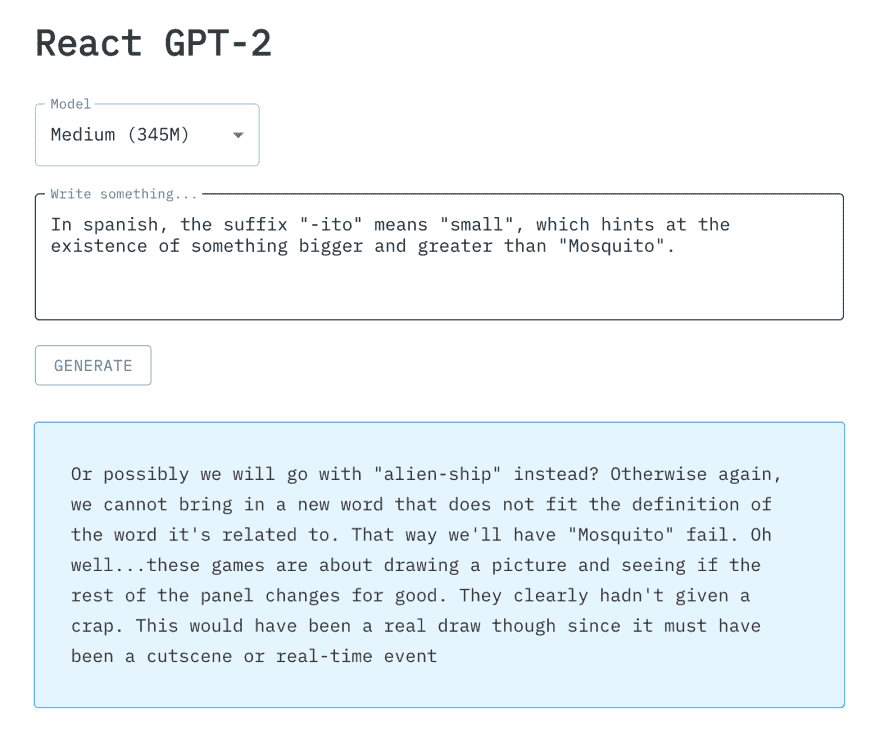

# 如何将 OpenAI 的 GPT-2 与 React 和 Flask 一起使用

> 原文：<https://dev.to/molamk/text-generation-with-openai-s-gpt-2-react-and-flask-27jk>

## 简介

在本教程中，我们将构建一个具有 GPT 2 功能的 Flask & React 应用程序。我们将一步一步来，通过调整生成器的*“接口”*，然后我们将构建 Flask 服务器，最后是 React 前端。

本教程结束时，我们的应用程序应该是这样的:

[](https://res.cloudinary.com/practicaldev/image/fetch/s--F1SKRaxp--/c_limit%2Cf_auto%2Cfl_progressive%2Cq_auto%2Cw_880/https://thepracticaldev.s3.amazonaws.com/i/08xvqqgideapb7dnu5ef.png)

## 用 GPT 生成文本-2

多亏了 [pytorch-transformers](https://github.com/huggingface/pytorch-transformers) ，玩最先进的 NLP 模型真的很容易。我们将使用在`pytorch-transformers/examples/run_generation.py`中找到的食谱作为我们应用程序的模板。

首先，让我们安装我们的依赖项

```
# Download the transformers package
pip3 install pytorch-transformers

# Get only the text generation file from the repository
wget https://raw.githubusercontent.com/huggingface/pytorch-transformers/master/examples/run_generation.py 
```

现在我们已经有了我们的生成脚本，我们需要对它做一点修改，以便它可以很好地与我们的 Flask 应用程序配合。脚本本身通常是一个带参数的 CLI 工具，就像这样。

```
python3 ./run_generation.py \
    --model_type=gpt2 \
    --length=20 \
    --model_name_or_path=gpt2 \
    --promt="Hello world" 
```

但是因为我们想从 Flask 应用程序中调用文本生成功能，所以需要做一些更改。首先让我们将`main()`重命名为`generate_text()`，并给它一些参数。如果我们直接在 shell 中运行它，这些参数与我们通常给出的参数完全相同。下面是它的样子

```
def generate_text(
    padding_text=None,
    model_type='gpt2',
    model_name_or_path='gpt2',
    prompt='',
    length=20,
    temperature=1.0,
    top_k=0,
    top_p=0.9,
    no_cuda=True,
    seed=42,
):
    # Set the seed manually
    np.random.seed(seed)
    torch.manual_seed(seed)
    if n_gpu > 0:
        torch.cuda.manual_seed_all(seed)

    # The rest of the old main() code
    # We just need to replace args.* with
    # the corresponding function's arguments
    ... 
```

就是这样！现在，我们准备通过带有 Flask 的 REST API 来公开我们的特性。

## 构建烧瓶 app

我们的服务器将非常精简，只有一个端点处理一个`POST`请求。在正文中，我们将提供`text`，它将作为 GPT-2 生成东西的*“提示”*。我们还将给出一个`model`，它可以是 3 个 GPT-2 模型中的一个，即小型(117 米)、中型(345 米)和大型(774 米)。

```
from flask import Flask, abort, jsonify, request
from flask_cors import CORS, cross_origin

from .run_generation import generate_text

app = Flask(__name__)
cors = CORS(app)
app.config['CORS_HEADERS'] = 'Content-Type'

@app.route("/generate", methods=['POST'])
@cross_origin()
def get_gen():
    data = request.get_json()

    if 'text' not in data or len(data['text']) == 0 or 'model' not in data:
        abort(400)
    else:
        text = data['text']
        model = data['model']

        result = generate_text(
            model_type='gpt2',
            length=100,
            prompt=text,
            model_name_or_path=model
        )

        return jsonify({'result': result}) 
```

## 前端工作

既然我们已经设置了我们的 Flask 服务器，是时候构建前端了。我们将有一个简单的表单，它接受一个`model`和一个输入`text`(提示)的 textarea。我还使用了[材质界面](https://material-ui.com)来设计奇特的表单控件。好吧，让我们设置我们的反应应用

```
# Create the app
create-react-app gpt2-frontend
cd gpt2-frontend

# Add some dependencies
yarn add @material-ui/core node-sass axios 
```

我们还将使用 [React 钩子](https://reactjs.org/docs/hooks-intro.html)来处理状态。我无耻地从[这篇非常透彻的文章](https://medium.com/@jaryd_34198/seamless-api-requests-with-react-hooks-part-2-3ab42ba6ad5c)中复制粘贴了 API 相关的样板文件。这是我们的`App.js`看起来的样子

```
function App() {
  const [text, setText] = useState("");
  const [model, setModel] = useState('gpt2');
  const [generatedText, postGenerateText] = postGenerateTextEndpoint();

  const generateText = () => {
    postGenerateText({ text, model, userId: 1 });
  }

  return (
    <div className='app-container'>
      <form noValidate autoComplete='off'>
        <h1>React GPT-2</h1>
        <SelectBox model={model} setModel={setModel} />
        <TextBox text={text} setText={setText} />
        <Button onClick={generateText} />
      </form>

      {generatedText.pending &&
        <div className='result pending'>Please wait</div>}

      {generatedText.complete &&
        (generatedText.error ?
          <div className='result error'>Bad Request</div> :
          <div className='result valid'>
            {generatedText.data.result}
          </div>)}
    </div>
  );
} 
```

## 从 Github 抓取代码

[https://github.com/molamk/gpt2-react-flask](https://github.com/molamk/gpt2-react-flask)