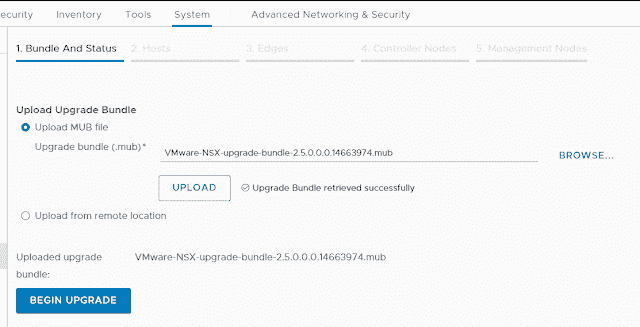
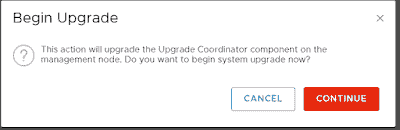
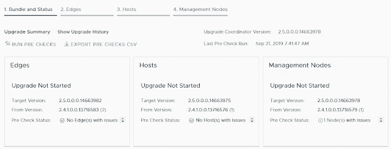
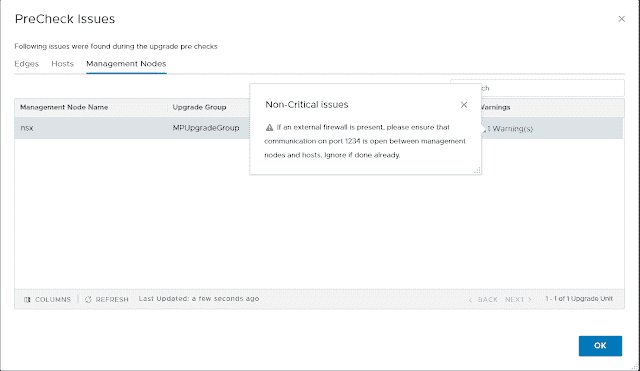
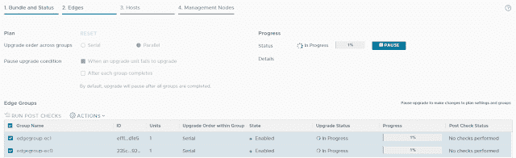
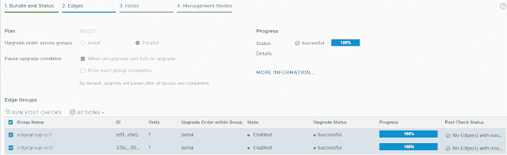
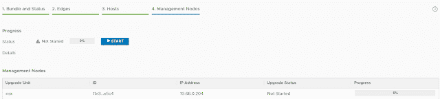
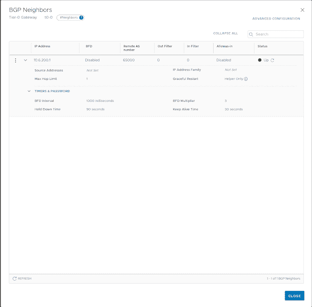
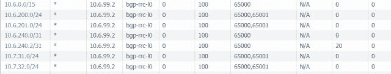
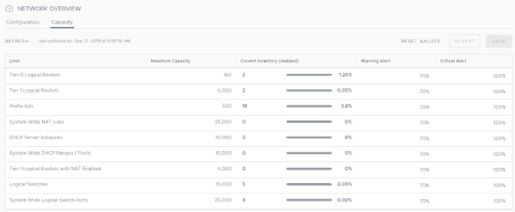

# NSX-T 数据中心 2.5 升级流程和预览

> 原文:[https://dev . to/ngschmidt/nsx-t-data center-2-5-upgrade-process-and-preview-2ml 2](https://dev.to/ngschmidt/nsx-t-datacenter-2-5-upgrade-process-and-preview-2ml2)

现在 NSX-T 数据中心 2.5 已经可以下载了，是时候在我的家庭实验室里尝试一下了。

首先，如果您登录时间超过 90 天，您将被完全锁定在设备之外。如果您以正常的 linux 方式( *passwd* 和 **chage** )进行任何更改，设备将在大约一分钟内自动恢复。由于这是一个家庭实验室，VMWare 增加了设置更高最大年龄的功能[在这里](https://kb.vmware.com/s/article/70691)。在生产中，使用活动目录或另一个 LDAP 源来防止自己丢失 NSX-T

下载升级包花了相当长的时间——似乎 VMWare 在主机容量方面遇到了问题。我猜这将是一个受欢迎的版本！

我们以通常的方式开始，上传升级包。mub 文件):

 
然后我们点击升级按钮，它会在整个过程中一步一步地提示你。但是没有进度条！

 
一旦设置了升级协调器，就该运行预检查了。这个警告您消息传递端口发生了变化。

[T2】](https://1.bp.blogspot.com/-VO2pzcUi05I/XYZFCklKZoI/AAAAAAAAAqc/dHPpcrDT3RUXz8vscJ3XIo8HGv8aiNYdQCLcBGAsYHQ/s1600/19sept-3.PNG)

 
是时候开始升级东东了！

[T2】](https://1.bp.blogspot.com/-Hdf70vyol54/XYZFms1JFII/AAAAAAAAAqs/LX8YLAjv6aM6E2e6kfLzI27aCeKsPOsGACLcBGAsYHQ/s1600/19sept-5.PNG)

 
与其他 2.4 版本一样，您不必使用维护模式(如果您这样做，可能会停机)。

 
除非您推出集群，否则管理节点将无法访问。如果您看到“设备不正常”或“错误状态 101”消息，这仅仅意味着设备尚未准备好。

升级后，我们可以看到承诺的 BGP 状态:

[T2】](https://1.bp.blogspot.com/-gaJLMnBZpxw/XYZUd-juuEI/AAAAAAAAAro/qek4afRpoA8On5t9bOMZknrCh5vBnvBVACLcBGAsYHQ/s1600/19sept-8.PNG)

[T2】](https://1.bp.blogspot.com/-Qn98R8ckZ5U/XYZWhljzUlI/AAAAAAAAAr0/wg4TUkqWWhYUvEcodjR_sEf4eucikN3WQCLcBGAsYHQ/s1600/19sept-9.PNG)

容量管理就在那里:

 
遗憾的是，我在 GUI 中看到了 BGP 状态，但没有路由表。文档可能会对事情有所指导，但我看不到它的全部功能。