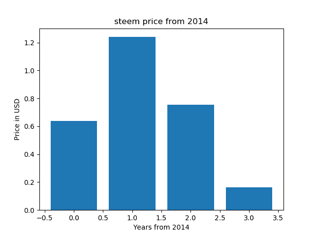

# 使用 python 的 steam 价格

> 原文:[https://dev.to/codesharedot/steem-price-with-python-5414](https://dev.to/codesharedot/steem-price-with-python-5414)

Steem 是一个总部位于区块链的奖励平台，为出版商提供货币化内容和发展社区。

网站 steemit 以 steem 币奖励写内容的用户。这个功能在 dev.to 中还不可用，但是也许在将来你可以通过发布获得加密货币。

[T2】](https://res.cloudinary.com/practicaldev/image/fetch/s--t6U2Lcdg--/c_limit%2Cf_auto%2Cfl_progressive%2Cq_auto%2Cw_880/https://thumbs.gfycat.com/BonySecondaryAmericanavocet.webp)

## [](#price-changes)价格变动

像任何货币或资产一样，价值会随着时间而波动。是增加还是减少？让我们用 Python 来了解一下吧

这些数据可以在 coinmarketcap 上找到，

```
#!/usr/bin/python3
r  = requests.get("https://coinmarketcap.com/currencies/steem/historical-data/?start=20140101&end={0}".format(enddate))
data = r.text 
```

这个链接指向一个 HTML 表，而不是一个 API 调用。这就是为什么我们需要 beautifulsoup 来解析数据。

```
#!/usr/bin/python3
soup = BeautifulSoup(data, "html.parser")
table = soup.find('table', attrs={ "class" : "table"}) 
```

您可以像这样迭代该表:

```
#!/usr/bin/python3
for row in table.find_all('tr'):
    tag = row.findAll('td')
    for val in tag:
        value = val.text 
```

我将数据添加到一个数组中并用 Python 绘制，参见[源代码](https://github.com/codesharedot/steem-price-chart/blob/master/example.py)

这表明最好立即用 steem 硬币换成其他东西，因为它的价格正在下降。

[T2】](https://res.cloudinary.com/practicaldev/image/fetch/s--afM82QsW--/c_limit%2Cf_auto%2Cfl_progressive%2Cq_auto%2Cw_880/https://github.com/codesharedot/steem-price-chart/raw/master/chart.png)

相关链接:

*   [关于 Steem 的更多信息](https://en.wikipedia.org/wiki/Steem)
*   [Coinmarketcap](https://coinmarketcap.com)
*   [学习 Python](https://pythonprogramminglanguage.com)