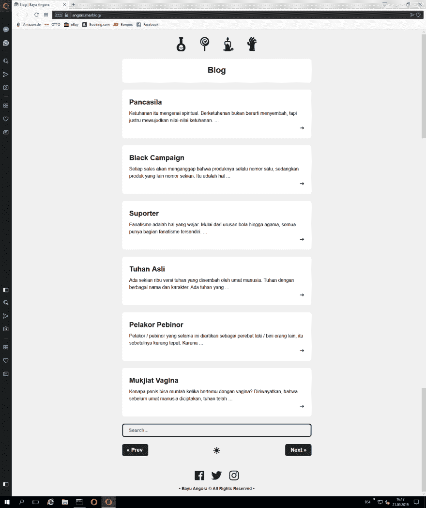
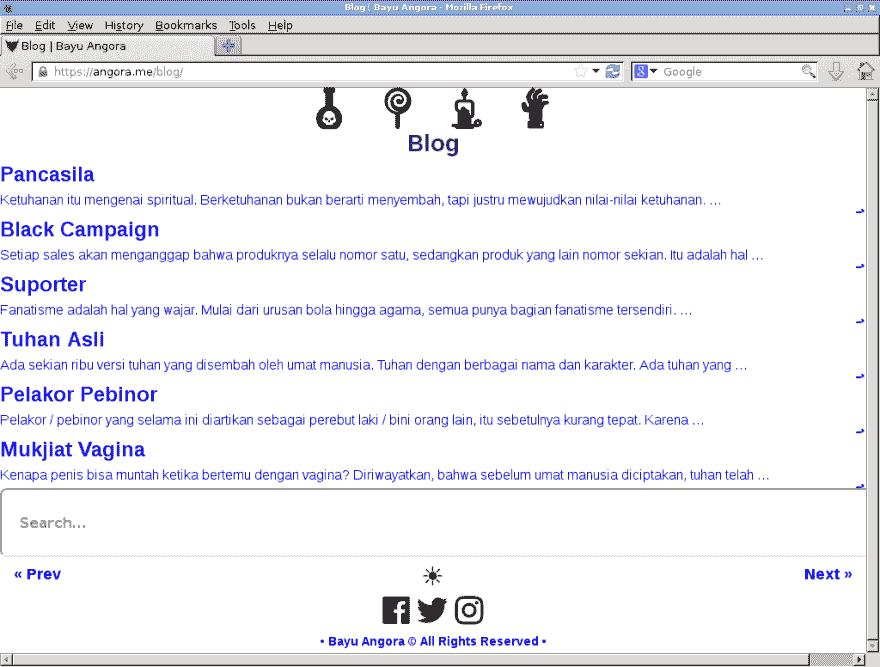
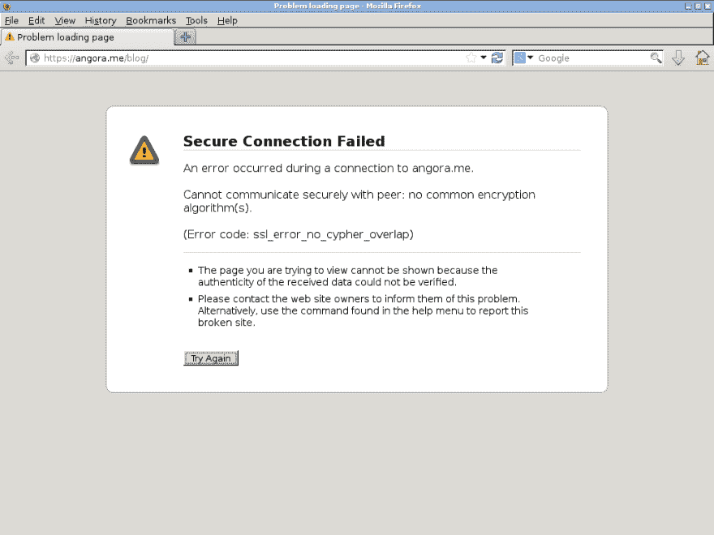

# 需要关于跨浏览器兼容性的帮助

> 原文：<https://dev.to/bayuangora/need-help-about-cross-browser-compatibility-2f78>

亲爱的大家

我需要一些关于我的网站跨浏览器兼容性的帮助->[https://angora.me/blog/](https://angora.me/blog/)

这里是我的 CSS 代码->
[https://angora.me/style.css](https://angora.me/style.css)

在现代浏览器上，我的网站看起来是这样的->

但是在一些老浏览器上，我的网站看起来丑成这样->

甚至这样连接失败->

我使用 Hugo 和 Netlify，让我们加密 SSL。不知道这个兼容性问题是来自我的代码端，SSL 端，服务器端，浏览器端等？知道如何解决这个问题吗？

问候