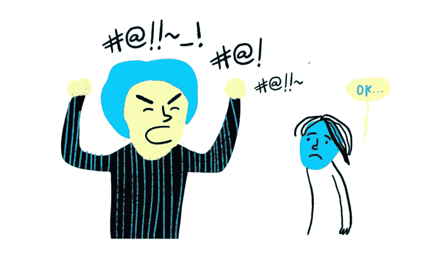
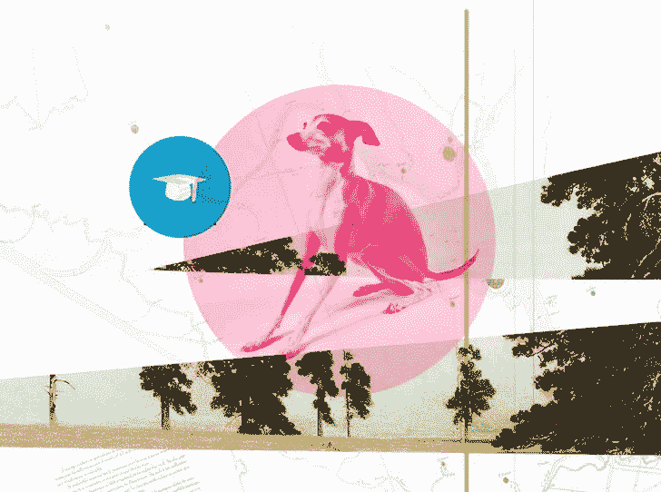
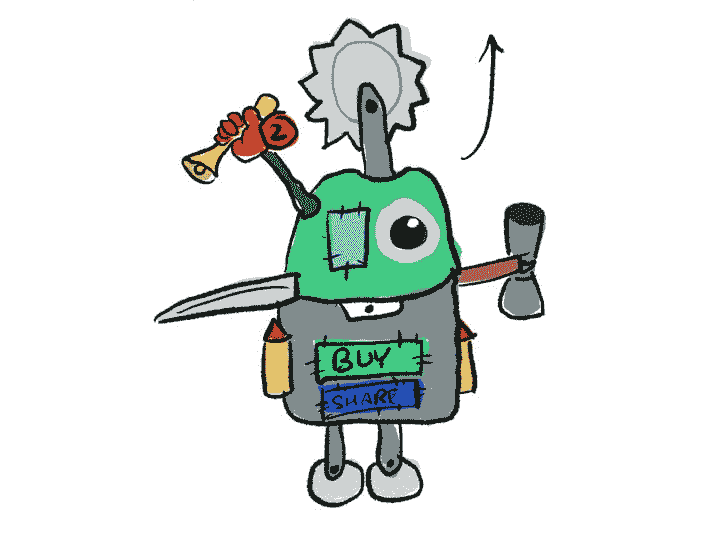
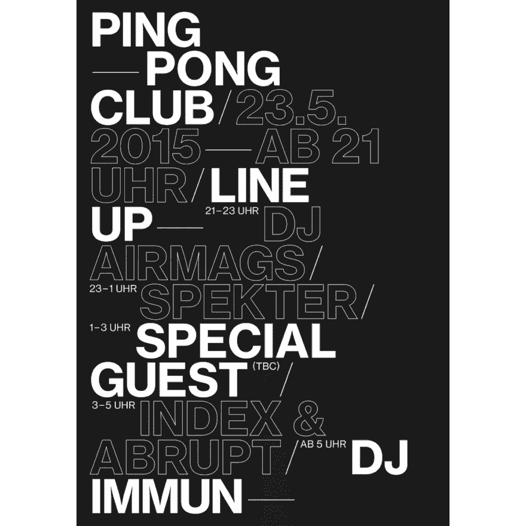
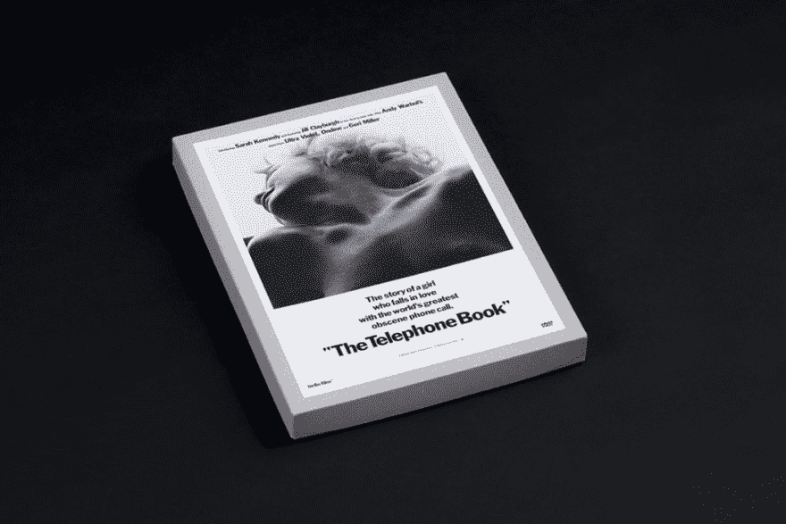
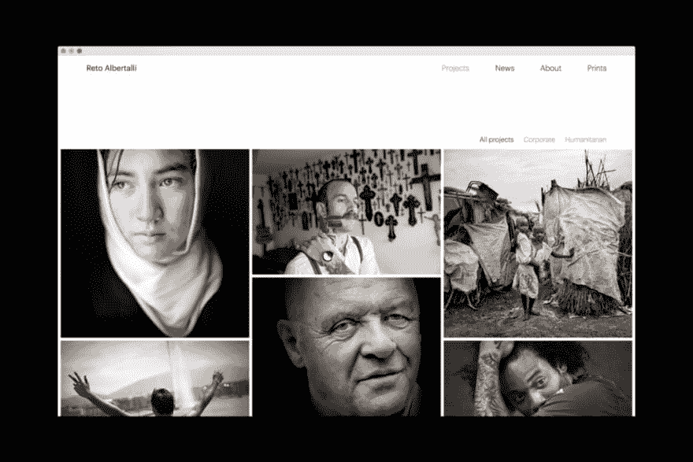
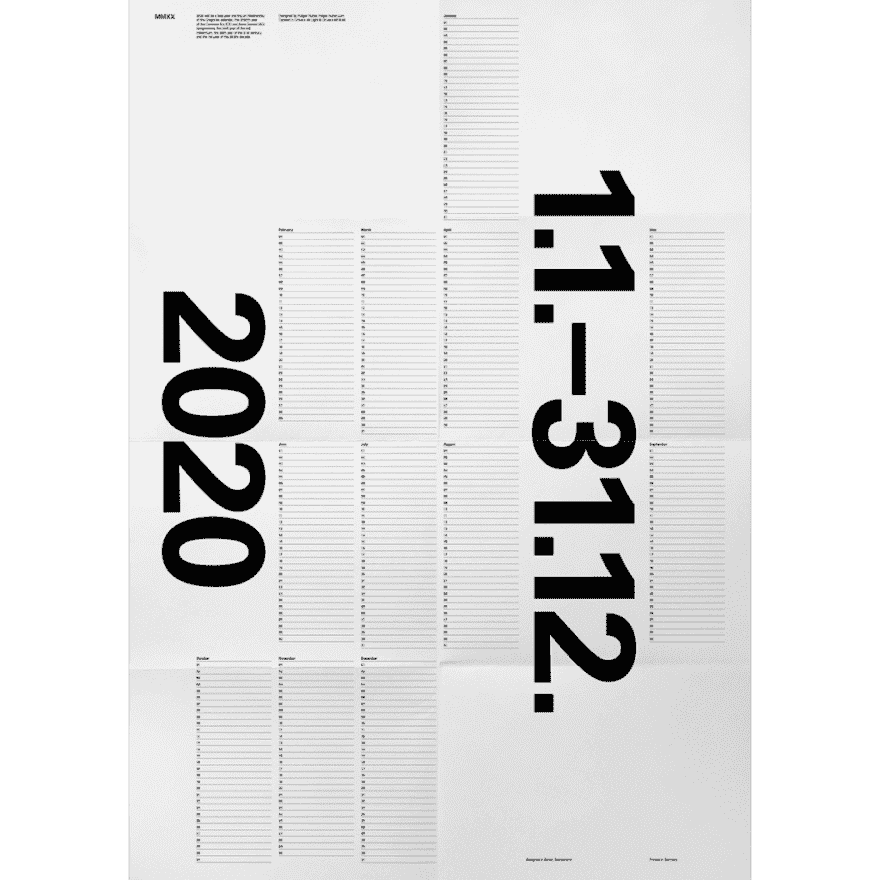

# 新经理综合症、相信你的直觉、人工智能生成的头像——以及本周更多的 UX

> 原文:[https://dev . to/UX collective/new-manager-syndrome-trusting-your-intuition-ai-generated-avatars-and-more-UX-this-week-3aib](https://dev.to/uxcollective/new-manager-syndrome-trusting-your-intuition-ai-generated-avatars-and-more-ux-this-week-3aib)

#### [](#a-weekly-selection-of-design-links-brought-to-you-by-your-friends-at-the-ux-collective)*每周精选的设计链接，由你在 UX 集体的朋友带给你。*

[T2】](https://res.cloudinary.com/practicaldev/image/fetch/s--VYa61Rz1--/c_limit%2Cf_auto%2Cfl_progressive%2Cq_auto%2Cw_880/https://cdn-images-1.medium.com/max/1024/0%2A21vv8KiNb736PKj0.jpg)

[**避免设计中的新经理综合症**](https://dev.to/uxcollective/avoiding-the-new-manager-syndrome-in-design-5gpc) →

“亲爱的年轻的我，

你终于得到了你一直期待的晋升，对吗？你现在是经理了。我真的为你感到兴奋；这是大事情的第一步。一定要和你爱的人一起庆祝这次晋升。是的，去吧，今晚一醉方休；你不需要一直表现得很专业。"

[**继续阅读**](https://dev.to/uxcollective/avoiding-the-new-manager-syndrome-in-design-5gpc)

*   [**直觉 vs 数据**](https://matthewstrom.com/writing/intuition/) →当数据为王时，相信自己的直觉。
*   [**设计成果**](https://designnotes.substack.com/p/what-makes-a-great-design-outcome) →为您和您的用户定义成功。
*   [**绿色出口标志**](https://uxdesign.cc/if-red-means-emergency-why-are-exit-signs-green-111760c217c1?source=friends_link&sk=00e72785a8b06d7c09ce5031434f0648) →如果红色=紧急情况，为什么出口标志是绿色？

### [](#stories-from-the-community)来自社区的故事

[T2】](https://res.cloudinary.com/practicaldev/image/fetch/s--XdAqILlb--/c_limit%2Cf_auto%2Cfl_progressive%2Cq_auto%2Cw_880/https://cdn-images-1.medium.com/max/728/0%2AtRkwMXfsRhjcPAXC.jpg)

[**设计师血统是废话:是作品，不是学校**](https://uxdesign.cc/designer-pedigree-is-nonsense-its-the-work-not-the-school-bb1cfa8e48f7?source=friends_link&sk=c81bddb297e3bae9e6871c8061e386e3) →

作者[迈克尔·麦克沃特斯](https://medium.com/u/4e0bea5561d9)

[T2】](https://res.cloudinary.com/practicaldev/image/fetch/s--KHyV1A9S--/c_limit%2Cf_auto%2Cfl_progressive%2Cq_auto%2Cw_880/https://cdn-images-1.medium.com/max/728/0%2AMuJDDGOZYKhB1zO4.jpg)

[**如何让继承的设计有意义**](https://uxdesign.cc/how-to-make-sense-of-inherited-design-17b7495362bb?source=friends_link&sk=f70813f2946ab447e45c03c59f64819f)→

By[@ kingsidharth](https://medium.com/u/ea17deaeaa97)

[T2】](https://res.cloudinary.com/practicaldev/image/fetch/s--okjUwp6G--/c_limit%2Cf_auto%2Cfl_progressive%2Cq_auto%2Cw_880/https://cdn-images-1.medium.com/max/728/0%2A2djTfoybUJ9zqGnt.jpg)

[**拥抱 UX 设计中的不完美**](https://uxdesign.cc/embracing-imperfection-in-ux-design-d99223359adc?source=friends_link&sk=85aeb3eb17e5fe7b25a02e37fd682497) →

作者[马克·马切海默](https://medium.com/u/7d48c38e42c9)

更多头条新闻:

*   [**UX 来自历史的启示:苏联制造**](https://uxdesign.cc/ux-inspiration-from-history-made-in-the-soviet-union-71cb969f1dd?source=friends_link&sk=3ebb8bf337e8242b6a79d968eec69e91) →由[塔拉斯·萨维茨基](https://medium.com/u/a2699ed45a76)
*   [**我们需要谈谈设计师不安全感的瘟疫**](https://uxdesign.cc/we-need-to-talk-about-the-plague-of-designers-insecurity-f35d6d645581?source=friends_link&sk=e7d7fee0240e5679399c64567485f0de)→By[kau tsar angga Kara](https://medium.com/u/75628a4fa342)
*   [**我们的通知是否应该更加平和？**](https://uxdesign.cc/should-our-notifications-be-more-peaceful-aed3fa9d884a?source=friends_link&sk=cd502ef92bd617159ed4333909db8165) →作者[迈克尔·福特汉姆](https://medium.com/u/d4b2f465b56d)
*   [**像专业人士一样充分利用你的用户研究和综合**](https://uxdesign.cc/make-the-most-of-your-user-research-and-synthesize-like-a-pro-5ae3fad23fc5?source=friends_link&sk=6d021ed7fa9eb6447fa5aa8c79fb68a1) →作者[乔·拉利](https://medium.com/u/1baa1daeb83c)
*   [**多林戈，这就是你所缺少的——UX 分析**](https://uxdesign.cc/duolingo-this-is-what-you-are-missing-7ba66559355a?source=friends_link&sk=836c2611471ec0ab76758a41814ef9e9) →作者[玛利亚·安德里亚·席尔瓦](https://medium.com/u/f4e22edc4247)
*   [**关于 UX**](https://uxdesign.cc/what-samurai-can-teach-us-about-ux-6a2319283178?source=friends_link&sk=3fb8c2158fda69f114be2cdf78ed0548) →作者[尼古拉斯·弗里贝尔](https://medium.com/u/25eebc7a02a4)
*   [**领导通过应用设计**](https://uxdesign.cc/leadership-through-application-design-8f82471cb207?source=friends_link&sk=f3e51947f0b3d6e431bf2599a53b6331) →通过 [Roxanne Coburn](https://medium.com/u/4feb28585859)

### [](#news-amp-ideas)新闻&观点

*   [**#大自然的战利品**](https://beside.media/dossier/spoils-of-nature-on-instagram/) →那些漂亮的 Instagram 镜头是在扼杀大自然。
*   [**摘要第二季**](https://www.youtube.com/watch?v=PHXxKZkeFmc&feature=youtu.be) →设计电视剧本周回网飞。
*   [**70 年代家具**](https://www.ignant.com/2019/09/19/moving-mountains-distinctive-furniture-pieces-are-inspired-by-1970s-italian-interiors/) →意大利 70 年代灵感的特色家具。
*   [**多林戈更名**](https://www.underconsideration.com/brandnew/archives/new_wordmark_and_identity_for_duolingo_by_johnson_banks.php) →全球最大语言学校品牌更新。

[T2】](https://res.cloudinary.com/practicaldev/image/fetch/s--rGVAf7_f--/c_limit%2Cf_auto%2Cfl_progressive%2Cq_auto%2Cw_880/https://cdn-images-1.medium.com/max/1024/1%2ArzQk7IWAkAq2PIkkuuPvag.png)

[T2】](https://res.cloudinary.com/practicaldev/image/fetch/s--fcTjuxPG--/c_limit%2Cf_auto%2Cfl_progressive%2Cq_auto%2Cw_880/https://cdn-images-1.medium.com/max/1024/1%2A2xyCmMSwdJTU8WdoqQCnEg.jpeg)

[T2】](https://res.cloudinary.com/practicaldev/image/fetch/s--PfP2Nqe1--/c_limit%2Cf_auto%2Cfl_progressive%2Cq_auto%2Cw_880/https://cdn-images-1.medium.com/max/1024/1%2A0soU8dZfQuYP6oHjhQG2oQ.jpeg)

[](https://res.cloudinary.com/practicaldev/image/fetch/s--F_tZEQgl--/c_limit%2Cf_auto%2Cfl_progressive%2Cq_auto%2Cw_880/https://cdn-images-1.medium.com/max/1024/1%2AJTIWKbSRG3hflV9UobNoSQ.png) 

<figcaption>[**精选作品:霍尔格胡贝尔**](https://www.holger-huber.com/) →</figcaption>

### [](#tools-amp-resources)工具&资源

*   [**10 万张 AI 人脸**](https://generated.photos/)→AI 生成的人脸免费使用。
*   [**图标 SVG**](https://iconsvg.xyz/) →为你的项目查找并生成图标。
*   [**AI 的模式**](https://smarterpatterns.com/) →常见 AI 挑战的交互库。
*   [**符号艺术**](http://artofsymbols.com/) →人类如何使用语标符号来传达复杂的思想。

```
We believe designers are thinkers as much as they are makers. So we created the [design newsletter](https://newsletter.uxdesign.cc/) we have always wanted to receive. 
```

* * *