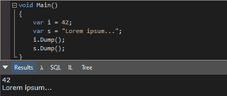
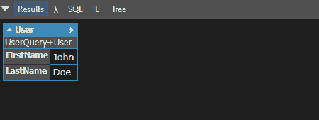
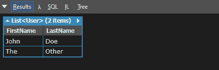
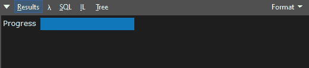
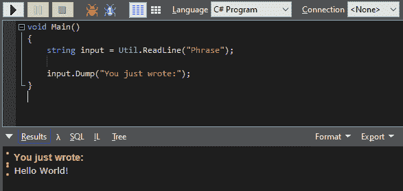

# LINQPad:对查询的更多控制

> 原文:[https://dev . to/tana thos/linq pad-more-control-over-your-queries-2hh 6](https://dev.to/tanathos/linqpad-more-control-over-your-queries-2hh6)

# [](#keep-exploring)不断探索

在本系列的上一篇文章之后，我将继续探索这个工具，向您展示一些有用的技巧，您可以使用它们来更好地控制查询。

如果你是一个经验丰富的 LINQPad 用户，很多东西看起来微不足道，但我实际上使用了多年，不知道他们，我想你们中的一些人会喜欢 kickstart。

# [](#control-the-dump)控制倾倒

正如您已经注意到的，Dump()扩展的结果因类型而异。例如，简单类型和字符串只是作为 HTML 字符串转储到输出面板上。

[T2】](https://res.cloudinary.com/practicaldev/image/fetch/s--yceKUtwM--/c_limit%2Cf_auto%2Cfl_progressive%2Cq_auto%2Cw_880/https://thepracticaldev.s3.amazonaws.com/i/ax0wurfzvyqsbnmq03sb.png)

对象被转储为 HTML 表，其属性在行上展开:

[T2】](https://res.cloudinary.com/practicaldev/image/fetch/s--wcS7hV8v--/c_limit%2Cf_auto%2Cfl_progressive%2Cq_auto%2Cw_880/https://thepracticaldev.s3.amazonaws.com/i/c0fifpkdi143i6zux2bi.png)

而数组、列表和其他可枚举类型呈现为表格，其中属性按列展开:

[T2】](https://res.cloudinary.com/practicaldev/image/fetch/s--vDXFNyfY--/c_limit%2Cf_auto%2Cfl_progressive%2Cq_auto%2Cw_880/https://thepracticaldev.s3.amazonaws.com/i/lp1zkmrc345u4liwsa1b.png)

Dump()扩展自动搜索公共属性，递归地将结果嵌套在需要的地方，并以标准方式呈现它们。

但是如果你看看这个方法的重载，你会看到 5 个参数:

*   描述
*   深度
*   今日电网
*   排除
*   希腊字母的第一个字母

写着类似于:

```
DateTime.Now.Dump("Current date:"); 
```

将使用 *description* param，将结果嵌套在一个标签下，这在您的查询输出大量变量时非常有用。

使用*深度*参数，您可以控制 Dump()在第一次渲染时分解对象的深度。默认情况下是 5，这意味着转储预先准备了 5 层嵌套的 HTML 表，这可能有点多，尤其是对于大型复杂的对象(您会注意到，如果您试图一起呈现数百个结果，查询的执行将会相当慢)。将深度设置为较低的值将加快第一次渲染的速度，并且您仍然可以在输出面板上手动分解折叠的属性，只需单击它们即可。

试举例:

```
System.Globalization.CultureInfo.GetCultures(System.Globalization.CultureTypes.AllCultures).Dump(1); 
```

你会注意到一个更快的渲染，因为这个集合相当大。

将*today datagrid*设置为 true，输出面板将切换到 WPF 控件，而不是标准的 HTML，而 *exclude* 允许您从渲染中省略特定的属性:

```
System.Globalization.CultureInfo.GetCultures(System.Globalization.CultureTypes.AllCultures).Dump(toDataGrid: true, exclude: "Parent"); 
```

最后，设置为 true 的 *alpha* params 改变了属性出现的顺序。默认情况下，LINQPad 按照它们在类中出现的样子编写它们，这样你就可以看到它们是按字母顺序排列的。

# [](#implementing-todump)实现 ToDump()

您可能需要指定一种自定义方式来显示特定类的数据，例如，明确要显示的属性或者甚至要使用的 HTML 格式。

最快的方法是在类中实现一个 ToDump()方法，所以假设该类是在查询本身中定义的，您可以编写:

```
class User
{
    public string FirstName { get; set; }

    public string LastName { get; set; }

    object ToDump()
    {
        return new {
            FirstName = this.FirstName,
            LastName = Util.WithStyle(this.LastName, "color:green")
        };
    }
} 
```

在这种情况下，ToDump()返回一个具有相同属性的匿名对象，但是 LastName 将以绿色呈现(注意`Util`的使用，我们将在后面详细讨论)。

在您的域模型中实现这种方法并不是最佳的(在这种情况下不可能，`Util`只在 LINQPad 查询中定义)，因此一种替代方法是在“My Extensions”查询中使用静态方法。
“我的扩展”是一个特殊的查询，您可以在“我的查询”选项卡中找到，它总是包含在其他查询的执行过程中，因此无论您在那里链接或定义什么，都将随处可用。

仍然不是最佳的:你必须在我的扩展中移动你的`User`类(或者在那里引用包含该类的程序集)。如上所述，这将在您运行的每个其他查询中导入该类。

最后，最好的方法是使用反射和`dynamic`关键字。

```
public static object ToDump(object input)
{
    if (input.GetType().FullName == "User") // e.g. "MyApp.DataModel.User"
    {
        dynamic output = input;

        return new
        {
            FirstName = output.FirstName,
            LastName = Util.WithStyle(output.LastName, "color:green")
        };
    }

    return input;
} 
```

另一个好方法是，假设您正在生成自己的 NuGet 包，在其中包含一组要导入到查询中的 LINQPad 示例，我将在以后的文章中展示。

# [](#dumpcontainer-examples)DumpContainer 示例

一个简单的`.Dump()`调用在某些场景中是有局限性的:每个调用都将按顺序创建一个新的转储输出行，而不能在查询执行期间改变实际的转储结果。但是如果你需要显示一个进程或者一个更新的信息，一般来说并不是一件好事情。

将会帮助你。

顾名思义，它是一种动态更新内容的容器，只需转储()一次，并在查询的生命周期内根据需要更新它的`Content`:

```
void Main()
{
    DumpContainer dc = new DumpContainer();
    dc.Content = "Starting the application...";
    dc.Dump();

    Thread.Sleep(500);

    for (int i = 1; i <= 10; i++)
    {
        dc.Content = $"{i}/10 - Processing...";
        Thread.Sleep(200);
    }

    dc.Content = "Completed!";
} 
```

如果你只是需要一个进度条来显示你可以使用，猜猜是什么。

正如我之前所说，每个 LINQPad 查询都引用 LINQPad。Util namespace，一个充满了与 LINQPad 本身交互的有用工具的实用工具带，ProgressBar 是一个使用简单但有效的 HTML 进度条的类。

我们可以用类似于
的代码来替换前面的代码

```
void Main()
{
    Util.ProgressBar pb = new LINQPad.Util.ProgressBar();
    pb.Caption = "Progress";
    pb.Dump();

    for (double i = 1; i <= 10; i++)
    {
        pb.Fraction = i/10;
        Thread.Sleep(200);
    }
} 
```

在这种情况下，您可以与`Fraction`或`Percent`属性交互来推进该栏。

[T2】](https://res.cloudinary.com/practicaldev/image/fetch/s--lry_Vgn0--/c_limit%2Cf_auto%2Cfl_progressive%2Cq_auto%2Cw_880/https://thepracticaldev.s3.amazonaws.com/i/7f1d8wgq177ytjb2c94y.png)

# [](#manage-input-for-interactive-queries)管理交互式查询的输入

在某些场景中，不要硬编码所有内容，而是要求用户输入，这可能是有用的，就像您对控制台应用程序所做的一样。

同样，您可以使用 ReadLine()方法访问 Util 名称空间。这将在 LINQPad 窗口的底部提示一个输入框，它的输入可以被赋给一个字符串变量并在执行代码中使用:

[T2】](https://res.cloudinary.com/practicaldev/image/fetch/s--nipqyUjl--/c_limit%2Cf_auto%2Cfl_progressive%2Cq_auto%2Cw_880/https://thepracticaldev.s3.amazonaws.com/i/ind38tim9ppmode29g1d.png)

# [](#exploring-the-util)探索 Util。*

探索 Util 名称空间！真的是充满了有用的东西，可以帮助您推动您的查询到一个新的水平。

一些例子:

*   。Cmd():将执行任何系统命令
*   。Dif():一个对象的图形化比较器，允许你很容易地显示两个给定输入之间的差异
*   。KeepRunning():创建一个循环来保持查询活动，这在处理辅助线程时很有用
*   。CurrentQuery:是表示当前查询的对象，允许您访问原始代码和程序集引用

# [](#conclusions)结论

LINQPad 确实是一款令人惊叹的软件，了解它将会使您的工作效率提高十倍。网络生态系统。

我打算以后至少再写一篇关于它的帖子，因为还是有有趣的东西可以聊的。

敬请期待！