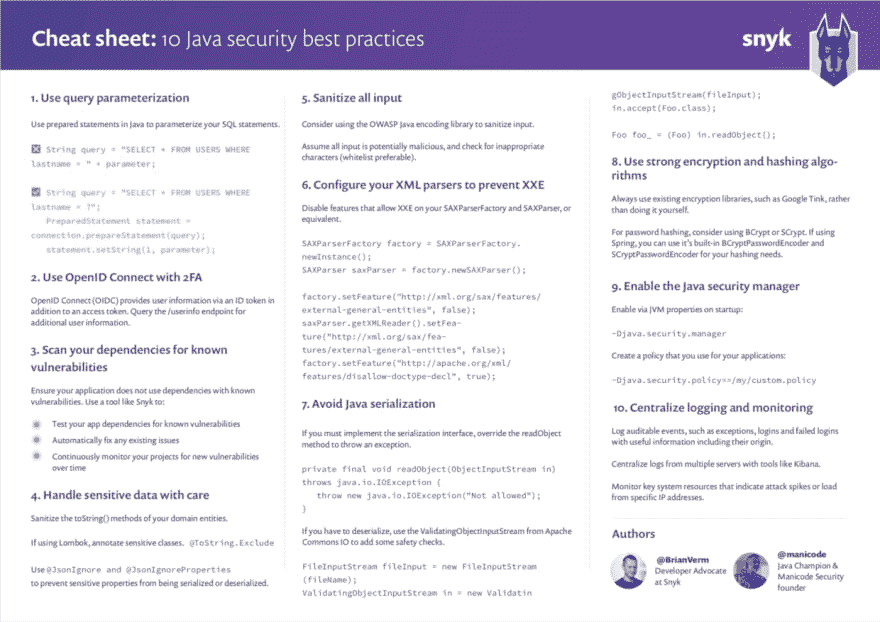

# 10 个 Java 安全最佳实践

> 原文:[https://dev . to/Brian verm/10-Java-security-best-practices-be8](https://dev.to/brianverm/10-java-security-best-practices-be8)

[T2】](https://snyk.io/blog/10-java-security-best-practices/)

在这个备忘单版本中，我们将关注面向开源维护者和开发者的十个 Java 安全最佳实践。尽管大多数开发人员理解安全编码的重要性，但是安全性并不是开发人员首先考虑的事情。使用 [OWASP 十大漏洞](https://www.owasp.org/index.php/Top_10-2017_Top_10)作为初始起点，我创建了这十大漏洞。为了这个备忘单，我与 Java 冠军和 [Manicode](https://manicode.com/) Security 的创始人 Jim Manico 合作。

因此，我很自豪地介绍 [10 个 Java 安全最佳实践](https://snyk.io/blog/10-java-security-best-practices/)

## [](#1-use-query-parameterization-to-prevent-injection)1。使用查询参数化来防止注入

在 2017 版 OWASP 十大漏洞中，注入作为当年的头号漏洞出现在榜单的首位。当查看 Java 中的典型 SQL 注入时，sequel 查询的参数被天真地连接到查询的静态部分。以下是 SQL 在 Java 中的不安全执行，攻击者可以利用它来获取比预期更多的信息。

```
public void selectExample(String parameter) throws SQLException {
   Connection connection = DriverManager.getConnection(DB_URL, USER, PASS);
   String query = "SELECT * FROM USERS WHERE lastname = " + parameter;
   Statement statement = connection.createStatement();
   ResultSet result = statement.executeQuery(query);

   printResult(result);
} 
```

<svg width="20px" height="20px" viewBox="0 0 24 24" class="highlight-action crayons-icon highlight-action--fullscreen-on"><title>Enter fullscreen mode</title></svg> <svg width="20px" height="20px" viewBox="0 0 24 24" class="highlight-action crayons-icon highlight-action--fullscreen-off"><title>Exit fullscreen mode</title></svg>

如果本例中的参数类似于`'' OR 1=1`，那么结果将包含表中的每一项。如果数据库支持多个查询，并且参数是`''; UPDATE USERS SET lastname=''`，这可能会更成问题。

为了防止在 Java 中出现这种情况，我们应该使用预处理语句来参数化查询。这应该是创建数据库查询的唯一方法。通过定义完整的 SQL 代码并在以后将参数传递给查询，代码更容易理解。最重要的是，通过区分 SQL 代码和参数数据，查询不会被恶意输入劫持。

```
public void prepStatmentExample(String parameter) throws SQLException {
   Connection connection = DriverManager.getConnection(DB_URL, USER, PASS);
   String query = "SELECT * FROM USERS WHERE lastname = ?";
   PreparedStatement statement = connection.prepareStatement(query);
   statement.setString(1, parameter);
   System.out.println(statement);
   ResultSet result = statement.executeQuery();

   printResult(result);
} 
```

<svg width="20px" height="20px" viewBox="0 0 24 24" class="highlight-action crayons-icon highlight-action--fullscreen-on"><title>Enter fullscreen mode</title></svg> <svg width="20px" height="20px" viewBox="0 0 24 24" class="highlight-action crayons-icon highlight-action--fullscreen-off"><title>Exit fullscreen mode</title></svg>

在上面的示例中，输入绑定到类型字符串，因此是查询代码的一部分。这种技术可以防止参数输入干扰 SQL 代码。

## [](#2-use-openid-connect-with-2fa)2。使用 OpenID 连接 2FA

身份管理和访问控制非常困难，而身份认证失败通常是数据泄露的原因。事实上，这是 OWASP 十大漏洞列表中的第二大漏洞。当您自己创建身份验证时，有许多事情需要考虑:密码的安全存储、强加密、凭证检索等。在许多情况下，使用像 OpenID Connect 这样令人兴奋的解决方案会更加容易和安全。OpenID Connect (OIDC)使您能够跨网站和应用对用户进行身份验证。这消除了拥有和管理密码文件的需要。OpenID Connect 是一个 OAuth 2.0 扩展，提供用户信息。除了访问令牌之外，它还添加了一个 ID 令牌，以及一个`/userinfo`端点，您可以在这里获得附加信息。它还增加了端点发现功能和动态客户端注册。

用 Spring Security 之类的库设置 OpenID Connect 是一项简单而常见的任务。确保您的应用程序实施 2FA(双因素身份验证)或 MFA(多因素身份验证),为您的系统增加一层额外的安全性。

通过将 oauth2-client 和 Spring 安全依赖项添加到您的 Spring Boot 应用程序中，您可以利用第三方客户端(如 Google、Github 和 Okta)来处理 OIDC。创建应用程序后，您只需通过在应用程序配置中指定它，将它连接到您选择的特定客户端；这可能是您的 GitHub 或 Okta 客户端 id 和客户端机密，如下所示。

*pom.xml*

```
<dependency>
  <groupId>org.springframework.boot</groupId>
  <artifactId>spring-boot-starter-oauth2-client</artifactId>
</dependency>
<dependency>
  <groupId>org.springframework.boot</groupId>
  <artifactId>spring-boot-starter-security</artifactId>
</dependency> 
```

<svg width="20px" height="20px" viewBox="0 0 24 24" class="highlight-action crayons-icon highlight-action--fullscreen-on"><title>Enter fullscreen mode</title></svg> <svg width="20px" height="20px" viewBox="0 0 24 24" class="highlight-action crayons-icon highlight-action--fullscreen-off"><title>Exit fullscreen mode</title></svg>

*application.yaml*

```
spring:
 security:
   oauth2:
     client:
         registration:
           github:
             client-id: 796b0e5403be4729ca01
             client-secret: f379318daa27502254a05e054361074180b840a9
           okta:
             client-id: 0oa1a4wascEpYu6yk358
             client-secret: hqxj7a9lVe_TudbS2boBW7AWwxTlZiHNrJxdc_Sk
             client-name: Okta
         provider:
           okta:
             issuer-uri: https://dev-844689.okta.com/oauth2/default 
```

<svg width="20px" height="20px" viewBox="0 0 24 24" class="highlight-action crayons-icon highlight-action--fullscreen-on"><title>Enter fullscreen mode</title></svg> <svg width="20px" height="20px" viewBox="0 0 24 24" class="highlight-action crayons-icon highlight-action--fullscreen-off"><title>Exit fullscreen mode</title></svg>

## [](#3-scan-your-dependencies-for-known-vulnerabilities)3。扫描您的依赖项中已知的漏洞

您很可能不知道您的应用程序使用了多少个直接依赖项。也极有可能您不知道您的应用程序使用了多少可传递的依赖关系。这通常是真的，尽管依赖项占了整个应用程序的大部分。攻击者越来越多地瞄准开源依赖项，因为它们的重用为恶意攻击者提供了许多受害者。确保应用程序的整个依赖关系树中没有已知的漏洞是很重要的。

Snyk 测试您的应用程序构建工件，标记那些具有已知漏洞的依赖项。它提供了您在应用程序中用作仪表板的包中存在的漏洞列表。

此外，它建议升级版本或提供补丁，通过对源代码库的拉请求来修复您的安全问题。Snyk 还通过确保自动测试(通过 webhooks)在您的存储库上提出的任何未来拉请求来保护您的环境，以确保它们不会引入新的已知漏洞。

Snyk 可通过 web UI 和 CLI 获得，因此您可以将其与 CI 环境集成，并对其进行配置，以便在存在严重程度超过您设定的阈值的漏洞时中断您的构建。

免费使用[Snyk](https://snyk.io/signup)用于开源项目或每月测试次数有限的私有项目。

## [](#4-handle-sensitive-data-with-care)4。小心处理敏感数据

暴露敏感数据，如个人数据或客户的信用卡号码，可能是有害的。但即使比这更微妙的情况也同样有害。例如，如果在另一个调用中可以使用唯一标识符来检索附加数据，那么在系统中公开该标识符是有害的。

首先，您需要仔细查看应用程序的设计，并确定您是否真的需要这些数据。最重要的是，确保不要暴露敏感数据，可能是通过日志记录、自动完成、传输数据等。

防止敏感数据出现在日志中的一个简单方法是净化域实体的`toString()`方法。这样你就不会不小心打印出敏感字段。如果您使用 project Lombok 来生成您的`toString()`方法，尝试使用`@ToString.Exclude`来防止字段成为`toString()`输出的一部分。

此外，在向外界公开数据时要非常小心。例如:如果我们的系统中有一个显示所有用户名的端点，就没有必要显示内部唯一标识符。该唯一标识符可用于通过使用其他端点将其他更敏感的信息连接到用户。如果您使用 Jackson 将 POJOs 序列化和反序列化为 JSON，请尝试使用`@JsonIgnore`和`@JsonIgnoreProperties`来防止这些属性被序列化或反序列化。

例如，如果您需要将敏感数据发送到其他服务，请对其进行适当加密，并确保您的连接受到 HTTPS 的保护。

## [](#5-sanitize-all-input)5。清理所有输入

跨站点脚本(XSS)是一个众所周知的问题，主要在 JavaScript 应用程序中使用。然而，Java 也不能幸免于此。XSS 只不过是远程执行的 JavaScript 代码的注入。根据 OWASP 的说法，防止 XSS 的第 0 条规则是“除非在允许的位置，否则不要插入不受信任的数据”。这方面的基本解决方案是尽可能地防止不受信任的数据，并在使用数据之前清理所有其他数据。一个很好的起点是 OWASP Java 编码库，它为您提供了许多编码器。

```
<dependency>
   <groupId>org.owasp.encoder</groupId>
   <artifactId>encoder</artifactId>
   <version>1.2.2</version>
</dependency> 
```

<svg width="20px" height="20px" viewBox="0 0 24 24" class="highlight-action crayons-icon highlight-action--fullscreen-on"><title>Enter fullscreen mode</title></svg> <svg width="20px" height="20px" viewBox="0 0 24 24" class="highlight-action crayons-icon highlight-action--fullscreen-off"><title>Exit fullscreen mode</title></svg>

```
String untrusted = "<script> alert(1); </script>";
System.out.println(Encode.forHtml(untrusted));

// output: <script> alert(1); </script> 
```

<svg width="20px" height="20px" viewBox="0 0 24 24" class="highlight-action crayons-icon highlight-action--fullscreen-on"><title>Enter fullscreen mode</title></svg> <svg width="20px" height="20px" viewBox="0 0 24 24" class="highlight-action crayons-icon highlight-action--fullscreen-off"><title>Exit fullscreen mode</title></svg>

净化用户文本输入是显而易见的。但是，从数据库中检索的数据怎么办呢，即使这是您自己的数据库？如果您的数据库遭到破坏，有人在数据库字段或文档中植入了一些恶意文本，该怎么办？

此外，留意传入的文件。许多库中存在 Zip-slip 漏洞，因为压缩文件的路径没有经过清理。包含路径为`../../../../foo.xy`的文件的 Zip 文件可能被解压缩，并可能覆盖任意文件。尽管这不是 XSS 攻击，但这是一个很好的例子，说明了为什么您必须净化所有输入。每个输入都有潜在的恶意，应该相应地清除。

* * *

这些只是我的**前 10** 的**前 5** 。
想了解以下 5 点？
[阅读更多...](https://snyk.io/blog/10-java-security-best-practices/)