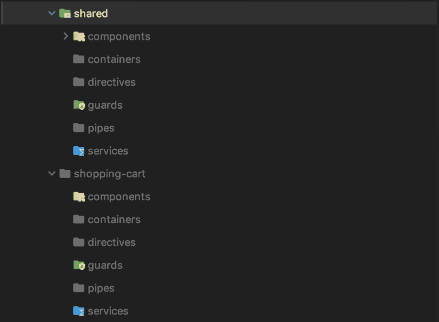
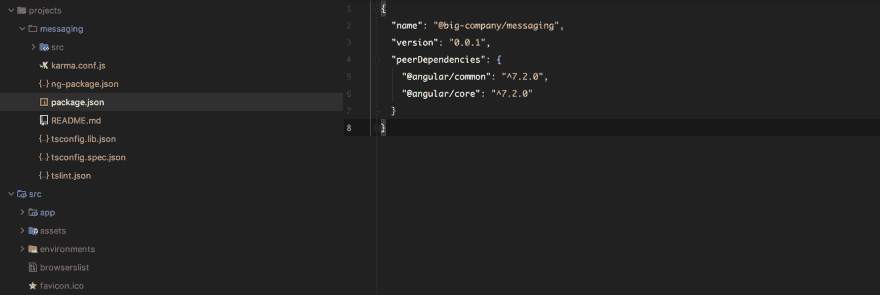
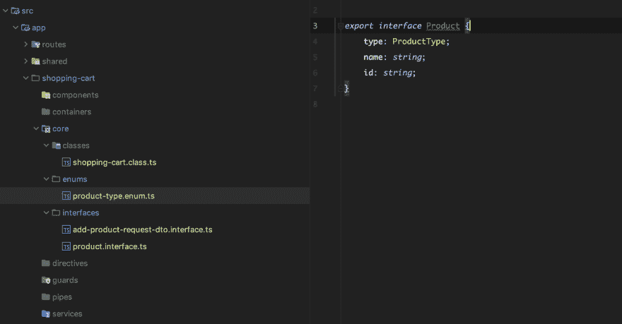
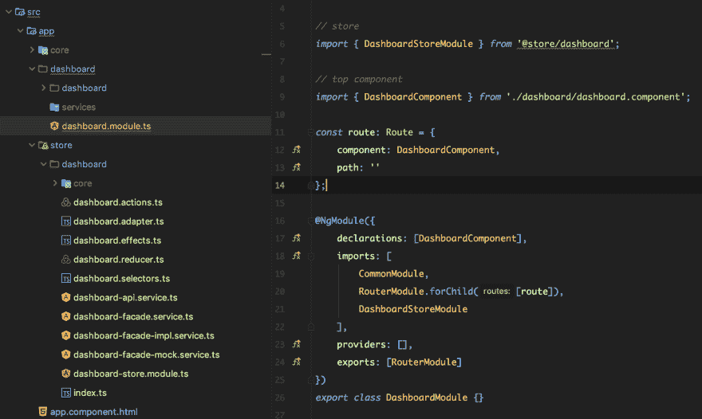

# 构建企业级角度项目结构

> 原文：<https://dev.to/gc_psk/building-an-enterprise-grade-angular-project-structure-3ihk>

建立现代前端项目的一项重要任务是定义一个可伸缩的、长期的、经得起未来考验的文件夹结构，以及每个不同编程实体的命名准则。

虽然有些人认为这是一个简单和次要的方面，但它往往隐藏着比看起来更复杂的东西。尽管大多数时候没有完美的解决方案，但我们可以探索一些行业最佳实践，以及一些我认为最有意义的事情。

在本文中，我们将了解:

*   在栈的每一层定义组成我们项目的实体
*   在文件夹中分发我们的角度和打字稿实体
*   作为服务模块集合的状态管理

## 有角的实体

当建立一个新的代码库时，我经常做的第一件事是思考和定义组成我的堆栈的编程实体。作为 Angular 开发人员，我们已经非常了解他们中的一些人:

*   模块、组件、指令、服务、管道和防护

正如框架文档所建议的，每次我们创建这些实体时，我们都会在文件名后面加上实体的名称。

因此，如果我们创建一个管道，它的类叫做 *HighlightPipe，*我们将把它的文件命名为 *highlight.pipe.ts，*，如果我们有一个组件叫做 *DropdownComponent* ，我们想要它的文件 *dropdown.component.ts，dropdown.component.html*和 *dropdown.component.scss.*

### 功能模块

我们不能在不首先谈论角度模块的情况下谈论角度项目的结构。

由于 Angular 应用程序是由可以导入其他模块的模块组成的，因此它们自然会成为组成 Angular 项目的根文件夹。每个模块将包含所有其他角度图元，这些图元包含在它们自己的文件夹中。

假设我们正在构建一个电子商务应用程序，我们创建了一个购物车功能模块，它的结构可能是这样的:

[](https://res.cloudinary.com/practicaldev/image/fetch/s--QXf2ZcjY--/c_limit%2Cf_auto%2Cfl_progressive%2Cq_auto%2Cw_880/https://cdn-images-1.medium.com/max/1600/1%2AehG_arBxpW0L2_MfzLC11w.png)

> 💡你可能注意到了，我倾向于区分*容器*(智能)和*组件*(非智能)，所以我把它们放在不同的文件夹中，但这不是我所提倡的

一个*特性模块*不应该导出除了顶层组件之外的任何东西，所以我们在其中定义的任何东西都不会在其他地方使用。

### 共享模块

但是，如果某些东西需要在其他地方重用呢？

在这种情况下，我们创建一个共享模块 *SharedModule* ，它将托管所有将提供给项目每个模块的共享实体。

一个 *SharedModule* 通常由项目内不同模块间共享的实体组成——但在项目外通常不需要。当我们确实遇到可以跨不同团队和项目重用的服务或组件，并且理想情况下不会经常改变时，我们可能想要构建一个 *Angular 库*。

> 💡对于所有不同模块类型的详细概述，你可以在 [Angular 的官方网站](https://medium.com/r/?url=https%3A%2F%2Fangular.io%2Fguide%2Fmodule-types)上查看。

[](https://res.cloudinary.com/practicaldev/image/fetch/s--RkZvQvmZ--/c_limit%2Cf_auto%2Cfl_progressive%2Cq_auto%2Cw_880/https://cdn-images-1.medium.com/max/1600/1%2A4yJiLhCEV4RNKN_7dw5PBA.png)

### 库、Monorepos 和微前端

当您使用高度可重用的服务或组件时，它们可以被分类为*服务模块*和*小部件模块*，您可能希望将这些模块构建为*角度库*，它们可以在自己的存储库中创建，也可以在更大的 *monorepo* 中创建。

多亏了强大的 CLI，我们可以用这个简单的命令 _:_ 轻松地生成 Angular 库，这些库将被构建在一个名为 *projects* 的文件夹中

```
ng generate library my-lib 
```

<svg width="20px" height="20px" viewBox="0 0 24 24" class="highlight-action crayons-icon highlight-action--fullscreen-on"><title>Enter fullscreen mode</title></svg> <svg width="20px" height="20px" viewBox="0 0 24 24" class="highlight-action crayons-icon highlight-action--fullscreen-off"><title>Exit fullscreen mode</title></svg>

关于 Angular 库的完整描述，请看 Angular.io 上的[官方文档。](https://medium.com/r/?url=https%3A%2F%2Fangular.io%2Fguide%2Fcreating-libraries)

与本地模块相比，使用库有几个优点:

*   我们考虑并构建这些模块时考虑到了可重用性
*   我们可以轻松地发布这些库，并与其他团队/项目共享

也有一些缺点:

*   您需要将您的库链接到您的主项目，并针对每次更改重新构建它
*   如果这是通过 NPM 发布的，并且是在主项目之外构建的，那么你需要保持你的项目与最新版本的库同步

**例子:**假设*大公司*使用所有团队都使用的消息系统——我们可能想要分享我们的抽象，以避免许多库本质上做通常的基础工作。

所以我们创建了一个名为 *messaging，*的库，并以 *@big-company/messaging 的名字发布到 NPM。*

[](https://res.cloudinary.com/practicaldev/image/fetch/s--LkrH80VP--/c_limit%2Cf_auto%2Cfl_progressive%2Cq_auto%2Cw_880/https://cdn-images-1.medium.com/max/2400/1%2AAcTvEFBvGrCjo3yFsMc5rQ.png)

但是 *monorepos* 呢？还有*微前端*？

这可能需要一篇更大的文章，但是我们不能在不提及其他两种方式的情况下谈论企业级项目:

*   monorepo 是一种行之有效的处理大型(甚至是巨型)代码库的策略，这样所有的代码都可以重用，基本上所有的代码都在同一个库中。所有项目将始终使用最新版本的代码
*   一个微前端允许大型应用程序在他们自己的代码库中被分割成更小的应用程序，可能使用一个完全不同的堆栈，可以被组合。例如，你的登录页面可以用 *Vue* 来写，应用程序的其余部分用 *Angular* 和 *React* 来写。值得一提的是 *Nx 工作区*也允许使用不同的技术栈，比如 *React*

> 💡您可能想看看 [Nx 工作区](https://medium.com/r/?url=https%3A%2F%2Fnx.dev%2Fgetting-started%2Fgetting-started) s

将 Angular 项目构建为包含更多项目和库的 monorepo 是一个有吸引力的解决方案，但对于大型技术公司来说实际上很难承担，因为许多团队和项目是分离的，彼此相距很远。

那么图书馆应该建在哪里呢？

*   如果一家公司的所有开发人员都在同一个主要项目上工作，不管项目有多大，单一回购都是一个好的解决方案
*   相反，如果开发人员在不同的团队、不同的地点从事不同的项目，更重要的是代码库，您可能希望在他们自己的存储库中构建每个库

## 打印实体

如果您将 Angular 与 Typescript 一起使用——我假设您是这样，那么您还必须考虑 Typescript 自身强大的实体，我们可以利用这些实体来创建结构化的、编写良好的代码库。

以下是您将在项目中最常用的 Typescript 实体列表:

*   班
*   枚举
*   接口(和类型)

我喜欢将这些实体分组到一个模块中它们自己的文件夹中，我勉强称之为*核心，*但是这在很大程度上取决于你和你的团队。

我建议为每个后端实体创建一个匹配的 Typescript 文件。这包括枚举、dto(用于请求和响应)和数据类。

[](https://res.cloudinary.com/practicaldev/image/fetch/s--4U73WtRS--/c_limit%2Cf_auto%2Cfl_progressive%2Cq_auto%2Cw_880/https://cdn-images-1.medium.com/max/2400/1%2ARlTkHY3DfZo7bMrWI6eHgA.png)

举例来说，有时我们将针对一个公司内几个团队共享的微服务进行开发。在类似的情况下，我认为构建一个 angular 库来托管匹配的类、接口和枚举比在本地开发模块更有意义。

## 状态管理

无论您计划使用什么样的状态管理库，我建议您将业务逻辑与领域模块分开。我们可以利用*服务模块*模式，并将其导入到相关的特性模块中。

状态管理服务模块只需要导出两件事情:

*   模块本身，以便注册其提供者
*   门面服务，充当我们的功能模块的 UI 组件和商店之间的桥梁

这种模式有什么优势？

*   如果我们从延迟加载的路由中导入模块，那么只有在加载路由时才会导入。有时，您可能需要在一个特定的路径中有多个特性模块——在这种情况下，您可能被迫从 *AppModule* 中导入它们
*   与 UI 更好的分离/封装。组件不需要知道您正在使用什么状态管理
*   我们可以重构/改变状态管理

我喜欢将状态与功能模块分开，这是一种特别流行的做法，但仍然让 Angular 社区保持相当的分裂:

*   假设我们在根级别有一个名为 *Dashboard* 的路由模块，它包含了所有的 UI 组件
*   同样在根级别——我们有一个名为 *store* 的文件夹，其中包含所有将处理状态的状态服务模块

### NGRX 编程实体

NGRX 有哪些编程实体？

*   还原剂
*   行动
*   选择器
*   效果(来自[@ ngrx](https://dev.to/ngrx)/效果)
*   适配器(来自 [@ngrx](https://dev.to/ngrx) /entity)

让我们看看下图中使用 NGRX 的简单例子，我将在另一篇文章中详细解释。

[](https://res.cloudinary.com/practicaldev/image/fetch/s--px1C9cG9--/c_limit%2Cf_auto%2Cfl_progressive%2Cq_auto%2Cw_880/https://cdn-images-1.medium.com/max/2400/1%2AXAewyZhX58E-BmuSFxi2dw.png)

*   仪表板模块导入仪表板存储模块
*   *仪表板*模块内的组件将只通过服务 *DashboardFacadeService* 与商店通信

> 💡如果我们为我们创建的每个文件创建一个测试，将它们放在一个单独的文件夹中是一个好主意

## Takeaways ⭐

*   无论您使用哪种堆栈，在建立一个新项目时，首先要考虑的事情之一就是考虑您将要使用的编程实体
*   一些高度可重用的模块应该存在于你的主应用程序之外:利用角度库💪
*   考虑通过创建状态管理服务模块，将您的功能模块从它们的状态中分离出来

* * *

如果您需要任何澄清，或者如果您认为有些事情不清楚或错误，请留下评论！

我希望你喜欢这篇文章！如果你有，请在 [Medium](https://medium.com/@.gc) 、 [Twitter](https://twitter.com/gc_psk) 或 [my website](https://frontend.consulting/articles) 上关注我，获取更多关于软件开发、前端、RxJS、Typescript 等方面的文章！