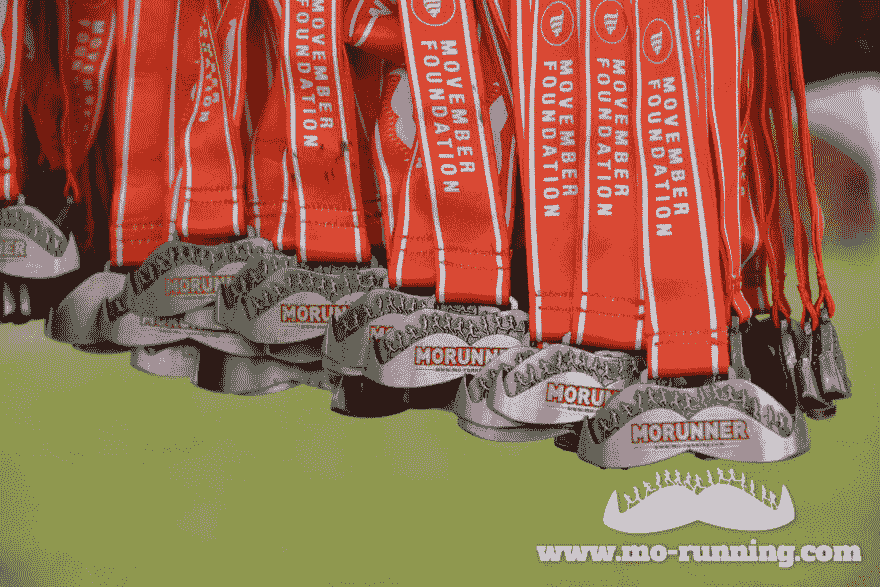

# 我的跑步开发故事

> 原文:[https://dev.to/nibi/my-running-dev-story-4a79](https://dev.to/nibi/my-running-dev-story-4a79)

快到上午 9 点的时候，我走上楼梯，一边喘着气，一边咒骂那个月第三次停运的电梯。我想知道在过去的几个月里我是否变得不健康了。“不，一定是陡峭的楼梯”内心的声音试图说服我脑海中的那个胖天使。不知从哪里，有人跑上楼梯的声音在我的脑海中重叠了讨论:“早上好！我赶时间！”。是我们将近 50 岁的销售经理像一只十几岁的小羚羊一样跑起来，没有注意到我的健康危机。这让我意识到是时候承认残酷的事实了。编程不是体力活，一个月走三次楼梯不算健康锻炼。

## 缓慢而短暂的开端

忙碌了一天回到家，很难说服自己出去跑步。当我想到我的大脑可能会疲劳，但身体的其他部分没有得到所需的锻炼时，这很有帮助。第一次跑步时，我对自己的速度感到有点尴尬，尽管如此，我还是在流汗。跑步的好处是，当人们看到你流汗时，他们更可能认为你正在跑第 15 公里，而不是意识到你刚刚离开家。事实上，我只从一公里开始。第二天，我只跑了一次，并试图比较我的时间，看看我是否有所改善。

## 有助于激励

为了让自己保持动力，我开始使用 endomondo 应用程序跟踪我的跑步。我的目标是一周至少跑三次，每次跑步我都试图打破我之前的记录。在我的距离增加到 5 公里后，我不得不买更好的跑鞋。在那之前，我的一双旧运动鞋已经够用了。有了新的更合适的跑鞋，事情变得容易了。我的速度提高了，我也能增加距离。由于我经常跑步，我的睡眠变得更好了，因为我很累就上床睡觉了，我在工作中感觉更有活力，在处理压力方面变得更好，并且总体上变得更加积极。这些副作用激励我继续跑步。

## 一路马拉松

 *照片:【www.mo-running.com】*T4

在我的第一次跑步挑战中，我报名参加了 10K 赛跑，并通过参与来支持与癌症的斗争。筹款跑步总是很有趣，你可以看到穿着滑稽服装的人，如果你像我一样幸运，你可能会和香肠赛跑！

过了一段时间，我想增加挑战，并致力于跑半程马拉松。训练变得更具挑战性，但仍然令人愉快。经过几周的准备，这个大日子终于到来了。

完成半程马拉松是我作为跑步者的第一次成功，这给了我更大的动力。我想看看我是否能跑马拉松。跑 42K 的想法看起来疯狂而不可能，这是我报名的一个很好的激励。大约 12 周的训练之后，我取得了最大的运动成绩。除了我的身体健康，我还锻炼了我的精神力量，比如早起去跑步，晚上不吃汉堡。完成这场长跑给了我一种(痛苦和)成就感。从那时起，我的信心增加了，现在我知道任何看似不可能的任务都可以用正确的方法完成。

## 它也能帮助你

如果不跑步，我很可能没有足够的精力去做兼职项目，学习新技术，无法应对压力，因此我的职业生涯也不会有所进展。你甚至不需要跑马拉松来享受好处和提高你的生产力——我将在下一次谈论更多。如果我的故事激励了你，拿一双运动鞋，试试跑步吧。很有可能对你也有帮助。