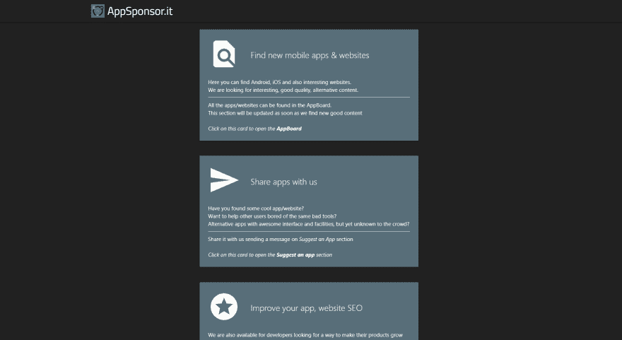

# 我第一个网站背后的故事

> 原文：<https://dev.to/mauroscianca98/the-story-behind-my-very-first-website-55fh>

七月，我第二年的考试结束了。

我渴了。所有的学习，理论..我的创造性思维正在崩溃。

我和朋友在海滩上，突然有了一个想法...这个想法。

*   一个寻找和发现新应用的平台。
*   Android、iOS 或桌面应用。
*   寻找新的网站，创业公司。
*   共享应用程序。
*   免费帮助开发者提高他们产品的知名度。

所有这些都集中在一个地方。

我不知道从哪里开始。

我的网络技能非常基础。

我只知道一个框架(CodeIgniter)和 bootstrap。

我知道最艰难的部分是从**开始的**。

你有那么多想法和计划，但你的头脑却停滞不前。

当该开始的时候，你的大脑会冻结。

我在某处读到过，把你的想法分成更小的部分非常有用，就像软件工程中自上而下的过程一样。

好的，简单，明白了。打开心爱的记事本++开始打字。

多少事情。我只是害怕。

很快我意识到，即使它们很多，但每一项都很容易实现。

多亏了这个愚蠢的清单，我才能够把这个项目从一个复杂的状态带到另一个复杂的状态。(我知道对你们大多数人来说这可能有点夸张，但对我来说这真的很难)

*7 月 13 日，我写了它的第一行代码。*

我设法在 2 周的工作中构建了后端核心和第一个 UI。

我有点满意，但很快我就不得不理解一些艰难的教训，首先是:搜索引擎优化

我的网站很慢，没有经过优化，运行缓慢，运行混乱(很遗憾我没有截图，所以相信我吧..).

注意:我使用的是一个 bootstrap starter 模板，一塌糊涂。我感到羞耻。

在那一点上，我只是对自己撒谎。

我认为这很好(我认为这是一项艰苦的工作)，但事实并非如此。

几周来，我一直试图在社交网站上分享它，但没有成功，因为它是被令人惊叹的 facebook 反恶意软件算法随机屏蔽的数千个网站之一，所以我转向了 twitter 等其他平台。

一切都是，没用的。它的基础有问题。我不得不承认。

三周后，我决定。

我不得不放弃那个入门主题，从头开始重新构建一切，或者至少用一些好的工具。

一想到它，我就头疼。

幸运的是，我发现了一个非常好的 css 库。

那是一见钟情。立即，干净的标签，轻量级。

经过一周的工作，一切都差不多准备好了。

这是首页截图(atm 图标不同):

即使不算 SEO(老实说我不记得了)我还是用 PageSpeed 做了比较。

前:移动 33，桌面 60 左右
后:移动 88，桌面 100

他们只是一些数字，但见鬼，差异是显而易见的。

几天后，第一个用户发送了第一个请求，我收到了第一个响应。

我无法形容我的感受。

即使我没有赚到一分钱，我也很开心，很满足。

在故事的这个点上，我们是在 9 月 2 日。

神奇的是，在第四次尝试后，但只是第一次用新的核心，我得到了 AdSense 批准。而且这还不是个例。

与此同时，其他人在网站上联系并不断发送请求。

一切都非常顺利。

游客增加了，我得到了第一笔收入(一天 9 美元，我已经看到自己在纽约炫耀我的法拉利)。

说正经的，我不在乎钱，我需要广告来支付服务器的费用。

一周前，我实现了一个 Android 应用程序，由于我过去的经验，它只花了我 3 天的工作。

今天是 9 月 21 日，我想和你分享这段旅程。

尽管还有很多需要改进的地方，但我迄今为止学到的最重要的经验是:

*   总是检查你的进展，一步一步地验证它。不要只是工作，不停地添加东西。
*   不要使用预先构建的模板
*   把你的想法分成更小的部分
*   最难的部分是开始。你开始得越早，完成得越早。
*   继续之前，谷歌技术替代方案
*   不要生气。即使你和我一样是 noob web 开发者。如果你有问题，就上 StackOverflow 搜索一下。不要浪费你的时间。
*   利用社交媒体的力量(哦，只是说，我的网站在 facebook 上被禁了)
*   不要放弃，如果你的想法是好的，它会得到它应得的。

希望你喜欢这个。

现在，我给你引用一本书的话，这本书在这个过程中确实帮助了我:蒂莫西·费里斯的《每周工作 4 小时》(我建议你阅读关于定义和消除的章节)

> 如果某样东西没有吓到你，那还不够。

快乐的编码伙计们！

*我把这个留在最后，因为作为一个好的开发者，我想呆在幕后:我叫 Mauro，CS 学生，来自意大利，我刚刚学习了 Markdown 语法:)*