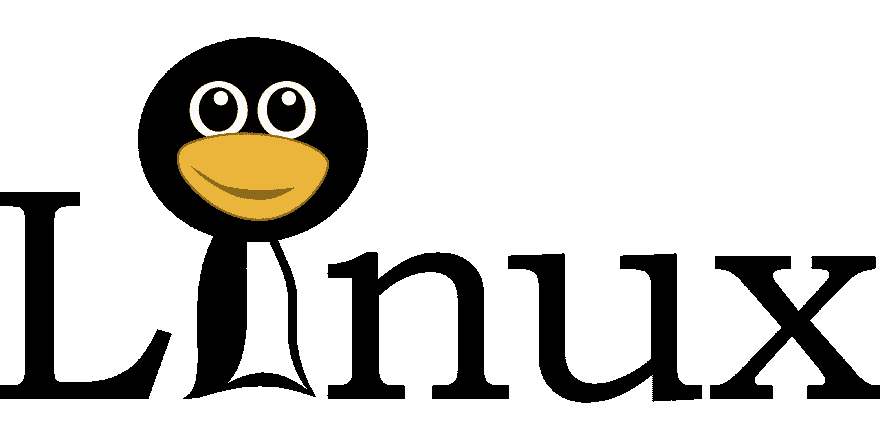
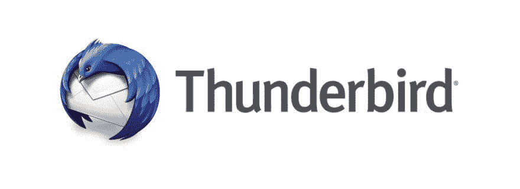

# 借助 Linux 提升您的个人计算体验

> 原文：<https://dev.to/vikneswaran/boost-your-personal-computing-experience-with-linux-1ke4>

谈到个人电脑，我们大多数人会更喜欢微软视窗系统。微软视窗系统统治着个人电脑世界，因为它占据了 90%以上的市场份额。虽然我们不知道我们为什么使用 Windows，但我们认为它是用于个人计算的。因为大多数笔记本电脑都装有 windows，或者我们的同事和朋友会使用它。我们需要重新审视我们的个人计算习惯。

嗯，Windows 配备了大量的功能，令人惊叹的用户体验和频繁的更新。我必须承认。但是每个操作系统都有自己的优缺点。此外，我们还有一个可供选择的操作系统需要小心。

# Linux 操作系统

Linux 是一个免费的开源操作系统。与 Windows 相比，它是轻量级的。你不需要花费额外的一分钱在一些反病毒程序来保护你的电脑，你只需要依靠一些安全更新来保持安全。但是使用 Linux 操作系统需要一些学习曲线。如果你越来越熟悉它，你可以感觉到你的生产力提高了。

# 哪个 Linux？

接下来，一个大问题，我应该选择哪个 Linux 发行版？嗯，看情况。根据你的需要，它会有所不同。Ubuntu 是目前最流行的个人电脑 Linux 发行版之一。但是也有其他发行版，你可以使用 Fedora，CentOS，OpenSUSE。如果你是 windows 的忠实用户，你可以选择 ChaletOS 或者 Linux Mint。我还发现了一个有趣的网站，它可以根据你的喜好向你推荐一个 Linux 发行版— [发行版选择器](https://distrochooser.de/en)

# Windows 应用的 Linux 替代品

让我们考虑一下生产力，我们每天都依赖于一些应用程序。这在 Linux 上可以实现吗？为什么不呢，甚至你可以提高你的生产力。让我走一遍。

## 办公套件

没有办公套件，任何基于计算机的工作都是不完整的。LibreOffice 是微软 Office 的替代产品。它兼容几乎所有的 MS Office 文件格式。免费提供。
[https://www.youtube.com/embed/3KC0ZdcA6s8](https://www.youtube.com/embed/3KC0ZdcA6s8)
其他软件像 WPS Office、Apache Open Office、AbiWord 都是它的一些替代品。

## 邮件客户端

[Mozilla Thunderbird](https://www.thunderbird.net/en-US/)是微软 Outlook 或 Windows Mail 的替代产品。它有惊人的功能来管理您的电子邮件。

## 图形和图像处理

对于图形，我们有一些 Adobe 产品的替代品。

GIMP 是一款功能全面的图像处理软件，可以替代 Adobe Photoshop。

Inkscape 是一款专业的矢量图形编辑器，可以替代 Adobe Illustrator。

Tux Paint 和[卡拿 Paint](http://kolourpaint.sourceforge.net/) 是 MS Paint 的替代品。

## 媒体播放器和编辑器

[VLC 媒体播放器](https://www.videolan.org/vlc/)是媒体播放器的流行选项。

如果你正在寻找一个视频编辑工具，那么 [OpenShot](https://www.openshot.org/) 是一个视频编辑工具，将是 Windows Movie Maker 的替代选择。对于编辑音频，您可以选择 [Audacity](https://www.audacityteam.org/) 。

## 文本编辑器和 IDE

如果你是一个开发者，你肯定会依赖文本编辑器和 IDE。

Notepadqq 是 Notepad++的替代品。所有其他流行的文本编辑器，如 Sublime、VSCode、Atom、Brackets 也可以在 Linux 平台上使用。你也可以尝试一些最好的基于 Linux 的编辑器，比如 VIM，Nano，Gedit。

就 IDE 而言，所有主流 IDE 都可用于 Linux。你有对 IntelliJ、Pycharm、Netbeans、Eclipse、Android Studio、RStudio 的 Linux 支持。

## 浏览器

几乎所有的现代网络浏览器都可以在 Linux 上使用。Mozilla 火狐，谷歌 Chrome，Opera。

## 读者

奥库拉、[证据](https://wiki.gnome.org/action/show/Apps/Evince)是一些受欢迎的选择。Adobe Reader 也可用于 Linux 平台。

我已经提出了一些著名的替代方案。如果你正在寻找一个特定的替代品，我推荐你去看看这个[网站](https://alternativeto.net)。它已经众包替代软件推荐。

当今世界，开源技术正在飞速发展。此外，Linux 正在获得越来越多的社区支持，以保证您的更新和安全。留意它，它会节省很多钱，提高你的生产力。