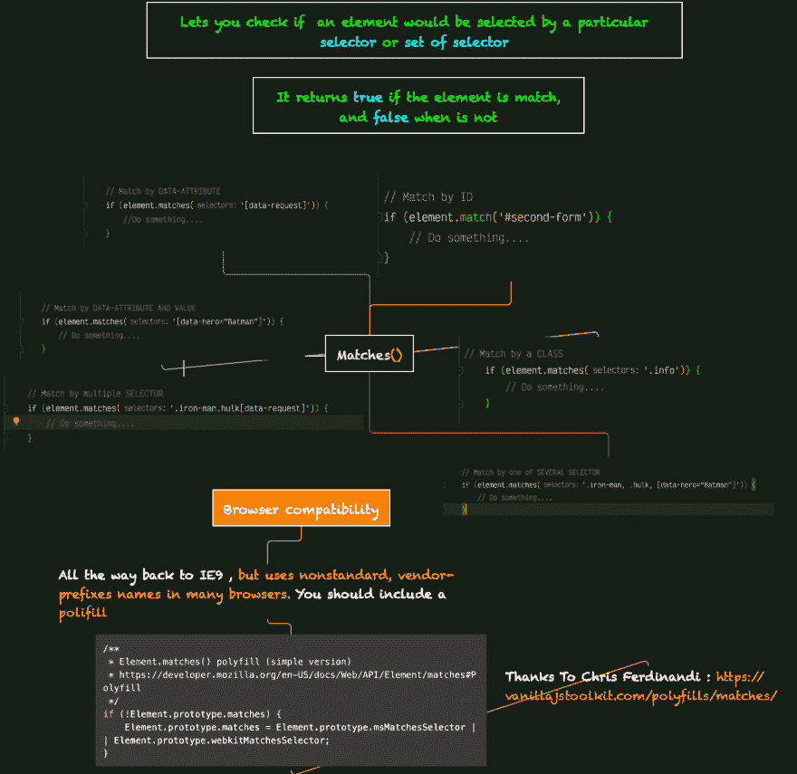

# 匹配()

> 原文:[https://dev.to/giandodev/match-2nbi](https://dev.to/giandodev/match-2nbi)

## 比赛()的酷法🤓😎

[T2】](https://res.cloudinary.com/practicaldev/image/fetch/s--qZhc-NvY--/c_limit%2Cf_auto%2Cfl_progressive%2Cq_auto%2Cw_880/https://thepracticaldev.s3.amazonaws.com/i/dzzixlrfbmec3mrsu2ij.png)