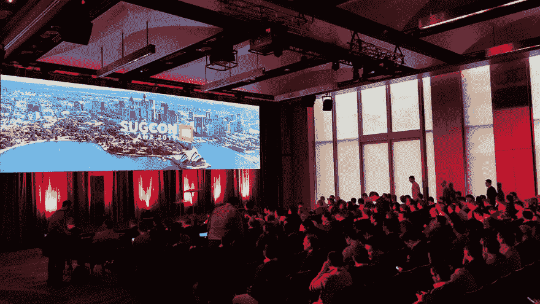
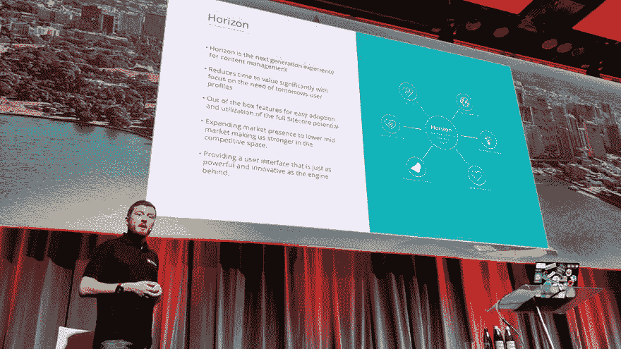

# SUGCON ANZ 2019

> 原文:[https://dev.to/robearlam/sugcon-anz-2019-3n49](https://dev.to/robearlam/sugcon-anz-2019-3n49)

上周标志着有史以来第一次 SUGCON ANZ，它是在悉尼运行的一天半的惊人的 Sitecore 内容。我们的会议涵盖了各种各样的主题，如 DevOps、JSS、商业、体验形式、SBOS、营销自动化以及任何你能想到的介于两者之间的东西。我们有悉尼本地的演讲者，也有跨州演讲的演讲者和其他跨国演讲的演讲者。

[T2】](https://res.cloudinary.com/practicaldev/image/fetch/s--E_EOyCDA--/c_limit%2Cf_auto%2Cfl_progressive%2Cq_auto%2Cw_880/https://robearlam.com/media/2019/SUGCON-ANZ-2019/Sugcon.png)

我们收到的反馈非常积极，我要感谢所有积极参与的与会者，是他们帮助我们使这次活动如此成功！从我的角度来看，能够赶上地区 Sitecore 社区是我最喜欢的事情之一，也很高兴在人群中看到一些老同事。

第二天早上，我在 Sitecore Horizon 上做了演示，尽管演示者并没有完全对我微笑(这是预发布软件的本性)，但这个会议似乎进行得很顺利。

[T2】](https://res.cloudinary.com/practicaldev/image/fetch/s--G49AO16D--/c_limit%2Cf_auto%2Cfl_progressive%2Cq_auto%2Cw_880/https://robearlam.com/media/2019/SUGCON-ANZ-2019/Horizon.png)

如果你今年没能来，那么你可以通过官方的 twitter 账户 [@@SUGCONF](https://twitter.com/sugconf) 来赶上当时直播的许多会议:

*   [启动&主题演讲](https://twitter.com/SUGCONF/status/1165824437343490048)主持人 [@@damovisa](https://twitter.com/damovisa)
*   [生产中的 Sitecore JSS&大规模–关键知识](https://twitter.com/SUGCONF/status/1165839634833690628)由 [@@alexshyba](https://twitter.com/alexshyba) 介绍
*   [极限体验形式:把它带到边缘](https://twitter.com/SUGCONF/status/1165857512886636547)由 [@@mike_i_reynolds](https://twitter.com/mike_i_reynolds) 呈现
*   [太快，没有愤怒(游客)](https://twitter.com/SUGCONF/status/1165875432362627072)由[@ @詹姆斯希尔卡](https://twitter.com/jameshirka)和杰森·伍兹主持
*   [认识你的新朋友:Sitecore 规则引擎](https://twitter.com/SUGCONF/status/1165890268240863232)由 [@@jrondeau16](https://twitter.com/jrondeau16) 提供
*   [摇滚明星研究！由凯文·威尔金斯主持](https://twitter.com/SUGCONF/status/1166127950636302337)
*   [Sitecore Horizon:内容编辑的未来](https://twitter.com/SUGCONF/status/1166142516996927488)主讲人 [@@robearlam](https://twitter.com/robearlam)
*   [营销自动化扩展](https://twitter.com/SUGCONF/status/1166142516996927488)由 [@@adeneys](https://twitter.com/adeneys) 呈现
*   [由](https://twitter.com/SUGCONF/status/1166184563674009600) [@@seanholmesby](https://twitter.com/seanholmesby) 呈现的 TDS 经典中的最佳隐藏功能
*   [Sitecore JSS + ReactJS -实践中的开发工作流程](https://twitter.com/SUGCONF/status/1166199991766904834)由 Angel Chuang 主讲
*   [使用 Sitecore 通用追踪器](https://twitter.com/SUGCONF/status/1166218038162542592)进行离线追踪 [@@akshaysura13](https://twitter.com/akshaysura13)
*   由尼克·亨德尔主持的闭幕

如果你看了上面包含闭幕词的流的最后一个链接，你可以看到我们宣布明年的活动将在墨尔本举行，墨尔本是我目前的所在地，所以请参加 SUGCON ANZ 2020，参加一个更大更好的活动！