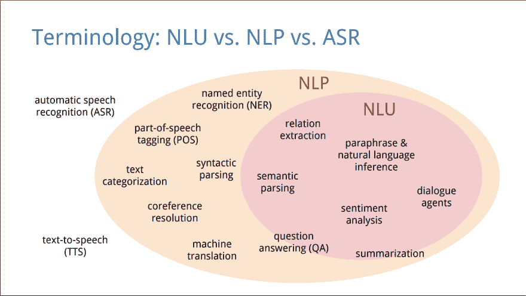
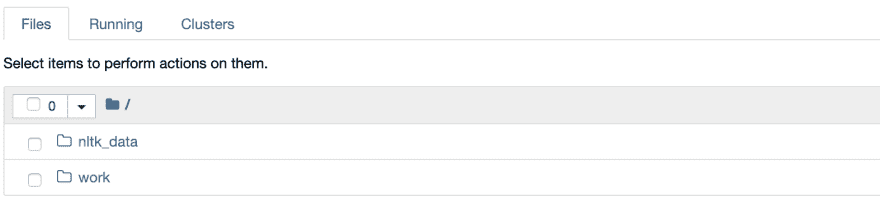
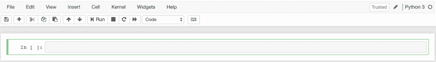
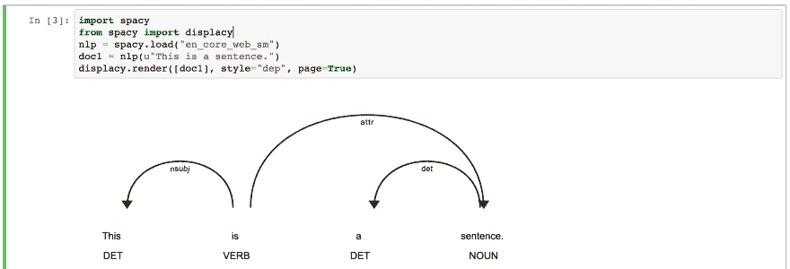
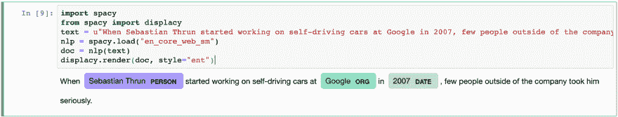

# 自然语言处理导论

> 原文:[https://dev . to/stereo booster/introduction-to-natural language-processing-38ei](https://dev.to/stereobooster/introduction-to-natural-language-processing-38ei)

## [](#what-is-nlp)什么是 NLP？

不要将与神经语言编程混淆🤦

> 自然语言处理允许计算机访问用语音或文本表示的非结构化数据。语音或文本数据确实涉及语言结构。语言结构因语言而异
> 
> - [本德](http://faculty.washington.edu/ebender/papers/Bender-SDSS-2019.pdf)2019

NLP 是一类处理自然语言文本的任务(计算机算法)，例如:命名实体识别(NER)、词性标注(POS)、文本分类、共指消解等。

[T2】](https://res.cloudinary.com/practicaldev/image/fetch/s--RQbrR76a--/c_limit%2Cf_auto%2Cfl_progressive%2Cq_auto%2Cw_880/https://thepracticaldev.s3.amazonaws.com/i/sxebld95pxg9nrwy4nl1.png)

图片来源:[理解自然语言理解](https://nlp.stanford.edu/~wcmac/papers/20140716-UNLU.pdf)

参见代码为的[论文和](https://paperswithcode.com/area/natural-language-processing)[进度](http://nlpprogress.com/)获得更大的任务分类。

## [](#getting-started)入门

我不是机器学习方面的专家，但我知道一些关于开发人员经验的知识，所以我将展示如何快速舒适地开始使用 NLP。

我们将使用:

*   码头工人
*   [Jupyter 笔记本](https://jupyter.org/)
*   具有[空间](https://spacy.io/)的 Python

在这个领域有很多工具，但是在我看来这些工具都是可接近的和现代的。

### [](#setup)设置

创建`Dockerfile` :

```
FROM jupyter/datascience-notebook:1386e2046833
RUN pip install spacy
RUN python -m spacy download en_core_web_sm 
```

我们将使用令人敬畏的 [Jupyter Docker 栈](https://jupyter-docker-stacks.readthedocs.io/en/latest/using/selecting.html#image-relationships)。

添加`docker-compose.yml` :

```
version: "3"
services:
 web:
 build: .
 ports:
 - "8888:8888"
 volumes:
 - ./work:/home/jovyan/work 
```

### [](#run)运行

运行(在终端中，在您创建文件的同一文件夹中):

```
docker-compose up 
```

此命令将下载、构建并启动开发环境。您将看到文本

```
To access the notebook, copy and paste one of these URLs:
 http://127.0.0.1:8888/?token=... 
```

[T2】](https://res.cloudinary.com/practicaldev/image/fetch/s--eSzI-ZgU--/c_limit%2Cf_auto%2Cfl_progressive%2Cq_auto%2Cw_880/https://thepracticaldev.s3.amazonaws.com/i/5zuoictacbsnt5srblaq.png)

*   在浏览器中打开 URL
*   导航到“工作”文件夹
*   点击右上角的“新建”，从下拉列表中选择“Python 3”

您的笔记本已经可以工作了。

[T2】](https://res.cloudinary.com/practicaldev/image/fetch/s--gym4gHah--/c_limit%2Cf_auto%2Cfl_progressive%2Cq_auto%2Cw_880/https://thepracticaldev.s3.amazonaws.com/i/g8f1601ctvfur3n1u7jy.png)

Jupyter notebook 是实验运行环境和科学杂志的混合体。

### [](#first-experiment-pos)第一次实验:POS

POS 代表词性标注——我们需要识别给定文本中每个单词的词性，例如名词、动词。

```
import spacy
from spacy import displacy
nlp = spacy.load("en_core_web_sm")
doc1 = nlp(u"This is a sentence.")
displacy.render([doc1], style="dep", page=True) 
```

输入程序，然后点击“运行”。

[T2】](https://res.cloudinary.com/practicaldev/image/fetch/s--liBT5ZqZ--/c_limit%2Cf_auto%2Cfl_progressive%2Cq_auto%2Cw_880/https://thepracticaldev.s3.amazonaws.com/i/dscuiqjlz7ym85vwg7ds.png)

[这里是所有标签](https://spacy.io/api/annotation#pos-tagging)的列表。

### [](#second-experiment-ner)第二个实验:NER

NER 代表命名实体识别。此任务是区分特定的实体，例如，由多个部分组成的人名(悉达多乔达摩)、国名(英国)或金额(十亿美元)。

```
import spacy
from spacy import displacy
text = u"When Sebastian Thrun started working on self-driving cars at Google in 2007, few people outside of the company took him seriously."
nlp = spacy.load("en_core_web_sm")
doc = nlp(text)
displacy.render(doc, style="ent") 
```

输入程序，然后点击“运行”。

[T2】](https://res.cloudinary.com/practicaldev/image/fetch/s--Pmiv8DIA--/c_limit%2Cf_auto%2Cfl_progressive%2Cq_auto%2Cw_880/https://thepracticaldev.s3.amazonaws.com/i/cn9r8rxjw7ri1je7fakr.png)

[这里是所有实体类型](https://spacy.io/api/annotation#named-entities)的列表。

### [](#save-your-work)保存您的工作

给你的笔记本重新命名(点击“无标题”)，取一个更有意义的名字，比如“实验”。点击“保存”按钮。

创建`.gitignore`文件:

```
work/.ipynb_checkpoints 
```

运行(在终端中，在您创建文件的同一文件夹中):

```
git init
git add .
git commit -m "first commit" 
```

现在，您将工作保存在 git 中。

## [](#tutorial)教程

这些实验的目的是展示如何容易开始。如果你真的想学习它，你可以使用这个教程。

祝你好运！

## [](#ps)PS

查看 [spaCy universe](https://spacy.io/universe) 获得更多酷项目。spaCy 只是工具之一，你可以使用任何你喜欢的替代品，比如 nltk，斯坦福 CoreNLP 等。

> 绿色变色龙在 Unsplash 上拍摄的照片